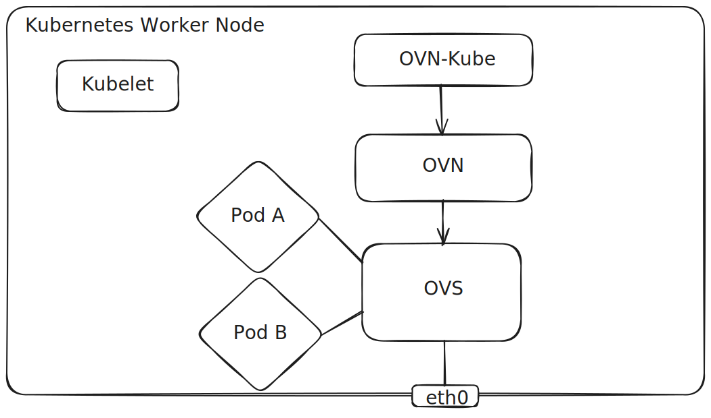
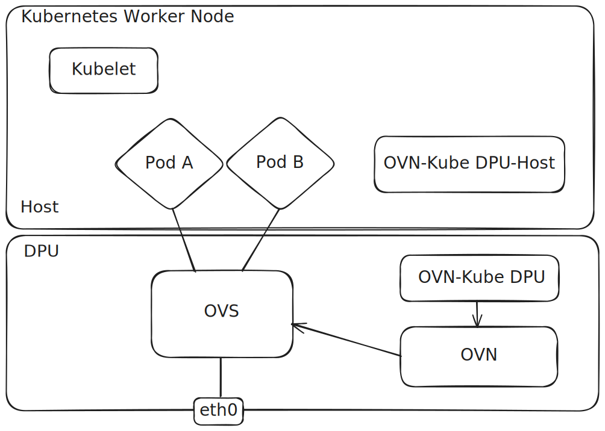

# Accelerating and Offloading Kubernetes Networking: Leveraging DPUs with OVN-Kubernetes

## Introduction

This blog post provides a comprehensive guide on deploying OVN-Kubernetes in an environment leveraging Data Processing Units (DPUs).
This setup is crucial for high-performance networking in cloud-native applications, offloading network processing from the host CPU to the
DPU, and providing better security for the networking control-plane. Additionally, OVN-Kubernetes brings in robust features like User Defined
Networks (UDNs) that enable per tenant network isolation into the Kubernetes environment and integrates with the DPU solution.

In this guide, **offloading** means moving OVN-Kubernetes SDN control and data plane work from the host into the DPU to free host CPU and memory
resources. Note, this is different from **OVS offloading**, where datapath processing is offloaded from kernel to hardware
ASICs inside a DPU or SmartNIC.
**Acceleration** means using hardware acceleration capabilities inside the DPU (SmartNIC/OVS offload paths) to deliver higher network
throughput and lower latency.

## Architecture Overview

Within a typical Kubernetes worker node, the CNI typically runs as a host networked pod alongside other processes in the host.
In an unaccelerated+non-offloaded environment, OVN-Kubernetes behaves the same way, with its stack composed of OVN-Kubernetes,
Open Virtual Network (OVN), and Open vSwitch (OVS). OVN-Kubernetes listens for KAPI events, configures a logical topology in OVN,
and then OVN translates that into OpenFlow which is programmed into the OVS datapath. Here is an overview of a typical setup:



---

In this environment there are several potential issues to highlight:

*   The SDN control and data planes are consuming CPU/memory resources on the host itself.
*   The SDN control and data planes are able to be compromised if an attacker breaks out of a pod into the host namespace.
*   Pods are attached with veth interfaces. Although fast path traffic is handled within the kernel using the OVS kernel module,
    there are realistic throughput and latency limitations.

---

A DPU is a system on a chip that is pluggable into the server via a PCIe slot. It provides a specialized environment with
its own CPU, memory, storage and OS. It also includes a SmartNIC architecture that provides packet processing acceleration and offload capabilities.
Integrating the DPU into the OVN-Kubernetes CNI provides the ability to move the SDN control and data plane down into the DPU.
This solves the aforementioned issues by:

*   Relieving the Host of resource consumption.
*   Adding security so that if a pod breaks out on the host, it cannot access/compromise the SDN control and data plane.
*   Pods are accelerated with Virtual Function (VF) interfaces which combined with specialized smart NIC hardware to offload
    the OVS datapath results in best in class throughput and latency.

---

Here is a diagram of a DPU accelerated worker node with OVN-Kubernetes:



---

In this kind of deployment the DPU is not part of the *Host Kubernetes Cluster*. This is typically referred to as an “*off-host-cluster*”
type of deployment. OVN-Kubernetes running in the DPU is typically managed as a secondary Kubernetes cluster, but it does not have to be.
The kubeconfig of the host cluster is provided to OVN-Kube running in the DPU in order to configure the SDN. For the purpose of this guide,
we will treat the DPU as if it is in its own secondary Kubernetes cluster, referred to as the *DPU Kubernetes Cluster*.
OVN-Kube on the DPU is responsible for configuring OVN and wiring up networking within the DPU, while OVN-Kube on the Host is a lightweight
container used to plug in the network interfaces for pods in the Host.

## Getting Started

Before starting the deployment, ensure the following prerequisites are met:

*   A Host Kubernetes cluster with nodes equipped with compatible DPUs.
*   A secondary DPU Kubernetes cluster that contains the DPUs.
*   Kube-proxy should be disabled in both clusters.
*   Familiarity with OVN-Kubernetes and general Kubernetes networking concepts.
*   Ensure the versions of Kubernetes are compatible with the version of OVN-Kubernetes to be used in the cluster. An OVN-Kubernetes version of at least 1.3 Alpha (latest master as of Feb 2026) is required, which maps to Kubernetes 1.34 as of this writing.

Note, for setting up Kubernetes clusters quickly for a test environment, see [kubernetes.io/docs/setup/production-environment/tools/kubeadm/create-cluster-kubeadm/](https://kubernetes.io/docs/setup/production-environment/tools/kubeadm/create-cluster-kubeadm/).

For this guide, we will focus on the setup using an NVIDIA BlueField-3 DPU, which has been tested to be
compatible with OVN-Kubernetes.
The OVN-Kubernetes DPU architecture is not specific to NVIDIA DPUs, and should be compatible with any DPU vendor.
Currently only NVIDIA BlueField DPUs have been tested and considered supported by upstream.
For the BlueField-3 Linux OS, ensure that it matches the version supported by the DOCA drivers. At the time of this writing,
the current DOCA drivers for BlueField-3 are version 3.2.1, which are compatible with Ubuntu 24.04 on the DPU.
Note, the Host Linux OS also needs DOCA software installed, but there are many different flavors and versions of Linux
supported for 3.2.1.
For the full list check out the [NVIDIA DOCA downloads page](https://developer.nvidia.com/doca-downloads?deployment_platform=Host-Server&deployment_package=DOCA-Host&target_os=Linux&Architecture=x86_64&Profile=doca-all).

## Limitations

A pod who's network interface is provided by the OVN-Kubernetes on the DPU is considered to be "DPU accelerated".
When using a DPU with OVN-Kubernetes, all OVN-Kubernetes networked pod interfaces on the Host must be DPU accelerated.
There is no support for a mix of unaccelerated and accelerated workloads within the same node. However, it is possible to
have a node with accelerated workloads with a DPU, and then another node with unaccelerated pods.
It is also possible to have a mix of some nodes with DPU and other nodes with other types of SmartNICs.

Furthermore, it is also not currently possible in OVN-Kubernetes to use more than one SmartNIC or DPU within a node.
There are plans in future to lift these limitations.

## OVS Offload Considerations

OVS provides two methods of datapath hardware offload:

*   **Kernel Hardware Offload** - Using Linux Traffic Control to configure the DPU.
*   **OVS DOCA** - A userspace OVS control plane that programs a fully hardware-resident datapath on the DPU using DOCA, with no kernel OVS or TC involvement.

Either option is supported by OVN-Kubernetes, and either option may be used in this guide.

## Setting up the DPU and Host

The DPU must be configured to handle networking functions for the host. The following configuration for the DPU will be done on the Host itself.

1.  Install DOCA-Host drivers on Host if not already present. Note, these are required even if not using OVS DOCA in order to access the rshim interface to manage the DPU. Be sure to use at least version 3.2.1.
    *   Go to [developer.nvidia.com/doca-downloads](https://developer.nvidia.com/doca-downloads), in the “Select” form, choose **Host-Server** -> **DOCA-Host** -> **Linux** -> **x86_64** -> **doca-ofed** -> {*Your-OS-Distribution*} -> {*Your-OS-Version*} -> {*Preferred installation type*}, then follow the instructions displayed below the form to install the package.

    Note: Some extra packages may be required depending on your distribution.

2.  Make sure that **bfb-install** exists after the above step.
3.  Start **rshim** by running either “systemctl enable -–now rshim” or simply “rshim”.
4.  Make sure that `/dev/rshim*` device file shows up after the above step.

5.  Update BFB and firmware for Mellanox Bluefield DPUs
    *   Go to [developer.nvidia.com/doca-downloads](https://developer.nvidia.com/doca-downloads), in the “Select” form, choose **BlueField** -> **BF-Bundle** -> **Ubuntu** -> {*Version*} -> **BFB**, then click “Download” to start downloading.
    *   Upload the BFB package to the Host.
    *   On the Host, follow the instructions to install the BFB package. You may provide a config file to set up a password for the **ubuntu** account, in the following format: “**ubuntu_PASSWORD='$1……'**”
    *   An encrypted password can be generated by command “**openssl passwd -1**”.
    *   Please power cycle (off and then on) the Host to reboot and run the newly installed software and firmware.

6.  The DPU has two modes, DPU and NIC, modes. DPU mode is required for this solution.
    *   Run following commands on the Host to identify the current mode or update it to enable DPU mode:

    ```bash
    user@fedora: mlxconfig -d /dev/mst/<device> q INTERNAL_CPU_OFFLOAD_ENGINE
    ENABLED(0)

    # to configure BlueField 3:
    user@fedora: mlxconfig -d /dev/mst/<device> s INTERNAL_CPU_OFFLOAD_ENGINE=0

    # to configure BlueField 2:
    user@fedora:  mlxconfig -d /dev/mst/<device> s INTERNAL_CPU_PAGE_SUPPLIER=0 INTERNAL_CPU_ESWITCH_MANAGER=0 INTERNAL_CPU_IB_VPORT0=0 INTERNAL_CPU_OFFLOAD_ENGINE=0
    ```

7.  Reboot.

8.  Optional: At this point you may follow this guide in order to enable OVS DOCA offload support: [docs.nvidia.com/doca/sdk/ovs-doca-hardware-acceleration/index.html](https://docs.nvidia.com/doca/sdk/ovs-doca-hardware-acceleration/index.html)

9.  On the Host, configure the desired number of VFs, then rename the first VF device so that it can be dedicated to and referenced by OVN-Kubernetes as the OVN-Kubernetes management port:

    ```bash
    user@fedora: echo ${num_of_desired_vfs} > /sys/class/net/${interface}/devices/sriov_numvfs
    user@fedora: ip link set ens1f0v0 down
    user@fedora: ip link set ens1f0v0 name forOVN0
    user@fedora: ip link set forOVN0 up
    ```

10. The BFB package installed earlier includes Open vSwitch (OVS). OVS will be installed as a systemd service, and the service is enabled by default. By default DPU will come up with 2 bridges, ovsbr1 and ovsbr2, regardless if the port is cabled or not. You may delete them and create your own bridges, just remember to add uplink **p0/p1** and x86 representor **pf0hpf/pf1hpf** to the new bridge. We will use a tool called minicom to get into the DPU from the host and configure OVS.

    ```bash
    #### run minicom on x86 host to login to the DPU via rshim interface
    # minicom -D /dev/rshim0/console
    #### login to DPU
    user@ubuntu: ovs-vsctl show
    c41c98ac-0159-4874-97d5-17a4d2647d70
        Bridge ovsbr2
            Port en3f1pf1sf0
                Interface en3f1pf1sf0
            Port p1
                Interface p1
            Port pf1hpf
                Interface pf1hpf
            Port ovsbr2
                Interface ovsbr2
                    type: internal
        Bridge ovsbr1
            Port p0
                Interface p0
            Port ovsbr1
                Interface ovsbr1
                    type: internal
            Port pf0hpf
                Interface pf0hpf
            Port en3f0pf0sf0
                Interface en3f0pf0sf0
       ovs_version: "3.2.1005"
    user@ubuntu: ovs-vsctl del-br ovsbr1
    user@ubuntu: ovs-vsctl del-br ovsbr2
    user@ubuntu: ovs-vsctl add-br brp0
    user@ubuntu: ovs-vsctl add-port brp0 p0
    user@ubuntu: ovs-vsctl add-port brp0 pf0hpf
    ```

11. Now that the OVS bridge is created with the proper port configuration, we need to configure the IP address of the bridge. Typically this involves moving the IP address that was already configured on the **en3f0pf0sf0** interface to the **brp0** bridge. This IP address will be used for Geneve encapsulation (ovn-encap-ip), and therefore we must configure the OVS bridge so that OVN is aware of it. Additionally, take note of the default gateway route on the Host (10.1.65.1 in this example). We will need to configure this as well in the OVS bridge so OVN will use it as its default gateway.

    ```bash
    #### run minicom on x86 host to login to the DPU via rshim interface
    # minicom -D /dev/rshim0/console
    #### login to DPU
    user@ubuntu: ip addr del 10.1.65.155/24 dev en3f0pf0sf0
    user@ubuntu: ip addr add 10.1.65.155/24 dev brp0
    #### make brp0 as the default route interface
    user@ubuntu: ip r add default via 10.1.65.1 dev brp0
    #### configure OVS
    user@ubuntu: ovs-vsctl set Open_vSwitch . other_config:hw-offload=true
    user@ubuntu: ovs-vsctl set Open_vSwitch . external_ids:ovn-encap-ip="10.1.65.155"
    user@ubuntu: ovs-vsctl set Open_vSwitch . external_ids:ovn-gw-interface="brp0"
    user@ubuntu: ovs-vsctl set Open_vSwitch . external_ids:ovn-gw-nexthop="10.1.65.1"
    #### configure the hostname of the Host as it will appear in the Host Kubernetes Cluster
    user@ubuntu: ovs-vsctl set Open_vSwitch . external_ids:host-k8s-nodename="host-worker-1"
    ```

## Deploying OVN-Kubernetes

A version of OVN-Kubernetes at least with 1.3 is required for DPUs. At the time of this writing, 1.3 is in Alpha state. The following steps should be done from a jumphost that has Kubeconfig access to both the Host and DPU cluster.

1.  Build or download the OVN-Kubernetes container images. Refer to this [image build guide](../developer-guide/image-build.md) on how to build/obtain the artifacts.
2.  Upload the images to a container registry that is reachable by both clusters.
3.  Label all Host nodes with DPU with **k8s.ovn.org/dpu-host=""**
4.  Label all DPU nodes with **k8s.ovn.org/dpu=""**
5.  `git clone https://github.com/ovn-kubernetes/ovn-kubernetes` to obtain the helm charts.
6.  Follow the [upstream installation guide](../installation/launching-ovn-kubernetes-with-dpu.md) to configure the helm charts correctly and install OVN-Kubernetes to the Host and DPU.

## Install SR-IOV Device Plugin

OVN-Kubernetes relies on SR-IOV Plugin to provision VFs for the pods. Once allocated, OVN-Kubernetes will plug the VF for the pod on the Host into the pod network namespace. Then, on the DPU side, it will plug in the VF representor into OVS. From the jumphost follow these steps and use the kubeconfig of the Host Kubernetes cluster.

1.  `git clone https://github.com/k8snetworkplumbingwg/sriov-network-device-plugin`. Use at least tag v3.11.0.
2.  Configure the SR-IOV resource that OVN-Kubernetes will use. Replace the content of `deployments/configMap.yaml` with:

    ```yaml
    apiVersion: v1
    kind: ConfigMap
    metadata:
      name: sriovdp-config
      namespace: kube-system
    data:
      config.json: |
        {
            "resourceList": [
               {
                   "resourceName": "asap2_vf",
                   "resourcePrefix": "nvidia.com",
                   "excludeTopology": true,
                   "selectors": {
                       "vendors": [ "15b3" ],
                       "devices": [ "101e" ],
                       "drivers": [ "mlx5_core" ],
                       "pfNames": [ "ens1f0np0#1-7" ]
                   }
               }
            ]
        }
    ```

3.  `kubectl create -f deployments/configMap.yaml`
4.  `kubectl create -f deployments/sriovdp-daemonset.yaml`

## Install Multus

Multus is needed in order to pass the VF allocated by SR-IOV Plugin to OVN-Kubernetes as the DeviceID. Furthermore, in addition to the primary network, OVN-Kubernetes supports Secondary Networks using Secondary Network Attachment Definitions (NADs) or Secondary User Defined Networks (UDNs). In simpler terms, a pod can have a VF for its default gateway interface, as well as one or more VFs for secondary networks. To leverage this capability, Multus needs to be installed. Follow these steps on the jumphost while using the Host kubeconfig.

1.  Download the deployment spec for Multus. Use at least tag v4.2.3:

    ```bash
    user@jumphost: curl -LO https://raw.githubusercontent.com/k8snetworkplumbingwg/multus-cni/master/deployments/multus-daemonset.yml
    ```

2.  Create the Multus cni-conf file that will be used with OVN-Kubernetes:

    ```bash
    user@jumphost: cat > cni-conf.json << 'EOF'
    {
      "name": "multus-cni-network",
      "type": "multus",
      "logLevel": "verbose",
      "logFile": "/var/log/multus.log",
      "namespaceIsolation": false,
      "multusNamespace": "default",
      "clusterNetwork": "ovn-primary",
      "confDir": "/etc/cni/net.d",
      "readinessindicatorfile": "/etc/cni/net.d/10-ovn-kubernetes.conf",
      "kubeconfig": "/etc/cni/net.d/multus.d/multus.kubeconfig"
    }
    EOF
    ```

3.  Create the configMap using the cni-conf file:

    ```bash
    user@jumphost: kubectl -n kube-system delete configmap multus-cni-config --ignore-not-found=true
    user@jumphost: kubectl -n kube-system create configmap multus-cni-config --from-file=cni-conf.json
    ```

4.  Edit the `multus-daemonset.yml` previously downloaded.

    ```yaml
    ...
    spec:
      ...
      template:
        ...
        spec:
          ...
          containers:
          - name: kube-multus
            image: ghcr.io/k8snetworkplumbingwg/multus-cni:snapshot
            command: ["/thin_entrypoint"]
            args:
            - "/tmp/multus-conf/00-multus.conf" # Modify multus-conf-file
          ...
          volumes:
            ...
            - name: multus-cfg
              configMap:
                name: multus-cni-config
                items:
                - key: cni-conf.json
                  path: 00-multus.conf # Modify to 00-multus.conf
    ```

5.  Create the Multus Daemonset.

    ```bash
    kubectl apply -f multus-daemonset.yml
    ```

## Validating the Setup

Now that we have configured everything it is time to create a pod and verify that it is properly offloaded. The last step to do before we can start a pod is to create the Network Attachment Definition (NAD) so that OVN-Kubernetes will be invoked as the CNI and use VFs for the default network. Additionally, Primary or Secondary User Defined Networks (UDNs) could also be created, but for the purpose of this guide we will focus on the Cluster Default Network (CDN). Follow these steps from the jumphost with the Host kubeconfig to create the NAD and a pod to test with.

1.  Configure the primary default NAD. Notice the `resourceName` annotation is set to the SR-IOV device plugin resource we previously configured:

    ```bash
    cat <<EOF | kubectl apply -f -
    apiVersion: k8s.cni.cncf.io/v1
    kind: NetworkAttachmentDefinition
    metadata:
      annotations:
        k8s.v1.cni.cncf.io/resourceName: nvidia.com/asap2_vf
      name: ovn-primary
    spec:
      config: |
        {
          "cniVersion": "1.1.0",
          "name": "ovn-primary",
          "netAttachDefName": "default/ovn-primary",
          "type": "ovn-k8s-cni-overlay",
          "logFile": "/var/log/ovn-kubernetes/ovn-k8s-cni-overlay.log",
          "logLevel": "5",
          "logfile-maxsize": 100,
          "logfile-maxbackups": 5,
          "logfile-maxage": 5
        }
    EOF
    ```

2.  Create a test pod.

    ```bash
    cat <<EOF | kubectl apply -f -
    apiVersion: v1
    kind: Pod
    metadata:
      name: testpod1
    spec:
      containers:
      - name: web
        image: nicolaka/netshoot
        imagePullPolicy: IfNotPresent
        resources:
          requests:
            nvidia.com/asap2_vf: "1"
          limits:
            nvidia.com/asap2_vf: "1"
    EOF
    ```

3.  Once the pod is in “Running” state, execute the following commands. The driver determined by ethtool for the pod’s network interface should be “mlx5_core”.

    ```bash
    # kubectl exec -it testpod1 -- bash
    # ethtool -i eth0 | grep driver
    driver: mlx5_core
    ```

4.  Now ssh to the DPU where the pod is running to check in OVS that the pod has been assigned to a VF representor that it is attached to OVS:

    ```bash
    # sudo ovs-vsctl list interface | grep -A 15 testpod1 | grep -E "^name" | cut -d ':' -f 2
    pf0vf7
    ```

5.  While still on the DPU, we can look at the flows installed by OVN to ensure that they are being configured correctly as offloaded:

    ```bash
    # sudo ovs-appctl dpctl/dump-flows type=offloaded
    ```

## Conclusion

Deploying OVN-Kubernetes in a DPU-accelerated environment provides significant performance and security benefits by offloading network processing. By carefully following the configuration steps for both the DPU and the host, and verifying the OVN-Kubernetes setup, you can establish a high-performance network foundation for your Kubernetes workloads.

*Posted on* *February 12, 2026* *by* *Tim Rozet*.
