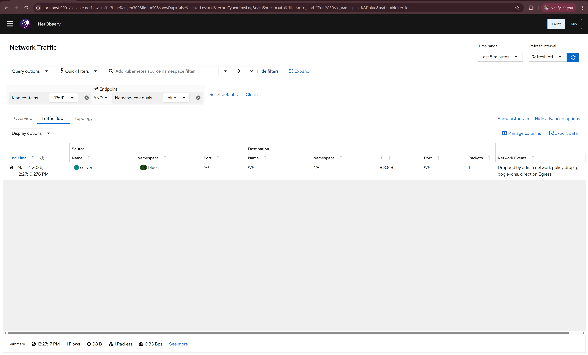
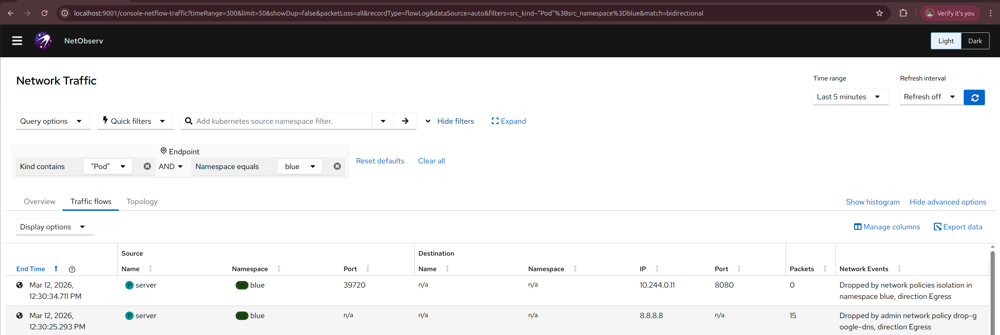

# Debugging NetworkPolicies with NetObserv

Observability is a key part of any system, and Kubernetes networking is no exception.
But even if you see WHAT happens in your network, you still don’t know WHY it happens. 
Especially if you have a number of network policies in the cluster, it is always difficult to tell why exactly 
a given connection is allowed or denied.

To solve this problem, OVN-Kubernetes has introduced a new observability feature together with the NetObserv project
that adds explicit communication between observability and networking.
This post will walk you through the installation steps and some examples of how to use it to understand the behavior of your network policies.
See feature guide for more information on limitations/requirements [OVN observability](../observability/ovn-observability.md).

## Install

- Run kind cluster with [OVN observability](../observability/ovn-observability.md) feature enabled
- Install NetObserv operator in Standalone mode following the [README guide](https://github.com/netobserv/netobserv-operator/tree/main?tab=readme-ov-file#getting-started)
- Some tweaks are required to the suggested flowCollector configuration 
Enable NetworkEvents to see OVN observability samples in NetObserv like so:
```yaml
spec:
  agent:
    ebpf:
      privileged: true
      features:
      - NetworkEvents
```
By default sampling rate is set to 50, which means that 1 in 50 packets will be sampled.
This is required to avoid overwhelming the system with samples, but that also means that a lot
of traffic will not be sampled. For the demo purposes, we can set the sampling rate to 1, which means that all packets will be sampled.
```yaml
spec:
  agent:
    ebpf:
      sampling: 1
```
Merging all the changes together with the current version of README from the netobserv-operator repo, we get the following configuration
```bash
cat <<EOF | kubectl apply -f -
apiVersion: flows.netobserv.io/v1beta2
kind: FlowCollector
metadata:
  name: cluster
spec:
  namespace: netobserv
  agent:
    ebpf:
      privileged: true
      features:
      - NetworkEvents
      sampling: 1
  consolePlugin:
    standalone: true
  processor:
    advanced:
      env:
        SERVER_NOTLS: "true"
  loki:
    mode: Monolithic
    monolithic:
      url: 'http://my-netobserv-loki.netobserv.svc.cluster.local.:3100/'
  prometheus:
    querier:
      mode: Manual
      manual:
        url: http://my-netobserv-kube-promethe-prometheus.netobserv.svc.cluster.local.:9090/
        alertManager:
          url: http://my-netobserv-kube-promethe-alertmanager.netobserv.svc.cluster.local.:9093/
EOF
```

Make sure to check against the latest recommended config and adjust the above example accordingly.
Wait for all the pods to come up before running port forwarding, then open the test console in your browser.

## Workload

To see the samples in NetObserv, we need to generate some traffic in the cluster.
Let's create 2 namespaces `red` and `blue` with 1 pod each, and emulate some pre-defined AdminNetworkPolicy (ANP) that you don't need to read, we will try to understand 
them later by looking at the samples.
```bash
cat <<EOF | kubectl apply -f -
kind: Namespace
apiVersion: v1
metadata:
  name: blue
---
apiVersion: v1
kind: Pod 
metadata: 
  name: server
  namespace: blue
spec:
  containers:
    - name: agnhost
      image: registry.k8s.io/e2e-test-images/agnhost:2.45
      command: ["/agnhost", "netexec"]
---
kind: Namespace
apiVersion: v1
metadata:
  name: red
---
apiVersion: v1
kind: Pod 
metadata: 
  name: server
  namespace: red
spec:
  containers:
    - name: agnhost
      image: registry.k8s.io/e2e-test-images/agnhost:2.45
      command: ["/agnhost", "netexec"]
---
apiVersion: policy.networking.k8s.io/v1alpha1
kind: AdminNetworkPolicy
metadata:
  name: drop-google-dns
spec:
  priority: 10
  subject:
    namespaces: 
      matchLabels:
        kubernetes.io/metadata.name: blue
  egress:
  - action: Deny
    to:
    - networks: [8.8.8.8/32]
EOF
```

Let's first check if the networking works.

```bash
$ kubectl exec -n blue server -- ping 8.8.8.8
PING 8.8.8.8 (8.8.8.8): 56 data bytes
^C
```
This fails, but why? Let's check if we have any NetworkPolicies in the `blue` namespace

```bash
$ kubectl get networkpolicy -n blue
No resources found in blue namespace.
```

No clue here, let's check the NetObserv console and see if it knows more.
Go to the `Traffic flows` tab and select namespace blue. Also make sure to add Destination IP as a column in the table
because it is not set by default, you can configure visible columns by clicking the `Manage columns` button.
Also make sure to either put some non-zero `Refresh interval` or manually refresh when checking for the latest data.
You should see something like this:



We didn't create any `NetworkPolicies`, but cluster admin can create cluster-wide policies using `AdminNetworkPolicy`,
that may affect any namespace in the cluster, and without the right observability tools, it may be hard to understand
why some traffic is allowed or dropped.
While we probably can't see what is inside the ANP, we can infer from the message "Dropped by admin network policy drop-google-dns, direction Egress"
that drops `8.8.8.8` specifically and we just picked an unfortunate destination IP to test the network, let's try another one

```bash
$ kubectl exec -n blue server -- ping 1.1.1.1
PING 1.1.1.1 (1.1.1.1): 56 data bytes
64 bytes from 1.1.1.1: seq=0 ttl=55 time=25.378 ms
64 bytes from 1.1.1.1: seq=1 ttl=55 time=25.711 ms
```

That's better!
My `blue` namespace will need to connect to the `red` server, let's see if that works

```bash
$ kubectl get pods -n red -o wide
NAME     READY   STATUS    RESTARTS   AGE   IP            NODE         NOMINATED NODE   READINESS GATES
server   1/1     Running   0          48m   10.244.0.11   ovn-worker   <none>           <none>

$ kubectl exec -n blue server -- curl 10.244.0.11:8080
NOW: 2026-03-12 09:59:20.661985026 +0000 UTC m=+2921.611518203 
  % Total    % Received % Xferd  Average Speed   Time    Time     Time  Current
                                 Dload  Upload   Total   Spent    Left  Speed
100    62  100    62    0     0  51666      0 --:--:-- --:--:-- --:--:-- 62000
```

Now let's actually protect our namespaces with a NetworkPolicy.
Allow `blue` pods to connect to this server only:

```bash
cat <<EOF | kubectl apply -f -
kind: NetworkPolicy
apiVersion: networking.k8s.io/v1
metadata:
  name: allow-server
  namespace: blue
spec:
  podSelector: {}
  egress:
    - to:
      ports:
        - protocol: TCP
          port: 80
  policyTypes:
  - Egress
EOF
```
aaand check:

```bash
$ kubectl exec -n blue server -- curl 10.244.0.11:8080
  % Total    % Received % Xferd  Average Speed   Time    Time     Time  Current
                                 Dload  Upload   Total   Spent    Left  Speed
  0     0    0     0    0     0      0      0 --:--:--  0:00:02 --:--:--     0^C
```
that was unexpected, what now? Let's check the NetObserv console again (don't forget to refresh)



it says "Dropped by network policies isolation in namespace blue, direction Egress"

We wanted to allow that connection with the `allow-server` NetworkPolicy, why doesn't it work?
Oh, the port is wrong, it should be `8080` and not `80`, let's fix that

```bash
cat <<EOF | kubectl apply -f -
kind: NetworkPolicy
apiVersion: networking.k8s.io/v1
metadata:
  name: allow-server
  namespace: blue
spec:
  podSelector: {}
  egress:
    - to:
      ports:
        - protocol: TCP
          port: 8080
  policyTypes:
  - Egress
EOF
```
and check:
```bash
$ kubectl exec -n blue server -- curl 10.244.0.11:8080
  % Total    % Received % Xferd  Average Speed   Time    Time     Time  Current
                                 Dload  Upload   Total   Spent    Left  Speed
100    62  100    62    0     0  48324      0 --:--:-- --:--:-- --:--:-- 62000
NOW: 2026-03-12 10:15:31.210317019 +0000 UTC m=+3892.159850196
```
and NetObserv `NetworkEvents` says "Allowed by network policy allow-server in namespace blue, direction Egress", 
exactly what we wanted to see!

Now let's see if the other destinations are dropped:
```bash
$ kubectl exec -n blue server -- ping 1.1.1.1
PING 1.1.1.1 (1.1.1.1): 56 data bytes
^C
```
and NetObserv says "Dropped by network policies isolation in namespace blue, direction Egress", works as expected!

Now let's create another namespace `yellow` that runs another server `blue` namespace needs to connect to.

```bash
cat <<EOF | kubectl apply -f -
kind: Namespace
apiVersion: v1
metadata:
  name: yellow
---
apiVersion: v1
kind: Pod 
metadata: 
  name: server
  namespace: yellow
spec:
  containers:
    - name: agnhost
      image: registry.k8s.io/e2e-test-images/agnhost:2.45
      command: ["/agnhost", "netexec"]
EOF
```

We need to create another NetworkPolicy to allow `blue` namespace to connect to the `yellow` server, let's check that it fails first.

```bash
$ kubectl get pods -n yellow -o wide
NAME     READY   STATUS    RESTARTS   AGE   IP            NODE         NOMINATED NODE   READINESS GATES
server   1/1     Running   0          75m   10.244.0.12   ovn-worker   <none>           <none>
$ kubectl exec -n blue server -- curl 10.244.0.12:8080
  % Total    % Received % Xferd  Average Speed   Time    Time     Time  Current
                                 Dload  Upload   Total   Spent    Left  Speed
100    62  100    62    0     0  44349      0 --:--:-- --:--:-- --:--:-- 62000
NOW: 2026-03-12 10:47:48.871924355 +0000 UTC m=+5829.558805665
```

Wait, I didn't allow that, why does it succeed? Let's check NetObserv, it says 
"Allowed by network policy allow-server in namespace blue, direction Egress", let's take a look at that `NetworkPolicy` again.
```yaml
kind: NetworkPolicy
apiVersion: networking.k8s.io/v1
metadata:
  name: allow-server
  namespace: blue
spec:
  podSelector: {}
  egress:
    - to:
      ports:
        - protocol: TCP
          port: 8080
  policyTypes:
    - Egress 
```

we only added port-based filtering, but not the namespace filtering, so any connection to port `8080` is allowed,
even if it is not the server in the `red` namespace that we wanted to allow at first. Let's fix this and also
allow a `yellow` namespace at the same time.

```bash
cat <<EOF | kubectl apply -f -
kind: NetworkPolicy
apiVersion: networking.k8s.io/v1
metadata:
  name: allow-server
  namespace: blue
spec:
  podSelector: {}
  egress:
    - to:
      - namespaceSelector:
          matchExpressions:
            - key: kubernetes.io/metadata.name
              operator: In
              values: 
                - red
                - yellow
      ports:
        - protocol: TCP
          port: 8080
  policyTypes:
  - Egress
EOF
```

Now both connections to namespace `red` and `yellow` are allowed
```bash
$ kubectl exec -n blue server -- curl 10.244.0.12:8080
  % Total    % Received % Xferd  Average Speed   Time    Time     Time  Current
                                 Dload  Upload   Total   Spent    Left  Speed
100    62  100    62    0     0  48324      0 --:--:-- --:--:-- --:--:-- 62000
NOW: 2026-03-12 10:57:24.224269981 +0000 UTC m=+6404.911151302
$ kubectl exec -n blue server -- curl 10.244.0.11:8080
  % Total    % Received % Xferd  Average Speed   Time    Time     Time  Current
                                 Dload  Upload   Total   Spent    Left  Speed
100    62  100    62    0     0  43175      0 --:--:-- --:--:-- --:--:-- 62000
NOW: 2026-03-12 10:56:08.079663587 +0000 UTC m=+6329.029196764
```

And if we create another namespace `green` that we didn't allow, the connection should be dropped
```bash
cat <<EOF | kubectl apply -f -
kind: Namespace
apiVersion: v1
metadata:
  name: green
---
apiVersion: v1
kind: Pod 
metadata: 
  name: server
  namespace: green
spec:
  containers:
    - name: agnhost
      image: registry.k8s.io/e2e-test-images/agnhost:2.45
      command: ["/agnhost", "netexec"]
EOF
```
```bash
$ kubectl get pods -n green -o wide
NAME     READY   STATUS    RESTARTS   AGE   IP            NODE         NOMINATED NODE   READINESS GATES
server   1/1     Running   0          7s    10.244.0.13   ovn-worker   <none>           <none>
$ kubectl exec -n blue server -- curl 10.244.0.13:8080
  % Total    % Received % Xferd  Average Speed   Time    Time     Time  Current
                                 Dload  Upload   Total   Spent    Left  Speed
  0     0    0     0    0     0      0      0 --:--:--  0:00:01 --:--:--     0^C
```

Now we can be sure that our `NetworkPolicy` is working as expected.