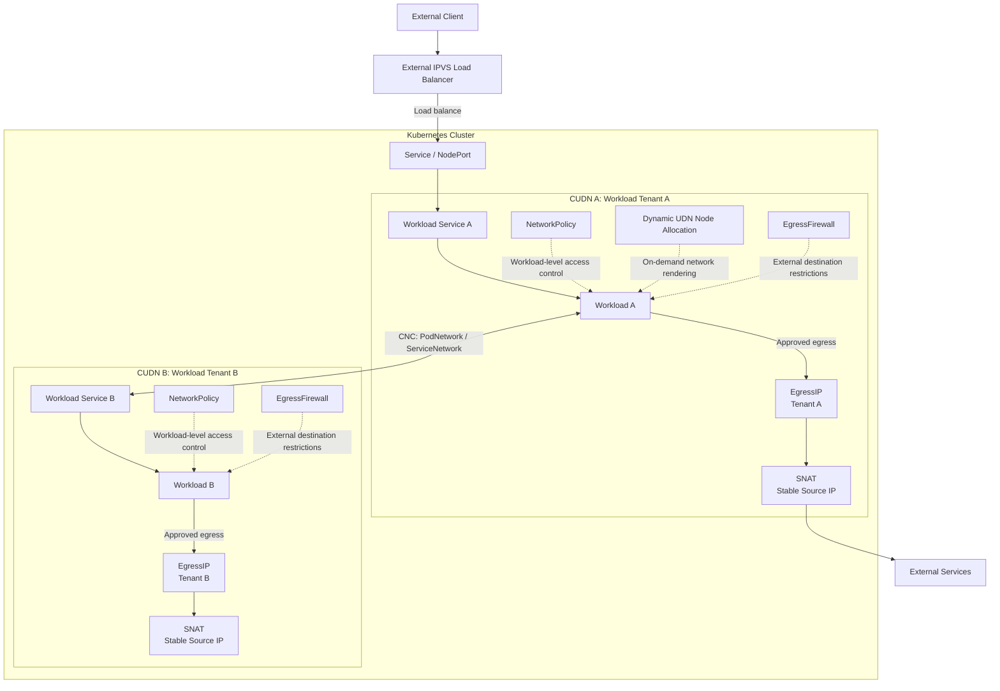

# SAIC Motor's Kubernetes-Based Multi-Tenant Networking Practice: Building a Unified Network Foundation with OVN-Kubernetes

SAIC Motor is a Chinese automobile company. When we chose Kubernetes as a unified, multi-tenant infrastructure for containers, virtual machines, and AI agents, its network had to evolve beyond basic Pod connectivity into a unified multi-tenant network foundation capable of supporting heterogeneous workloads. Through its OVN-based software-defined networking capabilities, OVN-Kubernetes provides a consistent network model for containers, KubeVirt virtual machines, and agent runtimes. This is particularly important for agents: each tenant can have a group of agents that communicate with one another, while agents belonging to different tenants remain isolated at the network layer.

Today, SAIC Motor operates two generations of Kubernetes clusters:

1. The existing fleet, which runs OVN-Kubernetes in central mode and relies on an in-house multi-tenant networking solution built on capabilities that have since been deprecated upstream.
2. The new AI agent fleet, which runs OVN-Kubernetes in interconnect mode and is currently being evaluated as the foundation for our next-generation multi-tenant infrastructure.

This blog post outlines our journey toward designing and building the new fleet, including the architectural decisions and capabilities we are evaluating along the way.
Looking ahead, once the required feature set has been fully implemented and validated, we plan to gradually migrate workloads from the existing fleet to the new architecture.

<!-- more -->

## Overall Design: Layering Isolation, Connectivity, and North-South Traffic Governance

In the diagram, solid lines represent data flows, while dashed lines represent policy or control relationships.  EgressFirewall, and EgressIP all affect traffic, but they are not separate network devices that packets traverse sequentially.

The responsibilities in this architecture are divided as follows:

* ClusterUserDefinedNetwork (CUDN) defines the network boundary of a tenant or security domain;
* Cluster Network Connect (CNC) explicitly establishes connectivity between isolated domains;
* NetworkPolicy constrains workload-level ingress and egress within its policy scope;
* EgressFirewall restricts external destinations, while EgressIP provides an identifiable source address for egress traffic;
* Service and NodePort provide ingress abstractions, while an external IPVS load balancer selects the appropriate ingress node.

## Deployment Baseline: Shared Gateway and Single-Node-Zone Interconnect

We use shared gateway mode together with OVN-Kubernetes's current default [interconnect architecture](../../design/architecture.md), in which each node belongs to its own zone—that is, a single-node-zone interconnect.

In shared gateway mode, traffic leaving the cluster can remain in the OVN/OVS data path and reach the external network through the Gateway Router and OVS bridge. Compared with a path in which traffic first leaves OVN/OVS and then enters the host network stack, this mode is better suited to our performance goals and preserves the option of OVS hardware offload. We have evaluated several DPU hardware solutions with OVN-Kubernetes, and they have delivered promising results. We believe hardware offload is a must-have when network bandwidth reaches 100 Gb/s.

Interconnect keeps the Kubernetes control-plane components on control-plane nodes while running OVN databases, `northd`, and node-local controllers per zone, eliminating the dependency on a centralized set of OVN databases. The following discussions of the Layer2 Transit Router, Dynamic UDN, and cross-network connectivity all assume this deployment baseline.

## Using Primary CUDNs to Create Isolated Domains for Tenant Workloads

We use [ClusterUserDefinedNetwork](../../features/user-defined-networks/user-defined-networks.md) to create cluster-scoped primary networks, selecting multiple namespaces from the same tenant, business domain, or security domain into a single CUDN. For workloads in these namespaces, the Primary CUDN is the default network rather than merely an additional network interface.

Compared with relying solely on NetworkPolicy for isolation within a shared cluster network, CUDN first establishes default isolation at the network topology layer. Workloads in different CUDNs do not become connected by default as the number of namespaces grows or when policies are inadvertently omitted. NetworkPolicy then expresses finer-grained access rules within each isolated domain.

## Selecting Layer2 for Primary CUDNs and Enabling the Layer2 Transit Router

Our current CUDNs use the Layer2 topology with the [Layer2 Transit Router](../../okeps/okep-5094-layer2-transit-router.md) enabled. We made this choice for the following reasons.

First, Layer2 provides consistent Layer 2 network semantics across nodes for workloads in the same CUDN. For virtual machines, persistent IPAM can preserve addresses during migration and provide a more stable default gateway identity.

Second, the Layer2 Transit Router introduces a network-level transit router for Primary Layer2 UDNs. It is designed to provide a stable default gateway for virtual machines and eliminate the previous Layer2 EgressIP implementation's dependency on external gateway addresses and special routing policies.

Third, Layer2 can reduce address consumption for CUDN interconnections. After [ClusterNetworkConnect](../../features/user-defined-networks/cluster-network-connect.md) allocates an address range to each Layer3 network, it must also allocate a `/31` or `/127` point-to-point subnet to every node. Each Layer2 network requires only one `/31` or `/127`, regardless of the number of nodes.

## Reducing UDN Scaling Costs with Dynamic UDN Node Allocation

By default, every UDN is rendered on every node. Even if a node has never run workloads belonging to a particular tenant, OVN-Kubernetes still creates OVN and host-side state for that network. As the number of CUDNs increases, this “number of networks multiplied by number of nodes” model gradually becomes a burden on both the control plane and the data plane.

We enable [Dynamic UDN Node Allocation](../../features/user-defined-networks/dynamic-udn.md) so that a CUDN is rendered only on nodes that actually use it. A node becomes active for a UDN in any of the following situations:

* A workload is scheduled to the node and attached to the CUDN;
* The node is assigned as an EgressIP node for the UDN;
* The UDN is connected through CNC to another UDN that is already active on the node.

This capability reduces unnecessary per-node network objects and address allocations. It also alleviates the pressure that rendering every UDN on every node would otherwise place on the OVS data plane.

## Establishing Controlled Connectivity with ClusterNetworkConnect

The value of CUDNs lies in their default isolation, but a platform cannot consist solely of disconnected network islands. Workloads need access to model services, tool services, knowledge bases, and shared platform components. We therefore use [ClusterNetworkConnect](../../features/user-defined-networks/cluster-network-connect.md) to explicitly connect different CUDNs.

Our current connections enable both:

* `PodNetwork`: permits direct workload IP communication between connected networks;
* `ServiceNetwork`: permits access to ClusterIP Services in connected networks.

CNC connections are symmetric but not transitive: if A is connected to B and B is connected to C, A does not automatically gain a path to C. Every cross-domain relationship must be declared explicitly, which is well suited to expressing the platform's principle of minimum connectivity.

The interconnection address ranges specified by `connectSubnets` must be planned before the resource is created. They are immutable after creation, and the connected networks themselves cannot use overlapping Pod CIDRs.

## Using NetworkPolicy as a “Security Group” Within a CUDN

Within each CUDN, we use Kubernetes [NetworkPolicy](../../features/network-security-controls/network-policy.md) to manage east-west access among workloads, tool services, and platform components.

When a NetworkPolicy includes egress rules, it also provides workload-level control over outbound connections before namespace-level EgressFirewall rules are applied.

We treat the responsibilities of CUDN and NetworkPolicy separately:

* CUDN determines which isolated network domain a workload belongs to;
* NetworkPolicy determines which workloads may communicate within the policy's scope.

## Managing Workload Egress with EgressIP and EgressFirewall

Network egress involves two distinct questions: **where traffic may go** and **which identity it uses when leaving the cluster**. We use EgressFirewall and EgressIP to address these questions separately.

[EgressFirewall](../../features/network-security-controls/egress-firewall.md) restricts the external CIDRs and ports that workloads in a namespace may access. Our current policies primarily use IP address ranges; we have not enabled DNS name rules.

[EgressIP](../../features/cluster-egress-controls/egress-ip.md) assigns stable, identifiable egress source addresses to different tenants or workload security domains. External firewalls, partner systems, and audit platforms can allowlist these addresses and associate external access with a specific tenant instead of seeing only arbitrary node egress addresses.

## Current Ingress Approach: Service with NodePort

We currently expose workloads using Kubernetes Services with NodePort. A Service provides a stable service abstraction, while NodePort exposes an external port. Together with an independent external IPVS load balancer, this allows external traffic to enter the cluster through selected nodes and then be forwarded to workload endpoints within a CUDN.

After Dynamic UDN Node Allocation is enabled, external traffic cannot be sent indiscriminately to nodes on which the target CUDN has not yet been rendered. We maintain the mapping between UDN ingress workloads and nodes to ensure that IPVS forwards traffic only to nodes where the UDN is active.

We are still evaluating LoadBalancer Service solutions for environments with Dynamic UDN Node Allocation enabled. The key challenge is enabling different UDNs to advertise their LoadBalancer VIPs on different sets of nodes.

## Feedback for OVN-Kubernetes community

Based on our practical experience, we recommend further development in the following areas.

### 1. VXLAN/EVPN-Based Multi-Cluster Networking in Shared Gateway Mode

The current [EVPN](../../features/bgp-integration/evpn.md) implementation requires local gateway mode and uses VXLAN instead of Geneve as the transport for selected CUDNs. We would like to see EVPN extended to shared gateway mode, allowing CUDNs to span clusters or establish controlled cross-cluster connections while preserving the shared gateway data path and hardware offload capabilities, thereby enabling multi-availability-zone deployments.

### 2. Workload-Declarable Highly Available Floating VIPs

For workloads running within an L2 CUDN, a highly available Virtual IP (VIP) can be implemented by running Keepalived directly inside the workloads. Multiple workloads can participate in a VRRP group, with one instance acting as the active owner of the VIP. If the active workload becomes unavailable, the VIP can automatically fail over to another healthy workload.

This pattern is useful for applications that require an active/standby architecture while preserving a stable service IP address, such as deploying highly available OpenVPN gateways inside a CUDN.

At the OVN networking layer, this behavior is closely related to the virtual logical switch port mechanism. OVN supports logical switch ports of type virtual, where a virtual IP can be dynamically associated with one of several parent logical switch ports. As ownership changes, OVN can move the VIP to the corresponding child workload port.

### 3. Private CUDNs

A Private CUDN should explicitly express “no default external egress” in the network model. Platform administrators could then attach a NAT Gateway as needed, instead of granting egress by default and relying on policies to restrict it afterward. This feature is included in the [Plexus proposal](https://github.com/ovn-kubernetes/ovn-kubernetes/pull/6649), which is currently under discussion within the community.

### 4. Native NAT Gateway

We would like a dedicated API for declaring NAT Gateways and centrally managing SNAT, DNAT, egress IP control, failover, and bandwidth limits.

### 5. Custom Routing Tables

Default routes and static connectivity relationships are insufficient when workloads need to build complex network topologies. We would like to configure custom routing tables, next hops, and policy-based routing for CUDNs through an API. This feature is also part of the Plexus proposal.

## Conclusion: Toward Software-Defined Networking for the Kubernetes Platform

When containers, virtual machines, and AI agents are managed by Kubernetes, the platform needs a network control plane that is declaratively composable, observable, and able to evolve continuously. We hope OVN-Kubernetes will become **“The Software Defined Network for the Kubernetes platform.”**
