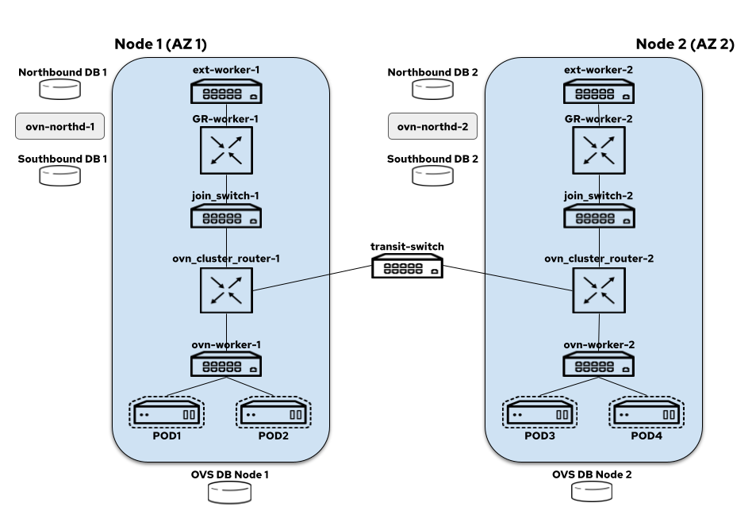

# OVN-Kubernetes Network Topology

OVN-Kubernetes uses interconnect mode, a distributed control plane
architecture. The network topology is distributed across zones; by default,
each node is in a zone of its own.

## OVN-Kubernetes Network Topology - Distributed (Interconnect)

The interconnect architecture in OVN-K looks like this today
(we assume each node is in a zone of their own):

On each node we have:

* node-local-switch: all the logical switch ports for the pods
created on a node are bound to this switch and it also hosts
load balancers that take care of DNAT-ing the service traffic
* distributed-ovn-cluster-router: it's responsible for tunnelling
overlay traffic between the nodes and also routing traffic between
the node switches and gateway router's (note that if its one node
per zone this behaves like a local router since there is no need
for a distributed setup; if there are multiple nodes in the same
zone, then it uses GENEVE tunnel for overlay traffic)
* distributed-join-switch: connects the ovn-cluster-router to the
gateway routers (note that if its one node per zone this behaves
like local switch since there is no need for a distributed setup;
if there are multiple nodes in the same zone, then its distributed
and connects cross more than one gateway router)
* node-local-gateway-router: it's responsible for north-south
traffic routing and connects the join switch to the external
switch and it also hosts load balancers that take care of DNAT-ing
the service traffic
* node-local-external-switch: connects the gateway router to the
external bridge
* transit-switch: distributed across the nodes in the cluster and responsible
for routing traffic between the different zones.

FIXME: This page is lazily written, there is so much more to do here.
