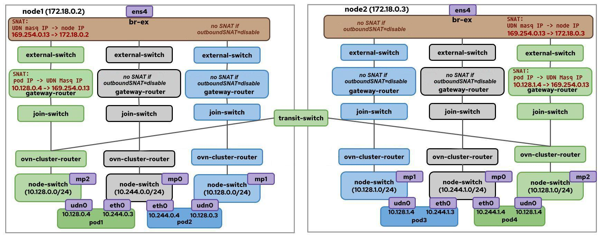

# No-Overlay Mode

## Introduction

No-overlay mode lets selected OVN-Kubernetes Layer 3 pod networks use direct
underlay routing for inter-node pod east/west traffic instead of Geneve
encapsulation. It uses the [Route Advertisements](route-advertisements.md)
integration with FRR-k8s to advertise pod network routes through BGP, so the
provider network or an OVN-Kubernetes managed internal BGP fabric can route
traffic between pod subnets.

No-overlay mode can be enabled for:

* The cluster default network.
* Primary Layer 3 `ClusterUserDefinedNetwork` (CUDN) networks.

Overlay and no-overlay networks can exist in the same cluster. Networks that do
not explicitly enable no-overlay continue to use the default OVN overlay
transport. No-overlay mode is compatible with local gateway mode and shared
gateway mode.



## Prerequisites

* A bare-metal deployment.
* OVN-Kubernetes single-node zone interconnect mode.
* The `route-advertisements` feature enabled in the OVN-Kubernetes
  configuration.
* [FRR-k8s](https://github.com/metallb/frr-k8s) deployed with FRR speakers
  running on every node.
* For unmanaged routing, administrator-created `RouteAdvertisements` and
  `FRRConfiguration` resources that exchange pod subnet routes. In managed
  routing mode, OVN-Kubernetes creates these resources for the internal
  full-mesh BGP fabric.

Always check the dependencies on the [Requirements page](../requirements.md).

> [!NOTE]
> Changing the cluster default network between overlay and no-overlay transport
> is not supported after the cluster has been created. Configure the desired
> transport at installation time.

## Motivation

The default OVN-Kubernetes overlay carries inter-node pod traffic through Geneve
tunnels. That model works without requiring the provider network to know pod
routes, but it adds encapsulation overhead and consumes CPU for tunnel handling.

No-overlay mode is useful when the deployment already has routing infrastructure
that can carry pod subnet routes. In that environment, pod traffic can use the
provider network directly, which can reduce overhead and make pod IP reachability
visible to existing network devices.

## Routing Modes

No-overlay networks use one of two routing modes.

* `managed`: OVN-Kubernetes creates the BGP resources for an internal full-mesh
  fabric. In this mode, each node advertises pod subnets to the default VRF on
  the other nodes. Use this only when nodes are directly connected at Layer 2.
  It is normally paired with SNAT enabled.
* `unmanaged`: The cluster administrator creates the `FRRConfiguration` and
  `RouteAdvertisements` resources. This is the right choice when an external
  BGP route reflector, eBGP topology, VRF-Lite design, or another site-specific
  routing design owns pod subnet distribution. This mode is normally used with
  SNAT disabled.

Managed routing currently supports only the `full-mesh` topology. For large
clusters, prefer unmanaged routing with route reflectors or another scalable BGP
topology.

In managed routing mode, administrators can still advertise the no-overlay pod
network to external BGP infrastructure by creating additional
`RouteAdvertisements` and `FRRConfiguration` resources.

## Traffic Behavior

When no-overlay mode is enabled for a network:

* Intra-node traffic remains on the local OVN bridge.
* Inter-node traffic follows the same path as north-south traffic and is routed
  through the underlay.
* Pod-to-pod and pod-to-ClusterIP traffic within the same network is forwarded
  without overlay encapsulation and without NAT.
* Pod-to-node egress traffic is SNATed to the source node IP so pods can access
  NodePort services in a different user-defined network.

## SNAT Behavior

No-overlay mode separates pod-to-pod routing from pod egress behavior.

* `outbound-snat = enabled` for the default network, or
  `outboundSNAT: Enabled` for a CUDN, SNATs pod-to-external traffic to the node
  IP. This is useful when pod IPs should not be visible or routable outside the
  cluster.
* `outbound-snat = disabled` for the default network, or
  `outboundSNAT: Disabled` for a CUDN, preserves pod IPs for external traffic.
  Use this only when the external network can route return traffic to pod IPs.

Pod-to-remote-pod traffic on a no-overlay network is not SNATed.
Traffic to remote nodes, to the Kubernetes API server, and to DNS is always SNATed.

## Enable no-overlay mode on the Default Network

The default network is configured with the `transport` option in the `[default]`
section and no-overlay options in the `[no-overlay]` section of the
OVN-Kubernetes configuration file.

### Managed Routing

Use managed routing when OVN-Kubernetes should create the internal BGP fabric
for the default network.

```ini
[default]
transport = no-overlay

[no-overlay]
outbound-snat = enabled
routing = managed

[bgp-managed]
topology = full-mesh
as-number = 64512
frr-namespace = frr-k8s-system
```

With this configuration, OVN-Kubernetes creates:

* A managed `RouteAdvertisements` object for the default network.
* A managed base `FRRConfiguration` in the configured FRR namespace.

The managed `FRRConfiguration` peers node FRR speakers with each other and
allows them to receive the no-overlay pod subnet routes.

When deploying with the OVN-Kubernetes Helm chart, the equivalent global values
are:

```yaml
global:
  enableRouteAdvertisements: true
  enableNoOverlay: true
  enableNoOverlaySnat: true
  enableNoOverlayManagedRouting: true
  managedBGPTopology: full-mesh
  managedBGPASNumber: 64512
  managedBGPFRRNamespace: frr-k8s-system
```

### Unmanaged Routing

Use unmanaged routing when the administrator owns the BGP configuration.

```ini
[default]
transport = no-overlay

[no-overlay]
outbound-snat = disabled
routing = unmanaged
```

In unmanaged mode, create an `FRRConfiguration` that peers with the routing
infrastructure and accepts pod subnet routes. The values below are examples;
adjust the AS numbers, neighbor address, and pod subnet prefixes for your
deployment.

```yaml
apiVersion: frrk8s.metallb.io/v1beta1
kind: FRRConfiguration
metadata:
  name: default-no-overlay
  namespace: frr-k8s-system
  labels:
    network: default-no-overlay
spec:
  nodeSelector: {}
  bgp:
    routers:
    - asn: 64512
      neighbors:
      - address: 172.20.0.2
        asn: 64512
        disableMP: true
        toReceive:
          allowed:
            mode: filtered
            prefixes:
            - prefix: 10.128.0.0/16
              ge: 24
              le: 24
```

Then create a `RouteAdvertisements` object that selects the default network and
the `FRRConfiguration`:

```yaml
apiVersion: k8s.ovn.org/v1
kind: RouteAdvertisements
metadata:
  name: default-no-overlay
spec:
  advertisements:
  - PodNetwork
  nodeSelector: {}
  frrConfigurationSelector:
    matchLabels:
      network: default-no-overlay
  networkSelectors:
  - networkSelectionType: DefaultNetwork
```

The default network no-overlay controller validates that at least one
`RouteAdvertisements` object advertises the default network pod routes and has
`Accepted=True`. If none exists, or if the selected object is not accepted,
OVN-Kubernetes reports an event on the default network
`NetworkAttachmentDefinition`.

## Enable no-overlay mode on a ClusterUserDefinedNetwork

No-overlay CUDNs are configured in the `ClusterUserDefinedNetwork` API. Only
primary Layer 3 CUDNs are supported.

```yaml
apiVersion: k8s.ovn.org/v1
kind: ClusterUserDefinedNetwork
metadata:
  name: blue
  labels:
    network: blue
spec:
  namespaceSelector:
    matchExpressions:
    - key: kubernetes.io/metadata.name
      operator: In
      values:
      - blue-a
      - blue-b
  network:
    topology: Layer3
    layer3:
      role: Primary
      mtu: 1500
      subnets:
      - cidr: 10.10.0.0/16
        hostSubnet: 24
    transport: NoOverlay
    noOverlay:
      outboundSNAT: Disabled
      routing: Unmanaged
```

The `noOverlay` field is required when `transport: NoOverlay` is set and is
forbidden otherwise. The `ClusterUserDefinedNetwork` API also rejects
no-overlay transport on Layer 2, localnet, and secondary Layer 3 networks.
The CUDN `spec` is immutable, so the transport configuration cannot be changed
after the CUDN is created.

To use managed routing for a CUDN, set `routing: Managed` and configure the
global `[bgp-managed]` section shown in the default network managed-routing
example. The CUDN still reports transport acceptance only after a
`RouteAdvertisements` object advertises its pod routes and reaches
`Accepted=True`.

Create a `RouteAdvertisements` object that selects the CUDN and advertises
`PodNetwork` routes:

```yaml
apiVersion: k8s.ovn.org/v1
kind: RouteAdvertisements
metadata:
  name: blue-no-overlay
spec:
  advertisements:
  - PodNetwork
  nodeSelector: {}
  frrConfigurationSelector:
    matchLabels:
      network: blue
  networkSelectors:
  - networkSelectionType: ClusterUserDefinedNetworks
    clusterUserDefinedNetworkSelector:
      networkSelector:
        matchLabels:
          network: blue
```

For VRF-Lite designs, set `targetVRF: auto` or a specific VRF as described in
the [Route Advertisements VRF-Lite workflow](route-advertisements.md#import-and-export-routes-to-a-cudn-over-the-network-vrf-vrf-lite).

When the CUDN is reconciled, OVN-Kubernetes sets the `TransportAccepted` status
condition:

```yaml
status:
  conditions:
  - type: TransportAccepted
    status: "True"
    reason: NoOverlayTransportAccepted
    message: "Transport has been configured as 'no-overlay'."
```

If no accepted `RouteAdvertisements` object advertises the CUDN pod routes, the
condition is set to `False` with a reason such as
`NoOverlayRouteAdvertisementsIsMissing` or
`NoOverlayRouteAdvertisementsNotAccepted`.

## Operational Notes

* The MTU for a no-overlay pod network can match the provider network MTU
  because there is no Geneve overhead. Do not set a pod MTU larger than the
  underlay can carry.
* `RouteAdvertisements` with `PodNetwork` must select all nodes with
  `nodeSelector: {}`. A network cannot be partly overlay and partly no-overlay.
* No-overlay CUDNs with overlapping pod subnets cannot be advertised into the
  same VRF. Use a VRF-Lite design when overlapping pod CIDRs are required.
* East-west traffic depends on the BGP network. BGP speaker outages can impact
  cluster pod networking.
* No-overlay mode inherits the limitations of the Route Advertisements and BGP
  integration.
* Network debugging includes both OVN-Kubernetes and the BGP routing
  infrastructure. Check the `RouteAdvertisements` status before debugging data
  plane paths.

## Known Limitations

* No-overlay mode is limited to the cluster default network and primary Layer 3
  CUDNs.
* `UserDefinedNetwork`, Layer 2 CUDN, localnet CUDN, and secondary Layer 3 CUDN
  no-overlay transport are not supported.
* Creating a no-overlay network manually with a `NetworkAttachmentDefinition` is
  not supported.
* No-overlay mode does not rely on routes that administrators might add directly to
  the underlay. Each no-overlay network must have at least one accepted
  `RouteAdvertisements` object that advertises `PodNetwork` routes. In unmanaged
  routing mode, administrators must create the matching `RouteAdvertisements`
  and `FRRConfiguration` resources. In managed routing mode, OVN-Kubernetes
  creates those resources for the internal BGP fabric.
* Features that rely on OVN delivering pod-to-pod traffic through the overlay,
  such as IPsec, multicast, EgressIP, and EgressService, are not supported on
  no-overlay networks.
  OVN-Kubernetes does not reject EgressIP or EgressService configuration on a
  no-overlay network, so do not rely on those features for no-overlay traffic.
* Advertised UDN isolation loose mode is broken if multiple no-overlay UDNs are
  advertised to the same VRF. Use VRF-Lite or an external routing design that
  preserves the intended isolation.
* Managed routing uses a full-mesh BGP topology and is not intended for large
  clusters.
* The default network transport cannot be changed between overlay and
  no-overlay after cluster creation.

## Related Documentation

* [Route Advertisements](route-advertisements.md)
* [User Defined Networks](../user-defined-networks/user-defined-networks.md)
* [No-overlay enhancement proposal](../../okeps/okep-5259-no-overlay.md)
* [UserDefinedNetwork API reference](../../api-reference/userdefinednetwork-api-spec.md)
