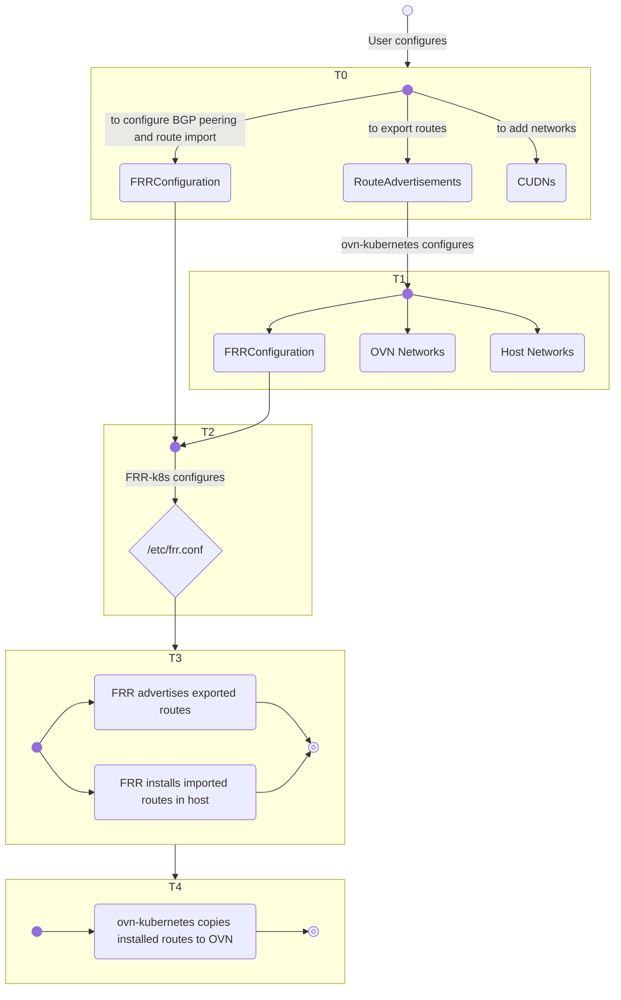

# Route Advertisements

## Introduction

The Route Advertisements feature introduces BGP as a supported routing protocol
with OVN-Kubernetes enabling the integration into different BGP user
environments. The extent of the Route Advertisements feature and corresponding
API allows importing routes from BGP peers on the provider network into OVN pod
networks as well as exporting pod network and egress IP routes to BGP peers on
the provider network. Both default pod network as well as primary Layer 3 and
Layer 2 cluster-user-defined networks (CUDNs) are supported.

> [!NOTE]
> For purposes of this documentation, the external, physical network of the
> cluster which a user administers will be called the “provider network”.

## Prerequisites

- [FRR-k8s](https://github.com/metallb/frr-k8s)

## Motivation

There are multiple driving factors which necessitate integrating BGP into
OVN-Kubernetes:

- Importing Routes from the Provider Network: Today there is no API for a user
to be able to configure routes into OVN. In order for a user to change how
egress traffic is routed, the user leverages local gateway mode. This mode
forces traffic to hop through the Linux networking stack, and there a user can
configure routes inside the host to control egress routing. This manual
configuration would need to be performed and maintained across nodes and VRFs
within each node.

- Exporting Routes into the Provider Network: There exists a need for provider
networks to learn routes directly to pods today in Kubernetes. One such use case
is integration with 3rd party load balancers, where they terminate a load
balancer and then send packets directly to cluster nodes with the destination IP
address being the pod IP itself. Today these load balancers rely on custom
operators to detect which node a pod is scheduled to and then add routes into
its load balancer to send the packet to the right node. By integrating BGP and
advertising the pod subnets/addresses directly on the provider network, load
balancers and other entities on the network would be able to reach the pod IPs
directly.

Additionally, integrating BGP support paves the way for other BGP based features
that might be implemented in the future, like:

- EVPN support to extend pod network isolation outside the cluster.
- No overlay mode to avoid the Geneve overhead.

## User-Stories/Use-Cases

- As a user, I want to be able to leverage my existing BGP network to dynamically
  learn routes to pods in my Kubernetes cluster.
- As a user, rather than having to maintain routes manually in each Kubernetes
  node, as well as being constrained to using local gateway mode for respecting
  user-defined routes; I want to use BGP so that I can dynamically advertise
  egress routes for the Kubernetes pod traffic in either gateway mode.
- As an egress IP user, I want to use a pure routing implementation to handle
  advertising egress IP movement across nodes.
- As a user, I want to extend CUDN isolation to the provider network over a
  VRF-Lite type of VPN where I can restrict traffic of the CUDN to an interface
  attached to the VRF associated with the CUDN.

> [!NOTE]
> The [isolation](#cudn-isolation) between different pod networks is unaffected
> by this feature.

## How to enable this feature on an OVN-Kubernetes cluster?

The `route-advertisements` feature must be enabled in the OVN-Kubernetes
configuration. Please use the `Feature Config` option
`enable-route-advertisements` under `OVNKubernetesFeatureConfig` config to
enable it.

## User-facing API Changes

A new OVN-Kubernetes API is introduced for this feature:
[`RouteAdvertisements`](../../api-reference/routeadvertisements-api-spec.md).

## Workflow Description

OVN-Kubernetes integrates with FRR-k8s to provide BGP support and it must be
deployed before enabling the `route-advertisements` feature.

Once deployed, an initial FRR-k8s configuration must be done using its
`FRRConfiguration` API which serves, among others, three purposes:

- Configure BGP peering.
- Configure route import.
- Serve as a template to the `FRRConfiguration` instances that OVN-Kubernetes
  generates.

Finally, route export is configured through `RouteAdvertisements` instances.
Each `RouteAdvertisements` instance allows to select which pod networks to
export routes for. It also allows to select which `FRRConfiguration` instances
to use as template, and as a consequence, provides the flexibility to export
routes in a different number of ways including: which BGP peers to export to,
the use of iBGP or eBGP, etc.

### Import routes into the default pod network

The following example represents an initial FRR-k8s configuration that
configures FRR-k8s to have all the nodes establish a BGP peering session and
receive routes in the `172.20.0.0/16` subnet:

```yaml
apiVersion: frrk8s.metallb.io/v1beta1
kind: FRRConfiguration
metadata:
  labels:
    use-for-advertisements: default
  name: receive-filtered
  namespace: frr-k8s-system
spec:
  nodeSelector: {}
  bgp:
    routers:
    - asn: 64512
      neighbors:
      - address: 192.168.111.3
        asn: 64512
        disableMP: true
        toReceive:
          allowed:
            mode: filtered
            prefixes:
            - prefix: 172.20.0.0/16
```

This will result in the routes being installed in the main (default VRF) routing
table on the nodes and used by the pod egress traffic in local gateway mode. As
long as the `route-advertisements` feature is enabled, OVN-Kubernetes will
synchronize the BGP routes from the default VRF to the default OVN pod network
gateway router and hence used for the egress traffic of the pods on that network
in shared gateway mode.

> [!NOTE]
> For two BGP routers to establish a peering session and exchange routes, their
> configurations must be mutually aligned: the `neighbor` configuration in the
> previous example must correspond to the remote BGP router's configuration
> (router ID, AS number, accept routes, etc...), and vice versa.

### Import routes from the default VRF into a CUDN

Assuming we have a CUDN:

```yaml
apiVersion: k8s.ovn.org/v1
kind: ClusterUserDefinedNetwork
metadata:
  name: extranet
  labels:
    advertise: "true"
spec:
  namespaceSelector:
    matchLabels:
      network: extranet
  network:
    topology: Layer3
    layer3:
      role: Primary
      subnets:
      - cidr: "22.100.0.0/16"
        hostSubnet: 24
```

After routes have been imported to the default VRF as in the previous example,
a typical scenario is to import those routes from the default VRF to a CUDN as
well. This can be achieved with:

```yaml
apiVersion: frrk8s.metallb.io/v1beta1
kind: FRRConfiguration
metadata:
  labels:
    use-for-advertisements: default
  name: import-extranet
  namespace: frr-k8s-system
spec:
  nodeSelector: {}
  bgp:
    routers:
    - asn: 64512
      imports:
      - vrf: default
      vrf: extranet
```

This will result in the routes being installed in the extranet VRF associated to
the CUDN of the same name. If `route-advertisements` feature is enabled,
OVN-Kubernetes will synchronize the BGP routes installed on a VRF to the OVN
gateway router of the associated CUDN and hence will be used for the egress
traffic of the pods on that network.

> [!NOTE]
> As long as the name of the CUDN is less than 16 characters, the corresponding
> VRF name for the network will have the same name. Otherwise the name will be
> pseudo-randomly generated and not easy to predict. Future enhancements will
> allow for the VRF name to be configurable.

> [!NOTE]
> If you export routes for a CUDN over the default VRF as detailed on the next
> sections, installed BGP routes in the default VRF are imported to the CUDN
> automatically and this configuration is not necessary.

### Export routes to the default pod network

Assuming the `FRRConfiguration` examples that have been used previously, this
example would advertise routes to the default pod network and its egress IPs:

```yaml
apiVersion: k8s.ovn.org/v1
kind: RouteAdvertisements
metadata:
  name: default
spec:
  targetVRF: default
  advertisements:
  - PodNetwork
  - EgressIP
  nodeSelector: {}
  frrConfigurationSelector:
    matchLabels:
      use-for-advertisements: default
  networkSelectors:
  - networkSelectionType: DefaultNetwork
```

This would advertise routes for the pod network to the BGP peers as defined on
the selected `FRRConfiguration` instances; and make the necessary changes to
correctly handle N/S traffic directly addressing IPs of that network.

Currently, when the `advertisements` field includes `PodNetwork`, you must
select all nodes with `nodeSelector`. However, if you are only advertising
egress IPs, you can limit advertisements to egress IPs assigned to the selected
nodes:

```yaml
apiVersion: k8s.ovn.org/v1
kind: RouteAdvertisements
metadata:
  name: default-egressip
spec:
  advertisements:
  - EgressIP
  nodeSelector: 
    matchLabels:
      egress-nodes: bgp
  frrConfigurationSelector:
    matchLabels:
      use-for-advertisements: default
  networkSelectors:
  - networkSelectionType: DefaultNetwork
```

> [!NOTE]
> Egress IPs will be advertised over the selected BGP sessions
> regardless of whether they are assigned to the same interface those sessions
> are established over or not, probably making the advertisements ineffective if
> they are not the same.

### Export routes to a CUDN over the default VRF

Similarly, routes to pods on a CUDN can be advertised over the default VRF:

```yaml
apiVersion: k8s.ovn.org/v1
kind: RouteAdvertisements
metadata:
  name: default-cudn
spec:
  targetVRF: default
  advertisements:
  - PodNetwork
  - EgressIP
  nodeSelector: {}
  frrConfigurationSelector:
    matchLabels:
      use-for-advertisements: default
  networkSelectors:
  - networkSelectionType: ClusterUserDefinedNetworks
    clusterUserDefinedNetworkSelector:
      networkSelector:
        matchLabels:
          advertise: true
```

Note that this configuration also results in the BGP installed routes of the
default VRF to be imported to the CUDN VRF.

Multiple types of network selectors can be specified making it possible to merge
the previous two examples into one:

```yaml
apiVersion: k8s.ovn.org/v1
kind: RouteAdvertisements
metadata:
  name: default-all
spec:
  targetVRF: default
  advertisements:
  - PodNetwork
  - EgressIP
  nodeSelector: {}
  frrConfigurationSelector:
    matchLabels:
      use-for-advertisements: default
  networkSelectors:
  - networkSelectionType: DefaultNetwork
  - networkSelectionType: ClusterUserDefinedNetworks
    clusterUserDefinedNetworkSelector:
      networkSelector:
        matchLabels:
          advertise: true
```

### Import and export routes to a CUDN over the network VRF (VRF-Lite)

It is also possible to import and export routes to a CUDN over a BGP session
established over that network's VRF without involving the default VRF at all.

To import, we define the proper `FRRConfiguration` first. This example is
similar to how routes are imported for the default pod network with the
exception that the BGP peering session is configured to happen over the CUDN VRF
`extranet`:

```yaml
apiVersion: frrk8s.metallb.io/v1beta1
kind: FRRConfiguration
metadata:
  labels:
    use-for-advertisements: extranet
  name: receive-filtered-extranet
  namespace: frr-k8s-system
spec:
  nodeSelector: {}
  bgp:
    routers:
    - asn: 64512
      neighbors:
      - address: 192.168.221.3
        asn: 64512
        disableMP: true
        toReceive:
          allowed:
            mode: filtered
            prefixes:
            - prefix: 172.20.0.0/16
      vrf: extranet
```

Then we define the `RouteAdvertisements` to export:

```yaml
apiVersion: k8s.ovn.org/v1
kind: RouteAdvertisements
metadata:
  name: extranet
spec:
  targetVRF: auto
  advertisements:
  - PodNetwork
  nodeSelector: {}
  frrConfigurationSelector:
    matchLabels:
      use-for-advertisements: extranet
  networkSelectors:
  - networkSelectionType: ClusterUserDefinedNetworks
    clusterUserDefinedNetworkSelector:
      networkSelector:
        matchLabels:
          advertise: true
```

`targetVRF` value `auto` is a magic helper value that tells OVN-Kubernetes to
advertise each network over that network's VRF.

When a CUDN is advertised only over its own VRF, OVN-Kubernetes interprets this
as an explicit intention to isolate the network to that VRF and takes additional
measures to ensure that no network traffic is leaked externally over the default
VRF. This configuration is referred to as `VRF-Lite`. An external provider edge
BGP router could map this isolated traffic to an EVPN achieving a similar use
case as if EVPN were to be supported directly.

> [!NOTE]
> For the BGP session to be actually established over that network's VRF, at
> least one interface with proper IP configuration needs to be attached to the
> network's VRF. The CUDN egress traffic matching the learned routes will be
> routed through that interface. OVN-Kubernetes does not manage this interface
> nor its attachment to the network's VRF.

> [!NOTE]
> This configuration is only supported in local gateway mode.
> Additionally, this configuration does not support the advertisement of egress
> IPs.

## CUDN isolation

User defined networks are isolated by default. In other words, users on CUDN A
cannot access pods on CUDN B via their internal pod or service addresses. When
advertising CUDNs via BGP on the same VRF (typically the default VRF), the
behavior of inter-CUDN isolation is preserved: from the perspective of a CUDN,
traffic addressing the subnet of a different CUDN will be considered N/S traffic
and will egress the cluster towards the provider network; and if the provider
network is able to route it back to the cluster by virtue of learned BGP routes,
the traffic will still be dropped to upkeep the CUDN isolation promise.

In the future, different alternatives will be provided to allow interconnecting
user defined networks.

## Implementation Details

> [!NOTE]
> This section is work in progress.

### Overview



The flowchart above gives an idea on what happens on different convergence
timelines:

- T0: Initially a user configures CUDN networks, sets up BGP peering and route
  import with `FRRConfiguration` instances and route export with
  `RouteAdvertisements` instances.
- T1: OVN-Kubernetes reacts to the configured `RouteAdvertisements` and
  generates the appropriate `FRRConfiguration` instances to export the selected
  networks. OVN-Kubernetes then reconfigures those networks in both OVN and the
  host stack so that they operate correctly when advertised.
- T2: FRR-k8s merges all the `FRRConfiguration` instances and configures its
  internal FRR daemons.
- T3: FRR daemons export, import and install routes accordingly.
- T4: OVN-Kubernetes copies installed routes to the appropriate OVN networks.

### RouteAdvertisements controller

The `RouteAdvertisements` controller reacts to `RouteAdvertisements` instances and
generates the corresponding `FRRConfiguration` instances to export routes for the
selected networks. It also annotates the NetworkAttachmentDefinition instances
for the selected networks to instruct the OVN and host network controllers on
each node to reconfigure the network.

#### FRRConfiguration instances generated by OVN-Kubernetes

When `RouteAdvertisements` instances are configured, OVN-Kubernetes generates
additional `FRRConfiguration` instances in order for the selected network
prefixes to be advertised, using the following logic:

- For each pair combination of selected network and selected node; and for each
  selected `FRRConfiguration` to be used as template:
    - If the `FRRConfiguration` does not apply to the node, it is discarded.
    - If a router defined in that `FRRConfiguration` does not apply to the
      target VRF, it is discarded.
    - An `FRRConfiguration` instance is generated that contains all routers that
      were not discarded with the following modifications:
        - If advertising pod network:
            - Router `prefixes` and neighbors `toAdvertise` `prefixes` set to:
                - the network host subnet for default network or layer 3
                  topologies.
                - the network subnet for layer 2 topologies.
            - Neighbors “toReceive” cleared defaulting to `filtered` mode with
              no prefixes.
            - If `targetVRF` and network VRF are different and `targetVRF` is
              not “auto”, routes are imported reciprocally across both VRFs:
                - An import from the network VRF.
                - An additional router on network VRF to import from target VRF.
        - If advertising egress IPs: for each egress IP, if the egress IP
          selects a namespace served by the selected network and it is assigned
          to the selected node, the egress IP is added to “prefixes” and
          neighbors “toAdvertise”.

This is an example of an `FRRConfiguration` instance generated for a node from
previous `RouteAdvertisements` examples when a CUDN is advertised over the
default VRF:

```yaml
apiVersion: frrk8s.metallb.io/v1beta1
kind: FRRConfiguration
metadata:
  annotations:
    k8s.ovn.org/route-advertisements: extranet/receive-filtered/master-1.ostest.test.metalkube.org
  labels:
    k8s.ovn.org/route-advertisements: extranet
  name: ovnk-generated-vl8gk
  namespace: frr-k8s-system
spec:
  bgp:
    routers:
    - asn: 64512
      imports:
      - vrf: extranet
      neighbors:
      - address: 192.168.111.3
        asn: 64512
        disableMP: true
        toAdvertise:
          allowed:
            mode: filtered
            prefixes:
            - 22.100.2.0/24
        toReceive:
          allowed:
            mode: filtered
      prefixes:
      - 22.100.2.0/24
    - asn: 64512
      imports:
      - vrf: default
      vrf: extranet
  nodeSelector:
    matchLabels:
      kubernetes.io/hostname: master-1.ostest.test.metalkube.org
```

This example `FRRConfiguration` instance applies to one of the nodes but you
would see similar `FRRConfiguration` instances for the other selected nodes. In
summary, the instance is instructing FRR-k8s to advertise the `22.100.2.0/24`
prefix, which is the one assigned to pods hosted on that node for that network,
over the session established towards the BGP peer `192.168.111.3` as instructed
by the selected `FRRConfiguration` instances used as a template to generate this
one.

From this example, it is relevant to highlight a couple of things:

- When a CUDN is advertised over the default VRF, received routes on the default
  VRF will also be imported to the VRF associated with the CUDN and become
  available for use to that CUDN.
- A previously mentioned, this generated configuration only deals with the
  advertisement of routes. Route reception must be configured manually as
  detailed in previous sections. Particularly, cluster advertised routes are not
  configured to be received by other cluster nodes as that would be problematic
  for the intra-cluster connectivity.

> [!NOTE]
> `FRRConfiguration` instances generated in this manner by
> OVN-Kubernetes can't become selected by `RouteAdvertisements`.

### OVN Network controllers: impacts in OVN configuration

OVN Network controllers on each node react to annotations on the
NetworkAttachmentDefinition, processing the applicable `RouteAdvertisements`
instances for the network and gathering information on how the network is being
advertised.

#### OVN SNAT behavior with BGP Advertisement

Usually N/S egress traffic from a pod is SNATed to the node IP. This does not
happen when the network is advertised. In that case the traffic egresses the
cluster with the pod IP as source. For shared gateway mode this is handled with
a conditional SNAT on the OVN configuration for the network which ensures that
E/W egress traffic continues to be SNATed. Egress IP SNAT is unaffected.

#### Route import

When BGP routes get installed in a node's routing table, OVN-Kubernetes
synchronizes them to the gateway router of the corresponding OVN network.

### Host network controllers: impacts on host networking stack

#### Ingress OVS flows

Flows are added to handle the ingress of N/S traffic addressing IPs of the
advertised pod networks. This traffic is forwarded to the corresponding patch
port of the network and is then handled by OVN with no extra changes required in
shared gateway mode.

In local gateway mode, the traffic is forwarded to the host networking stack
where it is handled with no further configuration changes required.

#### Host SNAT behavior with BGP Advertisement

In the same way that was done for the OVN configuration, the host networking
stack configuration is updated to inhibit the SNAT for N/S traffic.

#### VRF-Lite isolation

To ensure isolation in VRF-Lite configurations, the default route pointing to
the default VRF gateway present on the network's VRF is inhibited. Thus only BGP
installed routes will be used for N/S traffic.

## Troubleshooting

TBD

## Best Practices

TBD

## Future Items

- EVPN support
- No overlay support

## Known Limitations

- The `route-advertisements` feature is only supported in inter-connect mode.
- Advertised CUDNs must have a name of length under 16 characters to use a
  homonym and predictable VRF name.
- Pod network IPs must be advertised from all nodes. As such, a
  `RouteAdvertisements` instance including `PodNetwork` as `advertisements` type
  must select all nodes with its `nodeSelector`.
- VRF-Lite configurations are only supported in local gateway mode.
- Egress IP advertisements are not supported for Layer 2 CUDNs or in VRF-Lite
  configurations.
- Egress IPs will be advertised over the selected BGP sessions regardless of
  whether they are assigned to the same interface as those sessions are
  established over or not, probably making the advertisements ineffective if
  they are not the same.

## References

- [FRR-k8s](https://github.com/metallb/frr-k8s)
- [FRR](https://frrouting.org/)
