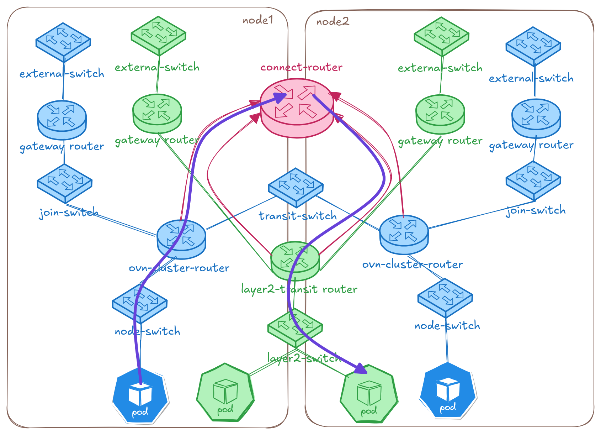

# Connecting User Defined Networks

## Introduction

ClusterNetworkConnect (CNC) enables cluster administrators to connect
multiple isolated [UserDefinedNetworks] (UDNs) and/or
[ClusterUserDefinedNetworks] (CUDNs) together. By default, workloads on
different (C)UDNs are completely isolated from each other. CNC provides a
declarative way to establish connectivity between these isolated network
islands — either full pod-to-pod communication, service-only access, or
both — while preserving isolation for networks that are not explicitly
connected.

[UserDefinedNetworks]: user-defined-networks.md
[ClusterUserDefinedNetworks]: ../../api-reference/userdefinednetwork-api-spec.md#clusteruserdefinednetwork

## Motivation

As clusters adopt User Defined Networks for tenant and workload isolation,
there are many real-world scenarios where controlled connectivity between
these isolated networks becomes necessary:

* **Network expansion**: A (C)UDN's address space is exhausted and CIDR
  expansion is not supported (Layer2 networks) or only allows adding
  new nodes (Layer3 networks), but not per-node subnet expansion.
  The admin creates a new UDN and connects it to the original so workloads
  can communicate across both.
* **Inter-tenant service access**: Two teams operate on separate UDNs but
  one team needs to consume the other's microservice via ClusterIP without
  direct pod access.
* **Temporary or permanent tenant merging**: Two previously isolated tenants
  need unrestricted communication for a joint project, with the ability
  to disconnect later.
* **Mixed topology connectivity**: A Layer3 tenant network needs to
  communicate with a Layer2 gateway network that provides HA via OVN
  virtual ports.
* **Platform migration**: Workloads migrated from other platforms (e.g. NSX)
  that had inter-segment routing need the same architecture replicated
  with connected UDNs.

See the [enhancement proposal] for the full set of user stories and
detailed design.

[enhancement proposal]: ../../okeps/okep-5224-connecting-udns/okep-5224-connecting-udns.md

## How to enable this feature on an OVN-Kubernetes cluster?

This feature requires the following flags to be enabled:

* `--enable-network-segmentation` (required for UDNs)
* `--enable-multi-network` (required for UDNs)
* `--enable-network-connect` (enables ClusterNetworkConnect)

When using Helm, set `global.enableNetworkConnect: true` in your values file.

## Workflow Description

The overall workflow is:

1. **Create your UDNs/CUDNs** — set up isolated networks for your tenants
   as usual.
2. **Create a ClusterNetworkConnect** — select which networks to connect and
   what level of connectivity is desired.
3. **OVN-Kubernetes reconciles** — the controller creates a transit
   `connect-router` and wires it to the selected networks' routers,
   establishing the requested connectivity.

Connectivity is **symmetric**: if UDN-A is connected to UDN-B, then
UDN-B is connected to UDN-A.

Connectivity is **non-transitive**: if UDN-A and UDN-B are connected, and
UDN-B and UDN-C are connected, UDN-A is **not** automatically connected to
UDN-C. Each connection must be explicitly declared.

### High-Level Topology

When a ClusterNetworkConnect CR is created, OVN-Kubernetes creates a new
distributed `connect-router` and peers it with the routers of all selected
networks:



The diagram shows two isolated networks — **blue-network** (blue, Layer3)
and **green-network** (green, Layer2) — each with their own routers and
switches across two nodes. When a ClusterNetworkConnect is created,
OVN-Kubernetes provisions a **connect-router** (pink, top center) and
peers it with both networks' routers. The purple line traces the path of
a cross-network packet: from a blue pod on node1, up through the blue
cluster router, across the connect-router, and down through the green
transit router to reach a green pod on node2.

## Examples

### Prerequisites

For all examples below, we assume you have an OVN-Kubernetes cluster
with the feature flags enabled.

### Example 1: Full Pod and Service Connectivity Between Two CUDNs

Suppose you have two CUDNs named `blue-network` and `green-network`
and you want full connectivity (pods can talk to pods, and services
are accessible across both networks).

**Step 1: Create the namespaces**

Namespaces that will use a primary UDN must be labeled with
`k8s.ovn.org/primary-user-defined-network` at creation time:

```yaml
apiVersion: v1
kind: Namespace
metadata:
  name: blue
  labels:
    network: blue
    k8s.ovn.org/primary-user-defined-network: ""
---
apiVersion: v1
kind: Namespace
metadata:
  name: green
  labels:
    network: green
    k8s.ovn.org/primary-user-defined-network: ""
```

**Step 2: Create the CUDNs**

Labels on CUDNs propagate to the underlying NADs, so add labels that
the CNC `networkSelector` can match on:

```yaml
apiVersion: k8s.ovn.org/v1
kind: ClusterUserDefinedNetwork
metadata:
  name: blue-network
  labels:
    app: colored-enterprise
spec:
  namespaceSelector:
    matchLabels:
      network: blue
  network:
    topology: Layer3
    layer3:
      role: Primary
      subnets:
      - cidr: 103.103.0.0/16
        hostSubnet: 24
---
apiVersion: k8s.ovn.org/v1
kind: ClusterUserDefinedNetwork
metadata:
  name: green-network
  labels:
    app: colored-enterprise
spec:
  namespaceSelector:
    matchLabels:
      network: green
  network:
    topology: Layer3
    layer3:
      role: Primary
      subnets:
      - cidr: 104.104.0.0/16
        hostSubnet: 24
```

**Step 3: Create the ClusterNetworkConnect**

The `networkSelector` matches against labels on the NADs (which inherit
labels from their parent CUDN):

```yaml
apiVersion: k8s.ovn.org/v1
kind: ClusterNetworkConnect
metadata:
  name: blue-green-connect
spec:
  networkSelectors:
    - networkSelectionType: ClusterUserDefinedNetworks
      clusterUserDefinedNetworkSelector:
        networkSelector:
          matchLabels:
            app: colored-enterprise
  connectSubnets:
  - cidr: "192.168.0.0/16"
    networkPrefix: 24
  connectivity:
    - PodNetwork
    - ServiceNetwork
```

**Step 4: Verify the status**

```shell
$ kubectl get cnc blue-green-connect
NAME                 AGE   STATUS
blue-green-connect   5s
```

Check the detailed conditions:

```shell
$ kubectl describe cnc blue-green-connect
Name:         blue-green-connect
Namespace:
Labels:       <none>
Annotations:  k8s.ovn.org/connect-router-tunnel-key: 16715782
              k8s.ovn.org/network-connect-subnet: {"layer3_1":{"ipv4":"192.168.0.0/24"},"layer3_2":{"ipv4":"192.168.1.0/24"}}
API Version:  k8s.ovn.org/v1
Kind:         ClusterNetworkConnect
Spec:
  Connect Subnets:
    Cidr:            192.168.0.0/16
    Network Prefix:  24
  Connectivity:
    PodNetwork
    ServiceNetwork
  Network Selectors:
    Cluster User Defined Network Selector:
      Network Selector:
        Match Labels:
          App:               colored-enterprise
    Network Selection Type:  ClusterUserDefinedNetworks
Status:
  Conditions:
    Last Transition Time:  2026-04-29T18:48:32Z
    Message:               All validation checks passed successfully
    Reason:                ResourceAllocationSucceeded
    Status:                True
    Type:                  Accepted
Events:                    <none>
```

The `Accepted` condition being `True` with reason `ResourceAllocationSucceeded`
means the cluster manager validated the CNC and allocated subnets for the
connected networks. The annotations show the tunnel key and the per-network
subnet allocations.

**Step 5: Deploy test workloads**

Create pods and services on both networks:

```shell
$ kubectl run blue-pod -n blue --image=registry.k8s.io/e2e-test-images/agnhost:2.43 \
    --labels="app=blue" --command -- /agnhost netexec --http-port=8080
$ kubectl run green-pod -n green --image=registry.k8s.io/e2e-test-images/agnhost:2.43 \
    --labels="app=green" --command -- /agnhost netexec --http-port=8080
$ kubectl wait --for=condition=ready pod/blue-pod -n blue --timeout=60s
$ kubectl wait --for=condition=ready pod/green-pod -n green --timeout=60s
```

Expose them as ClusterIP services:

```shell
$ kubectl expose pod blue-pod -n blue --name=service-blue --port=80 --target-port=8080
$ kubectl expose pod green-pod -n green --name=service-green --port=80 --target-port=8080
```

**Step 6: Test connectivity**

Pods on the blue network can now directly reach pods on the green network
and vice versa. Services created in either namespace are also accessible
from the other network:

```shell
$ kubectl exec -n blue blue-pod -- curl -s http://service-green.green.svc.cluster.local/hostname
green-pod

$ kubectl exec -n green green-pod -- curl -s http://service-blue.blue.svc.cluster.local/hostname
blue-pod
```

### Example 2: Service-Only Connectivity (No Direct Pod Access)

When you want two tenants to communicate only through ClusterIP services
without allowing direct pod-to-pod traffic, omit `PodNetwork` from the
`connectivity` list:

```yaml
apiVersion: k8s.ovn.org/v1
kind: ClusterNetworkConnect
metadata:
  name: frontend-backend-services
spec:
  networkSelectors:
    - networkSelectionType: ClusterUserDefinedNetworks
      clusterUserDefinedNetworkSelector:
        networkSelector:
          matchLabels:
            tier: application
  connectSubnets:
  - cidr: "10.200.0.0/16"
    networkPrefix: 24
  connectivity:
    - ServiceNetwork
```

With this configuration:

* Pods in "frontend" network **can** access ClusterIP services in
  "backend" network and vice versa
* Pods in "frontend" network **cannot** directly reach pod IPs in
  "backend" network

### Example 3: Connecting UDNs Across Namespaces

You can also select primary UDNs by namespace instead of (or in addition
to) CUDNs:

```yaml
apiVersion: k8s.ovn.org/v1
kind: ClusterNetworkConnect
metadata:
  name: colored-enterprise
spec:
  networkSelectors:
    - networkSelectionType: ClusterUserDefinedNetworks
      clusterUserDefinedNetworkSelector:
        networkSelector:
          matchLabels:
            app: colored-enterprise
    - networkSelectionType: PrimaryUserDefinedNetworks
      primaryUserDefinedNetworkSelector:
        namespaceSelector:
          matchExpressions:
          - key: kubernetes.io/metadata.name
            operator: In
            values:
            - yellow
            - red
  connectSubnets:
  - cidr: "192.168.0.0/16"
    networkPrefix: 24
  - cidr: "fd01::/112"
    networkPrefix: 120
  connectivity:
    - PodNetwork
    - ServiceNetwork
```

This connects CUDNs labeled `app: colored-enterprise` together with
the primary UDNs serving the `yellow` and `red` namespaces. The
`PrimaryUserDefinedNetworks` selector uses `kubernetes.io/metadata.name`
which is a built-in label on namespaces. Dual-stack `connectSubnets` are
provided for clusters running dual-stack networking.

### Example 4: Disconnecting Networks

To disconnect networks, simply delete the ClusterNetworkConnect resource:

```shell
$ kubectl delete cnc blue-green-connect
clusternetworkconnect.k8s.ovn.org "blue-green-connect" deleted
```

The controller will tear down the connect router and remove all routing
policies, restoring full isolation between the networks.

You can also disconnect a specific network by updating the
`networkSelectors` to no longer match it (e.g. change labels on the
network or update the selector expression).

## User Facing API

The `ClusterNetworkConnect` CRD is a **cluster-scoped**, admin-only
resource in the `k8s.ovn.org/v1` API group.

Short name: **`cnc`**

See the [API Reference](../../api-reference/clusternetworkconnect-api-spec.md)
for the full specification.

### Key Fields

| Field | Description |
|-------|-------------|
| `spec.networkSelectors` | Selects which networks to connect. Supports `ClusterUserDefinedNetworks` (by CUDN label) and `PrimaryUserDefinedNetworks` (by namespace label). |
| `spec.connectSubnets` | The CIDR range(s) used internally to wire the networks together. At most 1 per IP family. Must not overlap with pod, service, transit, join, masquerade, or node subnets. **Immutable** once set. |
| `spec.connectSubnets[].networkPrefix` | The prefix length carved out per connected Layer3 network. Determines max nodes per network. |
| `spec.connectivity` | What kind of connectivity to enable: `PodNetwork` (direct pod-to-pod), `ServiceNetwork` (ClusterIP access), or both. |

### Connectivity Types

| Type | What it enables |
|------|----------------|
| `PodNetwork` | Full pod-to-pod communication across connected networks. |
| `ServiceNetwork` | ClusterIP services are accessible across connected networks, but pods cannot reach each other directly. NodePort and LoadBalancer services are already reachable across UDNs by default. |
| Both | Full pod + service connectivity. |

### Sizing `connectSubnets`

The `connectSubnets` CIDR and `networkPrefix` control how many networks
and nodes can participate in a connection. Planning these values carefully
is important.

**For Layer3 networks**, each connected network gets a `/networkPrefix`
slice from the CIDR. Within that slice, each node gets a `/31` (IPv4) or
`/127` (IPv6) point-to-point subnet. So the `networkPrefix` must have
enough IPs for your nodes.

**For Layer2 networks**, each connected network only needs a single `/31`
or `/127` (no per-node allocation needed).

**Recommended `networkPrefix` values based on cluster size:**

| Max Nodes | Recommended `networkPrefix` | IPs per Network |
|-----------|---------------------------|-----------------|
| 10        | /26                       | ~40             |
| 100       | /23                       | ~400            |
| 1000      | /20                       | ~4000           |
| 5000      | /17                       | ~20000          |

**Dual-stack requirement**: When providing both an IPv4 and IPv6
`connectSubnets`, the `networkPrefix` values must have **matching host
bits**. That is, `(32 - ipv4NetworkPrefix)` must equal
`(128 - ipv6NetworkPrefix)`. For example, an IPv4 `networkPrefix: 24`
(8 host bits) requires an IPv6 `networkPrefix: 120` (also 8 host bits).

**Max CIDR size**: `/16` (65536 IPs). OVN has a limit of 32K tunnel keys
per router, so larger CIDRs won't be fully utilized.

**Max connectable networks** = `CIDR size / networkPrefix size`. For
example, `192.168.0.0/16` with `networkPrefix: 24` gives 256 possible
network slots.

### Status and Conditions

The CNC status reports whether the configuration was accepted and
resources were allocated successfully by the cluster manager:

| Condition Type | Reason | Meaning |
|---------------|--------|---------|
| `Accepted` | `ResourceAllocationSucceeded` | Validation passed, subnets allocated for all selected networks |
| `Accepted` | `ResourceAllocationFailed` | Validation or allocation failed — the condition `message` explains the error |

## Troubleshooting

### Check the CNC status

```shell
$ kubectl get cnc
NAME                 AGE   STATUS
blue-green-connect   10m
```

Describe the resource to see the `Accepted` condition:

```shell
$ kubectl describe cnc blue-green-connect
```

If the `Accepted` condition has `Status: False` and reason
`ResourceAllocationFailed`, the `Message` field describes
what went wrong. Common error messages include:

| Error message pattern | Cause | Fix |
|----------------------|-------|-----|
| "overlap with cluster network connect subnets" | `connectSubnets` overlaps with pod subnets, service CIDR, transit/join/masquerade subnets | Choose a non-overlapping CIDR for `connectSubnets` |
| "connectSubnets overlap detected between CNC ... and CNC ..." | Another CNC selecting the same network uses an overlapping `connectSubnets` | Each CNC selecting the same network must use distinct `connectSubnets` |
| "selected networks have overlapping subnets" | The selected networks have overlapping pod subnets | Connecting networks with overlapping pod subnets is not supported |
| "IP family conflict" | Trying to connect an IPv4-only network with an IPv6-only network, or `connectSubnets` missing the required IP family | Networks must use the same IP family; provide matching `connectSubnets` |
| "transport type ... not supported for networkConnect" | Selected network uses no-overlay or EVPN transport | Only overlay-based networks are supported |
| "failed to allocate ... subnet for network" | Not enough IPs in `connectSubnets` for all network-node combinations | Use a larger CIDR or a smaller `networkPrefix` value |

### Inspect the connect router

You can inspect the OVN topology created by the CNC using `ovn-nbctl`
from inside an ovnkube-node pod:

```shell
$ ovn-nbctl show connect_router_blue-green-connect
router ff42d0fb-7519-4ed5-ab0a-9ae2b9100b6e (connect_router_blue-green-connect)
    port crtor-blue-green-connect_cluster_udn_green-network_ovn-worker2
        mac: "0a:58:c0:a8:01:06"
        networks: ["192.168.1.6/31"]
    port crtor-blue-green-connect_cluster_udn_green-network_ovn-control-plane
        mac: "0a:58:c0:a8:01:04"
        networks: ["192.168.1.4/31"]
    port crtor-blue-green-connect_cluster_udn_green-network_ovn-worker
        mac: "0a:58:c0:a8:01:08"
        networks: ["192.168.1.8/31"]
    port crtor-blue-green-connect_cluster_udn_blue-network_ovn-control-plane
        mac: "0a:58:c0:a8:00:04"
        networks: ["192.168.0.4/31"]
    port crtor-blue-green-connect_cluster_udn_blue-network_ovn-worker2
        mac: "0a:58:c0:a8:00:06"
        networks: ["192.168.0.6/31"]
    port crtor-blue-green-connect_cluster_udn_blue-network_ovn-worker
        mac: "0a:58:c0:a8:00:08"
        networks: ["192.168.0.8/31"]
```

Check routes on the connect router:

```shell
$ ovn-nbctl lr-route-list connect_router_blue-green-connect
IPv4 Routes
Route Table <main>:
           103.103.0.0/24               192.168.0.5 dst-ip
           103.103.1.0/24               192.168.0.9 dst-ip
           103.103.2.0/24               192.168.0.7 dst-ip
           104.104.0.0/24               192.168.1.5 dst-ip
           104.104.1.0/24               192.168.1.9 dst-ip
           104.104.2.0/24               192.168.1.7 dst-ip
```

Check routing policies on a network's cluster router (the priority 9001
policies steer cross-network traffic to the connect router):

```shell
$ ovn-nbctl lr-policy-list cluster_udn_blue.network_ovn_cluster_router
Routing Policies
      9001 inport == "rtos-cluster_udn_blue.network_ovn-worker2" && ip4.dst == 104.104.0.0/16         reroute               192.168.0.6
      ...
```

## Best Practices

* **Plan your `connectSubnets` CIDR for growth.** The CIDR is immutable
  once set, so choose a range large enough to accommodate future networks
  and nodes. A `/16` gives you maximum flexibility.
* **Set `networkPrefix` to 4x your max planned node count.** This accounts
  for non-contiguous node IDs and future node churn.
* **Use `ServiceNetwork` only when full pod connectivity is not needed.**
  This provides a tighter security boundary — tenants can consume each
  other's APIs through services without exposing individual pods.
* **Avoid overlapping `connectSubnets` across multiple CNCs.** If the same
  network is selected by more than one CNC, each CNC must use a distinct
  `connectSubnets` range.
* **Label your networks meaningfully.** Using labels like `tier: frontend`
  or `team: payments` on your CUDNs makes the `networkSelector` in CNCs
  more manageable and less brittle than enumerating names.

## Known Limitations

* **Overlapping pod subnets**: Connecting networks that have overlapping
  pod subnets is not supported. The controller will report an
  `OverlappingNetworkSubnets` error.
* **Secondary networks**: Only `role: Primary` networks can be connected.
  Connecting `role: Secondary` UDNs/CUDNs is a future goal.
* **Localnet networks**: `localnet` type networks cannot be connected
  using CNC. These can be connected together using bridges.
* **No-overlay mode**: CNC is not supported when overlay tunnel
  encapsulation is disabled.
* **`connectSubnets` is immutable**: Once set, it cannot be changed. Plan
  the value carefully before creating the CNC.
* **Live migration**: Live migration and persistent IPs across connected
  UDNs is not supported.
* **Non-transitive connectivity**: Connections are not transitive. If A-B
  and B-C are connected, A-C requires its own CNC.
* **Node subnet validation**: The controller validates `connectSubnets`
  against pod subnets, service CIDRs, and other cluster subnets, but
  does **not** validate against physical node subnets chosen by the
  platform. Ensure your `connectSubnets` do not overlap with your node
  network.

## Known Issues

* **Network Policies do not span connected networks**: Network Policy
  peers cannot currently be selected across connected networks. If two
  UDNs are connected via CNC, a NetworkPolicy in one network cannot
  reference pods in the other network as ingress/egress peers. Handling
  overlapping IPs across connected networks is also not yet supported.
  See [#6331](https://github.com/ovn-kubernetes/ovn-kubernetes/issues/6331).
* **Advertised networks are not supported in isolated mode**: Connecting
  two BGP-advertised networks that use geneve tunnels for east-west
  traffic is not yet supported. See
  [#6332](https://github.com/ovn-kubernetes/ovn-kubernetes/issues/6332).

## Future Items

* Connecting `role: Secondary` UDNs and CUDNs
* Tenant self-service: a namespace-scoped API for tenants to connect
  their own networks without admin intervention
* Connecting UDNs with overlapping pod subnets via service-based routing
* Cross-cluster UDN connectivity using EVPN
* Metrics and alerts for connected network health, traffic, and errors

## References

* [OKEP-5224: Connecting UserDefinedNetworks](../../okeps/okep-5224-connecting-udns/okep-5224-connecting-udns.md)
* [ClusterNetworkConnect API Reference](../../api-reference/clusternetworkconnect-api-spec.md)
* [User Defined Networks Feature Docs](user-defined-networks.md)
* [UserDefinedNetwork API Reference](../../api-reference/userdefinednetwork-api-spec.md)
