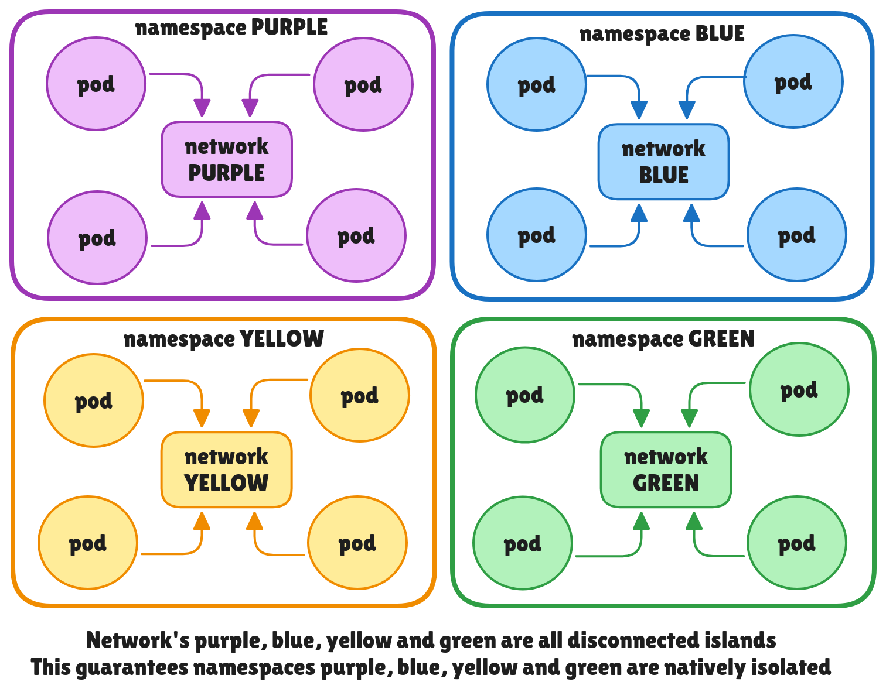
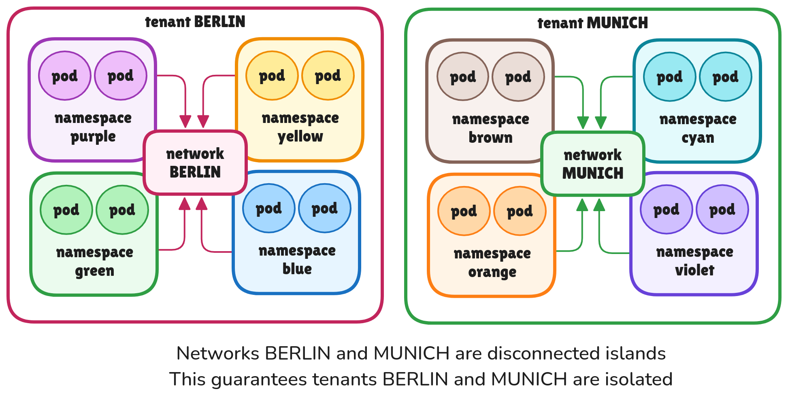
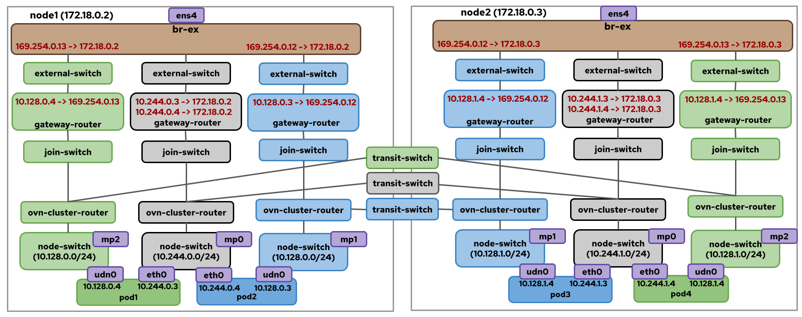
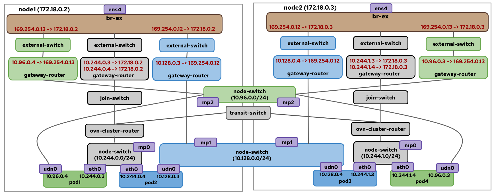
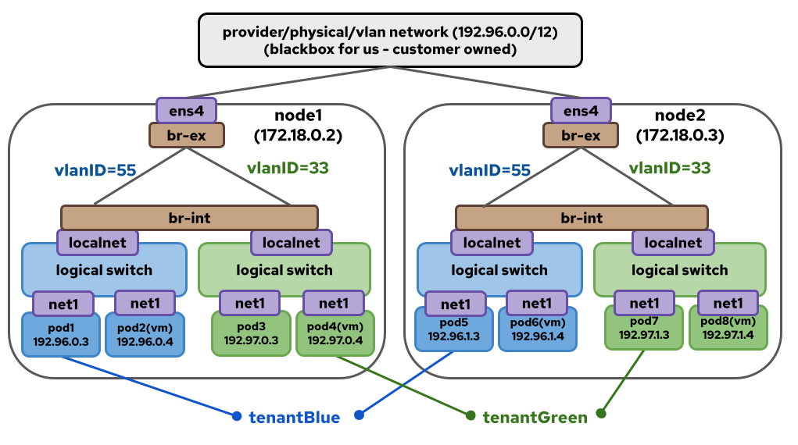
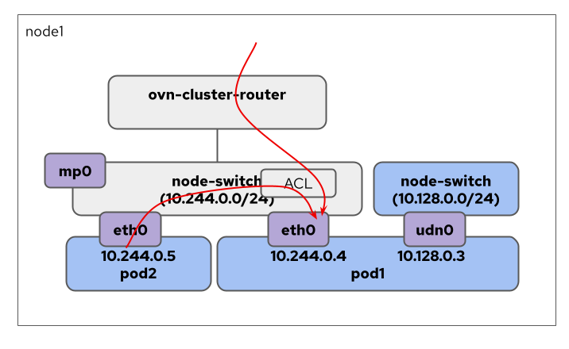
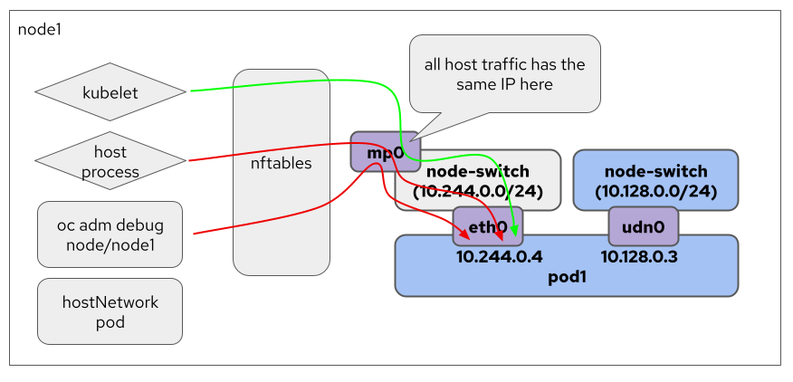
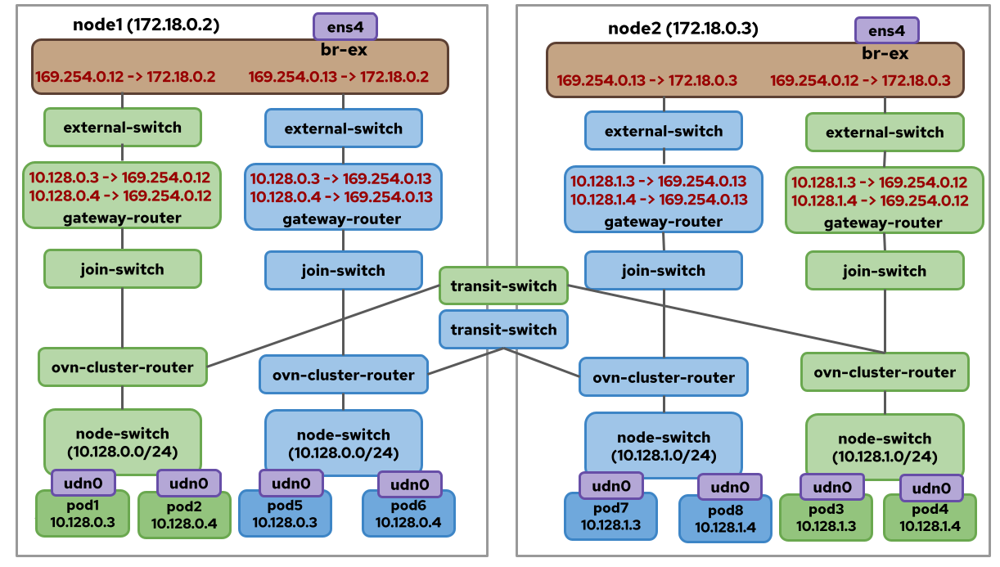
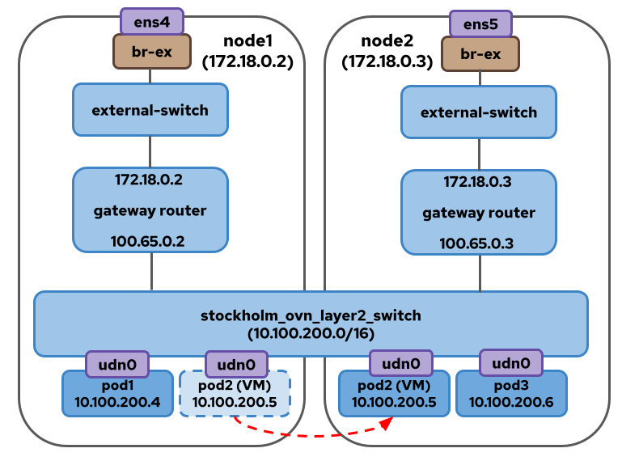

# User Defined Networks

## Introduction

User Defined Networks (UDNs) in OVN-Kubernetes offer flexible network configurations
for users, going beyond the traditional single default network model for all pods
within a Kubernetes cluster. This feature addresses the diverse and advanced networking
requirements of various applications and use cases.

## Motivation

Traditional Kubernetes networking, which typically connects all pods to a default Layer3 network,
lacks the necessary flexibility for many modern use cases and advanced network capabilities.
UDNs provide several key advantages:

* **Workload/Tenant Isolation**: UDNs enable the grouping of different application
types into isolated networks within the cluster, preventing communication between them.
* **Flexible Network Topologies**: Users can create different types of overlay networks
that suits their use cases and then attach their workloads to these networks which are
then isolated natively.
* **Overlapping Pod IPs**: UDNs allow the creation of multiple networks within a cluster that
can use the same IP address ranges for pods, expanding deployment scenarios.

See the [enhancement] for more details.

[enhancement]: https://ovn-kubernetes.io/okeps/okep-5193-user-defined-networks/

### User-Stories/Use-Cases

See the [user-stories] defined in the enhancement.

[user-stories]: https://ovn-kubernetes.io/okeps/okep-5193-user-defined-networks/#user-storiesuse-cases

The two main user stories are:

#### Native Namespace Isolation using Networks


Here the blue, green, purple and yellow networks within those
namespaces cannot reach other and hence provide native isolation
to the workloads in those networks from workloads in other networks.

#### Native Tenant Isolation using Networks


Here the tenants BERLIN and MUNICH are isolated from each other.
So the workloads in namespaces belonging to BERLIN across the
four namespaces - purple, yellow, green and blue can talk to each other
but they can't talk to the workloads belogning to MUNICH tenant
across namespaces brown, cyan, orange and violet.

There are more user stories which will be covered in the sections below
with appropriate diagrams.

## How to enable this feature on an OVN-Kubernetes cluster?

This feature is enabled by default on all OVN-Kubernetes clusters.
You don't need to do anything extra to start using this feature.
There is a Feature Config option `--enable-network-segmentation` under
`OVNKubernetesFeatureConfig` config that can be used to disable this
feature. However, note that disabling the feature will not remove
existing CRs in the cluster. This feature has to be enabled along with
the flag for multiple-networks `--enable-multi-network` since UDNs
use Network Attachment Definitions as underlying implementation detail
construct and reuse the user-defined network controllers.

## Workflow Description

A tenant consists of one or more namespaces in a cluster. Network segmentation
can be achieved by attaching 1 or more namespaces as part of same network which
are then not reachable from other namespaces in the cluster that are not part
of that network.

## Implementation Details

### User facing API Changes

The implementation of UDNs introduces two new Custom Resource Definitions (CRDs)
for network creation:

* Namespace-scoped **UserDefinedNetwork** (UDN): This CRD is for tenant owners,
allowing them to create networks within their namespace. This provides isolation
for their namespaces from other tenants' namespaces.

* Cluster-scoped **ClusterUserDefinedNetwork** (CUDN): This CRD provides cluster
administrators with the ability to allow multiple namespaces to be part of the
same network that is then isolated from other networks.

**NOTE**: For a namespace to be considered for UDN creation, it must be
labeled with `k8s.ovn.org/primary-user-defined-network` at the time of its
creation. This label cannot be updated later, and if absent, the namespace
will not be considered for UDN creation.

See the [api-specification-docs] for information on each of the fields

[api-specification-docs]: https://ovn-kubernetes.io/api-reference/userdefinednetwork-api-spec/

### OVN-Kubernetes Implementation Details

`UserDefinedNetworks` is an opinionated implementation
of multi-networking in Kubernetes. There are two types of
UserDefinedNetworks:

* `Primary`: Also known as P-UDN -> Primary UserDefinedNetwork: This means the
   network will act as the primary network for the pod and all default traffic
   will pass through this network except for Kubelet healthchecks which still uses
   the default cluster-wide network as Kubernetes is not multi-networking aware.
* `Secondary`: Also known as S-UDN -> Secondary UserDefinedNetwork: This means the
   network will act as only a secondary network for the pod and only pod traffic
   that is part of the secondary network may be routed through this interface. These
   types of networks have existed for a long time usually created using
   `NetworkAttachmentDefinitions` API but are now more standardised using UDN CRs.

OVN-Kubernetes currently doesn't support north-south traffic for
secondary networks and none of the core Kubernetes features like Services will work there.
Primary networks on the other hand has full support for all features as present
on cluster default network.

UDNs can have flexible virtual network topologies to suit the use cases
of end users. Currently supported topology types for a given network include:

**Layer3 Networks**

`Layer3`: is a topology type wherein the pods or VMs are connected to their
node’s local router and all these routers are then connected to the distributed
switch across nodes.
  * Each pod would hence get an IP from the node's subnet segment
  * When in doubt which topology to use go with layer3 which is the same topology
    as the cluster default network
  * Can be of type `primary` or `secondary`

Let's see how a Layer3 Network looks on the OVN layer.



Here we can see a blue and green P-UDN. On node1, pod1 is part of green UDN and
pod2 is part of blue UDN. They each have a udn-0 interface that is attached to
the UDN network and a eth0 interface that is attached to the cluster default
network (grey color) which is only used for kubelet healthchecks.

**Layer2 Networks**

`Layer2`: is a topology type wherein the pods or VMs are all connected to the
same layer2 flat switch.
  * Usually used when the applications deployed expect a layer2 type network
    connection (Perhaps applications want a single broadcast domain, latency sensitive, use proprietary L2 protocols)
  * Common in Virtualization world for seamless migration of the VM since
    persistent IPs of the VMs can be preserved across nodes in your cluster
    during live migration
  * Can be of type `primary` or `secondary`



Here we can see a blue and green P-UDN. On node1, pod1 is part of green UDN and
pod2 is part of blue UDN. They each have a udn-0 interface that is attached to
the UDN network and a eth0 interface that is attached to the cluster default
network (grey color) which is only used for kubelet healthchecks.

**Localnet Networks**

`Localnet`: is a topology type wherein the pods or VMs attached to a localnet
network on the overlay can egress to the provider’s physical network
  * without SNATing to nodeIPs… preserves the podIPs
  * podIPs can be on the same subnet as the provider’s VLAN
  * VLAN IDs can be used to mark the traffic coming from the localnet for
    isolation on provider network
  * Can be of type `secondary`, it cannot be a `primary` network of a pod.
  * Only `ClusterUserDefinedNetwork` supports `localnet`



Here we can see blue and green S-UDN localnet networks.

The ovnkube-cluster-manager component watches for these CR's and the controller
reacts to it by creating NADs under the hood. The ovnkube-controller watches for
the NADs and creates the required OVN logical constructs in the OVN database.
The ovnkube-node also adds the required gateway plumbing such as openflows and
VRF tables and routes to provide networking to these networks.

### Creating UserDefinedNetworks

Now that we understand what a UDN is, let's get handson!

Let's create two namespaces `blue` and `green`:

```yaml
apiVersion: v1
kind: Namespace
metadata:
  name: blue
  labels:
    name: blue
    k8s.ovn.org/primary-user-defined-network: ""
---
apiVersion: v1
kind: Namespace
metadata:
  name: green
  labels:
    name: green
    k8s.ovn.org/primary-user-defined-network: ""
```

Sample API yaml for create two `UserDefinedNetworks` of type `Layer3` in these namespaces:

```yaml
apiVersion: k8s.ovn.org/v1
kind: UserDefinedNetwork
metadata:
  name: blue-network
  namespace: blue
  labels:
    name: blue
    purpose: kubecon-eu-2025-demo
spec: 
  topology: Layer3
  layer3:
    role: Primary
    subnets:
    - cidr: 103.103.0.0/16
      hostSubnet: 24
---
apiVersion: k8s.ovn.org/v1
kind: UserDefinedNetwork
metadata:
  name: green-network
  namespace: green
  labels:
    name: green
    purpose: kubecon-eu-2025-demo
spec: 
  topology: Layer3
  layer3:
    role: Primary
    subnets:
    - cidr: 203.203.0.0/16
      hostSubnet: 24
```

### Inspecting a UDN Pod

Now if you create pods on these two namespaces and try to ping one pod from
the other pod, you will see that connection won't work.

```
 $ k get pods -n blue -owide
 NAME    READY   STATUS    RESTARTS   AGE   IP           NODE          
 blue    1/1     Running   0          9h    10.244.0.7   ovn-worker  
 blue1   1/1     Running   0          8h    10.244.1.4   ovn-worker2  

 $ k get pods -n green -owide
 NAME    READY   STATUS    RESTARTS   AGE   IP           NODE      
 green   1/1     Running   0          9h    10.244.0.6   ovn-worker
```

NOTE: Doing kubectl get pods and describe pod will all show the default network
podIP which is not to be confused with the UDN podIPs. Remember how we said
Kubernetes is not multi-networking aware? Hence pod.Status.IPs will always
be the IPs that kubelet is aware of for healthchecks to work.

In order to see the real UDN PodIPs, always do a describe on the pod and see
the following annotations on the pod:
```
$ k get pod -n green green -oyaml                                                                                        
apiVersion: v1                                                                                                                                                               
kind: Pod                                                                                                                                                                    
metadata:                                                                                                                                                                    
  annotations:                                                                                                                                                               
    k8s.ovn.org/pod-networks: '{"default":{"ip_addresses":["10.244.0.6/24"],
    "mac_address":"0a:58:0a:f4:00:06","routes":[{"dest":"10.244.0.0/16",
    "nextHop":"10.244.0.1"},{"dest":"100.64.0.0/16","nextHop":"10.244.0.1"}],
    "ip_address":"10.244.0.6/24","role":"infrastructure-locked"},
    "green/green-network":{"ip_addresses":["203.203.2.5/24"],
    "mac_address":"0a:58:c8:0a:02:05","gateway_ips":["203.203.2.1"],
    "routes":[{"dest":"203.203.0.0/16","nextHop":"203.203.2.1"},
    {"dest":"10.96.0.0/16","nextHop":"203.203.2.1"},{"dest":"100.65.0.0/16",
    "nextHop":"203.203.2.1"}],"ip_address":"203.203.2.5/24","gateway_ip":"203.203.2.1",
    "role":"primary"},"green/green-secondary-network":{"ip_addresses":["100.10.1.7/24"],
    "mac_address":"0a:58:64:0a:01:07","routes":[{"dest":"100.10.0.0/16",
    "nextHop":"100.10.1.1"}],"ip_address":"100.10.1.7/24","role":"secondary"}}'
```
The above shows the OVN-Kubernetes IPAM Annotation for each type of network:
* `default` which is the cluster-wide `infrastructure-locked` network only used
  for Kubelet health checks and pod has IP 10.244.0.6 here
* `primary` which is the primary UDN for the pod through which all traffic
  passes through and pod has IP 203.203.2.5.
* `secondary` which is the secondary UDN network for the pod from which pod has IP 100.10.1.7

One can also use the multus annotation to figure out the podIPs on each interface:

```
$ oc get pod -n green green -oyaml                                                                                          
apiVersion: v1                                                                                                                                                               
kind: Pod                                                                                                                                                                    
metadata:                                                                                                                                                                    
  annotations:                                                                                                                                                                                                                                 
        k8s.v1.cni.cncf.io/network-status: |-                                                                                                                                    
      [{                                                                                                                                                                     
          "name": "ovn-kubernetes",                                                                                                                                          
          "interface": "eth0",                                                                                                                                               
          "ips": [                                                                                                                                                           
              "10.244.0.6"                                                                                                                                                   
          ],                                                                                                                                                                 
          "mac": "0a:58:0a:f4:00:06",                                                                                                                                        
          "dns": {}                                                                                                                                                          
      },{                                                                                                                                                                    
          "name": "ovn-kubernetes",                                                                                                                                          
          "interface": "ovn-udn1",                                                                                                                                           
          "ips": [                                                                                                                                                           
              "200.203.2.5"                                                                                                                                                   
          ],                                                                                                                                                                 
          "mac": "0a:58:c8:0a:02:05",                                                                                                                                        
          "default": true,                                                                                                                                                   
          "dns": {}                                                                                                                                                          
      },{                                                                                                                                                                    
          "name": "green/green-secondary-network",                                                                                                                           
          "interface": "net1",                                                                                                                                               
          "ips": [                                                                                                                                                           
              "100.10.1.7"                                                                                                                                                   
          ],                                                                                                                                                                 
          "mac": "0a:58:64:0a:01:07",                                                                                                                                        
          "dns": {}                                                                                                                                                          
      }]
```

### KubeletHealthChecks for UDN pods

In each of the above diagrams we saw a grey network still attached to all
pods across all UDNs. This represents the cluster default network which
is `infrastructure-locked` for primary-UDN pods and is only used for healthchecks.

We add UDN Isolation ACLs and cgroups NFTable rules on these pod ports so that
no traffic except healthcheck traffic from kubelet is allowed to reach these pods.

Using OVN ACLs, we ensure only traffic from kubelet is allowed on the
default `eth0` interface of the pods:

```
_uuid               : 1278b0f4-0a14-4637-9d05-83ba9df6ec03
action              : allow
direction           : from-lport
external_ids        : {direction=Egress, "k8s.ovn.org/id"="default-network-controller:UDNIsolation:AllowHostARPPrimaryUDN:Egress", "k8s.ovn.org/name"=AllowHostARPPrimaryUDN, "k8s.ovn.org/owner-controller"=default-network-controller, "k8s.ovn.org/owner-type"=UDNIsolation}
label               : 0
log                 : false
match               : "inport == @a8747502060113802905 && (( arp && arp.tpa == 10.244.2.2 ) || ( nd && nd.target == fd00:10:244:3::2 ))"
meter               : acl-logging
name                : []
options             : {}
priority            : 1001
sample_est          : []
sample_new          : []
severity            : []
tier                : 0

_uuid               : 489ae95b-ae9d-47d0-bf1d-b2477a9ed6a2
action              : allow
direction           : to-lport
external_ids        : {direction=Ingress, "k8s.ovn.org/id"="default-network-controller:UDNIsolation:AllowHostARPPrimaryUDN:Ingress", "k8s.ovn.org/name"=AllowHostARPPrimaryUDN, "k8s.ovn.org/owner-controller"=default-network-controller, "k8s.ovn.org/owner-type"=UDNIsolation}
label               : 0
log                 : false
match               : "outport == @a8747502060113802905 && (( arp && arp.spa == 10.244.2.2 ) || ( nd && nd.target == fd00:10:244:3::2 ))"
meter               : acl-logging
name                : []
options             : {}
priority            : 1001
sample_est          : []
sample_new          : []
severity            : []
tier                : 0


_uuid               : 980be3e4-75af-45f7-bce3-3bb08ecd8b3a
action              : drop
direction           : to-lport
external_ids        : {direction=Ingress, "k8s.ovn.org/id"="default-network-controller:UDNIsolation:DenyPrimaryUDN:Ingress", "k8s.ovn.org/name"=DenyPrimaryUDN, "k8s.ovn.org/owner-controller"=default-network-controller, "k8s.ovn.org/owner-type"=UDNIsolation}
label               : 0
log                 : false
match               : "outport == @a8747502060113802905"
meter               : acl-logging
name                : []
options             : {}
priority            : 1000
sample_est          : []
sample_new          : []
severity            : []
tier                : 0

_uuid               : cca19dca-1fde-4a14-841d-7e2cce804de4
action              : drop
direction           : from-lport
external_ids        : {direction=Egress, "k8s.ovn.org/id"="default-network-controller:UDNIsolation:DenyPrimaryUDN:Egress", "k8s.ovn.org/name"=DenyPrimaryUDN, "k8s.ovn.org/owner-controller"=default-network-controller, "k8s.ovn.org/owner-type"=UDNIsolation}
label               : 0
log                 : false
match               : "inport == @a8747502060113802905"
meter               : acl-logging
name                : []
options             : {}
priority            : 1000
sample_est          : []
sample_new          : []
severity            : []
tier                : 0
```



As you can see here a default network pod, `pod2` can't reach
the UDN pod `pod1` via its eth0 interface thanks to the ACLs in place.
So no traffic from the UDN pod ever leaves via `eth0`. The only traffic
that is allowed via `eth0` interface is the kubelet probe traffic.

But given how we have allow ACLs for kubelet traffic, but this matches
on management portIP which is the hostIP, any process on the host can
potentially reach the UDN pods. In order to have more tighter security,
we have cgroups based NFT rules on the host to prevent any non-kubelet
process from being able to reach the default network `eth0` port on
UDN pods.



These rules look like this:

```
	chain udn-isolation {
		comment "Host isolation for user defined networks"
		type filter hook output priority filter; policy accept;
		ip daddr . meta l4proto . th dport @udn-open-ports-v4 accept
		ip daddr @udn-open-ports-icmp-v4 meta l4proto icmp accept
		socket cgroupv2 level 2 475436 ip daddr @udn-pod-default-ips-v4 accept
		ip daddr @udn-pod-default-ips-v4 drop
		ip6 daddr . meta l4proto . th dport @udn-open-ports-v6 accept
		ip6 daddr @udn-open-ports-icmp-v6 meta l4proto ipv6-icmp accept
		socket cgroupv2 level 2 475436 ip6 daddr @udn-pod-default-ips-v6 accept
		ip6 daddr @udn-pod-default-ips-v6 drop
	}

    	set udn-open-ports-v4 {
		type ipv4_addr . inet_proto . inet_service
		comment "default network open ports of pods in user defined networks (IPv4)"
	}

	set udn-open-ports-v6 {
		type ipv6_addr . inet_proto . inet_service
		comment "default network open ports of pods in user defined networks (IPv6)"
	}

	set udn-open-ports-icmp-v4 {
		type ipv4_addr
		comment "default network IPs of pods in user defined networks that allow ICMP (IPv4)"
	}

	set udn-open-ports-icmp-v6 {
		type ipv6_addr
		comment "default network IPs of pods in user defined networks that allow ICMP (IPv6)"
	}

	set udn-pod-default-ips-v4 {
		type ipv4_addr
		comment "default network IPs of pods in user defined networks (IPv4)"
	}

	set udn-pod-default-ips-v6 {
		type ipv6_addr
		comment "default network IPs of pods in user defined networks (IPv6)"
	}
```

The only exception to this is when users annotate
the UDN pod using the `open-default-ports` annotation:
```
k8s.ovn.org/open-default-ports: |
      - protocol: tcp
        port: 80
      - protocol: udp
        port: 53
```
which means we open up allow ACLs and nftrules to allow traffic
to reach at those ports.

### Overlapping PodIPs

Two networks can have the same subnet since they are completely
isolated. We use a `masqueradeIP` SNAT per UDN to avoid conntrack
collisions on the host. So traffic leaving each UDN is SNATed to
a unique IP before being sent to the host.



### VM LiveMigration and PersistentIPs over Layer2 UDNs

Users can use the `layer2` topology when creating virtual machines
on OVN-Kubernetes and can easily live migrate the VMs across nodes
along with preserving their IPs.



### Services on UDNs

Creating a service on UDNs is same as creating them on default
network, no extra plumbing is required.

```yaml
apiVersion: v1
kind: Service
metadata:
  name: service-blue
  namespace: blue
  labels:
    network: blue
spec:
  type: LoadBalancer
  selector:
    network: blue
  ports:
  - name: web
    port: 80
    targetPort: 8080
```
```
$ k get svc -n blue
NAME           TYPE           CLUSTER-IP      EXTERNAL-IP   PORT(S)        AGE
service-blue   LoadBalancer   10.96.207.175   172.19.0.10     80:31372/TCP   5s
$ k get endpointslice -n blue
NAME                 ADDRESSTYPE   PORTS   ENDPOINTS                 AGE
service-blue-55d6c   IPv4          8080    103.103.1.5,103.103.0.5   65s
service-blue-pkll7   IPv4          8080    10.244.0.3,10.244.1.8     66s
```
One set of endpoints show the UDN ntework IPs of the pods and the other set
shows default network IPs.

When the service is created inside the blue namespace, the
clusterIPs get automatically isolated from pods in other networks.
However nodeports, loadbalancerIPs and externalIPs can be reached
across UDNs.

### EndpointSlices mirror controller for User-Defined Networks

Pods that use a UDN as their primary network will still have the cluster
default network IP in their status. For services this results in the EndpointSlices
providing the IPs of the cluster default network in the Kubernetes API. To enable
services support for primary user-defined networks, the EndpointSlices mirror
controller was introduced to create custom EndpointSlices with user-defined
network IP addresses extracted from OVN-Kubernetes annotations.

The introduced controller duplicates the default EndpointSlices, creating
new copies that include IP addresses from primary user-defined network. It
bypasses EndpointSlices in namespaces that do not have a user-defined primary
network. The controller lacks specific logic for selecting endpoints, it only
replicates those generated by the default controller and replaces the IP addresses.
For host-networked pods, the controller retains the same IP addresses as the
default controller. Custom EndpointSlices not created by the default controller
are not processed.

The default EndpointSlices controller creates objects that contain the following labels:

- `endpointslice.kubernetes.io/managed-by:endpointslice-controller.k8s.io` - Indicates
  that the EndpointSlice is managed by the default Kubernetes EndpointSlice controller.
- `kubernetes.io/service-name:<service-name>` - The service that this EndpointSlice
  belongs to, used by the default network service controller.

The EndpointSlices mirror controller uses a separate set of labels:

- `endpointslice.kubernetes.io/managed-by:endpointslice-mirror-controller.k8s.ovn.org` -  Indicates
  that the EndpointSlice is managed by the mirror controller.
- `k8s.ovn.org/service-name:<service-name>` - The service that this mirrored EndpointSlice
  belongs to, used by the user-defined network service controller. Note that the label
  key is different from the default EndpointSlice.
- `k8s.ovn.org/source-endpointslice-version:<default-endpointslice-resourceversion>` - The
  last reconciled resource version from the default EndpointSlice.

and annotations (Label values have a length limit of 63 characters):
- `k8s.ovn.org/endpointslice-network:<udn-network-name>` - The user-defined network
  that the IP addresses in the mirrored EndpointSlice belong to.
- `k8s.ovn.org/source-endpointslice:<default-endpointslice>` -  The name of the
  default EndpointSlice that was the source of the mirrored EndpointSlice.

Example:

With the following NetworkAttachmentDefinition:

```yaml
apiVersion: k8s.cni.cncf.io/v1
kind: NetworkAttachmentDefinition
metadata:
  name: l3-network
  namespace: nad-l3
spec:
  config: |2
    {
            "cniVersion": "1.0.0",
            "name": "l3-network",
            "type": "ovn-k8s-cni-overlay",
            "topology":"layer3",
            "subnets": "10.128.0.0/16/24",
            "mtu": 1300,
            "netAttachDefName": "nad-l3/l3-network",
            "role": "primary"
    }
```

We can observe the following EndpointSlices created for a one-replica deployment
exposed through a `sample-deployment` service:
<table>
<tr>
<th>Default EndpointSlice</th>
<th>Mirrored EndpointSlice</th>
</tr>
<tr>
<td>

```yaml
kind: EndpointSlice
apiVersion: discovery.k8s.io/v1
metadata:
  name: sample-deployment-rkk4n
  generateName: sample-deployment-
  generation: 1
  labels:
    app: l3pod
    endpointslice.kubernetes.io/managed-by: endpointslice-controller.k8s.io
    kubernetes.io/service-name: sample-deployment
  name: sample-deployment-rkk4n
  namespace: nad-l3
  resourceVersion: "31533"
addressType: IPv4
endpoints:
- addresses:
  - 10.244.1.17
  conditions:
    ready: true
    serving: true
    terminating: false
  nodeName: ovn-worker
  targetRef:
    kind: Pod
    name: sample-deployment-6b64bd4868-7ftt6
    namespace: nad-l3
    uid: 6eb5d05c-cff4-467d-bc1b-890443750463
ports:
- name: ""
  port: 80
  protocol: TCP
```

</td>
<td>

```yaml
kind: EndpointSlice
apiVersion: discovery.k8s.io/v1
metadata:
  name: l3-network-sample-deployment-hgkmw
  generateName: l3-network-sample-deployment-
  labels:
    endpointslice.kubernetes.io/managed-by: endpointslice-mirror-controller.k8s.ovn.org
    k8s.ovn.org/service-name: sample-deployment
    k8s.ovn.org/source-endpointslice-version: "31533"
  annotations:
    k8s.ovn.org/endpointslice-network: l3-network
    k8s.ovn.org/source-endpointslice: sample-deployment-rkk4n
  namespace: nad-l3
  resourceVersion: "31535"
addressType: IPv4
endpoints:
- addresses:
  - 10.128.1.3
  conditions:
    ready: true
    serving: true
    terminating: false
  nodeName: ovn-worker
  targetRef:
    kind: Pod
    name: sample-deployment-6b64bd4868-7ftt6
    namespace: nad-l3
    uid: 6eb5d05c-cff4-467d-bc1b-890443750463
ports:
- name: ""
  port: 80
  protocol: TCP

```

</td>
</tr>
</table>

That's how behind the scenes services on UDNs are implemented.

## References

* Use the workshop yamls [here](https://github.com/tssurya/kubecon-eu-2025-london-udn-workshop/tree/main/manifests) to play around
