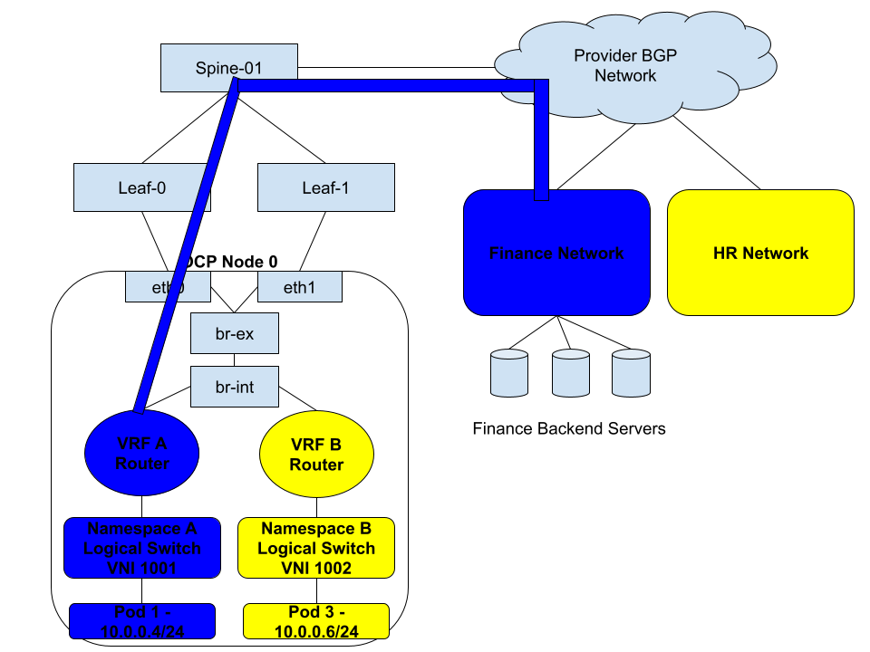
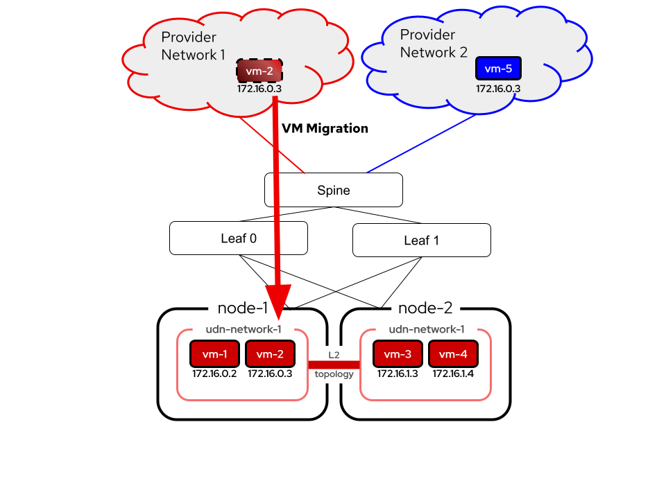
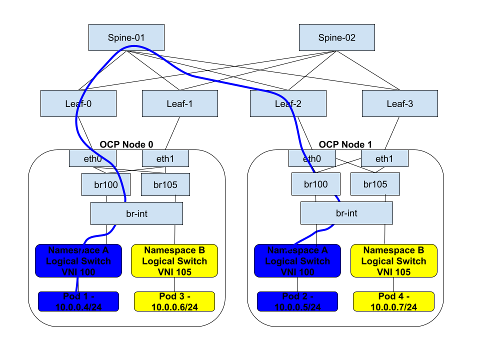
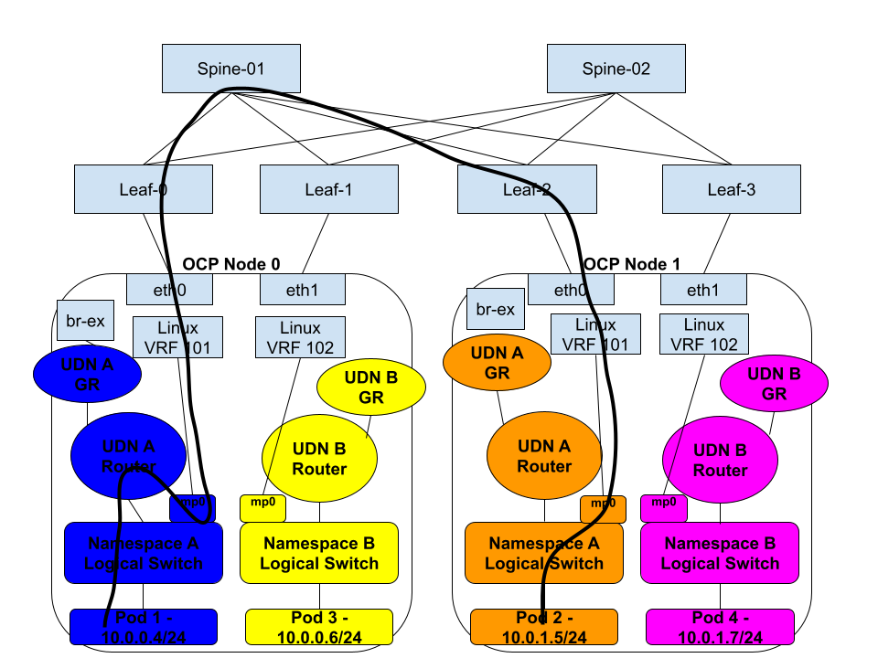

# OKEP-5088: EVPN Support

* Issue: [#5088](https://github.com/ovn-org/ovn-kubernetes/issues/5088)

## Problem Statement

The purpose of this enhancement is to add support for EVPN within the OVN-Kubernetes SDN, specifically with BGP. This
effort will allow exposing User Defined Networks (UDNs) externally via a VPN to other entities either
inside, or outside the cluster. BGP+EVPN is a common and native networking standard that will enable integration into
a user's networks without SDN specific network protocol integration, and provide an industry standardized way to achieve
network segmentation between sites.

## Goals

* To provide a user facing API to allow configuration of EVPN on Kubernetes worker nodes to integrate with a provider's
  EVPN fabric.
* EVPN support will be provided for Layer 2 (MAC-VRF) or Layer 3 (IP-VRF) OVN-Kubernetes Primary User Defined Network
  types.
* EVPN Multi-Homing + Mass Withdrawal support, including BFD support for link detection.
* FRR providing EVPN connectivity via BGP and acting as the Kubernetes worker node PE router.
* Support for EVPN in local gateway mode only.
* Support for EVPN in on-prem deployments only.

## Non-Goals

* Providing support for any other virtual router as a PE router.
* Asymmetric Integrated Routing and Bridging (IRB) with EVPN.
* Supporting EVPN via the Cluster Default Network (CDN).

## Future-Goals

* Support for EVPN in shared gateway mode once there is OVN support.
* Potentially advertising service Cluster IPs.
* Cloud platform BGP/EVPN enablement.
* Providing EVPN support for Secondary User Defined Network types.
* Specifying a VXLAN port other than 4789 for EVPN.
* Support for interconnecting two Kubernetes clusters with EVPN and then allowing VM migration across them.

## Introduction

The [BGP enhancement](./okep-5296-bgp.md) has been implemented in OVN-Kubernetes, which allows a user expose pods and
other internal Kubernetes network entities outside the cluster with dynamic routing.

Additionally, the User Defined Network (UDN) feature has
brought the capability for a user to be able to create per tenant networks. Combining these features today allows a user
to either:
- BGP advertise the Cluster Default Network (CDN) as well as leak non-IP-overlapping UDNs into default VRF.
- Expose UDNs via BGP peering over different network interfaces on an OCP node, allowing a VPN to be terminated on the
  next hop PE router, and preserved into the OCP node. Also known in the networking industry as VRF-Lite.

While VRF-Lite allows for a UDN to be carried via a VPN to external networks, it is cumbersome to configure and requires
an interface per UDN to be available on the host. By leveraging EVPN, these limitations no longer exist and all UDNs can
traverse the same host interface, segregated by VXLAN. Furthermore, with exposing UDNs via BGP today there is a limitation
that these networks are advertised as an L3 segment, even with VRF-Lite. With EVPN, we can now stretch the L2 UDN segment
across the external network fabric. 
Finally, EVPN is a common datacenter networking fabric that many users with Kubernetes clusters already
rely on for their top of rack (TOR) network connectivity. It is a natural next step to enable the Kubernetes platform
to be able to directly integrate with this fabric directly.

### EVPN/UDN Background

This section provides some background on UDN, EVPN. It is important to provide this context for a better understanding of
the following sections and design choices.

UDNs are separate and potentially overlapping networks that are naturally isolated from each other. Each Primary UDN maps
to a corresponding VRF in Linux. This is true for both Layer 2 and Layer 3 networks. The ovn-k8s-mpx interface exists
per UDN and is configured inside of this Linux VRF.

EVPN provides a mechanism for carrying potentially overlapping Layer 2 and/or Layer 3 networks while keeping them
isolated from each other in a Virtual Private Network (VPN) over an ethernet fabric via BGP extensions and an overlay
mechanism, typically VXLAN.

Therefore, it is a logical next step to leverage EVPN to carry PUDNs as it fits the paradigm well. However, there are key
design choices to be aware of. With EVPN a Layer 2 network (MAC-VRF) can be thought of as simply a switch extended across
the ethernet fabric and used for East/West traffic. 
With EVPN a Layer 2 network can belong to MAC-VRF as well as an IP-VRF (Layer 3) network simultaneously.
In practice, this means the Layer 2 switch has a Switch Virtual Interface (SVI) which is plugged into a router (VRF), and
clients on the Layer 2 network use this SVI as their default gateway for routing. In other words, if you have a pod connected
to a switch (MAC-VRF that spans all nodes) it can talk to other pods or entities on that Layer 2 network without leaving the
MAC-VRF. On the other hand if this pod needs to talk to the internet, it will go via its default gateway (SVI) and then be routed
via the IP-VRF. With EVPN, multiple Layer 2 networks can map to a single IP-VRF.

Let's now look at how a Layer 2 UDN works in practice. For East/West it uses Geneve to ensure MAC-VRF like functionality.
For North/South by default we leak the Layer 2 into the default VRF (CDN) and use masquerading to avoid collisions with
other overlapping Layer 2 UDNs. If BGP is enabled, this Layer 2 UDN may be advertised directly (without masquerading) in
the default VRF. Neither of these options provide IP-VRF like isolation, in both cases the network is leaked into the default
VRF. When leaking into the default VRF, multiple Layer 2 UDNs may not overlap in their subnet range, each subnet must be
unique.
Another option is VRF-Lite, where a user can connect a dedicated NIC (think VLAN interface) to the VRF provisioned
in the Linux host for the Layer 2 UDN. With this model, a Layer 3 VPN is created, but it relies on manual configuration
on the host, as well as configuration on the upstream PE router. Now in order to route Northbound, the pod sends the packet
to its default gateway, the transit router, which will either route towards ovn-k8s-mpx (local gw mode) or the gateway
router (GR). Note, VRF-Lite only works for Layer 3 type VPNs, and does not provide a Layer 2 type of VPN technology to
handle VM live migration use cases.

For Layer 3 networks, in OVN-Kubernetes we break up a supernet into a per-node subnet for the PUDN. Whenever a pod on
a node wants to talk to a pod on another node or anything externally, pure routing is used. This is the equivalent of an
IP-VRF.

Furthermore, so far we have talked about carrying VPN for Layer 2 and Layer 3 PUDNs. What about the Cluster Default Network (CDN)?
This network lives in the default VRF. Typically, the default VRF is not carried over the EVPN fabric as a VPN. For
the purpose of this enhancement it will be considered not be part of an EVPN. The CDN may still use Geneve, or it may
rely on the upcoming no-overlay mode to use a pure BGP routing scheme.

As far as underlying technologies go, we use FRR as our BGP provider. As EVPN relies on BGP, we will continue to use FRR
for EVPN support.

### Transitioning to EVPN from Geneve

For Layer 2 and Layer 3 PUDNs Geneve is no longer used when enabling EVPN. Instead, VXLAN is used as an overlay to carry
per network VPN packets across the EVPN fabric. In practice this means we still need a switch domain that crosses all nodes
for Layer 2, and we need per node routing for Layer 3. FRR integrates directly with Linux to provide EVPN support. It 
uses netdevs like Linux Bridge, VXLAN VTEPs, VRFs in order to map Linux networks to advertised EVPN VNIs.

We know that we create a VRF per Layer 2/Layer 3 UDN, which gives us our mapping to an EVPN VRF in Linux that FRR will
leverage. Therefore, we can conclude that every Layer 2 and Layer 3 UDN maps to an IP-VRF already. This implicit design
choice precludes us from taking several Layer 2 PUDNs and mapping them to a single IP-VRF. In other words, each MAC-VRF
in OVN-Kubernetes will map 1 to 1 with an IP-VRF. In practice, the consequence of this is a user is unable to connect
multiple Layer 2 PUDNs to the same "router" and allow routing between them. However, as we will see later, this can be
provided by other forms of route leaking (route target importing/exporting) between IP-VRFs. Nonetheless, it is key to
point out this implicit design choice and why it exists. It also provides implicit Network Isolation which was one of the
key tenets to the UDN design in the first place. So one could view this as intended behavior.

Additionally, we have the ovn-k8s-mpx interface, which gives us a way to route for Layer 2 networks into the
VRF. This interface can be viewed as our SVI. It is a way that we can get the packet to the VRF (IP-VRF) to be routed.
Note the SVI can be the same on every single node, since we are using symmetrical Integrated Routing and Bridging (IRB).
The SVI IP will not be advertised to via BGP, and is only used for local pod routing.

When we consider non-routed traffic for Layer 2 (just MAC-VRF traffic), we need a way for Layer 2 destined packets to get
VXLAN encapsulated and sent out with the right VNI. As previously mentioned, FRR relies on a Linux Bridge to serve as the
Layer 2 switch, which is connected to a VXLAN VTEP. With OVN, we obviously use a logical_switch that exists as flows in
br-int. In order to integrate with FRR/EVPN for local gateway mode, we will need to connect a port from the logical_switch
to the Linux Bridge. More technical details on that in the sections ahead.

## User-Stories/Use-Cases

The user stories will be broken down into more detail in the subsections below. The main use cases include:
* As a user, I want to connect my Kubernetes cluster to VMs or physical hosts on an external network. I want tenant
  pods/VMs inside my Kubernetes cluster to be able to only communicate with certain network segments on this external
  network.
* As a user, I want to be able to live migrate VMs from my external network onto the Kubernetes platform.
* As a user, my data center where I run Kubernetes is already using EVPN today. I want to eliminate the use of Geneve
  which causes double encapsulation (VXLAN and Geneve), and integrate natively with my networking fabric.
* As a user, I want to create overlapping IP address space UDNs, and then connect them to different external networks
  while preserving network isolation.

### Extending UDNs into the provider network via EVPN

This use case is about connecting a Kubernetes cluster to one or more external networks and preserving the network
isolation of the UDN and external virtual routing and forwarding instances (VRFs) segments. Consider the following
diagram:



In this example a user has traditional Finance and HR networks. These networks are in their own VRFs, meaning they are
isolated from one another and are unable to communicate or even know about the other. These networks may overlap in IP
addressing. Additionally, the user has a Kubernetes cluster where they are migrating some traditional servers/VMs
workloads over to the Kubernetes platform. In this case, the user wants to preserve the same network isolation they had
previously, while also giving the Kubernetes based Finance and HR tenants connectivity to the legacy external networks.

By combining EVPN and UDN this becomes possible. The blue Finance network UDN is created with the Kubernetes cluster, and
integrated into the user's EVPN fabric, extending it to the traditional Finance external network. The same is true for
the yellow HR network. The Finance and HR network isolation is preserved from the Kubernetes cluster outward to the
external networks.

### Extending Layer 2 UDNs into the provider network to allow VM migration

Building upon the previous example, the network connectivity between a UDN and an external network can be done using
either Layer 3 (IP-VRF) or Layer 2 (MAC-VRF). With the former, routing occurs between entities within the Kubernetes
UDN and the corresponding external network, while with the latter, the UDN and the external network are both part of the
same layer 2 broadcast domain. VM migration relies on being a part of the same L2 segment in order to preserve MAC
address reachability as well as IP address consistency. With MAC-VRFs and EVPN it becomes possible to extend the
layer 2 network between the kubernetes cluster and outside world:



The image above depicts a Layer 2 UDN which not only exists across the worker nodes node-1 and node-2 but is also stretched
into Provider Network 1. In this scenario, vm-2 is able to migrate into node-1 on the UDN network, preserving the same IP
address it had in the external provider network. Similarly, there is another Provider Network 2 which may or may not
correspond to another UDN within the Kubernetes cluster. However, notice that the red and blue networks are both using
the same IP addressing scheme and sharing the same hardware, however due to VRF isolation they are completely unaware and
unable to communicate with each other.

### Using EVPN as the Overlay for User Defined Networks

With integrating into a customer's already existing TOR spine and leaf architecture, Geneve can be disabled, and network
segmentation will still persist for east/west traffic due to VXLAN tunnels with EVPN. This is true for both IP-VRFs,
and MAC-VRFs. This reduces packet overhead for customers, while also providing some other advantages that come with
EVPN, such as link redundancy and broadcast, unknown unicast, and multicast (BUM) traffic suppression.

## Proposed Solution

As mentioned in the previous sections, EVPN will continue to build upon the BGP support already implemented into
OVN-Kubernetes using FRR. This support includes integration with an OVN-Kubernetes API as well as an FRR-K8S API for
configuring BGP peering and routing for UDNs. FRR already supports EVPN and similar API resources will be leveraged to
accomplish configuring FRR as the BGP/EVPN control plane. Recall that FRR relies on Linux netdevs to be configured in
order for EVPN to work. There are two configuration modes in FRR to accomplish this.

### Multiple VXLAN Devices (MVD)

MVD is the classic way that FRR maps netdevs to EVPN configuration. In this model we create the following Linux constructs
in order to use EVPN:

1. A VRF device
2. Linux Bridge enslaved to the VRF
3. An SVI attached to the bridge (for IP-VRF)
4. A VXLAN device enslaved to the bridge
5. A VTEP IP configured locally (generally on a loopback interface)

Devices 1-4 are needed to be configured for each network (UDN). Only a single VTEP IP is needed, although more than one
could be configured if it was desired to use multiple tunnels (uncommon).

### Single VXLAN Device (SVD)

SVD is a newer way that was created in order to solve scale issues around creating too many netdevs with MVD. In this model
only a single VXLAN device is created, along with a single Linux Bridge. VLANs are used within the Linux Bridge to segment
networks. The following devices are required:

1. A VRF device (one per UDN)
2. Linux Bridge (single bridge with a VLAN per UDN)
3. An SVI attached the bridge (for IP-VRF, one VLAN sub-interface per UDN)
4. A VXLAN device enslaved to the bridge (added in the UDN VLAN)
5. A VTEP IP configured locally (generally on a loopback interface)

SVD is supposed to scale better than MVD, and is similar to how other physical routers allow a single VTEP to be used
for multiple VNIs. The one drawback with the SVD implementation, is that by mapping VNIs to VLANs, we are limited to
4096 max VNIs per node, and thus limited to 4094 MAC+IP VRFs per node. It may be possible to extend SVD by creating
another set of bridge/VTEP pair and mapping the VLANs to VNIs > 4094. Needs to be investigated and confirmed.

SVD is only supported in FRR9 and later.

### FRR integration with OVN-Kubernetes

OVN-Kubernetes will be in charge of managing and configuring these devices on the node. We do not want to support both
MVD and SVD. Due to the simplicity and scalability, we will choose to support SVD and accept the potential drawback of
limited number of VRFs we can advertise. Additionally, this enhancement limits the scope of EVPN support to local gateway
mode, which means traffic will flow through the Linux Bridge (MAC-VRF) as well as through the Linux VRF (IP-VRF). In the
future, OVN will add support for also watching the Linux netdevs, and then configuring OVN to act as a VXLAN VTEP for
the UDNs.

If we consider the SVD devices that are required for OVN-Kubernetes integration, recall that we already create:
 * Linux VRF for every Layer2/Layer3 UDN
 * An ovn-k8s-mpx interface connected to the VRF and plugged into the UDN worker switch

These devices already give us the VRF and SVI devices we need for 2 of the 5 netdevs we need for EVPN. For an IP-VRF,
we just need a way to get the packet from the pod into the IP-VRF, it does not matter if we use the ovn-k8s-mpx interface
or if we use an SVI interface attached to the Linux Bridge. Therefore, we will never configure an IP address on the SVI
interface of the Linux bridge, and rely on ovn-k8s-mpx to get packets to the IP-VRF.

For the remaining devices, the API will drive their creation, covered in a later section.

### Workflow Description

Tenants as well as admins are able to create UDNs and CUDNs for their namespace(s), respectively. However, only CUDNs
are allowed to be BGP advertised by admins. This trend will continue with EVPN, where it will require admin access in order
to enable EVPN for one or more UDNs. A typical workflow will be:

1. Configure BGP peering via interacting with the FRR-K8S API for a given set of worker nodes.
2. Create a VTEP CR that defines the VTEP IP to be used with EVPN VXLAN.
3. Create a primary Layer 2 or Layer 3 CUDN. Within the the CUDN CR specify an EVPN overlay configuration.
4. Create a RouteAdvertisements CR to specify what routes should be advertised via EVPN for this UDN.

### API Details

### FRR-K8S

FRR-K8S will need to be extended to allow for configuring specific EVPN FRR configuration. In order to advertise MAC-VRFs
the following configuration needs to happen in FRR:

```bash
router bgp 64512
 !
 address-family l2vpn evpn
  neighbor 192.168.1.0 activate
  neighbor 192.168.1.0 allowas-in origin
  advertise-all-vni
```

This configuration signals to FRR to advertise all VNIs detected for Layer 2 MAC-VRFs. It does this by looking at
the netdevs and finding Linux Bridges/VLANs within the node.

For IP-VRFs, we need to be able to add the following configuration:

```bash
vrf udnA
 vni 100
exit-vrf
!
router bgp 64512 vrf udnA
 !
 address-family l2vpn evpn
  route-target import 64512:100
  route-target export 64512:100
 exit-address-family
exit 
```

In the above configuration, the "vrf udnA" refers to an IP-VRF, then we need a router bgp vrf stanza activating EVPN
for it. EVPN also utilizes BGP Route-Targets (RT) in order to import/export routes between IP-VRFs. We must configure at
least the targets for the VRF itself so that it will import/export routes from other nodes in its own IP-VRF. In the
future this route-target config may be extended to include other IP-VRFs (UDNs) in order to connect networks together.
Similar to the "Network Connect" feature to connect UDNs via OVN+Geneve.

In order for OVN-Kubernetes to generate FRR-K8S configuration that includes this EVPN specific configuration, FRR-K8S
API will need to be extended. Those API extensions will be designed and implemented within the FRR-K8S project.

### VTEP CRD

A VTEP CRD will be created which allows an admin to define VTEP IPs to be associated with an EVPN enabled CUDN. In the
the future this VTEP CRD may be extended to other use cases like providing VTEP IPs for Geneve tunnels, etc.

```yaml
apiVersion: k8s.ovn.org/v1
kind: VTEP
metadata:
  name: evpn-vtep
spec:
  cidr: 100.64.0.0/24
  mode: managed
```

The cidr field is mandatory. If the mode is "managed", then OVN-Kubernetes will handle allocating and assigning
VTEP IPs per node. If the mode is not provided, or is "unmanaged", then it is left to some other provider to handle
adding the IP address to each node from the subnet provided. In unmanaged mode, OVN-Kubernetes will find an interface on
the node which has an IP address in the cidr, and use that IP address. Unmanaged mode may be preferred where a provider
handles assigning VTEP IPs within its EVPN fabric. In this case OVN-Kubernetes cluster is integrating into an already
configured EVPN fabric. Therefore VTEP IP provisioning may be done by the provider and configured for each node.

The IP address assigned or found by OVN-Kubernetes will be annotated to the node as `k8s.ovn.org/<vtep name>: <ip>`.
If all nodes do not have an IP address annotated for this VTEP, the VTEP CR will go into error state.

### CUDN CRD changes for EVPN

This API change depends on the [No Overlay Feature](https://github.com/ovn-kubernetes/ovn-kubernetes/pull/5289) which will
introduce a new Transport field that we can extend to use EVPN. The API change will look like this:

```yaml
apiVersion: k8s.ovn.org/v1
kind: ClusterUserDefinedNetwork
metadata:
  name: l2-primary
  labels:
    bgp: enabled
spec:
  namespaceSelector:
    matchLabels:
      kubernetes.io/metadata.name: udn-test
  network:
    topology: Layer2
    layer2:
      role: Primary
      subnets:
      - 10.20.100.0/16
  transport: EVPN
  evpnConfiguration:
    vtep: evpn-vtep
    macVRF:
      vni: 100
      routeTarget: "65000:100"
    ipVRF:
      vni: 101
      routeTarget: "65000:101"
```

In the above example, a new transport type "EVPN" is introduced. This is paired with evpnConfiguration section, which
specifies the name of the VTEP CR to use. We will only support specifying a single VTEP to use for EVPN.

The macVRF field must be provided for Layer2 networks, and cannot be provided for Layer3. ipVRF must be provided for
Layer3, and is optional for Layer2 if an IP-VRF is also desired for the Layer2 UDN.

The "vni" specified under each will be used to determine the VNID for each EVPN segment.
The VNI values may not overlap between any EVPN CR.

Furthermore, routeTarget may be configured in order to specify the route target to import/export for the UDN. 
The routeTarget field is optional, and if left unset, the routeTarget will be automatically determined in the format
`<AS Number>:<VNI>`.
If the routeTarget is the same between UDNs of different VRF types (MAC and IP VRFs), the overlapping IDs will have no effect.
However, if routeTarget is the same between UDNs of the same VRF type, then UDN routes will be leaked between UDNs
within the leaves (Kubernetes nodes). It is recommended to handle route leaking within the spine itself, when using
eBGP or iBGP with route reflectors. However, in a full mesh iBGP environment, especially one without a TOR spine fabric,
it is necessary to configure route leaking at the leaves (Kubernetes nodes). This may be accomplished by setting the same
routeTarget value for multiple UDNs, or by adding extra FRR configuration to import other UDN's route targets.

Additionally, with Layer 2 MAC-VRFs stretched outside the cluster, we need a way to be able to tell OVN-Kubernetes not
to by default allocate certain IPs from the shared subnet. The Layer2 UDN already provides "ReservedSubnets" for this
purpose. If a VM or other application is migrated from the external fabric over the L2 VPN, then it is able to use
a static IP from this ReservedSubnets field. However, when a VM migrates it not only needs to preserve its IP address,
but also its default gateway. OVN-Kubernetes uses the first IP in the subnet as the default gateway for pods. This may
not align with the gateway IP used by a VM off-cluster, and in addition we use the second IP in the subnet as the
ovn-k8s-mpx IP that may also be used on the Layer 2 network off cluster. To address there are other fields already
provided in the Layer2 UDN spec that can be leveraged:
- DefaultGatewayIPs
- InfrastructureSubnets

These configurable fields should be considered when creating a MAC-VRF that will be extended to outside the cluster.

### Route Advertisement (RA) CRD changes

Note, in order to use EVPN, a Route Advertisement CR must also be created which selects the CUDN.
There are no foreseen changes required to the RA CRD.

### Implementation Details

#### VTEP

When a VTEP CR is created in managed mode, ovnkube-cluster-manager will handle
assigning an VTEP IP to each node. If the cidr range includes the Kubernetes node IP for a node, then the node IP will be
used for VTEP IP. Note, using the node IP should be avoided in most cases, as that IP will already be tied to a specific
interface on the node. This prevents proper Layer 3 failure handling. While the node IP on a dedicated link could use
bonding to prevent Layer 2 failover, if something goes wrong on the Layer 3 interface, or the leaf connected to that
link goes down, then there is no failover.
With EVPN, it is advantageous to assign the VTEP IP to a loopback interface, so that multihoming
and failover handling can occur. If a link goes down to one leaf, BFD will fire, and there will be a mass withdrawal of
routes, moving all traffic to a second leaf.

ovnkube-cluster-manager will handle annotating the node with the assigned IP address. If the VTEP is in unmanaged mode,
then ovnkube-cluster-manager will only handle checking that all nodes have an IP address annotated for this VTEP. If a
node is missing the IP, the VTEP will be updated with a failure status condition. Even if a single node fails, the other
healthy nodes with assigned VTEPs will be configured for EVPN correctly.

For unmanaged, the ovnkube-node component will handle detecting the IP address on the Linux node and setting the node
annotation.

#### EVPN

When a UDN is created with EVPN configuration, the UDN controller in ovnkube-cluster-manager will check to ensure that
a VTEP exists for this EVPN. If one does not, then the NAD will not be rendered and the UDN will be put into error state.
Additionally, a check will be done to ensure that VNIs do not overlap between any other UDNs in the cluster.

Once the NAD has been rendered, ovnkube-controller and ovnkube-node network controllers will be started. The ovnkube-node
network controller will detect that this network is EVPN enabled, and then create the correct network device configuration
in Linux.

The BGP RA controller will be responsible for detecting when a BGP RA selects a CUDN that is EVPN enabled. Once it does,
it will generate the proper FRR-K8S configuration.

For the rest of the examples in this section, assume there is a layer 2 UDN called "blue", with subnet 10.0.10.0/24.

##### Node Configuration: MAC-VRF + IP-VRF Combination with Layer 2 UDN

Once the VTEP IP is assigned, ovnkube-node will then handle configuring the following:
```bash
# VTEP IP assignment to loopback - only done in VTEP managed mode
ip addr add 100.64.0.1/32 dev lo

# SVD bridge + VXLAN setup
ip link add br0 type bridge vlan_filtering 1 vlan_default_pvid 0
ip link set br0 addrgenmode none
ip link set br0 address aa:bb:cc:00:00:64
ip link add vxlan0 type vxlan dstport 4789 local 100.64.0.1 nolearning external vnifilter
ip link set vxlan0 addrgenmode none master br0
ip link set vxlan0 address aa:bb:cc:00:00:64
ip link set br0 up
ip link set vxlan0 up
bridge link set dev vxlan0 vlan_tunnel on neigh_suppress on learning off

# Create the IP-VRF
# Map VLAN 11 <-> VNI 101
bridge vlan add dev br0 vid 11 self
bridge vlan add dev vxlan0 vid 11
bridge vni add dev vxlan0 vni 101
bridge vlan add dev vxlan0 vid 11 tunnel_info id 101

# 802.1Q sub-interface for routing
ip link add br0.11 link br0 type vlan id 11
ip link set br0.11 address aa:bb:cc:00:00:64 addrgenmode none

# Bind to the UDN VRF
ip link add blue type vrf table 10
ip link set br0.11 master blue
ip link set br0.11 up
ip link set blue up

## Create the MAC-VRF
# 1. Map VLAN 12 <-> VNI 100 on the SVD bridge
bridge vlan add dev br0 vid 12 self
bridge vlan add dev vxlan0 vid 12
bridge vni add dev vxlan0 vni 100
bridge vlan add dev vxlan0 vid 12 tunnel_info id 100

# 2. Connect OVS to the Linux Bridge
ovs-vsctl add-port br-int blue -- set interface blue type=internal external-ids:iface-id=blue
ip link set blue master br0
bridge vlan add dev blue vid 12 pvid untagged
ip link set blue up
```

The Linux configuration ends up looking like this:

```ascii

┌────────────────────────────── OVN-KUBERNETES DOMAIN ───────────────────────────────┐                                 
│                                                                                    │                                 
│  +-----------+        +------------------+        +--------------------+           │                                 
│  |  Pod(s)   |--------|  Logical Switch  |        |  Logical Router    |           │                                 
│  +-----------+        +------------------+        +--------------------+           │                                 
│                               │                                                    │                                 
│                               │                                                    │                                 
│          +-------------------------------------+   +-----------------------------+ │                                 
│          |           OVS br-int                |   |   ovn-k8s-mpx (host iface)  | │                                 
│          |  (OVN datapath for this UDN)        |   |   attached to VRF blue      | │                                 
│          +-------------------------------------+   +-----------------------│-----+ │                                 
│                     │  (blue internal port)                                │       │                                 
└─────────────────────┼──────────────────────────────────────────────────────┼──────┬┘                                 
                      │                                                      │                                         
                      │                                                      │                                         
                      │                                                      │                                         
                      │                                                      │                                         
                      │                                                      │                                         
                      │                                                      │                                         
┌─────────────────────┼─────────────────────── LINUX HOST / EVPN STACK ──────┼──────────────────────────────────────┐  
│                     │                                                      │                                      │  
│             ________|                                                      │                                      │  
│            │                                                               │                                      │  
│            │                                                               │                                      │  
│            │ vlan 12 (VNI 100)                                             │                                      │  
│            ▼                                                               │                                      │  
│  +----------------------+      +----------------------------------+       +▼------------------------------+       │  
│  |     br0 (SVD)        |──────|  br0.11 (VLAN 11 / L3VNI 101)   |──────>|  VRF blue  (IP-VRF for UDN)   |        │  
│  |  vlan_filtering=1    |      +----------------------------------+       +-------------------------------+       │  
│  |  vxlan0 master port  |                                                                               ▲         │  
│  +----------------------+                                                                               │         │  
│            │ vlan→vni mappings                                                                          │         │  
│            ▼                                                                                            │         │  
│     +-----------------+                                                                                 │         │  
│     |   vxlan0        |  local 100.64.0.1 dstport 4789 external                                         │         │  
│     +-----------------+                                                                                 │         │  
│            │  (VTEP)                                                                                    │         │  
│            └────────────────────────────────────────────────────────────────────────────────────────────┘         │  
│                                        Encapsulated EVPN traffic (VNI 100 & 101)                                  │  
│                                             via 100.64.0.1 <-> 100.64.0.x peers                                   │  
└────────────────────────────────────────────────────────────────────────────────────────────────────────────────── │
```

The MAC address for the bridge is unique and will be automatically generated by OVN-Kubernetes. This MAC address is
known as the "router-mac" and is used by Type 5 routes to know what the destination MAC of the next hop should be. The
MAC can be the same on every node, but must be different per UDN.

Furthermore, bridge and VXLAN link names may also change and will be decided by OVN-Kubernetes. 

While the IP-VRF uses pure routing to transmit traffic over the EVPN fabric, MAC-VRF relies on layer 2.
For that reason, the layer 2 OVN network needs to be extended into the EVPN fabric.
To do that, we connect br-int to the linux bridge for the MAC-VRF. This will allow layer 2 traffic to
travel through br-blue and then eventually into the EVPN fabric via the VNID 100. This enables a user to disable the
Geneve overlay and allow L2 communication between UDNs on different nodes via the MAC-VRF:

<a id="l2evpn-anchor"></a>


Note, the Layer 2 domain for the MAC-VRF may be extended into the provider's physical network, and not just extended across
Kubernetes nodes. This allows for VM migration and other layer 2 connectivity between entities external to the cluster
and entities within.

ovnkube-controller will be responsible for configuring OVN, including the extra OVS internal port attached to the worker logical
switch.

In addition to VTEP IP allocation, ovnkube-cluster-manager will be responsible for generating FRR-K8S config to enable
FRR with EVPN. The config for the above example would look something like this:

```bash
vrf blue
 vni 101
 rd 65000:101
exit-vrf
!
router bgp 65000
 !
 ! Peer with spine using eBGP
 neighbor 192.168.122.12 remote-as 65001
 !
 address-family ipv4 unicast
  network 100.64.0.1/32
 exit-address-family
 ! MAC-VRF config start
 address-family l2vpn evpn
  vni 100
    rd 65000:100
    route-target import 65000:100
    route-target export 65000:100
  ! 
  neighbor 192.168.122.12 activate
  advertise-all-vni
 exit-address-family
exit
! MAC-VRF config end
! IP-VRF config start
router bgp 65000 vrf blue
 !
 address-family ipv4 unicast
  network 10.0.10.0/24
 exit-address-family
 !
 !
 address-family l2vpn evpn
  advertise ipv4 unicast
  route-target import 65000:101
  route-target export 65000:101
 exit-address-family
exit
! IP-VRF config end
```
The MAC-VRF configuration for the Layer 2 UDN in the example above is contained within the `address-family l2vpn evpn`
stanza under the global `router bgp 65000`, denoted with the comments showing the beginning and end of the MAC-VRF
configuration.
FRR automatically detects VNIs via netlink via the `advertise-all-vni` configuration, and it is not required to specify
the MAC-VRFs that should use EVPN. However, the `vni 100` section explicitly lists the vni in order to explicitly
configure the route-target. The `rd 65000:100` line specifies the route distiguisher. The route distinguisher is used
uniquely identify routes for each VPN. This value is chosen automatically by OVN-Kubernetes in the format
`<AS Number>:<VNI>`, which is the same format used by FRR itself.
The entirety of this configuration section will enable Type 2 and Type 3 EVPN routes to be advertised.

The IP-VRF configuration starts with the `router bgp 65000 vrf blue` stanza.
The stanza indicates to FRR that VNI 101 is an IP-VRF and that it should advertise type 5 routes
for the subnet `10.0.10.0/24`. Notice that the entire Layer 2 UDN subnet is
advertised from each node. This can result in suboptimal routing as there may be an extra hop involved to deliver packets
from the ECMP chosen path for 10.244.0.0/16 to the node where the pod actually lives. This can be mitigated in the future
by advertising either static or kernel /32 routes for each pod IP on the node, however that is outside the scope of this
enhancement.

The RouteAdvertisements CRD will still work in conjunction with the EVPN CRD to determine what IPs should be advertised.

#### IP-VRF + Layer 3 UDN

A Layer 3 UDN with an IP-VRF is really just a subset of the previous example, as far as configuration of the node:

```bash
# VTEP IP assignment to loopback - only done in VTEP managed mode
ip addr add 100.64.0.1/32 dev lo

# SVD bridge + VXLAN setup
ip link add br0 type bridge vlan_filtering 1 vlan_default_pvid 0
ip link set br0 addrgenmode none
ip link set br0 address aa:bb:cc:00:00:64
ip link add vxlan0 type vxlan dstport 4789 local 100.64.0.1 nolearning external vnifilter
ip link set vxlan0 addrgenmode none master br0
ip link set vxlan0 address aa:bb:cc:00:00:64
ip link set br0 up
ip link set vxlan0 up
bridge link set dev vxlan0 vlan_tunnel on neigh_suppress on learning off

# Create the IP-VRF
# Map VLAN 11 <-> VNI 101
bridge vlan add dev br0 vid 11 self
bridge vlan add dev vxlan0 vid 11
bridge vni add dev vxlan0 vni 101
bridge vlan add dev vxlan0 vid 11 tunnel_info id 101

# 802.1Q sub-interface for routing
ip link add br0.11 link br0 type vlan id 11
ip link set br0.11 address aa:bb:cc:00:00:64 addrgenmode none

# Bind to the UDN VRF
ip link add blue type vrf table 10
ip link set br0.11 master blue
ip link set br0.11 up
ip link set blue up
```

Note, it is not required to wire the OVN logical switch to the linux bridge in this case. It is also not required to
modify routes in ovn_cluster_router. Pod egress traffic should be rerouted towards mpx as is done today with BGP.

The FRR configuration remains almost the same as the previous example, but with IP-VRF we no longer need the
`address-family l2vpn evpn` section under the global `router bgp 65000` section anymore:

```bash
vrf blue
 vni 101
 rd 65000:101
exit-vrf
!
router bgp 65000
 !
 ! Peer with spine using eBGP
 neighbor 192.168.122.12 remote-as 65001
 !
 address-family ipv4 unicast
  network 100.64.0.1/32
 exit-address-family
exit
! IP-VRF config start
router bgp 65000 vrf blue
 !
 address-family ipv4 unicast
  network 10.0.10.0/24
 exit-address-family
 !
 address-family l2vpn evpn
  advertise ipv4 unicast
  route-target import 65000:101
  route-target export 65000:101
 exit-address-family
exit
! IP-VRF config end
```

An IP-VRF with a layer 3 UDN would look something like this:



In this case each node has its own layer 2 domain, and routing is used via the IP-VRF for inter-node UDN communication. 

#### MAC-VRF + Layer 2 UDN

With only a MAC-VRF it is also a subset of the previous node configuration:

```bash
# VTEP IP assignment to loopback - only done in VTEP managed mode
ip addr add 100.64.0.1/32 dev lo

# SVD bridge + VXLAN setup
ip link add br0 type bridge vlan_filtering 1 vlan_default_pvid 0
ip link set br0 addrgenmode none
ip link set br0 address aa:bb:cc:00:00:64
ip link add vxlan0 type vxlan dstport 4789 local 100.64.0.1 nolearning external vnifilter
ip link set vxlan0 addrgenmode none master br0
ip link set vxlan0 address aa:bb:cc:00:00:64
ip link set br0 up
ip link set vxlan0 up
bridge link set dev vxlan0 vlan_tunnel on neigh_suppress on learning off

## Create the MAC-VRF
# 1. Map VLAN 12 <-> VNI 100 on the SVD bridge
bridge vlan add dev br0 vid 12 self
bridge vlan add dev vxlan0 vid 12
bridge vni add dev vxlan0 vni 100
bridge vlan add dev vxlan0 vid 12 tunnel_info id 100

# 2. Connect OVS to the Linux Bridge
ovs-vsctl add-port br-int blue -- set interface blue type=internal external-ids:iface-id=blue
ip link set blue master br0
bridge vlan add dev blue vid 12 pvid untagged
ip link set blue up
```

The FRR configuration is also a subset of the original config:

```bash
router bgp 65000
 ! Peer with spine using eBGP
 neighbor 192.168.122.12 remote-as 65001
 !
 address-family ipv4 unicast
  network 100.64.0.1/32
 exit-address-family
 !
 address-family l2vpn evpn
  vni 100
    rd 65000:100
    route-target import 65000:100
    route-target export 65000:100
  !
  neighbor 192.168.122.12 activate
  advertise-all-vni
 exit-address-family
exit
```

Notice the vrf stanzas are no longer needed.

Architecturally, the traffic pattern and topology will look the same as the diagram in the
[MAC-VRF + IP-VRF Combination with Layer 2 UDN](#l2evpn-anchor) section.

### Feature Compatibility

#### Multiple External Gateways (MEG)

Not supported.

#### Egress IP

Not supported.

#### Services

Full support for cluster IP access from pods. Limited support for external service access (node port, external IP,
load balancer IP).
MetalLB does not currently have a way to specify per VRF advertisements to the same BGP peer. Therefore,
for users to advertise an external IP or LoadBalancer IP, they must configure FRR-K8S to manually advertise it. A user
may also configure FRR-K8S to advertise cluster IP as well externally into the EVPN fabric.

MetalLB may be extended in the future to support per-VRF advertisement.

#### Egress Service

Not supported.

#### Egress Firewall

Full support.

#### Egress QoS

Full support.

#### Network Policy/ANP

Full support.

#### IPSec

Not supported.

#### Multicast

IP-VRF will not be supported for Multicast. Although OVN can handle router forwarding of multicast traffic, the kernel
routing will not be configured correctly. Multicast within IP-VRF is a less common use case than MAC-VRF. Multicast
within a MAC-VRF will be supported. The OVN logical switch will handle IGMP snooping and forwarding unknown multicast
with the logical_switch configuration set to `other_config:mcast_flood_unregistered=true` and `other_config:mcast_snoop=true`.
The linux bridge will only have the VXLAN VTEP and OVN internal port connected to it, so it is not necessary to configure
IGMP snooping there. Type 3 EVPN routes will be sent to announce VPN/VTEP membership and trigger ingress replication to
flood multicast packets to the right VTEPs across the fabric. The linux bridge will simply "flood" the packet to the OVS
internal port to the OVN logical switch. The OVN logical switch will then rely on IGMP snooping to limit which pods to
send the packet to.

### Testing Details

The EVPN feature will require E2E tests to be written which will simulate a spine and leaf topology that the KIND Kubernetes
nodes are attached to. From there tests will be added that will create UDN+BGP+EVPN and test the following:

1. UDN pods are able to talk to external applications on the same VPN.
2. UDN pods are unable to talk to external applications on a different VPN.
3. UDN pods are able to talk to other UDN pods on the same network without a Geneve overlay via EVPN.
4. The above tests will apply for both IP-VRF and MAC-VRF EVPN types.
5. For IP+MAC-VRF, a test will be added to ensure VM migration between two Kubernetes nodes with EVPN. This includes
ensuring TCP connections are not broken as well as minimal packet loss during migration.
6. Testing with Multicast on MAC-VRFs.

### Documentation Details

BGP documentation (including a user guide) needs to be completed first with details around how to configure with UDN.
Following up on that EVPN documentation will be added to show users how configure EVPN and have it integrate with a
spine and leaf topology.

## Risks, Known Limitations and Mitigations

Interoperability with external provider networks EVPN infrastructure. Although BGP+EVPN is a standardized protocol, there
may be nuances where certain features are not available or do not work as expected in FRR. There is no current FRR
development expertise in our group, so we will have to rely on FRR community for help as we ramp up.

Same drawbacks exist here that are highlighted in the BGP enhancement. Namely:

* Increased complexity of our SDN networking solution to support more complex networking.
* Increases support complexity due to integration with the user's provider network.

Other considerations include FRR deployment. If the default cluster network is relying on EVPN or BGP to provide network
connectivity, then FRR must be started and bootstrapped by the time the kubelet comes up. This includes considerations around
node reboot, as well as fresh cluster install. The means to manage, deploy and maintain FRR is outside the scope of
OVN-Kubernetes, but may be handled by another platform specific operator. For example, MetalLB may be used to install
FRR for day 2 operations.

Limitations include support for Local gateway mode only.

There are other aspects to consider around Kubernetes services. Today OVN-Kubernetes works with MetalLB, and MetalLB is
responsible for advertising externally exposed services across the BGP fabric. In OVN-Kubernetes we treat services as though
they belong to a specific UDN. This is due to the fact that a service is namespace scoped, and namespace belongs to either
the default cluster network or a UDN. However, when a user exposes a service externally via a nodeport, loadbalancer, or
external IP; that service is now reachable externally over the default VRF (advertised via MetalLB). MetalLB has no concept
of VRFs or UDNs, but it could be extended to allow advertising services in different VRFs. Until this support exists,
external services may not be advertised by MetalLB over non-default VRF EVPNs. However, it may be desirable for OVN-Kubernetes
to fill this void somewhat, by advertising the cluster IP of services on UDNs via BGP. This can be a future enhancement after
we figure out what can be done in MetalLB.

MEG will not be supported with EVPN as MEG is only supported in shared gateway mode, while EVPN is limited to local gateway mode.

## OVN Kubernetes Version Skew

TBD

## Alternatives

There is another alternative called [OpenPERouter](https://openperouter.github.io/) which manages EVPN FRR configuration
in another Linux network namespace. A VRF-Lite style configuration is done by connecting veth devices between the default
Linux network namespace and the OpenPERouter namespace. The FRR in the default network namespace peers with this
OpenPERouter in order to advertise routes from the host. For OVN-Kubernetes to integrate, we would need to configure
VRF-Lite on our side and connect to the OpenPERouter. While this does provide an easy way to plugin, the OpenPERouter
approach has several major drawbacks:

1. Lack of OVN integration - We eventually want shared gateway mode to work, where OVN will be handling encapsulation of
packets. This enables things like hardware offload. This is not possible with OpenPERouter.

2. Management complexity - Adding additional FRR instance running in another network namespace, and plumbing virtual
interfaces between the host/OVN and this other namespace increases resource footprint, and makes it harder to debug and
manage. The Linux interfaces on the host must be moved to this other namespace as well.

For OVN-Kubernetes, the cost of implementing the code to manage the netdevs, and configure FRR-K8S outweighs the
drawbacks listed above, and therefore OpenPERouter is not a viable alternative.

## References

- [FRR EVPN Configuration Guide](https://docs.frrouting.org/en/latest/evpn.html)
