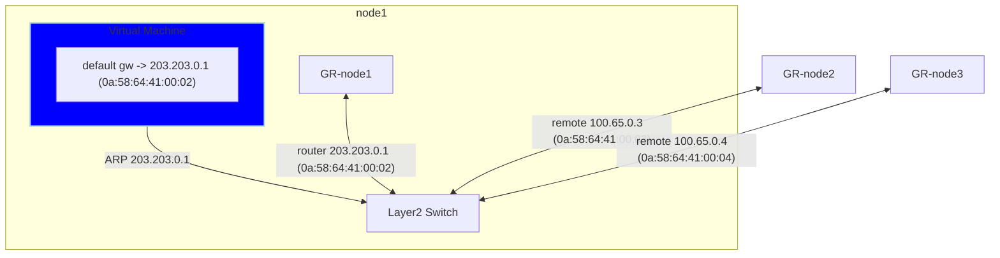
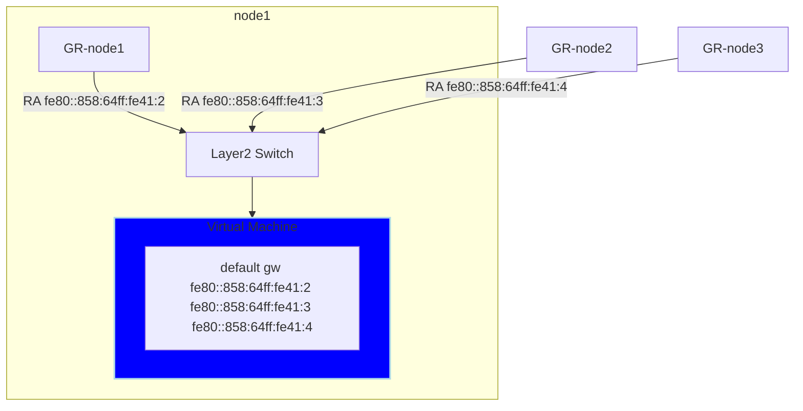
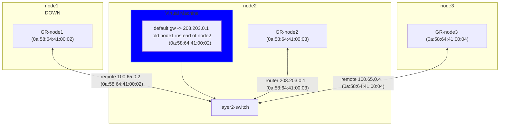
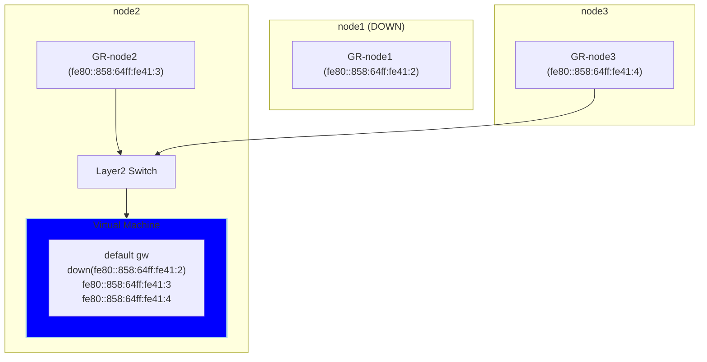
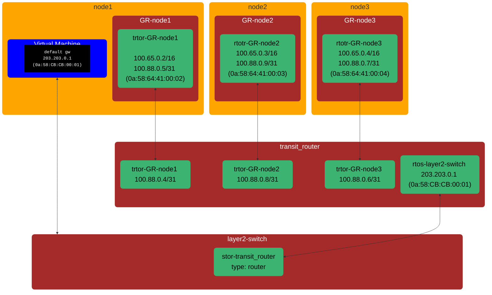
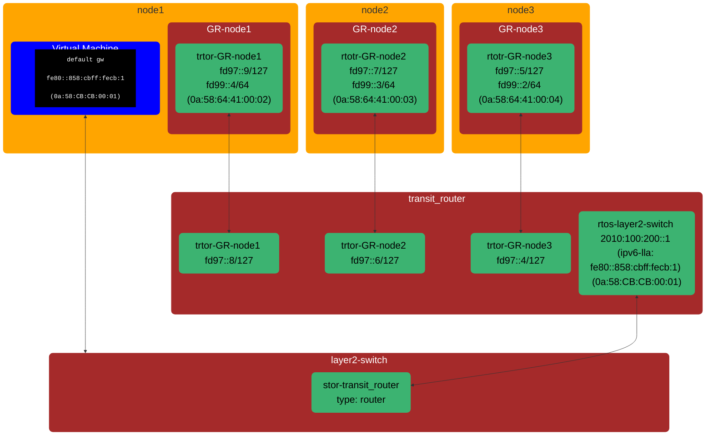
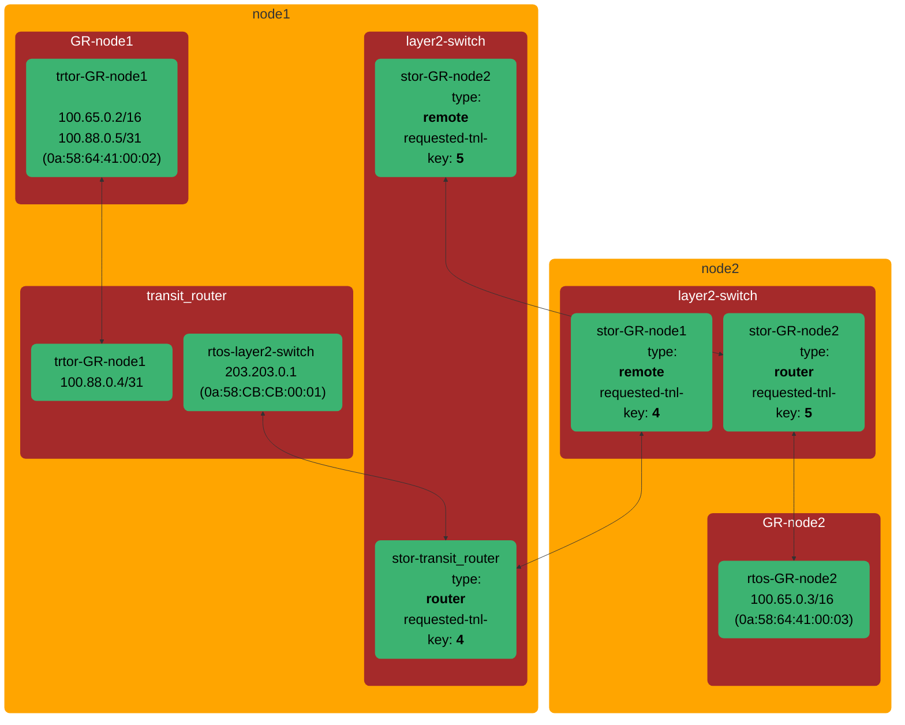
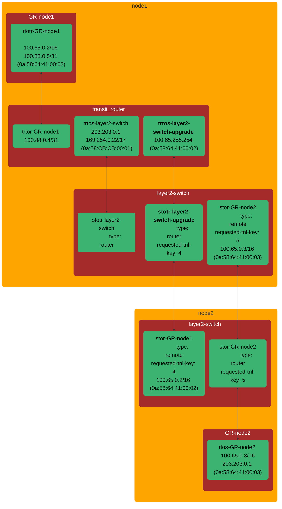

# OKEP-5094: Primary UDN Layer2 topology improvements

* Issue: [#5094](https://github.com/ovn-kubernetes/ovn-kubernetes/issues/5094)

## Problem Statement

The primary UDN layer2 topology presents some problems related to VM's live migration that are being addressed by
ovn-kubernetes sending GARPs or unsolicited router advertisement and blocking some OVN router advertisements, although this fixes the issue, is not the most robust way to address the problem and adds complexity to ovn-kubernetes live migration mechanism.

EgressIP logical router policies (LRP) for layer2 networks are applied on the gateway router, compared to the cluster router for layer3 networks.
To ensure proper traffic load balancing for EgressIPs with multiple IPs defined, especially for pods running on the EgressIP nodes themselves, a workaround was introduced.
This workaround configures the LRP for a pod on one of the EgressIP nodes to use the external gateway IP as one of the next hops to achieve proper load balancing.

For the following EgressIP:

```yaml
apiVersion: k8s.ovn.org/v1
kind: EgressIP
  metadata:
    annotations:
      k8s.ovn.org/egressip-mark: "50000"
  name: egressip-1
...
  spec:
    egressIPs:
    - 172.18.0.100
    - 172.18.0.101
...
  status:
    items:
    - egressIP: 172.18.0.100
      node: ovn-worker
    - egressIP: 172.18.0.101
      node: ovn-worker2
```

The following LRP is present on ovn-worker for a local pod with IP `10.10.0.8`:

```bash
ovn-nbctl lr-policy-list GR_cluster_udn_l2network_ovn-worker
Routing Policies
       100                               ip4.src == 10.10.0.8         reroute                100.65.0.3, 172.18.0.1               pkt_mark=50000
```

This policy redirects traffic the local external gateway `172.18.0.1`, or  to the join IP of the second egress node (ovn-worker2) `100.65.0.3`.

While this approach works in most cases, it has the following limitations:

* Does not work when there's no default gateway.
* [Does not work on platforms that use `/32` per node](https://issues.redhat.com/browse/OCPBUGS-48301).
* Does not respect multiple gateways and always sends traffic to one of the gateways.

We can make use of the [new transit router OVN topology entity](https://github.com/ovn-org/ovn/blob/c24b1aa3c724de1aa9fd2461f07e4127a6bfa190/NEWS#L42-L44) to fix these issues and changing the topology for primary UDN layer2.

## Goals

1. For layer2 topology advertise default gw with same IP and MAC address independently of the node where
   the vm is running.
2. Keep all the layer2 topology features at current topology.
3. Eliminate the dependency on external gateway IPs from layer2 EgressIP implementation.
4. Make the new topology upgradable with minor disruption.

## Non-Goals

1. Support non interconnect or interconnect with multiple nodes per zone.
2. Extend the layer2 topology changes to other topologies.

## Introduction

### Layer2 default gw discovery at VMs

Currently at layer2 topology the virtual machine related to default gw
routing looks like the following for ipv4, where the .1 address is configured
using DHCP and pods send an ARP that is only answered by the local gateway
router with the gateway router mac.



```bash
$ ip route
default via 203.203.0.1 dev eth0 proto dhcp metric 100

$ ip neigh
203.203.0.1 dev eth0 lladdr 0a:58:64:41:00:02 REACHABLE
```

And this is how it looks for IPv6 where the [RFC](https://datatracker.ietf.org/doc/html/rfc4861#section-4.2) dictates the default gw route
is advertised with the link local address. So every gateway router connected to the
switch will send a router advertisement after receiving the router solicitation from
the virtual machine.


```bash
$ ip -6 route
default proto ra metric 100 pref low
	nexthop via fe80::858:64ff:fe41:2 dev eth0 weight 1
	nexthop via fe80::858:64ff:fe41:3 dev eth0 weight 1
	nexthop via fe80::858:64ff:fe41:4 dev eth0 weight 1

$ ip neigh
fe80::858:64ff:fe41:3 dev eth0 lladdr 0a:58:64:41:00:03 router STALE
fe80::858:64ff:fe41:4 dev eth0 lladdr 0a:58:64:41:00:04 router STALE
fe80::858:64ff:fe41:2 dev eth0 lladdr 0a:58:64:41:00:02 router STALE
```

This is a view of the logical router ports connected to the switch, take
into account that the 203.203.0.1 is only "propagated" on the node where the
vm is running:
```bash
$ ovnk ovn-control-plane ovn-nbctl show GR_test12_namespace.scoped_ovn-control-plane
router 2b9a5f29-ef44-4bda-8d39-45198353013b (GR_test12_namespace.scoped_ovn-control-plane)
    port rtos-test12_namespace.scoped_ovn_layer2_switch
        mac: "0a:58:64:41:00:03"
        ipv6-lla: "fe80::858:64ff:fe41:3"
        networks: ["100.65.0.3/16", "2010:100:200::1/60", "203.203.0.1/16", "fd99::3/64"]

$ ovnk ovn-worker ovn-nbctl show GR_test12_namespace.scoped_ovn-worker
router dbbb9301-2311-4d2f-bfec-64e1caf78b8e (GR_test12_namespace.scoped_ovn-worker)
    port rtos-test12_namespace.scoped_ovn_layer2_switch
        mac: "0a:58:64:41:00:02"
        ipv6-lla: "fe80::858:64ff:fe41:2"
        networks: ["100.65.0.2/16", "2010:100:200::1/60", "203.203.0.1/16", "fd99::2/64"]

$ ovnk ovn-worker2 ovn-nbctl show GR_test12_namespace.scoped_ovn-worker2
router 148b41ca-3641-449e-897e-0d63bf395233 (GR_test12_namespace.scoped_ovn-worker2)
    port rtos-test12_namespace.scoped_ovn_layer2_switch
        mac: "0a:58:64:41:00:04"
        ipv6-lla: "fe80::858:64ff:fe41:4"
        networks: ["100.65.0.4/16", "2010:100:200::1/60", "203.203.0.1/16", "fd99::4/64"]
```

So the gist of it is that the default gw ip4 and ipv6 is dependent of where
the VM is running, and that has important implications.

Also having a multipath IPv6 default gateway means that the egress traffic is load balanced between nodes, across the geneve interconnect.

### Virtual machine live migration and default gateway

When a virtual machine is live migrated, it is transferred from the node where it is
running to a different one, in this case it can be from node1 to node2.

After live migration has finished and the VM is running on a different node,
the VM does *not* initiate any type of ARP or Router Solicitation to reconcile
routes since from its point of view nothing has changed. This means it's running
with the same network configuration, the consequence of that is that the
VM will continue running with its default IPv4 gateway mac address pointing to node1 and
for ipv6 it will continue to be the multipath default gw.

One common scenario that triggers user live migrating VMs is related to
doing some kind of node maintenance where the node need to go down. The VM is
live migrated to a different node, then the node where it was original running
is shutdown and some maintenance (e.g., hardware changes) is done before starting
it up again.

With that scenario in mind, after VM has live migrated:
- the default IPv4 default gateway mac will point to a node that is currently down
- one of default IPv6 gateway paths will be pointing to a node that is currently down.

To fix that for IPv4, ovn-kubernetes sends a GARP after live migration to
reconcile the default gw mac to the new node where the VM is running [Pull Request 4964](https://github.com/ovn-kubernetes/ovn-kubernetes/pull/4964).

For ipv6 there are changes to do something similar by blocking external gateway
routers RAs [Pull Request 4852](https://github.com/ovn-kubernetes/ovn-kubernetes/pull/4852) and reconciling gateways with unsolicited router advertisements
[Pull Request 4847](https://github.com/ovn-kubernetes/ovn-kubernetes/pull/4847).

Although these fixes work, they are not very robust since messages can be lost
or blocked so gateway do not get reconciled.

This is how the topology will look after the virtual machine has being live migrated from node1 to node2
and shutting down node1 after it.

ipv4:


ipv6:


### Layer2 topology limitations for EIP

The current layer2 topology has some limitations with Egress IP.
When multiple IPs are assigned to an Egress IP, and a pod is local to one
of the egress nodes, only the egress path local to that node will be used.

## User-Stories/Use-Cases

### Story 1: seamless live migration

As a kubevirt user, I want to live migrate a virtual machine using layer2 primary UDN,
so that TCP connections to the external network are not broken and downtime is minimum with network configuration
not being changed within the virtual machine.

For example: User has a virtual machine serving a video conference using TCP connection and the node
where is running needs to be shut down, so user does a live migration to move to other nodes, the video
should continue with minimum downtime without changing virtual machine network configuration.

### Story 2: EIP for layer2 limitations

As an EIP L2 UDN user, new connections from a pod should be balanced correctly over multiple Egress IPs.

## Proposed Solution

The OVN community did introduce a new network topology element [**transit router**](https://www.ovn.org/support/dist-docs/ovn-nb.5.html) that allows logical routers that are shared between OVN availability zones, this make possible to use a cluster router similar to layer3 topology ovn_cluster_router for layer2
so the logical router port that is connected to the layer2 switch will have just the .1 address and mac and ipv6 lla generated
with it.

### Ports, switches and routers topology

This is an overview of the topology with the transit subnet used to connect the transit_router and gateway routers directly (without a new logical switch - direct router port connections using the NB.Logical_Router_Port.peer field between the GR and the new transit_router).


OVN routers cannot have multiple ports in the same subnet, so the trtor (transit router to gateway router) ports of the transit_router need to have the minimal possible subnet, to accommodate at least 2 IPs one per peer, from the
transit switch subnet to connect the two peers, trtor (transit_router) <-> rtotr (GR).

#### IPv4

Address config
```yaml
subnet: 203.203.0.0/24
join-subnet: 100.65.0.0/16
transit-subnet: 100.88.0.0/16
transit-peers-node-subnet:
  node1: 100.88.0.4/31
  node2: 100.88.0.8/31
  node3: 100.88.0.6/31
```

The transit per node subnet has to reserve 2 addresses for the transit router side and gateway router side. 

Let's inspect node1 transit-peers-node-subnet with the `100.88.0.4/31` subnet: 
GR and transit_router peers ports should use `100.88.0.4` and `100.88.0.5`.



As shown by the topology the VM default gw IP is the first address from the subnet `203.203.0.1` and the mac address is computed from it
so this makes it __independent__ of where the VM is running.

#### IPv6

Address config
```yaml
subnet: 2010:100:200::0/60
join-subnet: fd99::/64
transit-subnet: fd97::/64
transit-peers-node-subnet:
  node1: fd97::8/127
  node2: fd97::6/127
  node3: fd97::4/127
```
In the case of IPv6 there is no broadcast concept so reserving two addresses (one bit) is enough that means the transit-peers-node-subnet size should
be `128 - 1 = 127`.

Again `ipcalc` we can inspect the subnet for node1:
```bash
$ ipcalc fd97::8/127
Full Network:	fd97:0000:0000:0000:0000:0000:0000:0008/127
Network:	fd97::8/127
Netmask:	ffff:ffff:ffff:ffff:ffff:ffff:ffff:fffe = 127

Address space:	Unique Local Unicast
HostMin:	fd97::8
HostMax:	fd97::9
Hosts/Net:	2
```
In this case the node1 gateway and ovn_cluster routers peer ports should use `fd97::8` and `fd97::9`.



According to RFC 4861/4862, routers advertise a link-local address
(`fe80::/64`). Its Interface Identifier (IID) is derived from the
router's MAC address (e.g., `fe80::858:cbff:fecb:1`). This LLA
remains stable as a default gateway, independent of the virtual
machine's hosting node.

#### Tunnel keys for the transit switches/routers

Every OVN switch and router has a unique tunnel key. It has to be manually allocated for all transit switches and routers,
but "regular" (non-transit) switches and routers currently use automatic allocation by the northd.
OVN has a reserved range of 2^16 for the transit switches and routers https://github.com/ovn-org/ovn/commit/969f7f54ea3868172f99119991d8d875bb8f240c
that won't be assigned by the northd for the regular switches and routers to avoid conflict.

We already use this key for the Layer3 transit switches and Layer2 switches. 
So currently we can support not more than 2^16 (65K) UDNs or to be more precise, NADs, of any topology type
(since the tunnel-key is allocated based on the network-id, which in turn is also allocated for Localnet networks). 
Now we need more transit routers for the layer2 topology, but the allowed tunnel key range for all transit switches and routers stays the same.
The same problem will arise when we get to UDN interconnect, because it will use even more transit routers.

For this enhancement we have 3 options:
1. We could just split the range into 3 equal parts, use the first part for transit switches, the second part for layer2 transit routers,
and the third part for UDN interconnect transit routers. That means we could support up to 21K UDNs (NADs) and
up to 21K UDN interconnects. If we ever hit the scale limit, we can proceed with option 4. For backwards-compatability, 
the first 21K keys for transit switches/routers will be allocated in the old range, and the new keys will use the new range.
This option doesn't allow adding more features that require tunnel keys in the future since the whole range will be already consumed.
2. Second option is to use tunnel-keys outside the protected range. Current range is split into [0, 2^24-2^16-1] for northd
allocation and [2^24-2^16, 2^24-1] for interconnect. Northd does sequential key allocation, that means
(for single-node-zone) it will only use `(<Number of UDNs> + 1)*5` keys, so the following range `[(<Number of UDNs> + 1)*5; 2^24-2^16-1]`
will be unused, and we could start allocating transit router keys from `2^24-2^16-1` going down. This is kind of dangerous
as it only relies on the current northd behaviour.
3. Another option (centralized) is to add ID allocation from the transit tunnel key range. There is no way to migrate existing transit 
switches to the new tunnel key, because all nodes need to do that at the same time, and rolling upgrade won't help here.
Since current limit for networkIDs is `4096` https://github.com/ovn-kubernetes/ovn-kubernetes/blob/8f6e3ee9883bb6eb2230cea5c1c138d6098c95b0/go-controller/pkg/networkmanager/api.go#L17
we can consider [`first-interconnect-key`, `first-interconnect-key`+4095] to be reserved for the legacy transit switch keys,
and use a new centralized transit keys allocation in the range [`first-interconnect-key`+4095, 2^24-1]. This option
requires up to 2 new annotations on NADs, and makes the number of supported UDNs dependent on the number of UDN interconnects.
4. Fourth approach (distributed) is to start assigning all datapath keys ourselves (for all switches and routers, currently it is done by the northd),
then we could use the full tunnel-key range of `2^24` (16M). Every regular (non-transit) switch or router only has to use
unique key within its zone (that is within node for single-node-zone IC). That means that every node could
re-use the same keys for regular datapaths (but it won't work for multi-node zones, the question is whether we need to support it).
Currently, every Layer3 topology (the most switches/routers) needs 7 keys (node switch, cluster router, join switch, 
gw router, transit router, transit switch, ext switch), so we could reserve 20 keys per network (just to be safe).
These keys could be derived from the network-id, and then we could support e.g. 100K UDNs (2M keys) + 1M UDN interconnects (1M keys),
and still have 12M keys left.

We have agreed that we want to avoid implementing option 4 for as long as possible, which means we need to use
tunnel keys in the most efficient way, which means option 3 is the way to go.
We will add error handling in case we run out of tunnel keys and document the dependency on supported number of UDNs
vs UDN interconnects (e.g. we can support 65K Layer3 UDNs or 32K Layer2 UDNs).

#### NAT configuration
As much as possible everything related to conntrack should not be modified since doing so can affect tcp connections.

The only nat rule that needs to be moved from GR to transit_router is the one SNATing the traffic from the network subnet that goes to the management port. This is needed because now ovn_custer_router is the router directly connected to the layer2 switch (instead of the GR). The rest of the NAT configurations can stay unchanged on the GR.

```
allowed_ext_ips     : []
exempted_ext_ips    : []
external_ids        : {"k8s.ovn.org/network"=test12_namespace-scoped, "k8s.ovn.org/topology"=layer2}
external_ip         : "169.254.0.12"
external_mac        : []
external_port_range : ""
gateway_port        : []
logical_ip          : "203.203.0.0/16"
logical_port        : rtos-test12_namespace.scoped_ovn_layer2_switch
match               : "eth.dst == 0a:58:cb:cb:00:02"
options             : {stateless="false"}
priority            : 0
type                : snat
```

Also the fact that join IP at gateway router is kept allow to maintain all the NATing done with it at gateway router to define OVN load balancers to implement k8s services.

#### Static Routes and Logical Router Policies
Changing where routes and policies are configured does not affect TCP connections on upgrade so we can move some routes and policies from gateway router
to transit_router without issues. In general it will be similar to the layer3 routes and policies.

These will be the routes and policies configured on the new transit_router
```
IPv4 Routes
Route Table <main>:
                10.96.0.1               203.203.0.2 dst-ip <-- api service
               10.96.0.10               203.203.0.2 dst-ip <-- dns service
               100.65.0.2                100.88.0.6 dst-ip <-- node1 traffic use node2 gr peer ip
               100.65.0.3               100.88.0.10 dst-ip <-- node2 traffic use node2 gr peer ip
               100.65.0.4               100.88.0.14 dst-ip <-- node3 traffic use node2 gr peer ip
           203.203.0.0/16               100.88.0.14 src-ip <-- network egress traffic goes to local gateway router peer ip
```
```
      1004 inport == "rtos-test12_namespace.scoped_ovn_layer2_switch" && ip4.dst == 172.18.0.3 /* test12_namespace.scoped_ovn_layer2_switch */         reroute               203.203.0.2
      1004 inport == "rtos-test12_namespace.scoped_ovn_layer2_switch" && ip6.dst == fc00:f853:ccd:e793::3 /* test12_namespace.scoped_ovn_layer2_switch */         reroute           2010:100:200::2
       102 (ip4.src == $a10466913729612642039 || ip4.src == $a13607449821398607916) && ip4.dst == $a3613486944346402462           allow
       102 (ip4.src == $a10466913729612642039 || ip4.src == $a13607449821398607916) && ip4.dst == $a712973235162149816           allow               pkt_mark=1008
       102 (ip6.src == $a2718358047735721557 || ip6.src == $a13607452020421864338) && ip6.dst == $a1091196985512978262           allow               pkt_mark=1008
       102 (ip6.src == $a2718358047735721557 || ip6.src == $a13607452020421864338) && ip6.dst == $a3613484745323146040           allow
       102 ip4.src == 203.203.0.0/16 && ip4.dst == 100.64.0.0/16           allow
       102 ip4.src == 203.203.0.0/16 && ip4.dst == 203.203.0.0/16           allow
       102 ip6.src == 2010:100:200::/60 && ip6.dst == 2010:100:200::/60           allow
       102 ip6.src == 2010:100:200::/60 && ip6.dst == fd98::/64           allow
       102                                     pkt.mark == 42           allow
```

And these will be the gateway router configured routes (no policies needed):
```
IPv4 Routes
Route Table <main>:
           169.254.0.0/17               169.254.0.4 dst-ip rtoe-GR_test12_namespace.scoped_ovn-control-plane
           203.203.0.0/16               100.88.0.13 dst-ip rtotr-GR_test12_namespace.scoped_ovn-control-plane <-- cluster ingress or egress reply traffic going towards the pod network via transit_router peer IP.
                0.0.0.0/0                172.18.0.1 dst-ip rtoe-GR_test12_namespace.scoped_ovn-control-plane
```

The logical router policies for EgressIP will be present on the transit router, using transit node peer ip as the next hop:

```
100                               ip4.src == 10.10.0.8         reroute               100.88.0.6,100.88.0.10               pkt_mark=50000
```

This approach eliminates the dependency on external IP addresses while maintaining proper load balancing for EgressIPs with multiple IP addresses.

#### Router to router direct connection without a switch

To connect the transit_router to the local gateway router instead of using a join switch like the layer3 topology those ports can be connected each other directly
using the `peer` field.

This is how it looks the `trtor` port at transit_router:
```
_uuid               : f697bce1-dac7-442d-9355-e298e1735c7b
dhcp_relay          : []
enabled             : []
external_ids        : {"k8s.ovn.org/network"=test12_namespace-scoped, "k8s.ovn.org/topology"=layer2}
gateway_chassis     : []
ha_chassis_group    : []
ipv6_prefix         : []
ipv6_ra_configs     : {}
mac                 : "0a:58:64:58:00:0d"
name                : trtor-GR_test12_namespace.scoped_ovn-control-plane
networks            : ["100.88.0.8/31", "fd97::8/127"]
options             : {requested-tnl-key="4"}
peer                : rtotr-GR_test12_namespace.scoped_ovn-control-plane <------------- peer field
status              : {}
```

And this is the `rtotr` port at GR:
```
_uuid               : f9ab92f3-478c-41dd-b845-0d8ddf4a34e5
dhcp_relay          : []
enabled             : []
external_ids        : {"k8s.ovn.org/network"=test12_namespace-scoped, "k8s.ovn.org/topology"=layer2}
gateway_chassis     : []
ha_chassis_group    : []
ipv6_prefix         : []
ipv6_ra_configs     : {}
mac                 : "0a:58:64:41:00:04"
name                : rtotr-GR_test12_namespace.scoped_ovn-control-plane
networks            : ["100.65.0.4/16", "100.88.0.9/31", "fd97::9/127", "fd99::4/64"]
options             : {gateway_mtu="1400"}
peer                : trtor-GR_test12_namespace.scoped_ovn-control-plane <-------------- peer field
status              : {}

```

#### Transit router specifics

For transit router to work the LRPs referencing the same gateway router peer should have a unique tunnel key and if they are remote also a
requested chassis pointing to the gateway router node.

Also in the case we still need to support conditional SNAT, the transit router port connected to the switch needs to be configured as gateway router port.



### Transit subnet conflict

Before this change Layer2 networks using Subnet overlapping with the `transitSubnet` were allowed to be created (and would be working just fine).
Now it is not possible anymore, and we need to decide what to do in this case:
1. Before upgrading to the new topology, check that no Layer2 networks with overlapping subnet are present.
If they are, block the upgrade and inform the user to fix the issue. This option prevents the user from getting new topology
for all networks until the next upgrade.
2. Upgrade all nodes, but leave old topology for networks with overlapping subnet. Report an event/warning for the user to fix the issue.
When the network is upgraded/re-created with non-overlapping subnet, it will get the new topology. Other networks will be
properly upgraded.
3. Add a new config field for Layer2 network similar to [JoinSubnets](https://github.com/ovn-kubernetes/ovn-kubernetes/blob/ff3001ba43bf724e477ab45167dc55d929042774/go-controller/pkg/crd/userdefinednetwork/v1/shared.go#L178)
to allow users to specify a custom transit subnet for the network, in case their Subnet overlaps with the default transit subnet.
We don't allow UDN spec updates, so the only way to use this option (without introducing UDN spec updates) is to 
re-create a UDN with the same fields + the new transit subnet and then migrate all the workloads to it.
4. Automatically select non-overlapping transit subnet and report it via status (it may be needed to avoid subnet overlap for Connecting UDNs).
Transit subnet is not exposed to pods, so it may be fine to select it automatically as opposed to joinSubnet.

Options 1 and 2 will require one more release of supporting the old topology (and in the next release we break the 
networks if they were not upgraded).
We think that overlapping subnets is a likely scenario, and we want this upgrade to be as smooth as possible, so
option 4 is the least disruptive.

### API Details

Every node will get a temporary annotation "k8s.ovn.org/layer2-topology-version: 2.0" that will be removed in the next
ovn-k version (1.3 is the feature gets in 1.2).
Every Layer2 and Layer3 NAD will get new annotations for tunnel keys distribution.

### Implementation Details

#### At ovnkube-node

Create a helper that is able to derive the peer IPs from the node annotation
for the transit peers node subnet.

The layer2 controller should do the following:
- Adapt and call the syncNodeClusterRouterPort from layer3 that creates the LRP that connects to the switch at transit_router
- Pass transit_router as cluster_name to the gateway init functions
- Remove from gateway.go the code that was attaching GR to layer2 switch
- Add to gateway.go the code that connects GR to transit_router using the peer ports
- Change egressip.go so routes are configured at transit_router instead of gateway router.
- Change the ZoneInterConnect handler to be able to add the transit router remote ports to transit_router
- In general re-use as much Layer3 code as possible since these makes Layer2 topology similar to it.

#### At ovnkube-control-plane

At cluster manager at the zoneCluster controller calculate the peers node subnet
and annotate the node.

To calculate the transit router subnet for each node we have two options:
- Derive it from the node-id (same we do for transit switch addrs. `offset := 2 * nodeID; subnet := 100.88.0.0 + offset /31`):
  - good:
    - No need to maintain the allocator lifecycle
    - It's possible to entertain the idea of not annotating the node since the source of truth is the node-id
  - bad:
    - Add complexity in the form of node-id to subnet derivation code
    - Make the transit peers node subnet dependent on node-id
- Create a new subnet allocator that will re-sync on restarts and allocate
  the subnet with it:
  - good:
    - Is simpler since it's matter of a new subnet allocator
    - The transit peers node subnet is no longer dependent on node-id
  - bad:
    - Need to maintain the allocator lifecycle
    - Use more memory

We will go with the first option to avoid polluting already overloaded node annotations.

### Rolling upgrade and traffic disruption

OpenShift upgrades work as follows: first the ovn-k pods are upgraded while the 
workload pods are still running. We can't upgrade topology at this point, 
because it includes SNAT for the management port move from the GR to the transit router, which is disruptive 
for existing connections. Some time after that the node is drained (no more workload pods are left) 
and rebooted, at this point ovn-k is restarted with no workload pods, which is the time 
when we can make the topology upgrade.

From the ovn-k side we need to figure out when is that time with no workload pods, so we will 
introduce a function similar to https://github.com/ovn-kubernetes/ovn-kubernetes/pull/5416/commits/8adda434a35831c49e9bd19b86888bfb074be89f#diff-214cf3919602fd060047b8d15fd6c0ca9d3ed3d42c47fff4b181a072c182b673R306 
that will check whether a given network has already been updated and if not if it has running pods, 
and only upgrade the topology when it doesn't.
This means that we will have to leave the code for the previous topology version in place for one more release, 
and only cleanup afterwards.

This means, we don't need to worry about existing connections disruption (since the topology upgrade happens
after the node reboot, so there are no running connections), but we need to make sure that new connections
created when some nodes are upgraded and some are not will work and won't be disrupted.

#### Remote pod traffic

The pod to remote pod traffic is not affected since the logical switch will
keep intact the pod's local and remote LSPs with its tunnel key.

No downtime expected during upgrade

#### Egress traffic over local node

At normal egress without an egress IP, traffic exits through the node
hosting the pod/VM. Therefore, a partial cluster upgrade does not impact
the logical network topology.

During the upgrade all the VMs are evicted from the node, hence, they'll be migrated to another node - 
and the GR MACs will be updated via the VM migration process.

#### Egress/Ingress traffic over remote node

Both egress (using egressip feature) and ingress can come from a remote node,
this introduces problematic scenarios that can happen during an upgrade:
- A pod's node has new topology, but its ingress/egress node has old topology.
- A pod's node has old topology, but its ingress/egress node has new topology.

The following diagram show a possible topology to support those two scenarios:



The intermediate upgrade topology parts are bold, and will be removed once all nodes finish the upgrade.
Nodes using the new topology must perform the following actions:
- At the distributed switch:
    - Retain `remote` type stor-GR LSPs from nodes still using the
      old topology.
    - Create a tmp `router` type stotr-upgrade LSP with `router-port` and same tunnel key as before
      pointing to rtos-GR.
  - Create a tmp transit router port `trtos-layer2-switch-upgrade` with the GR MAC address
  - Add a dummy IP from the join subnet to the `trtos-layer2-switch-upgrade` port to enable pod on node1 -> remote GR traffic.
  - Add `trasit_router` routes to steer joinIP traffic for the ole nodes to the `trtos-layer2-switch-upgrade` port.
    These routes look weird, but they work, like `100.65.0.3 100.65.0.3 dst-ip` for every joinIP of the old nodes. We need this because
    in OVN routes with dst-ip and src-ip policies are evaluated at the same time and selected based on longest-prefix-match,
    and we have the following route for pod network `10.10.0.0/24`:
    `10.10.0.0/24                 10.10.0.2 src-ip`
    Connected route for the join IP is based on the joinSubnet, which is always `/16`.
    That means, that for traffic with src IP from the podSubnet dst IP from joinSubnet,
    the winning route is joinIP if podSubnet mask is <= 16 and podSubnet otherwise.
    That is not the desired behavior, that is why we add always-winning routes (aka /32 or /128) for joinIPs.

We need to make sure joinSubnet works between upgraded and non-upgraded nodes, as this is the only network that both topologies
understand:
- We need to make sure pod2 on node2 -> `100.65.0.2` works (it is used e.g. for service reply traffic that came from node1 to pod2)
  - pod2(`203.203.0.3`) -> default GW (`203.203.0.1`)
  - GR will ARP for `100.65.0.2` and hit layer2-switch -> will use remote port `stor-GR-node1` config and ARP reply with `0a:58:64:41:00:02`
  - `layer2-switch` sends packet to `0a:58:64:41:00:02` via `stor-GR-node1` with `tunnel-key=4`
  - now we cross interconnect to node1 `stotr-layer2-switch-upgrade` 
  - it sends packet to `trtos-layer2-switch-upgrade` on the `transit_router` via direct peer connection
  - MAC address `0a:58:64:41:00:02` is owned by the port and will be accepted by the transit_router
  - dst IP=`100.65.0.2` => route lookup => choose between old joinIP routes via port `trtos-layer2-switch-upgrade`
  and new transit route `100.65.0.2/32` via `100.88.0.6`
  - `transit_router` will choose `100.65.0.2/32` with the longest-prefix match and send it to the `GR-node1`
- We need to make sure pod 1 on node1 -> `100.65.0.3` works (it is used e.g. for service reply traffic that came from node2 to pod1)
  - pod1(`203.203.0.2`) -> default GW (`203.203.0.1`)
  - `transit_router` will do route lookup and use `100.65.0.3/32` via `trtos-layer2-switch-upgrade` since it has the dummy IP
    from the same subnet
  - `transit_router` will ARP for `100.65.0.3` and go to the `layer2-switch`, which will use the remote port `stor-GR-node2` config
    and ARP reply with `0a:58:64:41:00:03`
  - `transit_router` sends packet to dst MAC `0a:58:64:41:00:03` via `trtos-layer2-switch-upgrade`
  - `layer2-switch` sends it out via `stor-GR-node2` with `tunnel-key=5`
  - `node2` handles the packet exactly as with the old topology

For comparison, fully upgraded scenario for ingress service via node1 to local pod1 `203.203.0.2` looks like this:
- incoming packet gets DNAT'ed to the `serviceIP` and SNAT'ed to the node masq IP (src=`169.254.0.2`), then comes to the GR
- GR does its usual DNAT to the backend pod IP (dst=`203.203.0.2`) and SNAT to the joinIP (src=`100.65.0.2`)
- GR sends the packet via `rtotr-GR-node1` to the `transit_router`
- `transit_router` sends the packet (dst=`203.203.0.2`) directly to the `layer2-switch`, done
Now reply:
- pod1 (`203.203.0.2`) replies to `100.65.0.2` -> default GW (`203.203.0.1`)
- `transit_router` will ARP for `100.65.0.2` and get a reply from `GR-node1` via port `rtotr-GR-node1` with `0a:58:64:41:00:02`
- `transit_router` will do route lookup and choose `100.65.0.2/32` via `100.88.0.6` with the longest-prefix match 
  and send it to the `GR-node1`
- the usual un-DNAT (dst=`169.254.0.2`), un-SNAT (src=`serviceIP`) happens here before being sent out

Some of the scenarios that we care about:
- Ingress traffic coming to GR via service
  - upgraded GR -> non-upgraded node pod: we SNAT to the same joinIP as before, reply traffic comes back to the 
    `transit_router` because `trtos-layer2-switch-upgrade` port is configured with the GW MAC.
  - non-upgraded GR -> upgraded node pod: uses the same joinIP as before. Reply uses the newly assigned dummyIP
    from the join subnet, to enable routing from the upgraded node pod to the joinIP subnet. Without the dummy IP
    transit_router doesn't know what to do with the `dst: 100.65.0.3` traffic.
- Egress IP traffic: uses the same joinIP to route as before, works similar to service traffic.

The same GR MAC address is used on the GR port (`rtotr-GR-node1`) and the transit router port (`trtos-layer2-switch-upgrade`).
That's fine because they're different L2 domains.

Dummy IP can be resued on all nodes, since it is never used as a source or destination IP, it is only used for the routing decision.
You may wonder why we need per-joinIP routes if dummyIP should be enough for routing decision based on the connected route.
It is about longest prefix match algorithm that OVN uses. Without `/32` routes for every joinIP, we have 2 fighting routes for
pod1->joinIP traffic, one with dummy IP `ip4.dst == 100.65.0.0/16` and another one for pod subnet `ip4.src == <podSubnet>` 
(this one sends everything to the GR). So which route wins currently depends on the `podSubnet` netmask: 
if it is `/16` or larger, dummy IP wins and everything works, otherwise pod subnet route wins and the traffic is blackholed.

joinIP is not really needed in the new topology, but we will have to keep it during the upgrade, and we can't
remove it after the upgrade is done, because there will be conntrack entries using it. Not too big of a deal,
but a side effect of supporting the upgrade.
There is a way to remove joinIPs eventually (not a part of this enhancement, but leaving here for future reference), 
which requires 2 more upgrades:
1. On the next upgrade replace all NATs using joinIPs with the transitIPs (at this point the new topology is used and all nodes understand
transit IPs). This can only be done in the same manner as this upgrade (i.e. after the node reboots) to avoid disruption.
Routes on the pod will also need to be updated.
2. On the next-after-next upgrade we can safely remove joinIPs from the topology, since they shouldn't be used anymore.

There is another aspect to this: joinSubnet is currently configurable in the Layer2 network spec, and it is exposed to the pods.
So if we get rid of it and replace it with the transitSubnet, we need to remove that field and see if transitSubnet also
needs to be configurable.

#### Upgrade Details

1. every node has to identify when it starts using new topology (so that the other nodes can switch from the switch 
remote ports to the router remote ports). This can be done with annotations, but it either will have to be per-network 
(which is a lot of updates) or it needs to check that absolutely no pods are present on the node for all layer2 networks, 
and use node-scope annotation. The only downside of per-node annotation is that if any layer2 network for whatever (buggy)
reason still has a local pod, none of the networks will be upgraded.
Since the whole upgrade procedure relies on pod eviction before node reboot, it is ok to use per-node annotation. 
The node will check that it has no running pods, and set the annotation "k8s.ovn.org/layer2-topology-version: 2.0".
2. every node will need to upgrade to the intermediate topology, when it has no running pods (when the node has been drained and rebooted)
  - ovnkube is updated on each node, no upgrade action is taken for the layer 2 topology. Networks continue to function as before.
  - Once network has rolled out, OpenShift Machine Config Operator (MCO) will start draining and rebooting nodes to update the host OS.
  - As each upgraded node comes up, it will modify its layer 2 networks as shown in [the upgrade topology](#egressingress-traffic-over-remote-node), 
    the upgraded node will refuse to bring up any ovn-networked pods while the topology is updating.
  - Other ovnkube pods will see this ovnkube pod's node event, and then reconfigure their remote port to directly connect to the router.
  - After all nodes have added their annotation, the nodes will then remove the backwards compatible upgrade topology 
    ("stotr-layer2-switch-upgrade" port, and the local join subnet address 100.65.255.254)
  - During topology upgrade we also need to cleanup/remove old topology parts, like GR-switch ports, old GR routes and NATs, 
    and these cleanups need to be idempotent and spread across multiple controllers.
3. remove the upgrade topology artifacts (like extra ports or IPs) when all nodes finished upgrading.

### Testing Details

* Unit test checking topology will need to be adapted.
* E2e tests should be the same and pass since this is a refactoring not adding or removing features.
* Upgrade tests are the most difficult part in this case.
  * Perform an upgrade while using all the ovn-kubernetes layer2 topology features and check that these continue working.
  * Make sure old layer2 topology is preserved and keeps working until all pods are removed from the node
  * We don't have such upgrade tests yet, and they don't make sense after this upgrade is done, so the suggestion is to
    do this testing manually.
  * Make sure VM live migration works during the upgrade.

### Documentation Details

N/A

## Risks, Known Limitations and Mitigations

This topology repositions the NAT, which masquerades management port
traffic, from the gateway router to the `transit_router`. This change
might disrupt name resolution (DNS service access) and local gateway
access to external traffic.

However, disrupting dns resolution is not a big issue since client would retry the
resolution

Consider that there are plans to migrate the SNAT from the logical
router to iptables on the nodes. If this occurs, the disruption
would be resolved. Therefore, it might be advisable to await this
enhancement's implementation before proceeding.

## OVN Kubernetes Version Skew

which version is this feature planned to be introduced in?
check repo milestones/releases to get this information for
when the next release is planned for

## Alternatives

N/A

## References

* OVN Transit Router: https://www.ovn.org/support/dist-docs/ovn-nb.5.html
