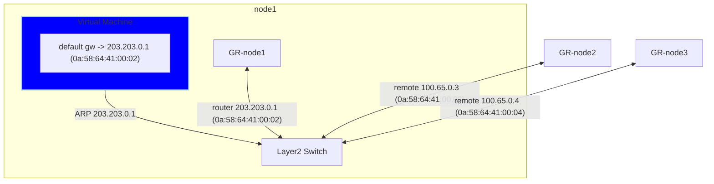
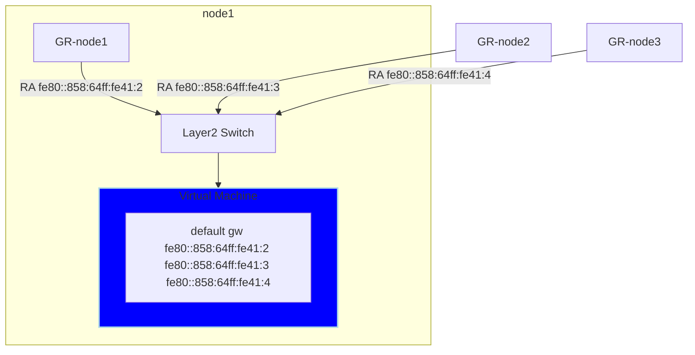
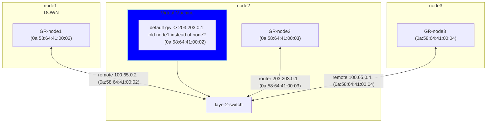
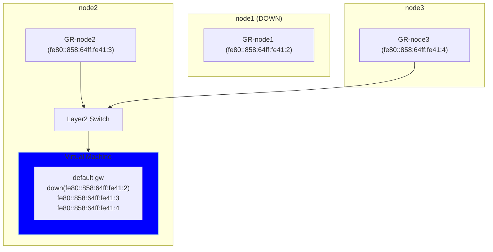
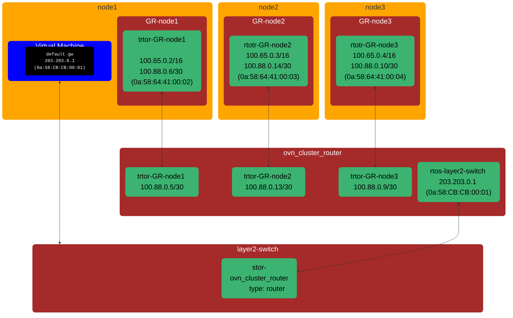
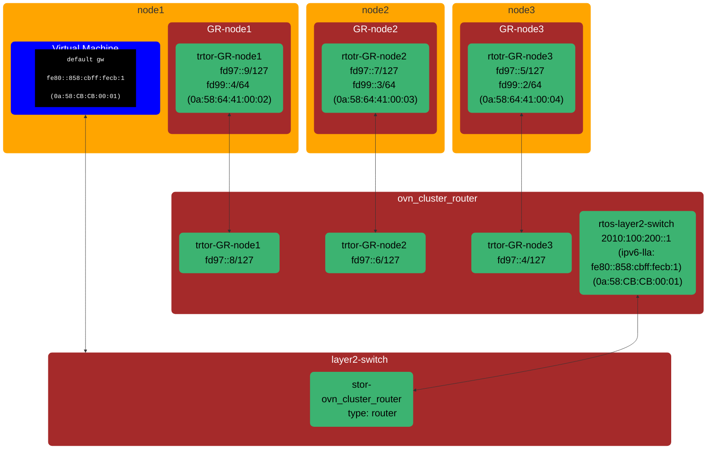
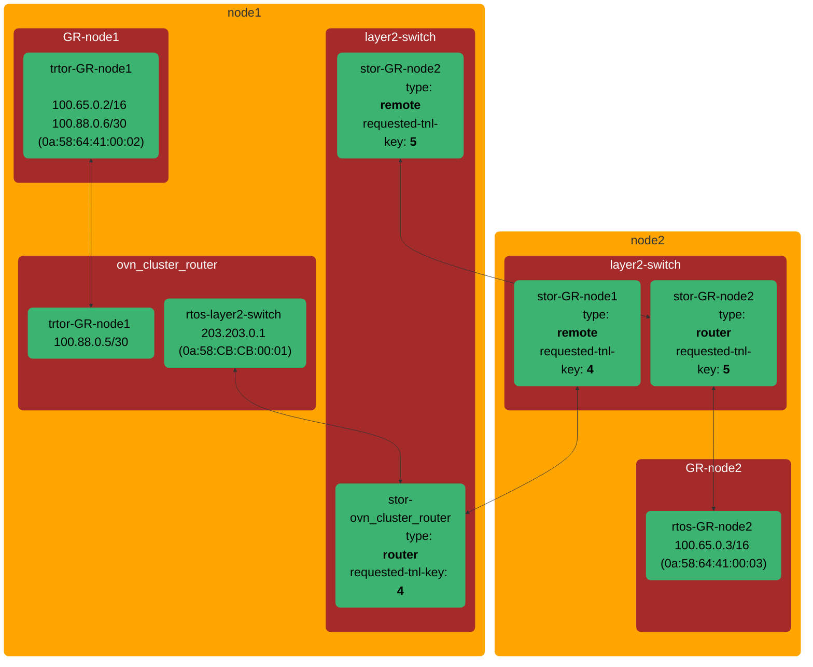
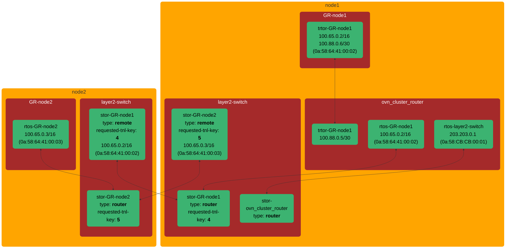

# OKEP-5094: Primary UDN Layer2 topology improvements

* Issue: [#5094](https://github.com/ovn-kubernetes/ovn-kubernetes/issues/5094)

## Problem Statement

The primary UDN layer2 topology present some problems related to VM's live migration that are being addressed by
ovn-kubernetes sending GARPs or unsolicited router advertisement and blocking some OVN router advertisement, although this fixes the issue, is not the most robust way to address the problem and adds complexity to ovn-kubernetes live migration mechanism.

There are other layer2 egressip [limitations](https://issues.redhat.com/browse/OCPBUGS-48301) introduced by this topology, EIP for L2 UDN depends on a single external GW IP therefore we dont respect multiple ext gws and forward all traffic to one GW.

We can make use of the [new transit router OVN topology entity](https://github.com/ovn-org/ovn/blob/c24b1aa3c724de1aa9fd2461f07e4127a6bfa190/NEWS#L42-L44) to fix these issues and changing the topology for primary UDN layer2.

## Goals

1. For layer2 topology advertise default gw with same IP and MAC address independently of the node where
   the vm is running.
2. Keep all the layer2 topology features at current topology.
3. Cover the missing egressip features from current topology.
4. Make the new topology upgradable with minor disruption.

## Non-Goals

1. Support non interconnect or interconnect with multiple nodes per zone.
2. Extend the layer2 topology changes to other topologies.

## Introduction

### Layer2 default gw discovery at VMs

Currently at layer2 topology the virtual machine related to default gw
routing looks like the following for ipv4, where the .1 address is configured
using DHCP and pods send an ARP that is only answered by the local gateway
router with the gateway router mac.



```bash
$ ip route
default via 203.203.0.1 dev eth0 proto dhcp metric 100

$ ip neigh
203.203.0.1 dev eth0 lladdr 0a:58:64:41:00:02 REACHABLE
```

And this is how it looks for IPv6 where the [RFC](https://datatracker.ietf.org/doc/html/rfc4861#section-4.2) dictates the default gw route
is advertised with the link local address. So every gateway router connected to the
switch will send a router advertisement after receiving the router solicitation from
the virtual machine.


```bash
$ ip -6 route
default proto ra metric 100 pref low
	nexthop via fe80::858:64ff:fe41:2 dev eth0 weight 1
	nexthop via fe80::858:64ff:fe41:3 dev eth0 weight 1
	nexthop via fe80::858:64ff:fe41:4 dev eth0 weight 1

$ ip neigh
fe80::858:64ff:fe41:3 dev eth0 lladdr 0a:58:64:41:00:03 router STALE
fe80::858:64ff:fe41:4 dev eth0 lladdr 0a:58:64:41:00:04 router STALE
fe80::858:64ff:fe41:2 dev eth0 lladdr 0a:58:64:41:00:02 router STALE
```

This is a view of the logical router ports connected to the switch, take
into account that the 203.203.0.1 is only "propagated" on the node where the
vm is running:
```bash
$ ovnk ovn-control-plane ovn-nbctl show GR_test12_namespace.scoped_ovn-control-plane
router 2b9a5f29-ef44-4bda-8d39-45198353013b (GR_test12_namespace.scoped_ovn-control-plane)
    port rtos-test12_namespace.scoped_ovn_layer2_switch
        mac: "0a:58:64:41:00:03"
        ipv6-lla: "fe80::858:64ff:fe41:3"
        networks: ["100.65.0.3/16", "2010:100:200::1/60", "203.203.0.1/16", "fd99::3/64"]

$ ovnk ovn-worker ovn-nbctl show GR_test12_namespace.scoped_ovn-worker
router dbbb9301-2311-4d2f-bfec-64e1caf78b8e (GR_test12_namespace.scoped_ovn-worker)
    port rtos-test12_namespace.scoped_ovn_layer2_switch
        mac: "0a:58:64:41:00:02"
        ipv6-lla: "fe80::858:64ff:fe41:2"
        networks: ["100.65.0.2/16", "2010:100:200::1/60", "203.203.0.1/16", "fd99::2/64"]

$ ovnk ovn-worker2 ovn-nbctl show GR_test12_namespace.scoped_ovn-worker2
router 148b41ca-3641-449e-897e-0d63bf395233 (GR_test12_namespace.scoped_ovn-worker2)
    port rtos-test12_namespace.scoped_ovn_layer2_switch
        mac: "0a:58:64:41:00:04"
        ipv6-lla: "fe80::858:64ff:fe41:4"
        networks: ["100.65.0.4/16", "2010:100:200::1/60", "203.203.0.1/16", "fd99::4/64"]
```

So the gist of it is that the default gw ip4 and ipv6 is dependent of where
the VM is running, and that has important implications.

Also having a multipath IPv6 default gateway means that the egress traffic is load balanced between nodes, across the geneve interconnect.

### Virtual machine live migration and default gateway

When a virtual machine is live migrated, it is transferred from the node where it is
running to a different one, in this case it can be from node1 to node2.

After live migration has finished and the VM is running on a different node,
the VM does *not* initiate any type of ARP or Router Solicitation to reconcile
routes since from its point of view nothing has changed. This means it's running
with the same network configuration, the consequence of that is that the
VM will continue running with its default IPv4 gateway mac address pointing to node1 and
for ipv6 it will continue to be the multipath default gw.

One common scenario that triggers user live migrating VMs is related to
doing some kind of node maintenance where the node need to go down. The VM is
live migrated to a different node, then the node where it was original running
is shutdown and some maintenance (e.g., hardware changes) is done before starting
it up again.

With that scenario in mind, after VM has live migrated:
- the default IPv4 default gateway mac will point to a node that is currently down
- one of default IPv6 gateway paths will be pointing to a node that is currently down.

To fix that for IPv4, ovn-kubernetes sends a GARP after live migration to
reconcile the default gw mac to the new node where the VM is running [Pull Request 4964](https://github.com/ovn-kubernetes/ovn-kubernetes/pull/4964).

For ipv6 there are a change to do something similar by blocking external gateway
routers RAs [Pull Request 4852](https://github.com/ovn-kubernetes/ovn-kubernetes/pull/4852) and reconciling gateways with unsolicited router advertisements
[Pull Request 4847](https://github.com/ovn-kubernetes/ovn-kubernetes/pull/4847).

Although these fixes works, they are not very robust since messages can be lost
or blocked so gateway do not get reconciled.

This is how the topology will look after the virtual machine has being live migrated from node1 to node2
and shutting down node1 after it.

ipv4:


ipv6:


### Layer2 topology limitations for EIP

The current layer2 topology has some limitations with Egress IP.
When multiple IPs are assigned to an Egress IP, and a pod is local to one
of the egress nodes, only the egress path local to that node will be used.

## User-Stories/Use-Cases

### Story 1: seamless live migration

As a kubevirt user, I want to live migrate a virtual machine using layer2 primary UDN,
so that TCP connections to the external network are not broken and downtime is minimum with network configuration
not being changed within the virtual machine.

For example: User has a virtual machine serving a video conference using TCP connection and the node
where is running needs to be shut down, so user does a live migration to move to other nodes, the video
should continue with minimum downtime without changing virtual machine network configuration.

### Story 2: EIP for layer2 limitations

As an EIP L2 UDN user, new connections from a pod should be balanced correctly over multiple Egress IPs.

## Proposed Solution

The OVN team did introduce a new network topology element [**transit router**](https://www.ovn.org/support/dist-docs/ovn-nb.5.html) that allows logical routers that are shared between OVN availability zones, this make possible to use a cluster router similar to layer3 topology ovn_cluster_router for layer2
so the logical router port that is connected to the layer2 switch will have just the .1 address and mac and ipv6 lla generated
with it.

There is a [PoC PR](https://github.com/ovn-kubernetes/ovn-kubernetes/pull/5067), with passing CI. implementing the proposed solution.

### Ports, switches and routers topology

This is a an overview of the topology with the transit subnet used to connect the ovn_cluster_router and gateway routers directly (without a new logical switch - direct router port connections using the NB.Logical_Router_Port.peer field between the GR and the new ovn_cluster_router).
using the Peer field.

OVN routers cannot have multiple ports in the same subnet, so the trtor (transit router to router) ports of the ovn_cluster_router need to have the minimal possible subnet, to accommodate at least 2 IPs one per peer, from the
transit switch subnet to connect the two peers, trtor (ovn_cluster_router) <-> rtotr (GR).

#### IPv4

Address config
```yaml
subnet: 203.203.0.0/24
join-subnet: 100.65.0.0/16
transit-subnet: 100.88.0.0/16
transit-peers-node-subnet:
  node1: 100.88.0.4/30
  node2: 100.88.0.12/30
  node3: 100.88.0.8/30
```

In the case of ipv4 the transit per node subnet has to reserve 4 addresses since broadcast address is reserved, this means that
we need 2 bits so the CIDR size should be `32 - 2 = 30` to have 4 addresses. Every node should reserve non colliding 4 address subnet
from the transit subnet.

Let's inspect node1 transit-peers-node-subnet with the command `ipcalc`:
```bash
$ ipcalc 100.88.0.4/30
Network:	100.88.0.4/30
Netmask:	255.255.255.252 = 30
Broadcast:	100.88.0.7

Address space:	Shared Address Space
HostMin:	100.88.0.5
HostMax:	100.88.0.6
Hosts/Net:	2
```
So in this case the network ip is `100.88.0.4` and the broadcast `100.88.0.7` so GR and ovn_cluster_router peers ports should use `100.88.0.5` and `100.88.0.6`.



As shown by the topology the VM default gw IP is the first address from the subnet `203.203.0.1` and the mac address is computed from it
so this makes it __independent__ of where the VM is running.

#### IPv6

Address config
```yaml
subnet: 2010:100:200::0/60
join-subnet: fd99::/64
transit-subnet: fd97::/64
transit-peers-node-subnet:
  node1: fd97::8/127
  node2: fd97::6/127
  node3: fd97::4/127
```
In the case of IPv6 there is no broadcast concept so reserving two addresses (one bit) is enough that means the transit-peers-node-subnet size should
be `128 - 1 = 127`.

Again `ipcalc` we can inspect the subnet for node1:
```bash
$ ipcalc fd97::8/127
Full Network:	fd97:0000:0000:0000:0000:0000:0000:0008/127
Network:	fd97::8/127
Netmask:	ffff:ffff:ffff:ffff:ffff:ffff:ffff:fffe = 127

Address space:	Unique Local Unicast
HostMin:	fd97::8
HostMax:	fd97::9
Hosts/Net:	2
```
In this case the node1 gateway and ovn_cluster routers peer ports should use `fd97::8` and `fd97::9`.



According to RFC 4861/4862, routers advertise a link-local address
(`fe80::/64`). Its Interface Identifier (IID) is derived from the
router's MAC address (e.g., `fe80::858:cbff:fecb:1`). This LLA
remains stable as a default gateway, independent of the virtual
machine's hosting node.

#### NAT configuration
As much as possible everything related to conntrack should not be modified since doing so can affect tcp connections.

The only nat rule that needs to be moved from GR to ovn_cluster_router is the one SNATing the traffic from the network subnet that goes to the mgmt port. This is needed because now ovn_custer_router is the router directly connected to the layer2 switch (instead of the GR). The rest of the NAT configurations can stay unchanged on the GR, not also that
there are plans to move the management port SNAT from OVN to iptables, so there were no issue here.

```
llowed_ext_ips     : []
exempted_ext_ips    : []
external_ids        : {"k8s.ovn.org/network"=test12_namespace-scoped, "k8s.ovn.org/topology"=layer2}
external_ip         : "169.254.0.12"
external_mac        : []
external_port_range : ""
gateway_port        : []
logical_ip          : "203.203.0.0/16"
logical_port        : rtos-test12_namespace.scoped_ovn_layer2_switch
match               : "eth.dst == 0a:58:cb:cb:00:02"
options             : {stateless="false"}
priority            : 0
type                : snat
```

Also the fact that join IP at gateway router is kept allow to maintain all the NATing done with it at gateway router to define OVN load balancers to implement k8s services.

#### Static Routes and Logical Route Policies
Changing where routes and policies are configured does not affect TCP connections on upgrade so we can move some routes and policies from gateway router
to ovn_cluster_router without issues. In general it will be similar to the layer3 routes and policies.

These will be the routes and policies configured on the new ovn_cluster_router
```
IPv4 Routes
Route Table <main>:
                10.96.0.1               203.203.0.2 dst-ip <-- api service
               10.96.0.10               203.203.0.2 dst-ip <-- dns service
               100.65.0.2                100.88.0.6 dst-ip <-- node1 traffic use node2 gr peer ip
               100.65.0.3               100.88.0.10 dst-ip <-- node2 traffic use node2 gr peer ip
               100.65.0.4               100.88.0.14 dst-ip <-- node3 traffic use node2 gr peer ip
           203.203.0.0/16               100.88.0.14 src-ip <-- network egress traffic goes to local gateway router peer ip
```
```
      1004 inport == "rtos-test12_namespace.scoped_ovn_layer2_switch" && ip4.dst == 172.18.0.3 /* test12_namespace.scoped_ovn_layer2_switch */         reroute               203.203.0.2
      1004 inport == "rtos-test12_namespace.scoped_ovn_layer2_switch" && ip6.dst == fc00:f853:ccd:e793::3 /* test12_namespace.scoped_ovn_layer2_switch */         reroute           2010:100:200::2
       102 (ip4.src == $a10466913729612642039 || ip4.src == $a13607449821398607916) && ip4.dst == $a3613486944346402462           allow
       102 (ip4.src == $a10466913729612642039 || ip4.src == $a13607449821398607916) && ip4.dst == $a712973235162149816           allow               pkt_mark=1008
       102 (ip6.src == $a2718358047735721557 || ip6.src == $a13607452020421864338) && ip6.dst == $a1091196985512978262           allow               pkt_mark=1008
       102 (ip6.src == $a2718358047735721557 || ip6.src == $a13607452020421864338) && ip6.dst == $a3613484745323146040           allow
       102 ip4.src == 203.203.0.0/16 && ip4.dst == 100.64.0.0/16           allow
       102 ip4.src == 203.203.0.0/16 && ip4.dst == 203.203.0.0/16           allow
       102 ip6.src == 2010:100:200::/60 && ip6.dst == 2010:100:200::/60           allow
       102 ip6.src == 2010:100:200::/60 && ip6.dst == fd98::/64           allow
       102                                     pkt.mark == 42           allow
```

And these will be the gateway router configured routes (no policies needed):
```
IPv4 Routes
Route Table <main>:
           169.254.0.0/17               169.254.0.4 dst-ip rtoe-GR_test12_namespace.scoped_ovn-control-plane
           203.203.0.0/16               100.88.0.13 dst-ip rtotr-GR_test12_namespace.scoped_ovn-control-plane <-- cluster ingress or egress reply traffic going towards the pod network via ovn_cluster_router peer IP.
                0.0.0.0/0                172.18.0.1 dst-ip rtoe-GR_test12_namespace.scoped_ovn-control-plane
```

For the routes related to EIP, they are moved from gateway router to ovn_cluster_router and the redirect action is changed to point to the transit node peer ip.

#### Router to router direct connection without a switch

To connect the ovn_cluster_router to the local gateway router instead of using a join switch like the layer3 topology those ports can be connected each other directly
using the `peer` field.

This is how it looks the `trtor` port at ovn_cluster_router:
```
_uuid               : f697bce1-dac7-442d-9355-e298e1735c7b
dhcp_relay          : []
enabled             : []
external_ids        : {"k8s.ovn.org/network"=test12_namespace-scoped, "k8s.ovn.org/topology"=layer2}
gateway_chassis     : []
ha_chassis_group    : []
ipv6_prefix         : []
ipv6_ra_configs     : {}
mac                 : "0a:58:64:58:00:0d"
name                : trtor-GR_test12_namespace.scoped_ovn-control-plane
networks            : ["100.88.0.13/30", "fd97::8/127"]
options             : {requested-tnl-key="4"}
peer                : rtotr-GR_test12_namespace.scoped_ovn-control-plane <------------- peer field
status              : {}
```

And this is the `rtotr` port at GR:
```
_uuid               : f9ab92f3-478c-41dd-b845-0d8ddf4a34e5
dhcp_relay          : []
enabled             : []
external_ids        : {"k8s.ovn.org/network"=test12_namespace-scoped, "k8s.ovn.org/topology"=layer2}
gateway_chassis     : []
ha_chassis_group    : []
ipv6_prefix         : []
ipv6_ra_configs     : {}
mac                 : "0a:58:64:41:00:04"
name                : rtotr-GR_test12_namespace.scoped_ovn-control-plane
networks            : ["100.65.0.4/16", "100.88.0.14/30", "fd97::9/127", "fd99::4/64"]
options             : {gateway_mtu="1400"}
peer                : trtor-GR_test12_namespace.scoped_ovn-control-plane <-------------- peer field
status              : {}

```

#### Transit router specifics

For transit router to work the LRPs referencing the same gateway router peer should have an unique tunnel key and if they are remote also a
requested chassis pointing to the gateway router node.

Also in the case we still need to support conditional SNAT, the transit router port connected to the switch needs to be configured as gateway router port.




### API Details

Similar to layer3 topology node annotation
```yaml
k8s.ovn.org/node-transit-switch-port-ifaddr: '{"ipv4":"100.88.0.4/16","ipv6":"fd97::4/64"}'
```

The layer2 transit router topology will need an annotation to define at least the transit router node peers subnet to derive
the peer ip addresses from:

```yaml
k8s.ovn.org/node-transit-peer-ports-subnet: '{"ipv4":"100.88.0.12/30","ipv6":"fd97::8/127"}'
```

Since these subnet can be shared between user defined layer2 networks they don't need to be qualified by network name, same as layer3 swith port ifaddr.

### Implementation Details

A [PoC PR](https://github.com/ovn-kubernetes/ovn-kubernetes/pull/5067) exists with basic implementation to make all CI pass and as input
for this document.

#### At ovnkube-node

Create a helper that is able to derive the peer IPs from the node annotation
for the transit peers node subnet.

The layer2 controller should do the following:
- Adapt and call the syncNodeClusterRouterPort from layer3 that creates the LRP that connectes to the switch at ovn_cluster_router
- Pass ovn_cluster_router as cluster_name to the gateway init functions
- Remove from gateway.go the code that was attaching GR to layer2 switch
- Add to gateway.go the code that connects GR to ovn_cluster_router using the peer ports
- Change egressip.go so routes are configured at ovn_cluster_router instead of gateway router.
- Change the ZoneInterConnect handler to be able to add the transit router remote ports to ovn_cluster_router
- In general re-use as much Layer3 code as possible since these makes Layer2 topology similar to it.

#### At ovnkube-control-plane

At cluster manager at the zoneCluster controller calculate the peers node subnet
and annotate the node.

To calculate the peer node subnet we have two options:
- Derive it from the node-id (same we do for transit switch addrs):
  - good:
    - No need to maintain the allocator lifecycle
    - It's possible to entertain the idea of not annotating the node since the source of truth is the node-id
  - bad:
    - Add complexity in the form of node-id to subnet derivation code
    - Make the transit peers node subnet dependent on node-id
- Create a new subnet allocator that will re-sync on restarts and allocate
  the subnet with it:
  - good:
    - Is simpler since it's matter of a new subnet allocator
    - The transit peers node subnet is no longer dependant on node-id
  - bad:
    - Need to maintain the allocator lifecycle
    - Use more memory

### Rolling upgrade and traffic disruption

During rolling upgrades, nodes are upgraded sequentially. This results in a
transitional cluster state where some nodes retain the previous non-transit
router topology, while others adopt the new transit router topology.

#### Remote pod traffic

The pod to remote pod traffic is not affected since the logical switch will
keep intact the pod's local and remote LSPs with its tunnel key.

No downtime expected during upgrade

#### Egress traffic over local node

At normal egress without an egress IP, traffic exits through the node
hosting the pod/VM. Therefore, a partial cluster upgrade does not impact
the logical network topology.

However, the pod/VM will continue to use outdated gateway values:
- **IPv4**: Gateway router LRP MAC address.
- **IPv6**: Gateway router LRP MAC and LLA address.

To sync this at VMs the following must be done by ovn-kubernetes
- **IPv4**::
    - Send a GARP with the new gateway IP mac address,
- **IPv6**::
    - Send one unsolicited RA to configure the ovn_cluster_router gateway
    - Send one unsolicited RA per node with lifetime 0 to remove the gateways from GRs.

Implementation-wise, this can be achieved by repurposing the existing code
that synchronizes gateways in the layer 2 topology following VM live
migration.

For pods, OVN-Kubernetes can directly modify the network namespace
to configure appropriate gateway values.

Similar downtime to live migration at VMs since we are also reconciling
the gateway ther so < 2 seconds.

#### Egress/Ingress traffic over remote node

Both egress (using egressip feature) and ingress can come from a remote node,
this introduces problematic scenarios that can happen during an upgrade:
- A pod's node has new topology, but its ingress/egress node has old topology.
- A pod's node has old topology, but its ingress/egress node has new topology.

The following diagram show a possible topology to support those two scenarios:



Nodes using the new topology must perform the following actions:
- At the distributed switch:
    - Retain `remote` type stor-GR LSPs from nodes still using the
      old topology.
    - Retain `router` type stor-GR LSP with `router-port` pointing
      to rtos-GR.
- Move the rtos-GR LRP controller from the gateway router to the
  ovn_cluster_router.
- Adjust ovn_cluster_router routing/policies for transitory traffic.
- Maintain node IP masquerading SNAT at gateway router for ongoing
  conntrack.

Keeping the 5-tuple ensures that TCP conntrack connections remain
unbroken. Theoretically, downtime should be minimal, as the old path is
preserved.

#### After upgrade cleanups

The implementation should handle cleaning up the ports, routes, policies and NAT that are no longer
configured on the gateway router or layer2 switch and remove them so there is no stale
configuration from the previous.

### Testing Details

* Unit test checking topology will need to be adapted.
* E2e tests should be the same and pass since this is a refactoring not adding or removing features.
* Scale tests to check if adding the transit router affects it
* Upgrade tests are the most important in this case. The tests should perform an upgrade
  while using all the ovn-kuberntes layer2 topology featues and check that these continue working.

### Documentation Details

N/A

## Risks, Known Limitations and Mitigations

This topology repositions the NAT, which masquerades management port
traffic, from the gateway router to the `ovn_cluster_router`. This change
might disrupt name resolution (DNS service access) and local gateway
access to external traffic.

However, disrupting dns resolution is not a big issue since client would retry the
resolution

Consider that there are plans to migrate the SNAT from the logical
router to iptables on the nodes. If this occurs, the disruption
would be resolved. Therefore, it might be advisable to await this
enhancement's implementation before proceeding.

## OVN Kubernetes Version Skew

which version is this feature planned to be introduced in?
check repo milestones/releases to get this information for
when the next release is planned for

## Alternatives

N/A

## References

* OVN Transit Router: https://www.ovn.org/support/dist-docs/ovn-nb.5.html
