#### Network Topology Alternatives that were discarded

**Connecting Layer3 type networks together**

The below diagram shows the overlay part of the OVN Topology that
OVN-Kubernetes creates for 3 UDN networks (blue, green and yellow)
across two nodes.

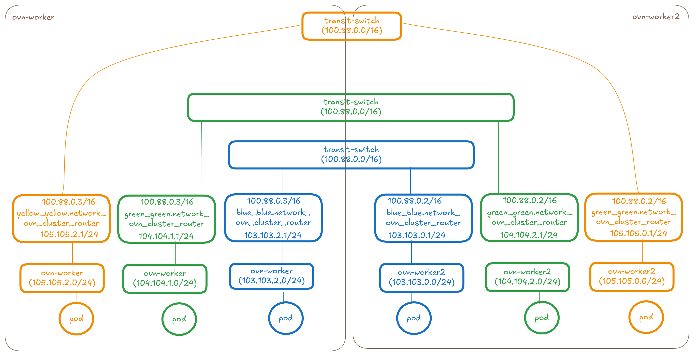

**Idea1: Add a new transit switch between the two
ovn_cluster_routers of the networks**

When the UDNConnect CR gets created selecting these three networks, the
controller will make the following changes to the topology:
* Create a distributed colored-enterprise_interconnect-switch
  (basically a transit-switch type in OVN used for
  interconnection) with the `connectSubnets` value provided on the CR
  (default=192.168.0.0/10)
* Connect the colored-enterprise_interconnect-switch to the
  ovn_cluster_router's of the blue, green and yellow networks on each
  node using remote patch ports and tunnelkeys
* Add routes towards each connected network's CIDR on the ovn_cluster_router's
  of the blue, green and yellow networks on each node.

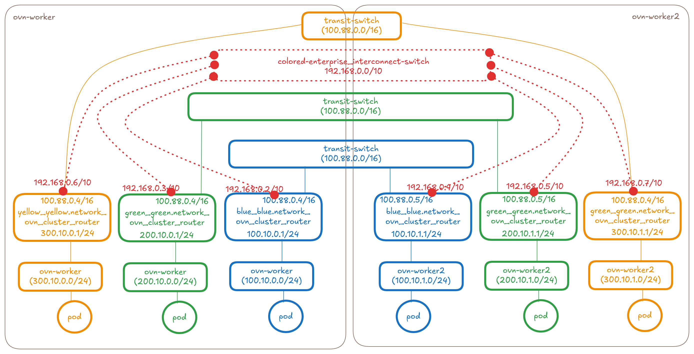

So in this idea it will be 1 router per connect API.

However this would cause an asymmetry for reply traffic:

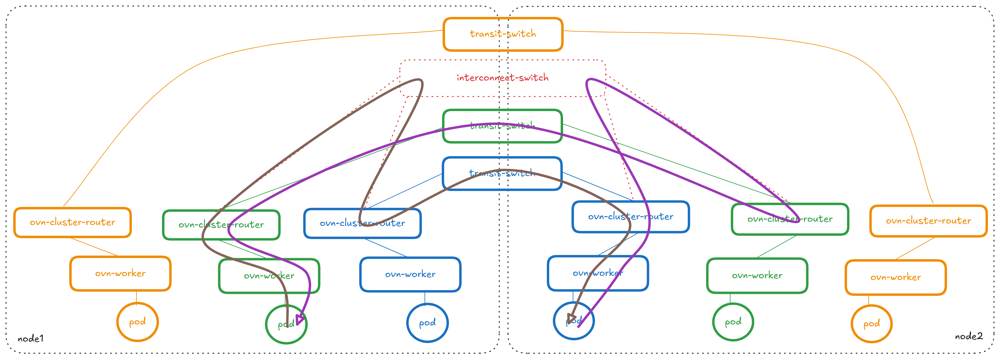

**Idea1.1 Add a new transit router between two ovn_cluster_routers of
the networks and move the node-network specific routes to the new connect router**

Ultimately Idea 1.1 is what we went with in the main proposal because
its the solution with no asymmetry. See the proposal for more
details around this.

**Idea2: Connecting the ovn_cluster_routers directly**

When the UDNConnect CR gets created selecting these two networks, the
controller will make the following changes to the topology:
* Create a logical-router-port on `blue_blue.network_ovn_cluster_router`
  with an IP assigned from `connectSubnets`.
* Create a logical-router-port on `green_green.network_ovn_cluster_router`
  with an IP assigned from `connectSubnets`.
* Create a logical-router-port on
  `yellow_yellow.network_ovn_cluster_router` with an IP assigned from
  `connectSubnets`.
These three ports will have their `peer` field set as each other to
allow for direct connectivity.

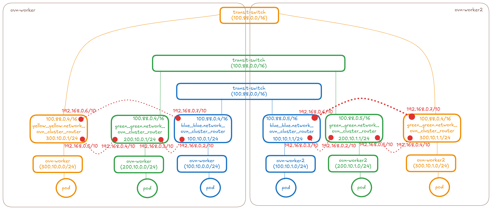

The above diagram shows what happens when all 3 networks are connected
together.

**Which idea to pick?**

| Topic       |    Idea1    |  Idea2      |
| ----------- | ----------- | ----------- |
| Number of new IPs required for connectSubnets | N(nodes)*M(networks) | N(nodes)*M(networks) |
| Requires ovnkube-controller local IPAM for per node-network router      | YES       | YES       |
| Requires node-network router IP storage design (either annotations OR nodeNetworkCRD)      | YES       | YES       |
| Requires Centralized IPAM slicing per node   | YES        | NO - here given each node can re-use the same set of IPs, there is no need for centralized slicing - this is a huge advantage |
| Requires Centralized tunnel-ids allocation   | YES        | NO - this is a huge advantage |
| Reply is Symmetric | NO - but can be made symmetric with /24 routes if required | NO - replies will be assymmetric |
| Scalability of routes | /16 will be 1 route on each router per connected network | /16 will be 1 route on each router per connected network |
| Scalability of connections | Each router get's 1 additional port and the new switch will get M (number of networks) patch ports - so totally N*M patch ports | Point-to-point connections means all ovn_cluster_router's now have N*M patch ports |
| Dataplane churn caused for connect/disconnect | More isolated changes because adding and disconnecting a network is as simple as adding/removing the port only from that network's router and the central switch. | Direct R2R Connection - so disconnecting a network means adding/removing the port from each connected router towards this network. So removing a specific tenant network will involve touching routers of other tenant's networks. |
| Network being part of more than one connectAPI | Non-transitivity is automatically taken care of because there is no connection between the indirectly connected networks. |  Non-transitivity is taken care of because of the absence of routes on the router for the indirect connection to work. Any lingering stale routes could accidentally cause connectivity. |
| Extensibility for adding features | Better because adding a transit router or switch opens up adding newer features easily like having hierarchical hubs of connections | Direct Connection might put us in a bind with regards to how much topology change we could do in future |
| Throughput | Add's an extra hop | Better because its a direct connection |
| Networking model | Aligns with a vRouter/vSwitch model that users expect | Direct R2R Connection |
| Connecting mixed type networks | Aligns with a vRouter/vSwitch model that users expect - 1 transit switch per connectAPI | Direct R2R Connection |
| Accounting for missing topologies on some nodes | This can be accommodated but we'd need to use specific /24 routes.. What about L2? | This won't work |

**Idea3: Connect the transit switches of the two UDNs together (either
using an interconnect switch/router in the middle OR directly using
remote ports)**

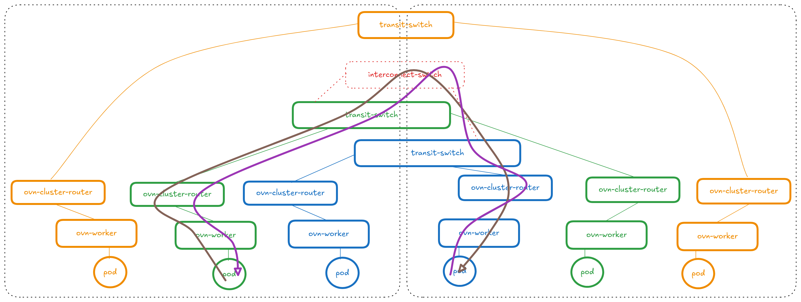

This idea was dropped because:
* Additional burden for the user and new API change: Given each transit
  router today has the same 100.88/16 subnet that is not configurable in
  UDNs on day2, if we want to connect transit switches directly together,
  we would need support day2 changes by exposing this subnet via the API
  and to place an additional constraint of either having unique
  transit-subnets in each of the UDNs that have to be connected together.
  This being an internal implementation details seems like a hard
  requirement for the user to know and configure.
* Upgrades and disruption of traffic: Users using UserDefinedNetworks
  feature in the older versions will need to make the above disruptive
  change of transit switch subnets that will lead to traffic disruption.
* Transitivity of interconnections will happen here which is not
  desired: If we now wanted to connect yellow with green, yellow would
  end up being connected to blue automatically which is not desired, in
  the case where it's directly connecting with remote ports.

**Idea3.1: Using NATs**

To avoid having to change the transit switch subnet ranges, NAT to a
particular UDN IP before sending it into the interconnect router - but I
assume we want to preserve srcIPs of the pods. This would also add
additional unwanted complexity so this idea was also not pursued.

**Connecting Layer2 type networks together**

The below diagram shows the overlay part of the OVN Topology that
OVN-Kubernetes creates for 3 UDN networks (blue, green and yellow)
across two nodes. NOTE: The topology representation is that of the new
upcoming Layer2 topology. The dotted pieces in network colors represent
the bits in design and not there yet.

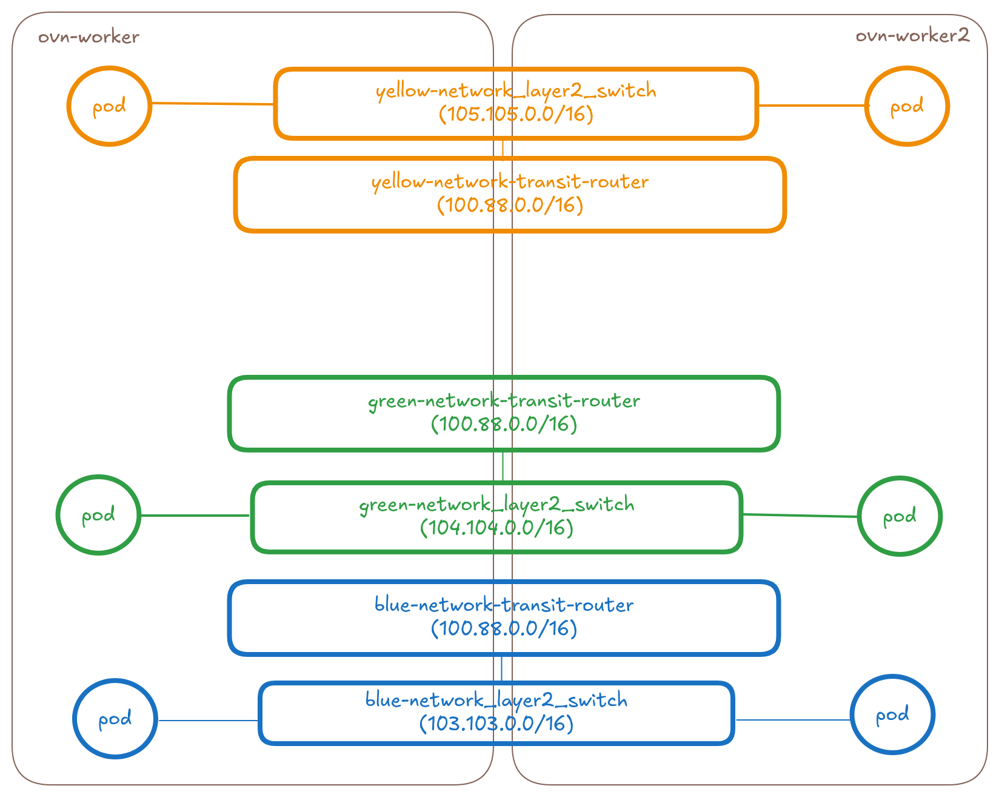

**Idea1: Add a new transit switch between the two transit routers of
the networks**

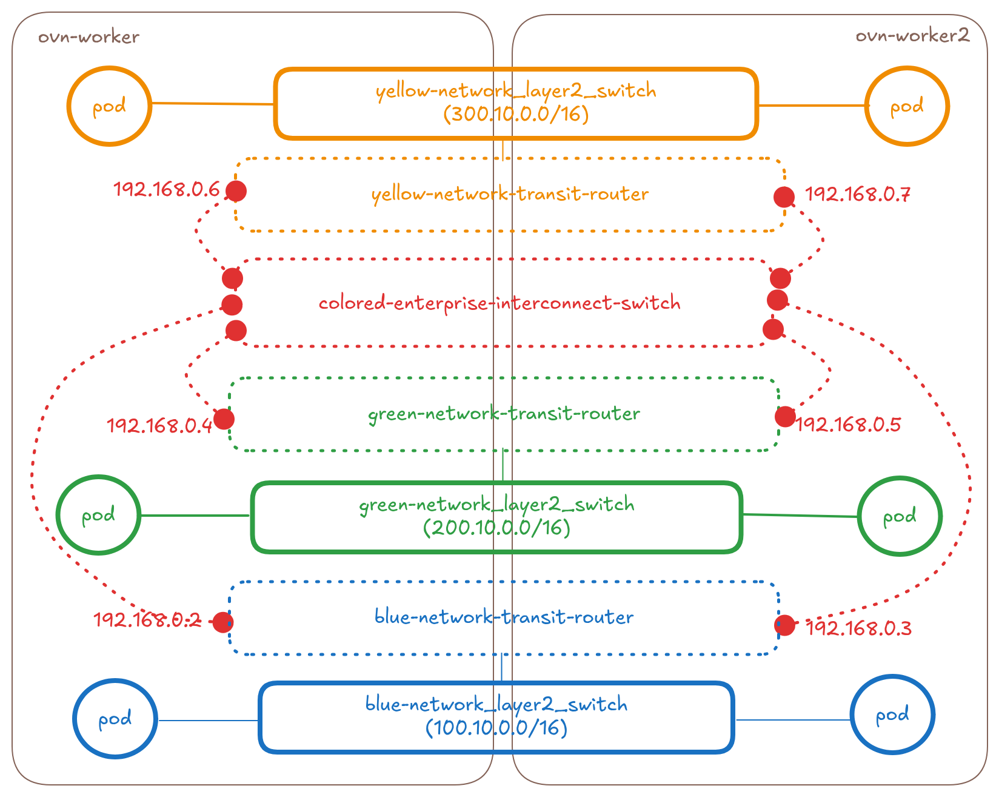

**Idea2: Connecting the ovn_cluster_routers directly**

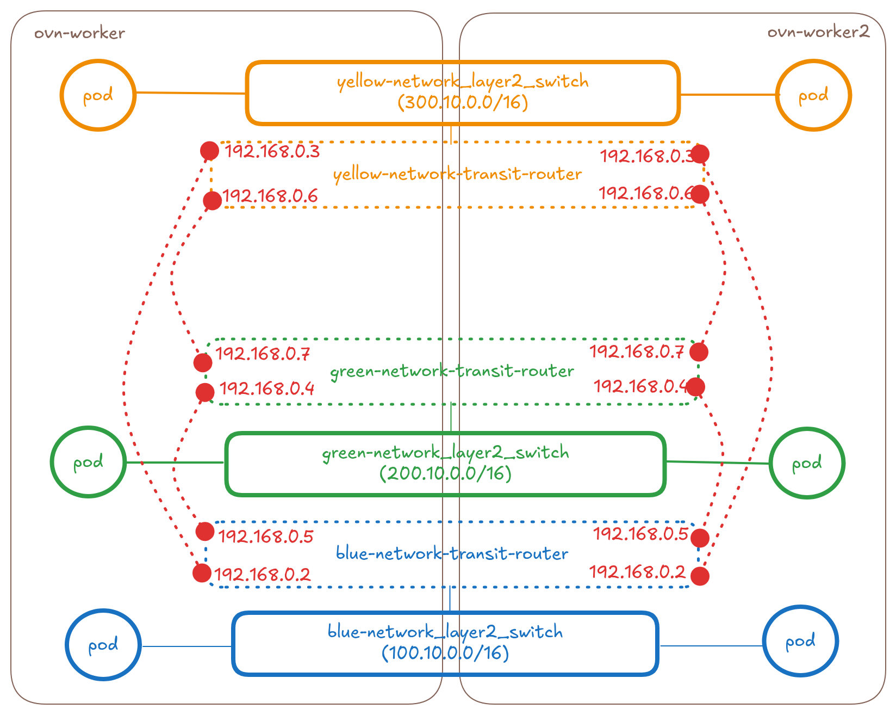

**Connecting mixed type (layer3 and/or layer2) networks together**

The below diagram shows the overlay part of the OVN Topology that
OVN-Kubernetes creates for 3 UDN networks (blue(l3), green(l3) and
yellow(l2)) across two nodes. NOTE: The yellow topology representation
is that of the new upcoming Layer2 topology. The dotted pieces in
network colors represent the bits in design and not there yet.

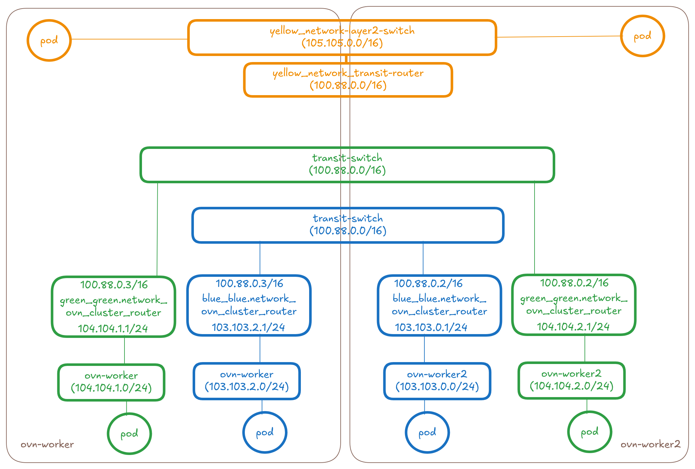

**Idea1: Add a new transit switch between the two transit routers of
the networks**

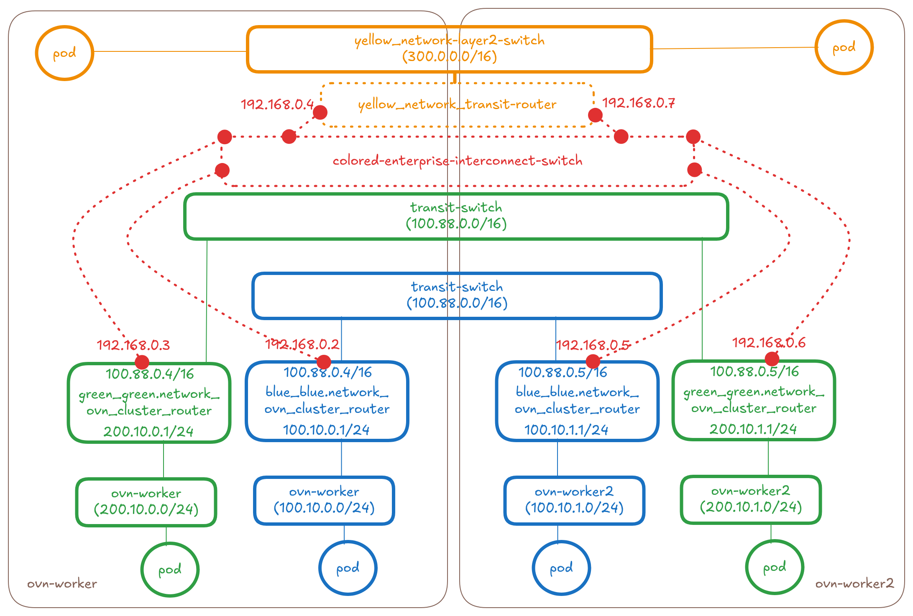

**Idea2: Connecting the ovn_cluster_routers directly**

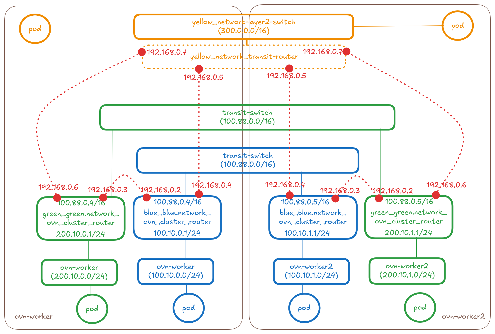
