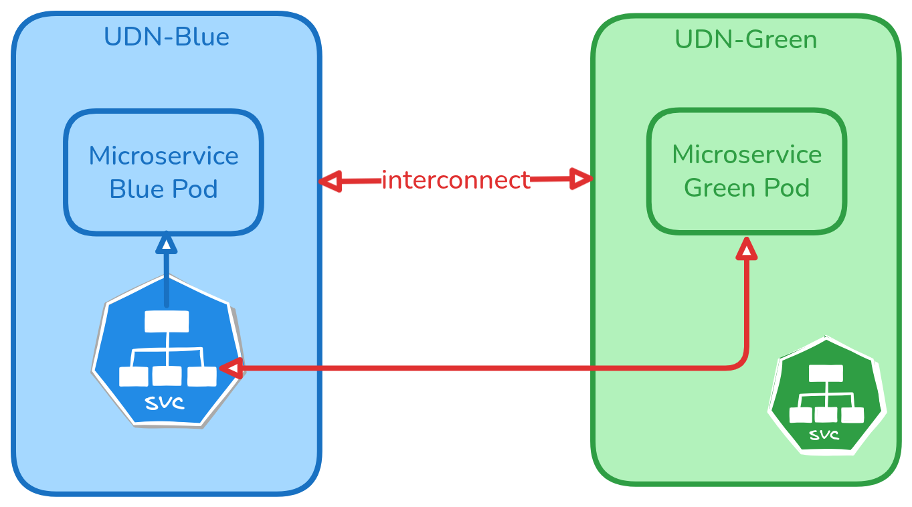
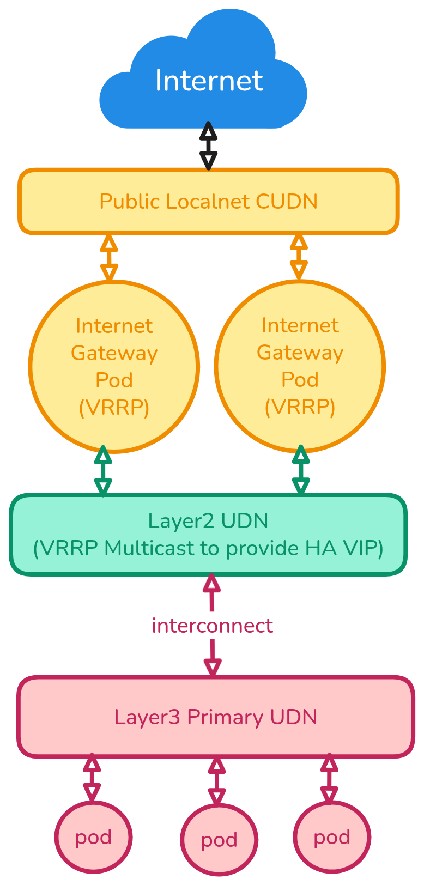
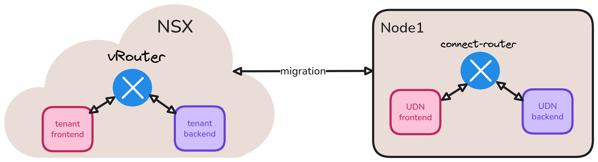
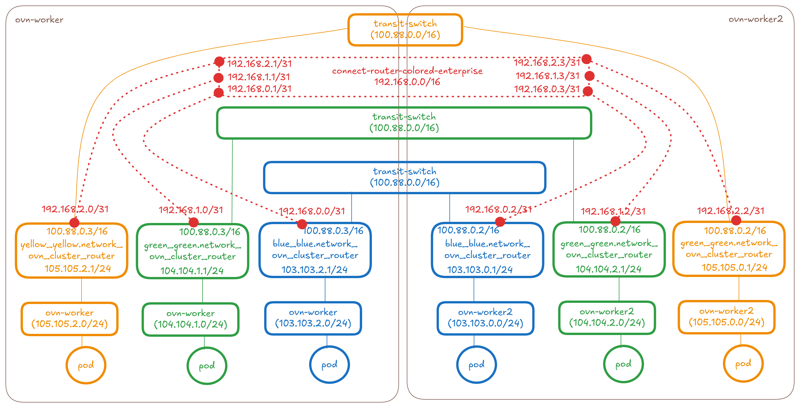
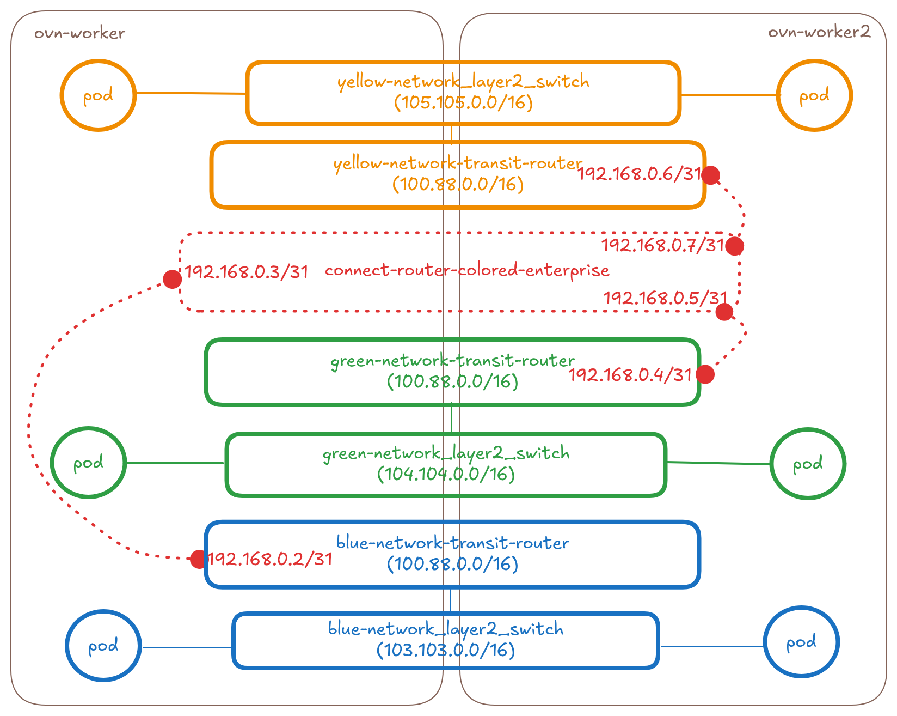
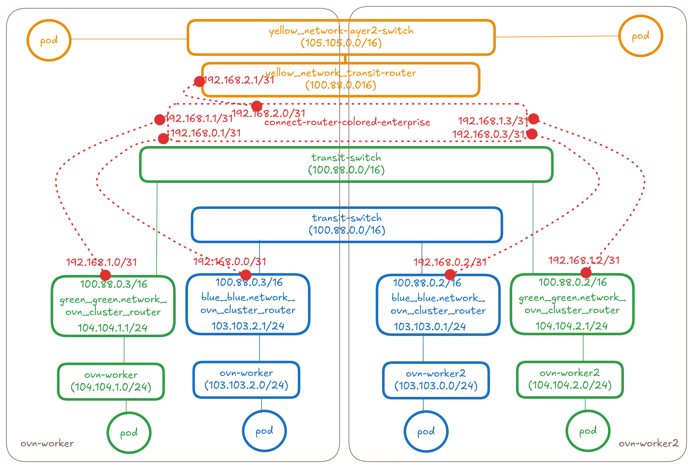
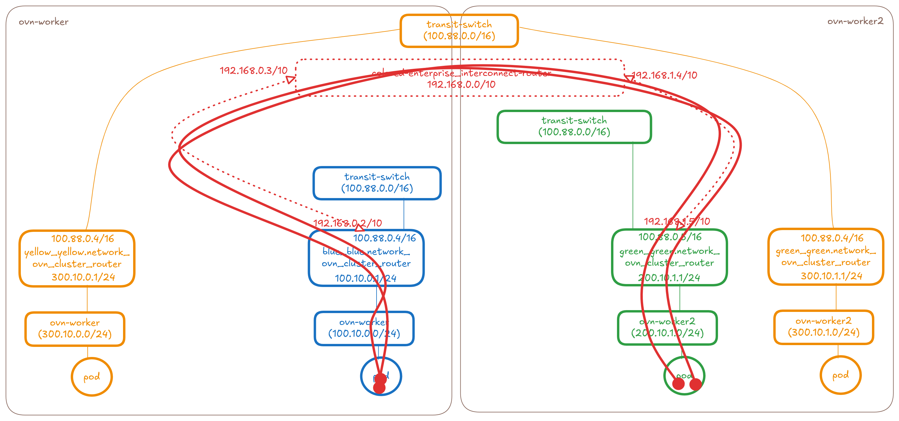

# OKEP-5224: Connecting UserDefinedNetworks

## Problem Statement

A (C)UDN is an isolated island, however, we have users that wish to connect
these islands together for multiple reasons. This OKEP proposes a solution
to connect multiple [UserDefinedNetworks] or [ClusterUserDefinedNetworks]
together, better known as "Connecting (C)UDNs". This solution will ensure
that (C)UDNs remain isolated unless an explicit request to connect them
together has been made.

[UserDefinedNetworks]: https://ovn-kubernetes.io/api-reference/userdefinednetwork-api-spec/#userdefinednetwork
[ClusterUserDefinedNetworks]: https://ovn-kubernetes.io/api-reference/userdefinednetwork-api-spec/#clusteruserdefinednetwork

### User Personas:

* `Admin`: Cluster administrator who has the highest priviledge access to
  the cluster. Admin creates the namespaces for each tenant in the cluster.
* `Tenant`: A tenant is an end user who owns the resources (workloads,
  policies, services, udns) created in one or more namespaces that are
  designated to them by admins. They cannot update or mutate the
  namespace(s) but they live within the namespace(s) boundary controlled
  using RBAC.

## Goals

* Connecting and disconnecting UDNs and CUDNs within the same cluster
  aka intra-cluster-udn-connectivity for admins (can be done as day0 or
  day2).
  * Support for connecting primary `CUDN<->UDN` across namespaces<sup>[footnote]</sup> which includes:
    * Support for connecting `CUDN<-> CUDN` (for `Admin` role only)
    * Support for connecting `CUDN<->UDN` (for `Admin` role only)
    * Support for connecting `UDN<->UDN` (for `Admin` role only)
  * Support for connecting `Layer3<->Layer3`, `Layer2<->Layer2` and
    `Layer3<->Layer2` type networks.
  * Support for only `role:Primary` type CUDN, and UDN connections.
* Support for pods, services (clusterIPs only since expectation today is
  that NodePorts and LoadBalancer type services are already exposed
  externally and hence reachable across UDNs) and network policies across
  the connected UDNs and CUDNs.
* Ensure the proposed API is expandable for also connecting and
  disconnecting UDNs or CUDNs across clusters in the future if need be.

[footnote] Food for thought: Currently, there is no need to consider
connecting UDNs within the same namespace since there is no support for
more than 1 primary-UDN in a namespace and each pod would have
connection to its primary and secondary UDNs in its namespace.
However there are use cases for connecting secondary UDNs within a namespace
to consider in the future. There is also a future enhancement on
[multiple primary UDNs] which if accepted can automatically leverage
the work happening in this enhancement.

[multiple primary UDNs]: https://github.com/ovn-kubernetes/ovn-kubernetes/pull/5255

## Future Goals

* [Tenant usecase] Connecting and disconnecting UDNs owned by the
  same tenant in same namespace or across different namespaces they
  own, in a self-serve fashion without any admin intervention. A tenant
  should be able to connnect the secondary networks that belong to them.
  This would most likely be a namespace-scoped API.
* Tenants being able to request for interconnecting their networks
  with other tenants.
    * We need to understand exact use cases for why we need tenants to
      initiate connection requests with other tenants. How will a tenant
      know other tenants that exist on the cluster? In cases like finance
      tenant wanting to use IT tenant's services, they could open a ticket
      to the admin to make that happen.
    * Regardless, the tenant API might need more RBAC considerations if we
      get such use cases
    * One other idea is to re-use the same peering semantics that
      network policies API uses where both the CRs across both the tenant
      namespaces would need to select each other to be permitted
      connectivity
* Admins being able to connect `role:Secondary` UDNs and CUDNs. The
  reason why this is a future goal is because of the following reasons:
    * For UDNs, given `SecondaryUserDefinedNetworkSelector` uses a
      combination of namespace selector and network selector, a tenant could
      change the labels on the UDN thereby causing security issues. Hence
      this type of selector support will come later where we might want to
      add a well-known label to be able to leverage selectors.
    * The secondary networks don't have the same level of topology parity
      as primary networks today. So there is no support for transit router
      or egress gateway today in `Layer2` secondary networks. Hence we would
      need to add the transit router to the secondary network `Layer2`
      topology as well which can come in the future. `Layer3` networks don't
      have the same issue as the required topology parity exists but given
      we'd need that change for `Layer2` might as well do the full secondary
      networks connect support in future.
* Connecting two UDNs with overlapping subnets won't be supported in the first
  phase. This is a valid use case scenario but harder to implement.

## Non-Goals

* Support for selecting NADs directly. Since UDNs is the future, new
  features should not be added on NADs.
* Support for this feature in non-interconnect architecture is out of scope
  since we plan to deprecate non-interconnect mode soon.
* Support for `localnet` type network connections is out of scope.
  * `localnet` type networks can be connected together using bridges
    already
  * `localnet`<->`layer2` or `localnet`<->`layer3` will not be covered here.
* Supporting Live Migration and PersistentIPs across connected UDNs.
* Connecting and disconnecting UDNs and CUDNs across two clusters
  aka inter-cluster-udn-connectivity for admins (can be done as day0 or
  day2). The plan is to be able to do this using EVPN protocol. See
  enhancement [on EVPN] to see how it is planned to be leveraged as the
  mode to connect different UDNs across clusters. But regardless, the API
  bits around how to request connectivity needs more fleshing and EVPN's
  primary use case is not about connecting UDNs across clusters.

[on EVPN]: https://github.com/ovn-kubernetes/ovn-kubernetes/pull/5255

## Introduction

OVN-Kubernetes supports two types of user-defined networks for workload
isolation:

- **UserDefinedNetworks (UDNs)**: Namespace-scoped networks that tenants can
  create to isolate workloads within a namespace.

- **ClusterUserDefinedNetworks (CUDNs)**: Cluster-scoped networks that admins
  can use to connect multiple namespaces as part of the same isolated network.

These networks can be configured with different roles:

- **`role:Primary`**: The network becomes the primary network for workloads.
  Workloads attached to a primary UDN/CUDN cannot communicate with workloads
  on other UDNs/CUDNs or the default network.

- **`role:Secondary`**: Enables multihoming scenarios, allowing pods to be
  attached to multiple networks simultaneously.

Currently, workloads on different (C)UDNs are completely isolated from each
other. However, there are scenarios where partial or full connectivity between
microservices segmented across different (C)UDNs is desirable (see use cases
section).

This OKEP defines how to implement connectivity between two or more (C)UDNs
within a single cluster. The following sections outline the design assumptions
and implementation details.

### Symmetric nature of UDN Connectivity

If UDN-A is connected to UDN-B then that means UDN-B is connected to
UDN-A. When connecting those networks together it assumes bi-directional
relationship.

### Non-Transitive nature of UDN Connectivity

If UDN-A and UDN-B are connected together and UDN-B and UDN-C are
connected together, that does not mean UDN-A is connected to UDN-C.
Reasoning is we cannot assume something indirectly - It's always best to
let the user express what they'd like to see connected.

## User-Stories/Use-Cases

### Story 1: Allowing network expansion for a tenant

**As a cluster admin**, **I want** to connect my newly created UDN-New
with an existing UDN-Old **so that** they can communicate with each other
as if being part of the same network.

Example: Existing (C)UDN has full occupancy of its address-space and
we don’t allow CIDR expansion or mutation of UDN Spec today.

The admin created UDN-Old with a defined subnet CIDR range which gets
exhausted on a 500th day, now the admin cannot mutate UDN-Old to change
or expand its subnet CIDR range. Admin creates a new UDN-New (could be
in a totally different cluster) and now wants to interconnect them
together.


### Story 2: Allowing connectivity between two tenants through exposed clusterIP services

**As a cluster admin**, **I want** to allow tenant-Green to be able to
access the clusterIP microservice exposed by tenant-Blue without direct
access to workloads behind the service.

Example: When separate services owned by different teams need to
communicate via APIs like frontend needing to access database through
the backend service.

The admin created UDN-Blue and UDN-Green that were isolated initially
but now wants to allow partial inter-tenant communication. Say data
produced by microservice blue needs to be consumed by microservice
green to do its task.



When the two networks have overlapping subnets, using service clusterIP
as a way to allow communication is valid use case.

### Story 3: Allowing connectivity between two networks with overlapping subnets through exposed clusterIP services

**As a cluster admin**, **I want** to allow tenant-Green to be able to
access the clusterIP microservice exposed by tenant-Blue even though
tenant-Green and tenant-Blue have overlapping pod subnets.

Example: IPAddress Management is hard. It is not possible to predict the
future of how all applications will communicate with one another. There is
a chance app-type-green and app-type-blue got the same pod subnets and
now they need to talk to each other. While allowing direct connection of
the two overlapping pod subnet networks is hard, a middleground is to use
clusterIPs to communicate.

### Story 4: Merging two tenants (maybe even temporarily)

**As a cluster admin**, **I want** to now connect my existing UDN-Blue
and UDN-Green **so that** they can communicate with each other as if being
part of the same network.

Example: The admin created UDN-Blue and UDN-Green that were isolated
initially but now wants to treat them as being part of the same network.
Pods cannot be rewired given they are part of two different UDNs. Say
when different teams within the same organization operate as separate
tenants but collaborate on a project requiring unrestricted communication
for a period of time and then want to disconnect from each other later.

### Story 5: Same UDN across multiple clusters must be connected by default

**As a cluster admin**, **I want** to connect my workloads which are
part of the same UDN but are in different clusters. 

Example: The user has split their workloads into multiple clusters
thereby the same UDN could be fragmented across different clusters. These
pods should be able to communicate with each like it would be if they were
on the same cluster but be isolated from other workloads.

NOTE: Cross cluster UDN connecting is not targeted in this OKEP, but is
covered here since connecting UDNs within the cluster is the first step
here.

### Story 6: Connecting mixed type networks together (Layer2 Network workloads with Layer3 Primary/Default Network)

**As a cluster admin**, **I manage** isolated tenants (a bunch of
interconnected pods) and share them with my users. Every tenant has its
own Primary Layer3 UDN to emulate its own cluster network, but isolate
it from the other tenants. Northbound/internet traffic from my tenants
is always flowing through additional gateways that I manage. Gateways
require HA support, which is done using OVN virtual Port type, which is
only supported when all parent ports are located on the same switch,
hence the UDN used by the Gateways is Layer2 (Primary).

To make tenants' traffic flow through the gateways, I need to
interconnect Primary Layer3 network with Primary Layer2 network. Here is
a diagram illustrating this ask:



### Story 7: Migration of connected tenant workloads from other platforms like NSX into OVN-Kubernetes

**As a cluster admin**, **I manage** isolated tenants on my native NSX
platform where they are already seggregated into segments using networks.
Some of these segments are connected through vRouter for mutual access.
I want to migrate such workloads into OVN-Kubernetes platform by
leveraging user defined networks. I would need connecting UDNs feature
to replicate that same workload architecture. The alternative of placing
those workloads into same UDN and using network policies will not work
because it is significant architectural change we would need to mandate
on each tenant since tenant own their networks.

Example: Tenant-frontend has access to Tenant-backend's databaseAPI
workloads on NSX through vRouter, I want to migrate both these tenants
into OVN-Kubernetes platform keeping that architecture intact.



### Story 8: [Future Use Case] Tenant self-connection without admin intervention

**As a tenant owner**, **I want** to connect my workloads which are
part of two different namespaces (networks) in the same cluster with no
admin intervention.

Example: If the same tenant owns microservices across 5 namespaces that
are 5 different networks, there should be provision for this tenant to
connect their networks together without the requirement for an admin to
intervene. The reason could be the same as the above admin user stories
but this story captures the tenant intent with no admin intervention

## Proposed Solution

This section tries to answer: How can an admin declare two (C)UDNs to
be connected?

### Config for enabling the feature

The whole feature will be behind a config flag called
`--enable-network-connect` which has to be set to true to get this
feature.

### API Details

This enhancement proposes a new CRD to allow admins to request multiple
networks to be connected together.

`ClusterNetworkConnect` CR will be cluster-scoped resource and admin-only
API that will allow admins to select multiple different networks that
need to be connected together. It will also allow specifying what level
of connectivity is expected. See the API definitions for more details.

Admins can create a `ClusterNetworkConnect` CR which signals the
controller to connect the topologies of the UDNs selected by this CR.

Sample YAML:

```yaml
apiVersion: k8s.ovn.org/v1
kind: ClusterNetworkConnect
metadata:
  name: colored-enterprise
spec:
  networkSelectors: # can match on UDNs and/or CUDNs
    - networkSelectionType: ClusterUserDefinedNetworks
      clusterUserDefinedNetworkSelector:
        networkSelector:
          matchExpressions:
          - key: kubernetes.io/metadata.name
            operator: In
            values:
            - blue-network
            - green-network
    - networkSelectionType: PrimaryUserDefinedNetworks
      primaryUserDefinedNetworkSelector:
        namespaceSelector:
          matchExpressions:
          - key: kubernetes.io/metadata.name
            operator: In
            values:
            - yellow
            - red
  connectSubnets: # can have at most 1 CIDR for each family type
  - cidr: "192.168.0.0/16"  # 65K total IPs
    networkPrefix: 24 # 255 IPs per layer3 network = ~100 possible nodes in your cluster
  - cidr: "fd01::/64"
    networkPrefix: 96
  connectivityEnabled:
    - PodNetwork
    - ClusterIPServiceNetwork
```
* `connectivityEnabled` field will ensure we can add support for enabling
  more types of features for the connected UDNs granularly in the future.
  At least one of these options must be set and validations will be added
  for which combinations of these options could/should be set together
* If `PodNetwork` is enabled then admin is asking for full
  pod2pod connectivity across UDNs
* If `ClusterIPServiceNetwork` is enabled then admin is asking for
  clusterIPs to be reachable across UDNs.
    * If this flag is set but `PodNetwork` is not set, then
      it means users only want partial connectivity through services and
      not full mesh pod connectivity.
* `connectSubnets` field is used to take a configurable subnet from the end
  user that will be used to connect the different networks together. The
  slice needs to be big enough to accommodate an IP per network per node
  for layer3 network connectivity. So if there are M nodes in your cluster
  and N_L3 networks you should have 2*(N_L3×M) IPs for allocation in this slice.
  The `networkPrefix` contains the prefix length allocated for each
  connected layer3 network. From this pool each node get's a `/31` or `/127` point to
  point network for actual topology connectivity.
  To connect layer2 networks we don't need per node-network slices, we just
  need one `/31` or `127` slice per network.
  ConnectSubnets value is expected to be configured uniquely across multiple `ClusterNetworkConnect`
  CRs that select the same network i.e. If a given network is selected as part
  of more than 1 ClusterNetworkConnect API, each of those ClusterNetworkConnect
  APIs must have a unique connect subnet. If a user accidentally configures overlapping values,
  we must have a status check to block and report this in the status. See
  status validation section for more details.
  ConnectSubnets field cannot be mutated to keep things simple in the first
  iteration/implementation of this enhancement. Can be revisited in future.

#### API field details and CEL Validations

API fields are described in detail below along with field validations:

```go
// ClusterNetworkConnect enables connecting multiple User Defined Networks
// or Cluster User Defined Networks together.
//
// +genclient
// +genclient:nonNamespaced
// +k8s:openapi-gen=true
// +k8s:deepcopy-gen:interfaces=k8s.io/apimachinery/pkg/runtime.Object
// +kubebuilder:resource:path=clusternetworkconnects,scope=Cluster,shortName=cnc,singular=clusternetworkconnect
// +kubebuilder:object:root=true
// +kubebuilder:subresource:status
// +kubebuilder:printcolumn:name="Age",type="date",JSONPath=".metadata.creationTimestamp"
// +kubebuilder:printcolumn:name="Status",type=string,JSONPath=".status.status"
type ClusterNetworkConnect struct {
    metav1.TypeMeta   `json:",inline"`
    metav1.ObjectMeta `json:"metadata,omitempty"`

    // +kubebuilder:validation:Required
    // +required
    Spec ClusterNetworkConnectSpec `json:"spec"`

    // +optional
    Status ClusterNetworkConnectStatus `json:"status,omitempty"`
}

// ClusterNetworkConnectSpec defines the desired state of ClusterNetworkConnect.
// +kubebuilder:validation:XValidation:rule="!self.networkSelectors.exists(i, i.networkSelectionType != 'ClusterUserDefinedNetworks' && i.networkSelectionType != 'PrimaryUserDefinedNetworks')",message="Only ClusterUserDefinedNetworks or PrimaryUserDefinedNetworks can be selected"
type ClusterNetworkConnectSpec struct {
    // networkSelectors selects the networks to be connected together.
    // This can match User Defined Networks (UDNs) and/or Cluster User Defined Networks (CUDNs).
    // Only ClusterUserDefinedNetworkSelector and PrimaryUserDefinedNetworkSelector can be selected.
    //
    // +kubebuilder:validation:Required
    // +required
    NetworkSelectors types.NetworkSelectors `json:"networkSelectors"`

    // connectSubnets specifies the subnets used for interconnecting the selected networks.
    // This creates a shared subnet space that connected networks can use to communicate.
    // Can have at most 1 CIDR for each IP family (IPv4 and IPv6).
    // Must not overlap with:
    //  any of the pod subnets used by the selected networks.
    //  any of the transit subnets used by the selected networks.
    //  any of the service CIDR range used in the cluster.
    //  any of the join subnet of the selected networks to be connected.
    //  any of the masquerade subnet range used in the cluster.
    //  any of the node subnets for choosen by the platform.
    //  any of other connect subnets for other ClusterNetworkConnects that might be selecting same networks.
    //
    // Does not have a default value for the above reason so
    // that user takes care in setting non-overlapping subnets.
    // Cannot be mutated once set.
    // +kubebuilder:validation:Required
    // +kubebuilder:validation:MinItems=1
    // +kubebuilder:validation:MaxItems=2
    // +kubebuilder:validation:XValidation:rule="self == oldSelf", message="connectSubnets is immutable"
    // +required
    // +kubebuilder:validation:XValidation:rule="size(self) != 2 || !isCIDR(self[0].cidr) || !isCIDR(self[1].cidr) || cidr(self[0].cidr).ip().family() != cidr(self[1].cidr).ip().family()", message="When 2 CIDRs are set, they must be from different IP families"
    ConnectSubnets []ConnectSubnet `json:"connectSubnets"`

    // connectivityEnabled specifies which connectivity types should be enabled for the connected networks.
    //
    // +kubebuilder:validation:Required
    // +kubebuilder:validation:MinItems=1
    // +kubebuilder:validation:MaxItems=2
    // +kubebuilder:validation:XValidation:rule="self.all(x, self.exists_one(y, x == y))",message="connectivityEnabled cannot contain duplicate values"
    ConnectivityEnabled []ConnectivityType `json:"connectivityEnabled"`
}

// +kubebuilder:validation:XValidation:rule="isCIDR(self) && cidr(self) == cidr(self).masked()", message="CIDR must be a valid network address"
// +kubebuilder:validation:MaxLength=43
type CIDR string

// +kubebuilder:validation:XValidation:rule="!has(self.networkPrefix) || !isCIDR(self.cidr) || self.networkPrefix > cidr(self.cidr).prefixLength()", message="networkPrefix must be smaller than CIDR subnet"
// +kubebuilder:validation:XValidation:rule="!has(self.networkPrefix) || !isCIDR(self.cidr) || (cidr(self.cidr).ip().family() != 4 || self.networkPrefix < 32)", message="networkPrefix must < 32 for ipv4 CIDR"
type ConnectSubnet struct {
  // CIDR specifies ConnectSubnet, which is split into smaller subnets for every connected network.
  // This CIDR should be containing 2*((Number of L3 networks*Max Number of Nodes)+Number of L2 networks) IPs.
  // Example: cidr= "192.168.0.0/16", networkPrefix= 24 means that you can connect 256 Layer3 networks OR
  // 255 Layer3 networks and 128 Layer2 networks
  //
  // CIDR also restricts the maximum number of networks that can be connected together
  // based on what CIDR range is picked. So choosing a large enough CIDR for future use cases
  // is important.
  // +required
  CIDR CIDR `json:"cidr"`

  // networkPrefix specifies the prefix length for every connected network.
  // This prefix length should be equal to or longer than the length of the CIDR prefix.
  //
  // For example, if the CIDR is 10.0.0.0/8 and the networkPrefix is 24,
  // then the connect subnet for each connected layer3 network will be 10.0.0.0/24, 10.0.1.0/24, 10.0.2.0/24 etc.
  // For each connected layer2 network we will allocate a /networkPrefix range
  // that is then used to allocate /31 and /127 slices for each layer2 network.
  // A good practice is to set this to a value that ensures it contains more
  // than twice the number of maximum nodes planned to be deployed in the cluster
  // and how frequently nodes are created and destroyed.
  // To be safe, better to set this to a value that's 4 times the maximum nodes planned
  // to be deployed in the cluster.
  // Example - required values;
  // if you plan to deploy 10 nodes, minimum required networkPrefix is /27 (20+ IPs)
  // if you plan to deploy 100 nodes, minimum required networkPrefix is /24 (200+ IPs)
  // if you plan to deploy 1000 nodes, minimum required networkPrefix is /21 (2000+ IPs)
  // if you plan to deploy 5000 nodes, minimum required networkPrefix is /18 (10000+ IPs)
  //
  // However to be safe and in case nodes are created and destroyed at fast rate,
  // set it to 4 times max nodes of the cluster:
  // if you plan to deploy 10 nodes, set the networkPrefix to /26 (40+ IPs)
  // if you plan to deploy 100 nodes, set the networkPrefix to /23 (400+ IPs)
  // if you plan to deploy 1000 nodes, set the networkPrefix to /20 (4000+ IPs)
  // if you plan to deploy 5000 nodes, set the networkPrefix to /17 (20000+ IPs)
  // This field restricts the maximum number of nodes that can be deployed in the cluster
  // and hence its good to plan this value carefully along with the CIDR.
  //
  // +kubebuilder:validation:Minimum=1
  // +kubebuilder:validation:Maximum=127
  // +required
  NetworkPrefix int32 `json:"networkPrefix"`
}

// ConnectivityType represents the different connectivity types that can be enabled for connected networks.
// +kubebuilder:validation:Enum=PodNetwork;ClusterIPServiceNetwork
type ConnectivityType string

const (
    // PodNetwork enables direct pod-to-pod communication across connected networks.
    PodNetwork ConnectivityType = "PodNetwork"

    // ClusterIPServiceNetwork enables ClusterIP service access across connected networks.
    ClusterIPServiceNetwork ConnectivityType = "ClusterIPServiceNetwork"
)

// StatusType represents the status of a ClusterNetworkConnect.
// +kubebuilder:validation:Enum=Success;Failure
type StatusType string

const (
    // Success indicates that the ClusterNetworkConnect has been successfully applied.
    Success StatusType = "Success"

    // Failure indicates that the ClusterNetworkConnect has failed to be applied.
    Failure StatusType = "Failure"
)

// ClusterNetworkConnectStatus defines the observed state of ClusterNetworkConnect.
type ClusterNetworkConnectStatus struct {
    // status is a concise indication of whether the ClusterNetworkConnect
    // resource is applied with success.
    // +kubebuilder:validation:Optional
    Status StatusType `json:"status,omitempty"`

    // conditions is an array of condition objects indicating details about
    // status of ClusterNetworkConnect object.
    // +patchMergeKey=type
    // +patchStrategy=merge
    // +listType=map
    // +listMapKey=type
    Conditions []metav1.Condition `json:"conditions,omitempty"`
}

// ClusterNetworkConnectList contains a list of ClusterNetworkConnect.
// +kubebuilder:object:root=true
// +k8s:deepcopy-gen:interfaces=k8s.io/apimachinery/pkg/runtime.Object
type ClusterNetworkConnectList struct {
    metav1.TypeMeta `json:",inline"`
    metav1.ListMeta `json:"metadata,omitempty"`
    Items           []ClusterNetworkConnect `json:"items"`
}
```

#### Validation Field Checks

In the implementation, after parsing the `ClusterNetworkConnect`
object, we must ensure the following:

* `connectSubnets` must not conflict with:
  1) pod subnets of the selected networks to be connected
  2) transit subnets of the selected networks to be connected
  3) service CIDR range used in the cluster
  4) join subnet of the selected networks to be connected
  5) masquerade subnet range used in the cluster
  6) node subnets for choosen by the platform. This is the responsibility
     of the user and we won't provide validation for node subnets since
     fetching that value could vary from platform to platform. We will
     cover this in the docs.
  If it does, we need to provide validation and feedback to the
  end user for the conflict. 
* Since connection of overlapping pod subnet networks is not
  allowed in first phase, we must detect the collision and report
  the error back to the user via the status
* Expectation is for users to initiate the connection of networks of same
  family types together. If a singlestack IPV6 UDN is tried to be connected
  to singlestack IPV4 UDN, then we will have to validate this as a misconfiguration
  and have a status error for this.

#### Valid ways of Connecting/Selecting/Disconnecting UDNs

* A network could be selected as part of more than one network connnect, so
  what is the expectation when two Connect APIs are designed that select the
  exact same set of networks? How do we control validation of such scenarios?
  Example, ClusterNetworkConnect-A selects blue and green networks and
  ClusterNetworkConnect-B selects blue and red networks:
    * In such scenarios the same network's router is going to be connected to
      more than one `connect-router`. So blue network will be connected
      to both `connect-router-A` and `connect-router-B`.
    * However given non-transitive relation and absence of connecting routes,
      indirect connection of green and red will not happen.
    * We must add validation in code to ensure if more than 1
      ClusterNetworkConnect API selects the same network, then they must
      have non-overlapping `connectSubnets` field configured. If there is a
      conflict, we must emit an event on the connectAPI and fail to create
      the plumbing for the subsequent case. OVN does not handle blocking
      the creation of two ports on the same router with same subnets.
      So if that happens, it will cause wrong routing and hence OVN-Kubernetes
      must detect this conflict.
* A ClusterNetworkConnect could be selecting a subset of networks already selected by
  another ClusterNetworkConnect API. What is the expectation in this case?
  Example,
  ClusterNetworkConnect-A selects blue, green, red and yellow networks and
  ClusterNetworkConnect-B selects blue and green networks.
    * This is going to be considered a user-configuration error oversight.
      This same issue also exists for other APIs like `RouteAdvertisement`
      (wonder what we do there?).
    * We expect the rules to be additively implemented but in this case, we
      won't optimize for anything since its a hard problem to solve. We will
      end up create duplicate connect networks unnecessarily and it will be
      an ECMP routing situation on which connect network will be used to
      reach the other side.
    * We will not provide any validation around selectors across all connect
      APIs to rule out overlap except we will ensure the `connectSubnets` is
      non-overlapping across all connectAPIs that select a given network
      which is same as the first case.
* Selecting a network can be done as a day0 or day2 operation. So label changes
  to existing networks, new networks added and deleted need to be watched
  in order to connect and disconnect networks on the fly based on user
  configuration changes.

#### StatusConditions

The `ClusterNetworkConnect` status will include a `status` field
with a concise indication and a `conditions` array with detailed
condition objects. The controller will update these conditions based
on validation results.

**Condition Types**

* The `Accepted` type condition will be done from the cluster-manager
  which indicates whether the validation checks passed.
* The `Ready-In-Zone-<nodename>` type condition will be done from
  each node's ovnkube-controller which indicates if all the corresponding
  OVN objects were created correctly.
* Based on whether `status` of the above two types of conditions is
  `True` or `False`, the final string `status` will be marked `Success` or
  `Failure`

**Valid Scenario**

When a `ClusterNetworkConnect` resource is successfully applied,
the following conditions indicate healthy states:

```yaml
status:
  status: "Success"
  conditions:
  - type: "Accepted"
    status: "True"
    reason: "ValidationSucceeded"
    message: "All validation checks passed successfully"
    lastTransitionTime: "2023-10-01T09:59:00Z"
  - type: "Ready-In-Zone-ovn-worker"
    status: "True"
    reason: "OVNSetupSucceeded"
    message: "Connect router and all ports created successfully"
    lastTransitionTime: "2023-10-01T10:00:00Z"
  - type: "Ready-In-Zone-ovn-worker2"
    status: "True"
    reason: "OVNSetupSucceeded"
    message: "Connect router and all ports created successfully"
    lastTransitionTime: "2023-10-01T10:00:00Z"
```

**Invalid Scenarios**

When validation fails or errors occur, the following error conditions will be reported:

**Cluster-Manager Validation Errors:**
```yaml
status:
  status: "Failure"
  conditions:
  - type: "Accepted"
    status: "False"
    reason: "ConnectSubnetExhausted"
    message: "Insufficient IP addresses in connect subnet 192.168.0.0/16.
    lastTransitionTime: "2023-10-01T10:00:00Z"
```

```yaml
status:
  status: "Failure"
  conditions:
  - type: "Accepted"
    status: "False"
    reason: "OverlappingNetworkSubnets"
    message: "Cannot connect networks 'blue-network' and 'green-network': overlapping
    pod subnets 10.1.0.0/16 detected."
    lastTransitionTime: "2023-10-01T10:00:00Z"
```

```yaml
status:
  status: "Failure"
  conditions:
  - type: "Accepted"
    status: "False"
    reason: "ConnectSubnetConflict"
    message: "Connect subnet 192.168.0.0/16 conflicts with pod subnet 192.168.1.0/24
    of network 'blue-network'"
    lastTransitionTime: "2023-10-01T10:00:00Z"
```

```yaml
status:
  status: "Failure"
  conditions:
  - type: "Accepted"
    status: "False"
    reason: "ConnectSubnetOverlap"
    message: "Connect subnet 192.168.0.0/16 overlaps with ClusterNetworkConnect
    'enterprise-connect' which also selects network 'blue-network'.
    Each ClusterNetworkConnect selecting the same network must use non-overlapping
    connect subnets"
    lastTransitionTime: "2023-10-01T10:00:00Z"
```

```yaml
status:
  status: "Failure"
  conditions:
  - type: "Accepted"
    status: "False"
    reason: "IPFamilyMismatch"
    message: "Cannot connect single-stack IPv4 network 'ipv4-network' with
    single-stack IPv6 network 'ipv6-network'. Networks must use the same IP family"
    lastTransitionTime: "2023-10-01T10:00:00Z"
```

```yaml
status:
  status: "Failure"
  conditions:
  - type: "Accepted"
    status: "False"
    reason: "InsufficientNetworks"
    message: "Only 1 network selected, minimum 2 networks required for connection"
    lastTransitionTime: "2023-10-01T10:00:00Z"
```

```yaml
status:
  status: "Failure"
  conditions:
  - type: "Accepted"
    status: "False"
    reason: "UnsupportedNetworkType"
    message: "Network 'blue-network' has role 'Secondary'. Only 'Primary' role networks are supported"
    lastTransitionTime: "2023-10-01T10:00:00Z"
```

```yaml
status:
  status: "Failure"
  conditions:
  - type: "Accepted"
    status: "False"
    reason: "UnsupportedNetworkType"
    message: "Network 'localnet-network' has type 'localnet'. Localnet networks are not supported"
    lastTransitionTime: "2023-10-01T10:00:00Z"
```

```yaml
status:
  status: "Failure"
  conditions:
  - type: "Accepted"
    status: "False"
    reason: "UnsupportedNetworkType"
    message: "Network connect feature is not supported when overlay tunneling is disabled"
    lastTransitionTime: "2023-10-01T10:00:00Z"
```

**OVN Setup Failures: (Per Zone)**
```yaml
status:
  status: "Failure"
  conditions:
  - type: "Accepted"
    status: "True"
    reason: "ValidationSucceeded"
    message: "All validation checks passed successfully"
    lastTransitionTime: "2023-10-01T09:59:00Z"
  - type: "Ready-In-Zone-ovn-worker"
    status: "False"
    reason: "OVNSetupFailed"
    message: "Failed to create connect router ports: tunnel key allocation failed"
    lastTransitionTime: "2023-10-01T10:00:00Z"
  - type: "Ready-In-Zone-ovn-worker2"
    status: "False"
    reason: "OVNSetupFailed"
    message: "Failed to install routing policies for network 'blue-network'"
    lastTransitionTime: "2023-10-01T10:00:00Z"
```

**Accepted Condition Reasons (from cluster-manager):**

- **`ValidationSucceeded`** - All validation checks passed successfully
- **`ConnectSubnetExhausted`** - Not enough IPs in connect subnet for all network-node combinations
- **`OverlappingNetworkSubnets`** - Selected networks have overlapping pod subnets (not supported)
- **`ConnectSubnetConflict`** - Connect subnet conflicts with existing network subnets, service CIDR, etc.
- **`ConnectSubnetOverlap`** - Connect subnet overlaps with another ClusterNetworkConnect selecting the same network
- **`IPFamilyMismatch`** - Attempting to connect networks with different IP families
- **`InsufficientNetworks`** - Less than 2 networks selected for connection
- **`UnsupportedNetworkType`** - Network has unsupported role (Secondary) or type (localnet) or no-overlay mode enabled

**Ready-In-Zone Condition Reasons (from ovnkube-controller):**

- **`OVNSetupSucceeded`** - OVN topology setup completed successfully
- **`OVNSetupFailed`** - OVN topology setup failed

NOTE: The actual messages and name types may vary in implementation
subject to reviews. These snippets only represent some potential examples.

### Implementation Details

The implementation details of the feature are covered in various
sub sections below:

#### Network Topology

This section covers the topology changes that will be introduced to
connect networks together.  NOTE: Besides the finalized
proposal we have below for the topology change, there were other ideas
which were discarded and listed in the alternatives section.

**Connecting Layer3 type networks together**

The below diagram shows the overlay part of the OVN Topology that
OVN-Kubernetes creates for 3 UDN networks (blue, green and yellow)
across two nodes.


Let's take a look at how we can connect a blue network, green network
and yellow network at the OVN layer.

**Add a new transit router between the ovn_cluster_routers of the
networks**

When the `ClusterNetworkConnect` CR gets created selecting these three
networks, the controller will make the following changes to the topology:
* Create a distributed `connect-router-colored-enterprise` (basically
  a transit-router type in OVN used for interconnection)
* Connect the `connect-router-colored-enterprise` to the
  `ovn_cluster_router`'s of the blue, green and yellow networks on each
  node using peer ports and tunnelkeys. We will have a total of N*M
  links where N is the number of networks and M is the number of nodes.
* The port's will have IPs allocated from within the `connectSubnets`
  value provided on the CR. For connecting N networks on M nodes we
  would need 2×(N×M) IPs from the `connectSubnets`. See the controller
  design section for more details.



So in this proposal it will be 1 new transit router per
`ClusterNetworkConnect` API.
NOTE: Please keep reading to the **Pods** and **Services** sections for
details around routes, policies and other OVN object changes.

In the OVN database of ovn-worker node, this new router looks
like this:

```yaml
sh-5.2# ovn-nbctl show connect-router-colored-enterprise
router bb053a19-99d5-4af8-a8e9-ebcab52908d8 (connect-router-colored-enterprise)
    port colored-enterprise-to-blue_blue-network-ovn-control-plane
        mac: "0a:58:c0:80:00:01"
        ipv6-lla: "fe80::858:c0ff:fe80:1"
        networks: ["192.168.0.1/31"]
    port colored-enterprise-to-yellow_yellow-network-ovn-control-plane
        mac: "0a:58:c0:80:00:03"
        ipv6-lla: "fe80::858:c0ff:fe80:3"
        networks: ["192.168.2.3/31"]
    port colored-enterprise-to-green_green-network-ovn-control-plane
        mac: "0a:58:c0:80:00:05"
        ipv6-lla: "fe80::858:c0ff:fe80:5"
        networks: ["192.168.1.5/31"]
    port colored-enterprise-to-green_green-network-ovn-worker2
        mac: "0a:58:c0:80:00:11"
        ipv6-lla: "fe80::858:c0ff:fe80:11"
        networks: ["192.168.1.17/31"]
    port colored-enterprise-to-blue_blue-network-ovn-worker
        mac: "0a:58:c0:80:00:07"
        ipv6-lla: "fe80::858:c0ff:fe80:7"
        networks: ["192.168.0.7/31"]
    port colored-enterprise-to-blue_blue-network-ovn-worker2
        mac: "0a:58:c0:80:00:0d"
        ipv6-lla: "fe80::858:c0ff:fe80:d"
        networks: ["192.168.0.13/31"]
    port colored-enterprise-to-yellow_yellow-network-ovn-worker2
        mac: "0a:58:c0:80:00:0f"
        ipv6-lla: "fe80::858:c0ff:fe80:f"
        networks: ["192.168.2.15/31"]
    port colored-enterprise-to-yellow_yellow-network-ovn-worker
        mac: "0a:58:c0:80:00:09"
        ipv6-lla: "fe80::858:c0ff:fe80:9"
        networks: ["192.168.2.9/31"]
    port colored-enterprise-to-green_green-network-ovn-worker
        mac: "0a:58:c0:80:00:0b"
        ipv6-lla: "fe80::858:c0ff:fe80:b"
        networks: ["192.168.1.11/31"]
```

The new ports added to the `ovn_cluster_router`'s of the 3 networks:

```yaml
sh-5.2# ovn-nbctl show yellow_yellow.network_ovn_cluster_router
router 01e9f2fc-e351-4c7a-a51a-ba5f2b2fb099 (yellow_yellow.network_ovn_cluster_router)
    port yellow_yellow-network-ovn-worker-to-colored-enterprise
        mac: "0a:58:c0:80:02:08"
        ipv6-lla: "fe80::858:c0ff:fe80:8"
        networks: ["192.168.2.8/31"]
---
_uuid               : c78b105c-d2ee-4ba9-bb25-ec94dada0d15
dhcp_relay          : []
enabled             : []
external_ids        : {}
gateway_chassis     : []
ha_chassis_group    : []
ipv6_prefix         : []
ipv6_ra_configs     : {}
mac                 : "0a:58:c0:80:02:08"
name                : yellow_yellow-network-ovn-worker-to-colored-enterprise
networks            : ["192.168.2.8/31"]
options             : {}
peer                : colored-enterprise-to-yellow_yellow-network-ovn-worker --> connects to connect-router
status              : {}
---
sh-5.2# ovn-nbctl show blue_blue.network_ovn_cluster_router
router 13b24c4d-f3c3-4811-98a9-98cc996be0d4 (blue_blue.network_ovn_cluster_router)
    port blue_blue-network-ovn-worker-to-colored-enterprise
        mac: "0a:58:c0:80:00:06"
        ipv6-lla: "fe80::858:c0ff:fe80:6"
        networks: ["192.168.0.6/31"]
---
_uuid               : 24aabdb9-0b37-4332-965d-5d09ae0694a8
dhcp_relay          : []
enabled             : []
external_ids        : {}
gateway_chassis     : []
ha_chassis_group    : []
ipv6_prefix         : []
ipv6_ra_configs     : {}
mac                 : "0a:58:c0:80:00:06"
name                : blue_blue-network-ovn-worker-to-colored-enterprise
networks            : ["192.168.0.6/31"]
options             : {}
peer                : colored-enterprise-to-blue_blue-network-ovn-worker --> connects to connect-router
status              : {}
---
sh-5.2# ovn-nbctl show green_green.network_ovn_cluster_router
router 15532710-213f-4bee-8bc1-9d500a6bc5a9 (green_green.network_ovn_cluster_router)
    port green_green-network-ovn-worker-to-colored-enterprise
        mac: "0a:58:c0:80:01:0a"
        ipv6-lla: "fe80::858:c0ff:fe80:a"
        networks: ["192.168.1.10/31"]
---
_uuid               : 99c4bff1-17c9-4d17-826c-c069f2a3cb6b
dhcp_relay          : []
enabled             : []
external_ids        : {}
gateway_chassis     : []
ha_chassis_group    : []
ipv6_prefix         : []
ipv6_ra_configs     : {}
mac                 : "0a:58:c0:80:01:0a"
name                : green_green-network-ovn-worker-to-colored-enterprise
networks            : ["192.168.1.10/31"]
options             : {}
peer                : colored-enterprise-to-green_green-network-ovn-worker --> connects to connect-router
status              : {}
```

**Connecting Layer2 type networks together**

The below diagram shows the overlay part of the OVN Topology that
OVN-Kubernetes creates for 3 UDN networks (blue, green and yellow)
across two nodes. NOTE: The topology representation is that of the new
upcoming Layer2 topology. See enhancement on [new Layer2 topology]
for more details on the new design.


**Add a new transit router between the transit routers of the networks**

When the `ClusterNetworkConnect` CR gets created selecting these three
networks, the controller will make the following changes to the topology:
* Create a distributed `connect-router-colored-enterprise` (basically a
  transit-router type in OVN used for interconnection). However note that
  for pure layer2 network connections, we don't actually need a transit
  router since there won't be any remote ports we need to create for
  layer2 unlike in case of layer3. When we go from a pure layer2 to mixed
  type connections we will need the remote ports (see the next section).
* Connect the `connect-router-colored-enterprise` to the `transit-router`’s
  of the blue, green and yellow networks using patch ports and
  tunnelkeys. In case of Layer2, we will have N links where N is the
  number of networks.
* The port's will have IPs allocated from within the `connectSubnets`
  value provided on the CR. For connecting N networks on M nodes we
  would need 2×N IPs from the `connectSubnets`. See the controller
  design section for more details.



**Connecting mixed type (layer3 and/or layer2) networks together**

The below diagram shows the overlay part of the OVN Topology that OVN-Kubernetes
creates for 3 UDN networks (blue(l3), green(l3) and yellow(l2)) across two
nodes.


**Add a new transit router between the ovn_cluster_router's and transit-routers of the networks**

When the `ClusterNetworkConnect` CR gets created selecting these three
networks, the controller will make the following changes to the topology:
* Create a distributed `connect-router-colored-enterprise` (basically
  a transit-router type in OVN used for interconnection). Remote ports
  will be used only in layer3 type interconnection and not in layer2.
* Connect the `connect-router-colored-enterprise` to the
  `transit-router` of the yellow network and `ovn_cluster_router`'s of the
  blue and green networks on each node using patch ports and tunnelkeys.
  In case of mixed connection type, we will have N_L3×M+N_L2 links where
  N_L3 is the number of Layer3 networks and N_L2 is the number of Layer2
  networks
* The port's will have IPs allocated from within the `connectSubnets`
  value provided on the CR. For connecting N_L3 and N_L2 networks on M nodes
  we would need 2×(N_L3×M+N_L2) IPs from the `connectSubnets`. See the
  controller design section for more details.



#### Pods

In order to ensure pods in different connected networks can talk to
each other we will need to add appropriate routes on the routers.

* Create policies on each connected network's `ovn_cluster_router` (L3)
  or `transit-router` (L2) that steers the traffic towards the other
  networks' subnet to the `connect-router`.
* On the interconect `connect-router` we will add specific per
  network-node subnet routes that steers the traffic to the correct node.

**Layer3**

These routes will look like this in the L3 blue, green, yellow sample topology:

* Add logical router policies to `blue_blue.network_ovn_cluster_router`
  that steers traffic towards the green and yellow UDN's subnet to connect
  router on all nodes
* Add logical router policies to `green_green.network_ovn_cluster_router`
  that steers traffic towards the blue and yellow UDN's subnet to connect
  router on all nodes
* Add logical router policies to `yellow_yellow.network_ovn_cluster_router`
  that steers traffic towards the blue and green UDN's subnet to connect
  router on all nodes
* On the `connect-router-colored-enterprise` add routes to specific
  node subnet slices of the blue, green and yellow ovn_cluster_routers on the
  respective nodes.

```yaml
sh-5.2# ovn-nbctl lr-policy-list green_green.network_ovn_cluster_router
Routing Policies
      9001 inport == "rtos-green_green.network_ovn-worker" && ip4.dst == 103.103.0.0/16         reroute              192.168.0.11
      9001 inport == "rtos-green_green.network_ovn-worker" && ip4.dst == 105.105.0.0/16         reroute              192.168.0.11
---
sh-5.2# ovn-nbctl lr-policy-list blue_blue.network_ovn_cluster_router
Routing Policies
      9001 inport == "rtos-blue_blue.network_ovn-worker" && ip4.dst == 104.104.0.0/16         reroute               192.168.0.7
      9001 inport == "rtos-blue_blue.network_ovn-worker" && ip4.dst == 105.105.0.0/16         reroute               192.168.0.7
---
sh-5.2# ovn-nbctl lr-policy-list yellow_yellow.network_ovn_cluster_router
Routing Policies
      9001 inport == "rtos-yellow_yellow.network_ovn-worker" && ip4.dst == 103.103.0.0/16         reroute               192.168.0.9
      9001 inport == "rtos-yellow_yellow.network_ovn-worker" && ip4.dst == 104.104.0.0/16         reroute               192.168.0.9
---
sh-5.2# ovn-nbctl lr-route-list connect-router-colored-enterprise 
IPv4 Routes
Route Table <main>:
           103.103.0.0/24              192.168.0.12 dst-ip
           103.103.1.0/24               192.168.0.0 dst-ip
           103.103.2.0/24               192.168.0.6 dst-ip
           104.104.0.0/24               192.168.0.4 dst-ip
           104.104.1.0/24              192.168.0.10 dst-ip
           104.104.2.0/24              192.168.0.16 dst-ip
           105.105.0.0/24              192.168.0.14 dst-ip
           105.105.1.0/24               192.168.0.2 dst-ip
           105.105.2.0/24               192.168.0.8 dst-ip
```

**Layer2**

These routes will look like this in the L3 blue, green, yellow sample topology:

* Add logical router policies to `blue_blue.network_transit_router`
  that steers traffic towards the green and yellow UDN's subnet to connect
  router on all nodes
* Add logical router policies to `green_green.network_transit_router`
  that steers traffic towards the blue and yellow UDN's subnet to connect
  router on all nodes
* Add logical router policies to `yellow_yellow.network_transit_router`
  that steers traffic towards the blue and green UDN's subnet to connect
  router on all nodes
* On the `connect-router-colored-enterprise` add routes to specific
  node subnet slices of the blue, green and yellow transit_routers. We
  don't need per-node routes like with layer3, since transit router is
  distributed across all nodes and layer2 is a flat network

```yaml
sh-5.2# ovn-nbctl lr-policy-list green_green.network_transit_router
Routing Policies
      9001 inport == "trtos-green_green.network_ovn_layer2_switch" && ip4.dst == 103.103.0.0/16         reroute               192.168.0.7
      9001 inport == "trtos-green_green.network_ovn_layer2_switch" && ip4.dst == 105.105.0.0/16         reroute               192.168.0.7
---
sh-5.2# ovn-nbctl lr-policy-list blue_blue.network_transit_router
Routing Policies
      9001 inport == "trtos-blue_blue.network_ovn_layer2_switch" && ip4.dst == 104.104.0.0/16         reroute              192.168.0.11
      9001 inport == "trtos-blue_blue.network_ovn_layer2_switch" && ip4.dst == 105.105.0.0/16         reroute              192.168.0.11
---
sh-5.2# ovn-nbctl lr-policy-list yellow_yellow.network_transit_router
Routing Policies
      9001 inport == "trtos-yellow_yellow.network_ovn_layer2_switch" && ip4.dst == 103.103.0.0/16         reroute               192.168.0.9
      9001 inport == "trtos-yellow_yellow.network_ovn_layer2_switch" && ip4.dst == 104.104.0.0/16         reroute               192.168.0.9
---
sh-5.2# ovn-nbctl lr-route-list connect-router-colored-enterprise
IPv4 Routes
Route Table <main>:
           103.103.0.0/16               192.168.0.4 dst-ip
           104.104.0.0/16               192.168.0.0 dst-ip
           105.105.0.0/16               192.168.0.2 dst-ip
```

**Mixed**

These routes will look like this in the mixed blue, green, yellow sample topology:

* Add logical router policies to `blue_blue.network_ovn_cluster_router`
  that steers traffic towards the green and yellow UDN's subnet to connect
  router on all nodes
* Add logical router policies to `green_green.network_ovn_cluster_router`
  that steers traffic towards the blue and yellow UDN's subnet to connect
  router on all nodes
* Add logical router policies to `yellow_yellow.network_transit_router`
  that steers traffic towards the blue and green UDN's subnet to connect
  router on all nodes
* On the `connect-router-colored-enterprise` add routes to specific
  node subnet slices of the blue, green ovn_cluster_router on the respective
  nodes and 1 global route to the distributed yellow transit_router

```yaml
sh-5.2# ovn-nbctl lr-policy-list blue_blue.network_ovn_cluster_router
Routing Policies
      9001 inport == "rtos-blue_blue.network_ovn-worker" && ip4.dst == 104.104.0.0/16         reroute              192.168.0.17
      9001 inport == "rtos-blue_blue.network_ovn-worker" && ip4.dst == 105.105.0.0/16         reroute              192.168.0.17
---
sh-5.2# ovn-nbctl lr-policy-list green_green.network_ovn_cluster_router
Routing Policies
      9001 inport == "rtos-green_green.network_ovn-worker" && ip4.dst == 103.103.0.0/16         reroute              192.168.0.13
      9001 inport == "rtos-green_green.network_ovn-worker" && ip4.dst == 105.105.0.0/16         reroute              192.168.0.13
---
sh-5.2# ovn-nbctl lr-policy-list yellow_yellow.network_transit_router
Routing Policies
      9001 inport == "trtos-yellow_yellow.network_ovn_layer2_switch" && ip4.dst == 103.103.0.0/16         reroute              192.168.0.15
      9001 inport == "trtos-yellow_yellow.network_ovn_layer2_switch" && ip4.dst == 104.104.0.0/16         reroute              192.168.0.15
---
sh-5.2# ovn-nbctl lr-route-list connect-router-colored-enterprise
IPv4 Routes
Route Table <main>:
           103.103.0.0/24               192.168.0.12 dst-ip
           103.103.1.0/24               192.168.0.10 dst-ip
           103.103.2.0/24               192.168.0.4 dst-ip
           104.104.0.0/24               192.168.0.6 dst-ip
           104.104.1.0/24               192.168.0.0 dst-ip
           104.104.2.0/24               192.168.0.8 dst-ip
           105.105.0.0/16               192.168.0.2 dst-ip
```

**Overlapping Subnets**

Direct pod to pod connectivity of two networks is not supported in
phase1. Conflict overlap detection and notification via API must be
implemented.

#### Services

Case1: `ClusterIPServiceNetwork` is not set

no-op. Services connectivity is not supported across connected UDNs.

Case2: `ClusterIPServiceNetwork` and `PodNetwork` are set

If the `ClusterIPServiceNetwork` is explicitly requested, then
it means the end user wants the services of both networks to be
connected. In this case, we need to modify the services controller to
program the OVN load balancers on the local network switches also for
connected networks so that once the DNAT to the backend happens it takes
the same path as the policies and routes outlined in the Pods section.

Example, if we have blue and green clusterIP services:

```yaml
$ k get svc -n blue
NAME           TYPE        CLUSTER-IP      EXTERNAL-IP   PORT(S)   AGE
service-blue   ClusterIP   10.96.210.158   <none>        80/TCP    57m
k get svc -n green
NAME            TYPE        CLUSTER-IP    EXTERNAL-IP   PORT(S)   AGE
service-green   ClusterIP   10.96.69.71   <none>        80/TCP    58m
k get endpointslice -n blue
NAME                 ADDRESSTYPE   PORTS   ENDPOINTS                 AGE
service-blue-czpg2   IPv4          8080    103.103.0.5,103.103.2.5   58m
service-blue-l26v9   IPv4          8080    10.244.2.3,10.244.1.6     58m
k get endpointslice -n green
NAME                  ADDRESSTYPE   PORTS   ENDPOINTS                 AGE
service-green-ngrrc   IPv4          8080    10.244.2.5,10.244.1.8     58m
service-green-rs2wv   IPv4          8080    104.104.2.4,104.104.1.4   58m
---
sh-5.2# ovn-nbctl ls-lb-list green_green.network_ovn-worker
UUID                                    LB                  PROTO      VIP               IPs
ab3397dd-6c4f-41bd-9239-60c73c25aaee    green_green.netw    tcp        10.96.69.71:80    104.104.1.4:8080,104.104.2.4:8080
sh-5.2# ovn-nbctl ls-lb-list blue_blue.network_ovn-worker
UUID                                    LB                  PROTO      VIP                 IPs
04aa1e0b-bfec-4270-94f0-4b6d511b63a3    blue_blue.networ    tcp        10.96.210.158:80    103.103.0.5:8080,103.103.2.5:8080
```

We need the controller to also add `ab3397dd-6c4f-41bd-9239-60c73c25aaee`
to `blue_blue.network_ovn-worker` and `04aa1e0b-bfec-4270-94f0-4b6d511b63a3`
to `green_green.network_ovn-worker` for the blue pods to be able to
talk to green service and vice versa. The switches will DNAT the traffic
and the policies and routes we added in the **Pods** section will take
care of routing the DNAT-ed traffic to the correct network.

```yaml
sh-5.2# ovn-nbctl ls-lb-add blue_blue.network_ovn-worker ab3397dd-6c4f-41bd-9239-60c73c25aaee
sh-5.2# ovn-nbctl ls-lb-add green_green.network_ovn-worker 04aa1e0b-bfec-4270-94f0-4b6d511b63a3
sh-5.2# ovn-nbctl ls-lb-list blue_blue.network_ovn-worker
UUID                                    LB                  PROTO      VIP                 IPs
04aa1e0b-bfec-4270-94f0-4b6d511b63a3    blue_blue.networ    tcp        10.96.210.158:80    103.103.0.5:8080,103.103.2.5:8080
ab3397dd-6c4f-41bd-9239-60c73c25aaee    green_green.netw    tcp        10.96.69.71:80      104.104.1.4:8080,104.104.2.4:8080
sh-5.2# ovn-nbctl ls-lb-list green_green.network_ovn-worker
UUID                                    LB                  PROTO      VIP                 IPs
04aa1e0b-bfec-4270-94f0-4b6d511b63a3    blue_blue.networ    tcp        10.96.210.158:80    103.103.0.5:8080,103.103.2.5:8080
ab3397dd-6c4f-41bd-9239-60c73c25aaee    green_green.netw    tcp        10.96.69.71:80      104.104.1.4:8080,104.104.2.4:8080
```

Case3: `ClusterIPServiceNetwork` is set and `PodNetwork` is not set

This means user is asking for partial connectivity between UDNs
through serviceCIDRs. They don't want direct connectivity between
all their applications.

We will use ACLs in `Tier0` to allow traffic to service CIDR
and drop all `connected_udn_subnet` pod traffic. These ACLs
will be added on the local node switches for layer3 networks
and the distributed flat switch for layer2 networks.
They are applied in the `from-lport` direction for traffic
originating from the pod's ports.

```yaml
_uuid               : e88434bf-70c2-4853-810e-ecb2a64aaaa7
action              : pass
direction           : from-lport
external_ids        : {}
label               : 0
log                 : false
match               : "ip4.dst==10.96.0.0/16"
meter               : []
name                : []
options             : {}
priority            : 5000
sample_est          : []
sample_new          : []
severity            : []
tier                : 0
---
sh-5.2# ovn-nbctl list address-set connected_udn_subnets
_uuid               : d340f83e-0adb-4f8c-9196-1e36ddcda7e9
addresses           : ["103.103.0.0/16", "104.104.0.0/16", "105.105.0.0/16"]
external_ids        : {}
name                : connected_udn_subnets
---
_uuid               : cfe7b1cd-25cc-4f4f-8d15-f7b978ef43a1
action              : drop
direction           : from-lport
external_ids        : {}
label               : 0
log                 : false
match               : "ip4.src==$connected_udn_subnets && ip4.dst==$connected_udn_subnets && ct.new"
meter               : []
name                : []
options             : {}
priority            : 4950
sample_est          : []
sample_new          : []
severity            : []
tier                : 0
---
sh-5.2# ovn-nbctl acl-list green_green.network_ovn-worker2
from-lport  5000 (ip4.dst==10.96.0.0/16) pass --> new ACL in tier0
from-lport  4999 (ip4.src==$connected_udn_subnets && ip4.dst==$connected_udn_subnets && ct.new) drop --> new ACL in tier0
  to-lport  1001 (ip4.src==104.104.0.2) allow-related --> tier2 (allow healthchecks from kubelet)
---
sh-5.2# ovn-nbctl acl-list blue_blue.network_ovn-worker2
from-lport  5000 (ip4.dst==10.96.0.0/16) pass --> new ACL in tier0
from-lport  4999 (ip4.src==$connected_udn_subnets && ip4.dst==$connected_udn_subnets && ct.new) drop --> new ACL in tier 0
  to-lport  1001 (ip4.src==103.103.1.2) allow-related --> tier2 (allow healthchecks from kubelet)
```
These ACLs will be having `apply-after-lb=false` so the service
DNAT will happen after the ACLs are applied. Similarly for the response
the unDNAT will happen before ACLs for the replies. This guarantees traffic
destined directly to the pods in other connected networks will be
dropped but if its destined to a clusterIP service, then after the
ACL stage, we will hit the load balancing stage in the pipeline
where the DNAT to backend IP will happen. Remaining workflow is same
as the Pods section where the traffic will be routed to the
`connect-router`.

These ACLs take precedence over other ACL features (ANPs, NetPols)
and that is the defined behaviour since if full connectivity for
PodNetwork is not requested, then network policies are a no-op
and need not be honored for the cross-network connection case.

NOTE: Since we always have a allow-related ACL on our switches:
```
  to-lport  1001 (ip4.src==103.103.1.2) allow-related
```
ideally we should not need the `ct.new` match in the drop ACL
since ct session should automatically be maintained by OVN and
replies shouldn't be dropped. However while doing the PoC I don't
see this working as expected and when I remove the `ct.new`
match, drop seems to be happening that too at an unexpected
places in the pipeline which needs more investigation. During
implementation phase, if we fix that behaviour then we can remove
the ct.new match from the ACL.

Traffic Path:

```
Onward Traffic Flow:
┌──────┐     ┌──────────────┐     ┌─────────────┐     ┌───────────────┐     ┌─────────────┐     ┌──────────────┐     ┌──────┐
│ podA │───▶│ UDNA switch  │───▶│ UDNA router │───▶│ connect router│───▶│ UDNB router │───▶│ UDNB switch  │───▶│ podB │
└──────┘     └──────────────┘     └─────────────┘     └───────────────┘     └─────────────┘     └──────────────┘     └──────┘
              (DNAT to podB)         (LRPs)               (LRSRs)              (LRSR)

Response Traffic Flow:
┌──────┐     ┌──────────────┐     ┌─────────────┐     ┌───────────────┐     ┌─────────────┐     ┌──────────────┐     ┌──────┐
│ podA │◀───│ UDNA switch  │◀───│ UDNA router │◀───│ connect router│◀───│ UDNB router │◀───│ UDNB switch  │◀───│ podB │
└──────┘     └──────────────┘     └─────────────┘     └───────────────┘     └─────────────┘     └──────────────┘     └──────┘
              (unSNAT to CIP)        (LRSR)                 (LRSR)             (LRP)
```

**Overlapping Subnets**

We will not support connecting networks via services that have
overlapping subnets in the first iteration. Proper
user feedback indicating an error will be provided
in case users try to connect networks with overlapping
subnets.

#### Network Policies and Admin Network Policies

If `PodNetwork` is set, then Network Policies
and AdminNetworkPolicies (when they get supported on UDNs)
that are created in the networks that are part of
ClusterNetworkConnect API will have peers that span across all
connect networks. So the scope of policies will be within all
connected networks.

If `PodNetwork` is not set, then policies won't
apply across networks since there is no need to do so.

#### Controller Design / Changes to Components

**Cluster Manager**

A new `network-connect-controller` will be created that watches the
`ClusterNetworkConnect` objects and does the following:

1) It is responsible to allocate a range for each network:
  * It get's the `connectSubnets` value from the CNC and allocates
    a `/networkPrefix` subnet for each layer3 connected network.
    If its a layer2 type network, then allocator gives out a
    `/networkPrefix` subnet and then from that gives out a `/31` or
    `/127` slice subnet for each layer2 network. So until that
    `/networkPrefix` subnet is exhausted, all subsequent layer2
    networks will use that range.
  * These values are annotated on the `ClusterNetworkConnect`
    CRD for it to be then consumed on the `ovnkube-controller` side.
    Sample:
    ```yaml
    k8s.ovn.org/network-subnets: {
      layer3_<network1-id>: {"ipv4": "192.168.0.0/24", "ipv6":"fd01:0:0:0::/64"},
      layer3_<network2-id>: {"ipv4": "192.168.1.0/24", "ipv6": "fd01:0:0:1::/64"}, 
      layer3_<network5-id>: {"ipv4": "192.168.2.0/24", "ipv6": "fd01:0:0:2::/64"},
      layer3_<network12-id>: {"ipv4": "192.168.3.0/24", "ipv6": "fd01:0:0:3::/64"},
      layer2_<network40-id>: {"ipv4": "192.168.4.0/31", "ipv6": "fd01:0:0:4::/127"},
      layer2_<network103-id>: {"ipv4": "192.168.4.2/31", "ipv6": "fd01:0:0:4::2/127"},
      layer3_<network15-id>: {"ipv4": "192.168.5.0/24", "ipv6": "fd01:0:0:5::/64"},
      layer2_<network2000-id>: {"ipv4": "192.168.4.4/31", "ipv6": "fd01:0:0:4::4/127"},
      ...
    }
    ```
    Ideally speaking, we will need N_L3×M subnets for N_L3 Layer3
    networks and M nodes and N_L2 subnets for Layer2 for N layer2 networks.
    So a total of `N_L3*M+N_L2` subnets and `2x(N_L3*M+N_L2)` IPs.
    However in this method, we plan to let CM give a slice for each
    layer3 connected network based on `networkPrefix` and each
    layer2 connected network a `/31`- so that means we
    are going to consume `N_L3*M+N_L2` subnets and `2x(N_L3*M+N_L2)` IPs
    where M is maximum nodes in your cluster. Users need to be careful because
    this `networkPrefix` can limit the maximum number of nodes in your
    cluster. On the node side from this `networkPrefix`, we will give out
    a `/31` for each node. For layer3 networks, its possible the node-ids
    are not contiguous so we will loose out on a few IPs in the middle sparsely.
    This method was chosen so that we don't need to annotate a lot of
    N*M values on our annotation which will make it bloat a lot
    from performance and scale perspective.
2) It is responsible for allocating the global tunnel key for each
  `connect-router`:
  * It will use the same instance of global `TunnelKeysAllocator`
    in cluster manager that already allocates the tunnel keys for
    existing Layer2 transit routers. This allocator already
    preserves the first 4096 IDs which are used as tunnel-keys
    for Layer3 and Layer2 transit switches (derived from the networkID
    that is allocated by the networkID allocator).
    `TunnelKeysAllocator` will then allocate the new ones for the
    connect router dynamically. This ensures we don't reuse
    already allocated networkIDs. For each connect API that will
    create a connect router, we will need 1 tunnel key per router.
  * This value is annotated on the `ClusterNetworkConnect`
    CRD for it to be then consumed on the `ovnkube-controller` side.
    Sample:
    ```yaml
    k8s.ovn.org/connect-router-tunnel-key: '50000'
    ```
3) Status conditions will be updated based on feedback of setup
 from the `ovnkube-controllers` in different zones.

This controller also needs to watch for NADs to
accommodate adds, updates and deletes for the network-subnet.

**OVN-Kubernetes Controller**

A new `network-connect-controller` will be created that watches the
`ClusterNetworkConnect` objects and does the following:

1) Based on the network selectors, creates the
   necessary network topology changes mentioned
   in the above section:
   * Creates the `connect-router`
   * Creates the ports connecting each Layer3 `ovn_cluster_router` and
     each Layer2 `transit-router` to the `connect-router`
   * Adds the necessary logical router policies on each network router
   * Adds the necessary logical router static routes on the `connect-router`
2) Reads the `k8s.ovn.org/network-subnets`
   annotation set by the cluster manager on CNC and allocates
   a `/31` point to point subnet for each layer3 node-network's router port link
   and uses the IPs from the `/31` to create the ports. For layer2 we only
   need one `/31` instead of per node /31's which is already allocated by
   CM. This allocator will be a static allocator util that deterministically
   always picks the same `/31` for every `node-id`. Example:
   ```yaml
    worker-1 (node-id=0) → 10.2.0.0/31 (10.2.0.0 + 10.2.0.1)
    worker-2 (node-id=1) → 10.2.0.2/31 (10.2.0.2 + 10.2.0.3)
    worker-3 (node-id=2) → 10.2.0.4/31 (10.2.0.4 + 10.2.0.5)
    worker-4 (node-id=5) → 10.2.0.10/31 (10.2.0.10 + 10.2.0.11)
   ```
   We can see that if node-ids are not contiguous, then we will loose
   those IPs in the middle. But we determined this is still better than
   having annotation patch issues at scale. However this static allocator
   totally relies on maxNodes value and node-id not exceeding the range
   user has provided. Offset used will be `generator.GenerateP2PSubnet(nodeID * 2)`.
   For layer2 we will just use the annotation value directly.
3) Reads the `k8s.ovn.org/connect-router-tunnel-key` and uses
   the tunnel key to create the `connect-router`
4) Within each `connect-router`, we would need N_L3*M tunnel keys to
   connect N_L3 Layer3 networks on M nodes and N_L2 tunnel keys to connect
   N_L2 Layer2 networks on M nodes. So total of `N_L3*M+N_L2` keys.
   * This will be done statically based on subnets allocated out for each
     node-network pair for layer3 networks and for each layer2 network.
5) Creates the `pass` and `drop` ACLs if only partial service connectivity
   is requested
6) If `ClusterIPServiceNetwork` is set, then once the services
   controller of each network creates the load balancers (retries till
   its created), this controller will also attach those load balancers
   to the switches of the connected networks. This way, no changes are
   required to existing services controller. However this means network-connect
   controller will need to watch for endpointslice and services
   objects.

This controller watches for CNCs, NADs, Services, Endpointslices
and Nodes to react to events. It will be a level driven controller.

## Cross Feature Interaction

### Connecting Advertised UDNs

The ACLs that are added to block traffic routing between the two UDNs
in strict mode will be removed so that traffic can flow between networks
once connected.

A side caveat here is instead of the edge router doing the routing,
OVN-Kubernetes itself will take care of routing the traffic. If
that is not desired, then users should stick with loose isolation mode
using BGP and not use this feature.

### Connecting UDNs with no overlay mode

This feature will not be supported if overlay tunnel encapsulation is
turned off. Cluster Manager will perform the necessary steps to validate
and emit a message to the end user reporting an error if they tried to
connect UDNs when overlay is turned off.

## Testing Details

* Unit Testing details - All code modules will have necessary unit tests
* E2E Testing details - Entire feature will have E2E and Integration
  testing
* API Testing details - CEL rules and API validation will have its own
  apply test suite
* Scale Testing details - Bare minimum set of scale testing will be done
  for this feature although we probably need to fix UDN Scale first
* Cross Feature Testing details - coverage for interaction with other
  features like BGP and no-overlay mode

## Documentation Details

* User guide will be updated for the feature on ovn-kubernetes.io
  website
* Blog posts and easy to get started guides will be done on
  ovn-kubernetes.io website
* Developer docs whereever possible will be added

## Risks, Known Limitations and Mitigations

### Scale and Performance

* Adding a /16 route to each router for each connected peer network and
  then adding /24 routes for each node-network combo on the transit
  router has scale implications specially on clusters with large nodes.
  A cluster with 500 nodes and 500 networks will end up with 250000
  routes on each transit router distributed half on the node.
* In future there is a requirement to not create OVN constructs for UDNs
  on those nodes where we know there won't be pod's scheduled. This is
  to optimize resource consumption on large scale clusters with 1000 nodes
  where only 10 nodes are going to host UDNs. Whatever topology we pick
  here must work for that future enhancement as changing topologies is not
  really encouraged. See [Dynamic UDN Node Allocation] for more details.
* The annotations we add to the CNC has cost of marshal and unmarshal
  at each ovnkube-controller



[Dynamic UDN Node Allocation]: https://ovn-kubernetes.io/okeps/okep-5552-dynamic-udn-node-allocation/

## OVN Kubernetes Version Skew

Targeting release 1.2

## Alternatives

### Using BGP and RouterAdvertisement API

If admin wants to connect two UDNs together then they can simply expose
the two UDNs using RouterAdvertisement CR and the router acting as
gateway outside the cluster will learn the pod subnet routes from both
these UDNs thereby acting as the router and being able to connect pods
together. Today we add ACLs, but those could be removed to accommodate
the connectivity.

**Pros**

* No need for a new API to connect UDNs together
* Implementation changes are also almost nil

**Cons**

* Some users might want to use BGP and UDNs only for the pods to be
  directly accessible from external destinations and within the cluster
  they might still want to respect segmentation - this is not possible
  if we declare exposing UDNs subnets using BGP also means they are now
  connected together. So basically the current API didn't account for
  BGP to solve connecting UDNs problem.
* Some users might not want to use BGP at all because that makes
  assumptions on having the right fabric at the cluster infrastructure
  layer like presence of FRR-K8s which might not be the case always -
  then how can they connect their UDNs together? Solution needs to be
  OVN-native where-ever possible.
* Users cannot ask for partial v/s full connectivity across these UDNs
  - example allow only services not pods.
* Hardware offload not possible since traffic is not curtailed only to
  the OVS stack

### Using alternative connection ideas on OVN topology level

See [discarded-alternatives.md](discarded-alternatives.md) for details
on alternative topology connection ideas that were considered but
discarded.

### Using NodeNetwork CR instead of Annotations on ClusterNetworkConnect API

NOTE: Having the `NodeNetwork` CRD as an internal data storage API might
be more ideal to store the above information internally as this needs to
be persisted into etcd on reboots. It will simplify the annotations and
also help with scale since there are known issues around patching of
annotation and waiting for reading and unmarshalling the annotation
impacts scale. But this theory is not proven yet. During discussions we
concluded it wouldn't be faster because the NetworkConnectController
would be the only one watching for these CRs and it will need to process
all the data and networks anyway.

### Have ClusterManager give out point to point subnet slices

Initial design had:
```yaml
    k8s.ovn.org/node-network-subnets: {
      layer3_<network1-id>_<node1name>: 192.168.0.0/31,
      layer3_<network1-id>_<node2name>: 192.168.0.2/31,
      layer3_<network1-id>_<node3name>: 192.168.0.4/31,
      layer3_<network2-id>_<node1name>: 192.168.0.6/31,
      layer3_<network2-id>_<node2name>: 192.168.0.8/31,
      layer3_<network3-id>_<node3name>: 192.168.0.10/31,
      layer2_<network1-id>: 192.168.0.12/31,
      layer2_<network2-id>: 192.168.0.14/31,
      ...
    }
```
this style of annotation on the CNC object, but we decided against it
since 5000 nodes (max nodes) x 4096 networks (max networks) could at
worst case generate 2*20480000 values in annotation which won't scale
well. Each network and node change would cause churn and frequent updates.
For scale reasons we went with the hybrid model mentioned in the proposal.
We would have needed N_L3×M subnets for N_L3 Layer3 networks and M nodes
and N_L2 subnets for Layer2 for N layer2 networks. So a total of
`N_L3*M+N_L2` subnets and `2x(N_L3*M+N_L2)` IPs. This had the advantage
of the ranges being contiguous and no wasted IPs in connectSubnets range
compared to the solution we have today.

### Adding load balancers on transit connect routers for services

Alternative Idea2: **Instead of doing the DNAT at the network
switches, we could add the load balancers to the connect router.**

If `ClusterIPServiceNetwork` is set, then we add routes for each
clusterIP that belongs to the other connected networks
to be routed to the `connect-router` or a ClusterIP CIDR route.
We would need to then either host all load balancers for all connected
networks on the `connect-router` OR we would need to route the clusterIP to
any random node-network pair belonging to the destination network
where the DNAT and reroute would happen but that's complicated.
If we go with adding load balancers to the connect router, then
traffic path looks like this:

```
Forward Path (podA -> podB):
┌──────┐     ┌──────────────┐     ┌─────────────┐     ┌───────────────┐     ┌─────────────┐     ┌──────────────┐     ┌──────┐
│ podA │───▶│ UDNA switch  │───▶│ UDNA router │───▶│ connect router│───▶│ UDNB router │───▶│ UDNB switch  │───▶│ podB │
└──────┘     └──────────────┘     └─────────────┘     └───────────────┘     └─────────────┘     └──────────────┘     └──────┘
                                      (LRP)          (DNAT to podB +        (LRSR)
                                                           LRSR)

Return Path (podB -> podA):
┌──────┐     ┌──────────────┐     ┌─────────────┐     ┌───────────────┐     ┌─────────────┐     ┌──────────────┐     ┌──────┐
│ podA │◀───│ UDNA switch  │◀───│ UDNA router │◀───│ connect router│◀───│ UDNB router │◀───│ UDNB switch  │◀───│ podB │
└──────┘     └──────────────┘     └─────────────┘     └───────────────┘     └─────────────┘     └──────────────┘     └──────┘
                                      (LRSR)        (unSNAT to cip +      (need LRPs
                                                           LRSR)          for reply)
```

So in the end we'd need CIP routes and pod subnet routes + add the
load balancers to connect router and also add ACLs to drop direct
traffic towards pod subnets but only allow replies for service
traffic for idea2 v/s for idea1 we don't need the CIP routes an
rest remains the same except load balancers are added to the
switches instead of routers. However, idea2 won't work because
transit routers have same limitations as regular distributed routers
in OVN when it comes to connection tracking. Given the Layer2
transit router to Connect router is a distributed port, traffic
coming from the layer2 switch -> layer2 router -> connect router
cannot be load balanced.

## Dependencies

* This enhancement depends on the [new Layer2 topology] changes.

[new Layer2 topology]: https://ovn-kubernetes.io/okeps/okep-5094-layer2-transit-router/