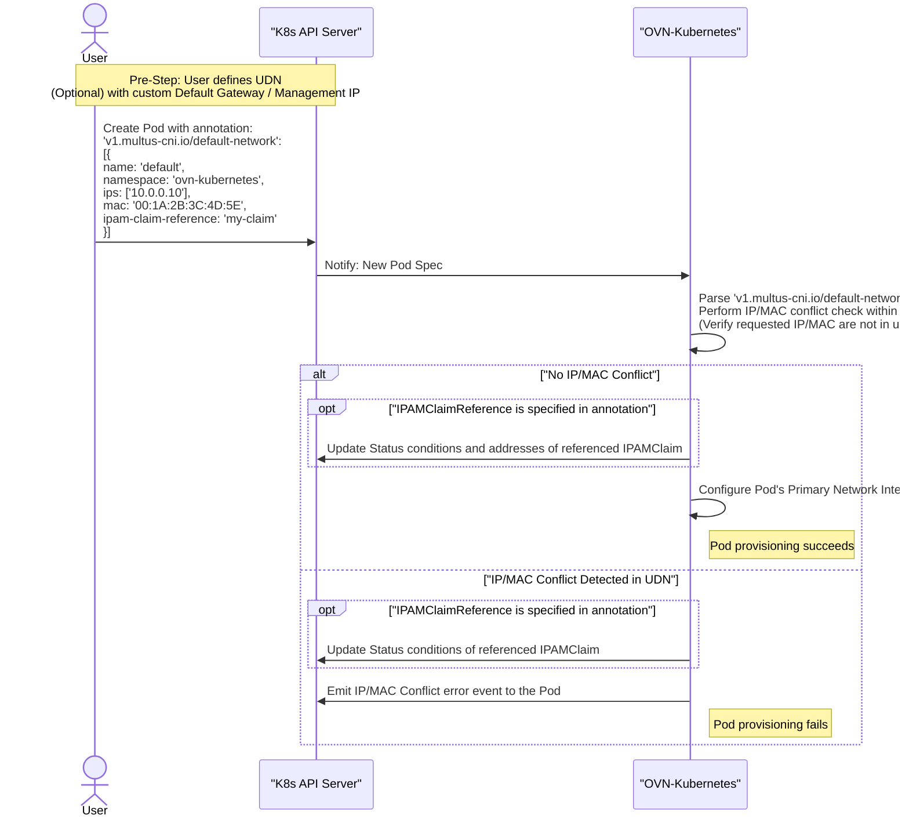

# OKEP-5233: Predefined addresses for primary user defined networks workloads

* Issue: [#5233](https://github.com/ovn-org/ovn-kubernetes/issues/5233)

## Problem Statement

Migrating legacy workloads with predefined network configurations (IP, MAC, default gateway)
to OVN-Kubernetes is currently not possible. There is a need to import these workloads, preserving
their network configuration, while also enabling non-NATed traffic to better integrate with
existing infrastructures.

## Goals

* Enable pods on primary Layer2 User Defined Network (UDN) and Cluster UDN to use a predefined static network
  configuration including IP address, MAC address, and default gateway.
* Ensure it is possible to enable non-NATed traffic for pods with predefined static network configuration
  by exposing the Layer2 Cluster UDN through BGP (see [Risks, Known Limitations and Mitigations](#risks-known-limitations-and-mitigations) for current BGP support limitations).

## Non-Goals

* Modifying the default gateway and management IPs of a primary UDN after it was created.
* Modifying a pod's network configuration after the pod was created.
* Non-NATed traffic support in secondary networks.
* Predefined IP/MAC addresses support for pods in Layer3 UDNs.
* Configurable default gateway and infrastructure addresses in Layer3 UDNs.
* Predefined IP/MAC addresses support for pods in Localnet UDNs.
* Configuring default gateway and infrastructure addresses in Layer2 (Cluster) UDNs that do not belong to the networks subnets.
* No-downtime workload migration.

## Introduction

Legacy workloads, particularly virtual machines, are often set up with static
network configurations. When migrating to OVN-Kubernetes UDNs,
it should be possible to integrate these gradually to prevent disruptions.

Currently, OVN-Kubernetes allocates IP addresses dynamically and it generates the MAC
addresses from it. It sets the pod's default gateway to the first usable IP address of its subnet.
For primary UDNs, it additionally reserves the second usable IP address for the internal management port which
excludes it from being available for workloads.

## User-Stories/Use-Cases

* As a user, I want to define a custom default gateway IP for a new primary Layer2 UDN
so that my migrated workloads can maintain their existing network configuration without disruption.

* As a user, I want the ability to configure a new primary Layer2 UDN with a custom management IP
address to prevent IP conflicts with the workloads I am importing.

* As a user, I want to assign a predefined IP address and MAC address to a pod to ensure the
network identity of my imported workload is maintained.

* As a user, I want to prevent OVN-Kubernetes from automatically assigning  IP addresses that are
already in use by my existing infrastructure, so that I can migrate my services gradually without network conflicts.

## Proposed Solution

### Primary UDN configuration

To support the migration of pre-configured workloads, the UDN and cluster UDN API has to
be enhanced. The aim is to provide control over the IP addresses that OVN-Kubernetes
consumes in the overlay network, this includes the default gateway and management IPs.
The proposed changes are specified in the [Layer2 User Defined Network API changes](#layer2-user-defined-network-api-changes) section.

### Pod network identity

OVN-Kubernetes currently supports configuring pods' secondary network interfaces through
the `k8s.v1.cni.cncf.io/networks` annotation, which contains a JSON array of
[NetworkSelectionElement](https://github.com/k8snetworkplumbingwg/network-attachment-definition-client/blob/e12bd55d48a1f798a1720218819063f5903b72e3/pkg/apis/k8s.cni.cncf.io/v1/types.go#L136-L171)
objects. Additionally, it is possible to modify the cluster's default network attachment by
setting the `v1.multus-cni.io/default-network` annotation to a singular NetworkSelectionElement
object.

To enable using predefined MAC and IP addresses on pods attached to a primary UDN,
the `v1.multus-cni.io/default-network` will be reused, as it is a well-known annotation for
configuring the pod's default network. The `k8s.v1.cni.cncf.io/networks` annotation is specific to
secondary networks and expects a list of networks, which does not fit well with primary UDNs.
With the proposed approach, the `k8s.ovn.org/primary-udn-ipamclaim` annotation, used to link a
pod with a matching claim, will be deprecated in favor of the `IPAMClaimReference` field in the
NetworkSelectionElement. When `IPAMClaimReference` is specified we will update its status to reflect
the result of the IP allocation, see [IPAMClaim API changes](#ipamclaim-api-changes).
OVN-Kubernetes will keep track of all allocated MAC and IP addresses to detect conflicts.
When a conflict is detected, OVN-Kubernetes will emit a Kubernetes event to the pod indicating
the specific conflict (IP or MAC address already in use) and prevent the pod from starting.



### API Details

#### Layer2 User Defined Network API changes

Proposed API change adds `infrastructureSubnets` `reservedSubnets` and `defaultGatewayIPs` fields to the `Layer2Config` which is a part of both
the [UDN](https://github.com/ovn-kubernetes/ovn-kubernetes/blob/a3d0a2b238bef9b1399b3342228d75504afed18b/go-controller/pkg/crd/userdefinednetwork/v1/udn.go#L47)
and [cluster UDN](https://github.com/ovn-kubernetes/ovn-kubernetes/blob/a3d0a2b238bef9b1399b3342228d75504afed18b/go-controller/pkg/crd/userdefinednetwork/v1/cudn.go#L63) specs:

```diff
// +kubebuilder:validation:XValidation:rule="has(self.ipam) && has(self.ipam.mode) && self.ipam.mode != 'Enabled' || has(self.subnets)", message="Subnets is required with ipam.mode is Enabled or unset"
// +kubebuilder:validation:XValidation:rule="!has(self.ipam) || !has(self.ipam.mode) || self.ipam.mode != 'Disabled' || !has(self.subnets)", message="Subnets must be unset when ipam.mode is Disabled"
// +kubebuilder:validation:XValidation:rule="!has(self.ipam) || !has(self.ipam.mode) || self.ipam.mode != 'Disabled' || self.role == 'Secondary'", message="Disabled ipam.mode is only supported for Secondary network"
// +kubebuilder:validation:XValidation:rule="!has(self.joinSubnets) || has(self.role) && self.role == 'Primary'", message="JoinSubnets is only supported for Primary network"
// +kubebuilder:validation:XValidation:rule="!has(self.subnets) || !has(self.mtu) || !self.subnets.exists_one(i, isCIDR(i) && cidr(i).ip().family() == 6) || self.mtu >= 1280", message="MTU should be greater than or equal to 1280 when IPv6 subnet is used"
+ // +kubebuilder:validation:XValidation:rule="!has(self.defaultGatewayIPs) || has(self.role) && self.role == 'Primary'", message="defaultGatewayIPs is only supported for Primary network"
+ // +kubebuilder:validation:XValidation:rule="!has(self.defaultGatewayIPs) || self.defaultGatewayIPs.all(ip, self.subnets.exists(subnet, cidr(subnet).containsIP(ip)))", message="defaultGatewayIPs must belong to one of the subnets specified in the subnets field"
+ // +kubebuilder:validation:XValidation:rule="!has(self.reservedSubnets) || has(self.reservedSubnets) && has(self.subnets)", message="reservedSubnets must be unset when subnets is unset"
+ // +kubebuilder:validation:XValidation:rule="!has(self.reservedSubnets) || self.reservedSubnets.all(e, self.subnets.exists(s, cidr(s).containsCIDR(cidr(e))))",message="reservedSubnets must be subnetworks of the networks specified in the subnets field",fieldPath=".reservedSubnets"
+ // +kubebuilder:validation:XValidation:rule="!has(self.infrastructureSubnets) || has(self.infrastructureSubnets) && has(self.subnets)", message="infrastructureSubnets must be unset when subnets is unset"
+ // +kubebuilder:validation:XValidation:rule="!has(self.infrastructureSubnets) || self.infrastructureSubnets.all(e, self.subnets.exists(s, cidr(s).containsCIDR(cidr(e))))",message="infrastructureSubnets must be subnetworks of the networks specified in the subnets field",fieldPath=".infrastructureSubnets"
+ // +kubebuilder:validation:XValidation:rule="!has(self.infrastructureSubnets) || !has(self.defaultGatewayIPs) || self.defaultGatewayIPs.all(ip, self.infrastructureSubnets.exists(subnet, cidr(subnet).containsIP(ip)))", message="defaultGatewayIPs have to belong to infrastructureSubnets"
+ // +kubebuilder:validation:XValidation:rule="!has(self.infrastructureSubnets) || !has(self.reservedSubnets) || self.infrastructureSubnets.all(infra, !self.reservedSubnets.exists(reserved, cidr(infra).containsCIDR(reserved) || cidr(reserved).containsCIDR(infra)))", message="infrastructureSubnets and reservedSubnets must not overlap"
type Layer2Config struct {

// Role describes the network role in the pod.
//
// Allowed value is "Secondary".
// Secondary network is only assigned to pods that use `k8s.v1.cni.cncf.io/networks` annotation to select given network.
//
// +kubebuilder:validation:Enum=Primary;Secondary
// +kubebuilder:validation:Required
// +required
Role NetworkRole `json:"role"`

// MTU is the maximum transmission unit for a network.
// MTU is optional, if not provided, the globally configured value in OVN-Kubernetes (defaults to 1400) is used for the network.
//
// +kubebuilder:validation:Minimum=576
// +kubebuilder:validation:Maximum=65536
// +optional
MTU int32 `json:"mtu,omitempty"`

// Subnets are used for the pod network across the cluster.
// Dual-stack clusters may set 2 subnets (one for each IP family), otherwise only 1 subnet is allowed.
//
// The format should match standard CIDR notation (for example, "10.128.0.0/16").
// This field must be omitted if `ipam.mode` is `Disabled`.
//
// +optional
Subnets DualStackCIDRs `json:"subnets,omitempty"`

+ // reservedSubnets specifies a list of CIDRs reserved for static IP assignment, excluded from automatic allocation.
+ // reservedSubnets is optional. When omitted, all IP addresses in `subnets` are available for automatic assignment.
+ // IPs from these ranges can still be requested through static IP assignment in pod annotations.
+ // Each item should be in range of the specified CIDR(s) in `subnets`.
+ // The maximum number of entries allowed is 25.
+ // The format should match standard CIDR notation (for example, "10.128.0.0/16").
+ // This field must be omitted if `subnets` is unset or `ipam.mode` is `Disabled`.
+ // +optional
+ // +kubebuilder:validation:MinItems=1
+ // +kubebuilder:validation:MaxItems=25
+ ReservedSubnets []CIDR `json:"reservedSubnets,omitempty"`

// JoinSubnets are used inside the OVN network topology.
//
// Dual-stack clusters may set 2 subnets (one for each IP family), otherwise only 1 subnet is allowed.
// This field is only allowed for "Primary" network.
// It is not recommended to set this field without explicit need and understanding of the OVN network topology.
// When omitted, the platform will choose a reasonable default which is subject to change over time.
//
// +optional
JoinSubnets DualStackCIDRs `json:"joinSubnets,omitempty"`

+ // infrastructureSubnets specifies a list of internal CIDR ranges that OVN-Kubernetes will reserve for internal network infrastructure.
+ // Any IP addresses within these ranges cannot be assigned to workloads.
+ // When omitted, OVN-Kubernetes will automatically allocate IP addresses from `subnets` for its infrastructure needs.
+ // When `reservedSubnets` is also specified the CIDRs cannot overlap.
+ // When `defaultGatewayIPs` is also specified  the default gateway IPs must belong to one of the CIDRs.
+ // Each item should be in range of the specified CIDR(s) in `subnets`.
+ // The maximum number of entries allowed is 10.
+ // The format should match standard CIDR notation (for example, "10.128.0.0/16").
+ // This field must be omitted if `subnets` is unset or `ipam.mode` is `Disabled`.
+ // +optional
+ // +kubebuilder:validation:MinItems=1
+ // +kubebuilder:validation:MaxItems=10
+ InfrastructureSubnets []CIDR `json:"infrastructureSubnets,omitempty"`

+ // defaultGatewayIPs specifies the default gateway IP used in the internal OVN topology.
+ //
+ // Dual-stack clusters may set 2 IPs (one for each IP family), otherwise only 1 IP is allowed.
+ // This field is only allowed for "Primary" network.
+ // It is not recommended to set this field without explicit need and understanding of the OVN network topology.
+ // When omitted, an IP from network subnet is used.
+ //
+ // +optional
+ DefaultGatewayIPs DualStackIPs `json:"defaultGatewayIPs,omitempty"`

// IPAM section contains IPAM-related configuration for the network.
// +optional
IPAM *IPAMConfig `json:"ipam,omitempty"`
}

// +kubebuilder:validation:XValidation:rule="isIP(self)", message="IP is invalid"
type IP string

// +kubebuilder:validation:MinItems=1
// +kubebuilder:validation:MaxItems=2
// +kubebuilder:validation:XValidation:rule="size(self) != 2 || !isIP(self[0]) || !isIP(self[1]) || ip(self[0]).family() != ip(self[1]).family()", message="When 2 IPs are set, they must be from different IP families"
type DualStackIPs []IP

```

The API changes mentioned above will be carried to the `NetworkAttachmentDefinition` JSON spec.

#### IPAMClaim API changes

The following pull request is tracking the IPAMClaim API change that introduces the status conditions:
<https://github.com/k8snetworkplumbingwg/ipamclaims/pull/9>

[IPAMClaim CRD doc](https://docs.google.com/document/d/1OQIJIrCtsYpR5O44w0hpoJ2TyKBz1Du-KhRT4RtrAjk) - `IPAM allocation on behalf of other entities` section

### Usage Example

A user migrating services wants to import a workload pod preserving it's original IP address.
Workload data:

```yaml
IP: 192.168.100.205
MAC: 00:1A:2B:3C:4D:5E
Default Gateway: 192.168.100.2
```

```yaml
apiVersion: k8s.ovn.org/v1
kind: ClusterUserDefinedNetwork
metadata:
  name: network-l2
spec:
  topology: "Layer2"
  layer2:
    role: Primary
    subnets: ["192.168.100.0/24"]
    infrastructureSubnets: ["192.168.100.0/30"]  # used for OVN-Kubernetes infrastructure
    reservedSubnets: ["192.168.100.200/29"]      # reserved for workloads that will require predefined addresses
    defaultGatewayIPs: ["192.168.100.2"]
```

With this configuration, OVN-Kubernetes automatically assigns IPs from `.4-.199` and `.208-.254` for new workloads, while pods can request specific IPs from the reserved range:

```yaml
apiVersion: v1
kind: Pod
metadata:
  name: migrated-app
  annotations:
    v1.multus-cni.io/default-network: |
      {"name": "default", "namespace": "ovn-kubernetes", "ips": ["192.168.100.205"], "mac": "00:1A:2B:3C:4D:5E", "ipam-claim-reference": "my-claim"}
spec:
```

### Implementation Details

#### Configurability

The changes outlined in this enhancement should be configurable. This means a configuration knob
is required to instruct OVN-Kubernetes on whether to process the annotation described in the
[Pod network identity](#pod-network-identity) section. The feature knob will be called `preconfigured-udn-addresses-enable`.

#### NetworkSelectionElement annotation

Currently, the `v1.multus-cni.io/default-network` annotation is only processed for the cluster default network.
This enhancement will extend this behavior, allowing it to be applied to pods created in the primary Layer2 UDN as well.
The annotation should only be processed for new pods, modifying it after the addresses were allocated won't
be reflected in the pods network configuration and this should be blocked through a
[Validating Admission Policy](https://kubernetes.io/docs/reference/access-authn-authz/validating-admission-policy/):

```yaml
apiVersion: admissionregistration.k8s.io/v1
kind: ValidatingAdmissionPolicy
metadata:
  name: predefined-network-addresses
spec:
  matchConstraints:
    resourceRules:
      - apiGroups:   [""]
        apiVersions: ["v1"]
        operations:  ["UPDATE"]
        resources:   ["pods"]
  failurePolicy: Fail
  validations:
    - expression: "('v1.multus-cni.io/default-network' in oldObject.metadata.annotations) == ('v1.multus-cni.io/default-network' in object.metadata.annotations)"
      message: "The 'v1.multus-cni.io/default-network' annotation cannot be changed after the pod was created"
```

The `NetworkSelectionElement` structure has an extensive list of fields, this enhancement
focuses only on the following:

```cgo
type NetworkSelectionElement struct {
    // Name contains the name of the Network object this element selects
    Name string `json:"name"`
    // Namespace contains the optional namespace that the network referenced
    // by Name exists in
    Namespace string `json:"namespace,omitempty"`
    // IPRequest contains an optional requested IP addresses for this network
    // attachment
    IPRequest []string `json:"ips,omitempty"`
    // MacRequest contains an optional requested MAC address for this
    // network attachment
    MacRequest string `json:"mac,omitempty"`
    // IPAMClaimReference container the IPAMClaim name where the IPs for this
    // attachment will be located.
    IPAMClaimReference string `json:"ipam-claim-reference,omitempty"`
}
```

Any other field set in the struct will be ignored by OVN-Kubernetes.

When using the `v1.multus-cni.io/default-network` annotation, Multus strictly requires its value to reference an
existing NAD. Multus then builds the CNI requests based on it.
This proposal introduces a static default NAD object applied to the cluster. This object will serve as a
stub to generate the CNI calls, preserving the current behavior:

```yaml
apiVersion: k8s.cni.cncf.io/v1
kind: NetworkAttachmentDefinition
metadata:
  name: default
  namespace: ovn-kubernetes
spec:
  config: '{"cniVersion": "0.4.0", "name": "ovn-kubernetes", "type": "ovn-k8s-cni-overlay"}'
```

With this approach, users must configure the `Name` to `default` and the `Namespace` to `ovn-kubernetes`.
This configuration ensures Multus still references the default network while OVN-Kubernetes will internally use the
primary UDN to handle MAC/IP requests from the NSE.

> The default NAD object specified above is already used when the default network is exposed through BGP as
part of the route advertisement feature. The proposal is to have it available all the time.

With `k8s.ovn.org/primary-udn-ipamclaim` being deprecated in favor of the `IPAMClaimReference` field
in the `NetworkSelectionElement` we have to define the expected behavior. To avoid conflicting
settings when `v1.multus-cni.io/default-network` is set the `k8s.ovn.org/primary-udn-ipamclaim` is
going to be ignored, it will be reflected in the opposite scenario for backwards compatibility
with a plan to remove it in a future release.
Deprecation plan for the `k8s.ovn.org/primary-udn-ipamclaim` annotation:

* release-N - emit a warning event stating that the annotation is deprecated and will be removed in a future release.
* release-N+1 - fail to configure pods with the annotation set.
* release-N+2 - remove any code handling the annotation, effectively ignoring it.

Note that `GatewayRequest` is not listed, the default gateway is an attribute of the network is not going to be
configurable per pod.

### Address allocation

OVN-Kubernetes currently [generates](https://github.com/ovn-kubernetes/ovn-kubernetes/blob/3ef29b9a32b04b7917a0afd6b0e9651d17242ed7/go-controller/pkg/util/net.go#L100-L113)
the overlay MAC addresses from the IPs:

* IPv4: It takes the four octets of the address (e.g `AA.BB.CC.DD`) and uses them to
create the MAC address with a constant prefix (e.g. `0A:58:AA:BB:CC:DD`).
* IPv6: Computes a SHA256 checksum from the IPv6 string and uses the first four bytes for the MAC
address with the `0A:58` constant prefix(e.g. `0A:58:SHA[0]:SHA[1]:SHA[2]:SHA[3]`).

Although unlikely, we need to implement logic that ensures that the MAC address requested through
the `NetworkSelectionElement` does not conflict with any other configured address on the UDN
(including addresses consumed by OVN-Kubernetes).

OVN-Kubernetes already persists the IP and MAC addresses in the `k8s.ovn.org/pod-networks` annotation for each pod:

```cgo
// PodAnnotation describes the assigned network details for a single pod network. (The
// actual annotation may include the equivalent of multiple PodAnnotations.)
type PodAnnotation struct {
// IPs are the pod's assigned IP addresses/prefixes
IPs []*net.IPNet
// MAC is the pod's assigned MAC address
MAC net.HardwareAddr
// Gateways are the pod's gateway IP addresses; note that there may be
// fewer Gateways than IPs.
Gateways []net.IP

// GatewayIPv6LLA is the IPv6 Link Local Address for the pod's gateway, that is the address
// that will be set as gateway with router advertisements
// generated from the gateway router from the node where the pod is running.
GatewayIPv6LLA net.IP

// Routes are additional routes to add to the pod's network namespace
Routes []PodRoute

// TunnelID assigned to each pod for layer2 secondary networks
TunnelID int

// Role defines what role this network plays for the given pod.
// Expected values are:
// (1) "primary" if this network is the primary network of the pod.
//     The "default" network is the primary network of any pod usually
//     unless user-defined-network-segmentation feature has been activated.
//     If network segmentation feature is enabled then any user defined
//     network can be the primary network of the pod.
// (2) "secondary" if this network is the secondary network of the pod.
//     Only user defined networks can be secondary networks for a pod.
// (3) "infrastructure-locked" is applicable only to "default" network if
//     a user defined network is the "primary" network for this pod. This
//     signifies the "default" network is only used for probing and
//     is otherwise locked for all intents and purposes.
// At a given time a pod can have only 1 network with role:"primary"
Role string
}
```

This annotation will be used to build an initial cache of allocated addresses at startup, which will then be updated
dynamically at runtime and used for conflict detection.
A similar approach is required for IP address conflict detection.
When a conflict is detected the pod should not start and an appropriate event should be emitted.

When the `NetworkSelectionElement` contains an `IPAMClaimReference` the referenced IPAMClaim should
reflect the IP allocation status including error reporting through the newly introduced
`Conditions` status field.
In the opposite scenario where the `NetworkSelectionElement` does not specify the `IPAMClaimReference`
the IP allocation is not persisted when the pod is removed.

### Testing Details

The following scenarios should be covered in testing:

* VM workloads import into OVN-Kubernetes with no changes to the instances network configuration.
* Imported VM workloads can live-migrate to another node without any additional traffic disruption.
* 'v1.multus-cni.io/default-network' cannot be changed after the pod was created.
* It should be possible to configure the pods MAC or the IP address without configuring the other.
* When `reservedSubnets` is configured automatic IP allocation should not use addresses specified in it.
* It should be possible to configure the pods IP address using the 'v1.multus-cni.io/default-network'
even if the address is a part of the `reservedSubnets`.
* Requesting an IP address and default gateway IP that is not a part of the networks subnet should fail.
* Detect MAC and IP address conflicts between the requested addresses for a newly created pods and the addresses that
are already allocated in the network.
* After configuring custom default gateway and management addresses on a Layer2 UDN the previous default
IPs can be consumed by workloads(e.g. for 10.0.0.0/16 network create pods with 10.0.0.1 and 10.0.0.2 addresses).
* Modifying the  default gateway and management addresses on a Layer2 UDN should not be possible after the network
was created.

The scenarios mentioned above have to cover both IPv4 and IPv6 IP families.

### Documentation Details

## Risks, Known Limitations and Mitigations

* Modifying the 'v1.multus-cni.io/default-network' value after the pod was created could have unpredictable
consequences.
To mitigate this introduce a Validating Admission Policy described in [Implementation Details](#implementation-details).

* By allowing users to specify the IP and MAC addresses for the pods there is a risk of conflicts.
To mitigate this OVN-Kubernetes will check that the requested addresses are not currently used in the UDN.
There is still a risk that the user picks an address that's consumed by something outside of the UDN but that's beyond
what OVN-Kubernetes controls and can check.

* The dynamic, per-node subnet allocation in Layer3 UDNs, where each node has a unique default gateway and
management IP, makes user-specified UDN gateway/management IPs and static pod IP/MAC assignments very complex. This
enhancement will not support Layer3 UDNs.

* BGP support today is limited to cluster UDNs, to ensure a non-NATed traffic for pods with predefined addresses
the user has to use a cluster UDN to configure the network. This is a limitation unrelated to this enhancement
and it is possible it will be solved in the future.

* By consuming the 'v1.multus-cni.io/default-network' annotation for altering the primary UDNs pod configuration the
user won't be able to use it for configuring the cluster default network attachment. This is acceptable as there is
currently no support for modifying the cluster default network through this annotation while using primary UDNs.
If there is a requirement in the future another mechanism can be considered.

* OVN-Kubernetes computes MAC addresses from pod IPs rather than allocating them, which creates potential
MAC address conflicts in a potential scenario where a MAC address previously used by a stopped VM gets consumed by
OVN-Kubernetes for a dynamically allocated IP. To mitigate these conflicts, users will have to use a different
MAC address and recreate the workload. For importing workloads that already use this prefix, a future enhancement
could add a field to the Layer2 spec allowing users to specify a custom MAC prefix for the UDN.

## OVN-Kubernetes Version Skew

## Alternatives

* Instead of the [Pod network identity](#pod-network-identity) approach, we could expand the
IPAMClaim API. It currently lacks IP request capabilities, and using IPAMClaim for MAC addresses
is confusing. Introducing a new API would mean deprecating the IPAMClaim, while managing
upgrades and supporting both solutions for a period of time. This requires significant effort, which
is not feasible at this time.

* As described in the [NetworkSelectionElement annotation](#networkselectionelement-annotation) section, using the
`v1.multus-cni.io/default-network` annotation means Multus strictly requires this annotation's value to reference an
existing NAD. An alternative to the proposed approach would be to reference the NAD that defines the primary network.
It was discarded as it would require OVN-Kubernetes to modify the CNI handling logic because multus
would target the CNI requests towards the custom network. Additionally it would require users to determine the exact
NAD name and namespace for every primary UDN pod needing custom MAC, IP, or IPAMClaim.

## References

* [IPAMClaim CRD doc](https://docs.google.com/document/d/1OQIJIrCtsYpR5O44w0hpoJ2TyKBz1Du-KhRT4RtrAjk) - `IPAM allocation on behalf of other entities` section

* IPAMClaim status conditions pull request: <https://github.com/k8snetworkplumbingwg/ipamclaims/pull/9>
