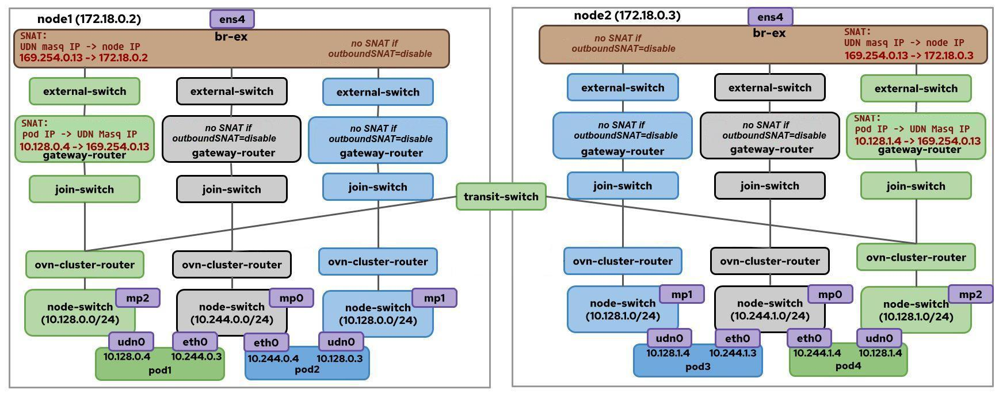
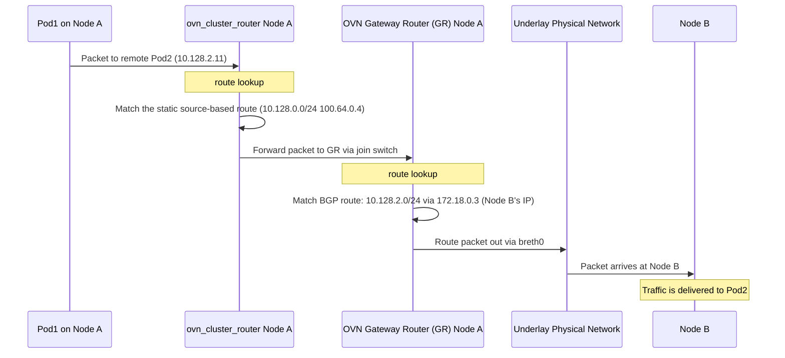
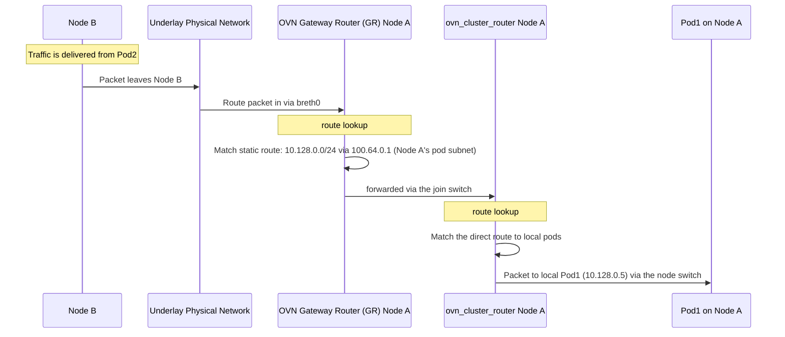
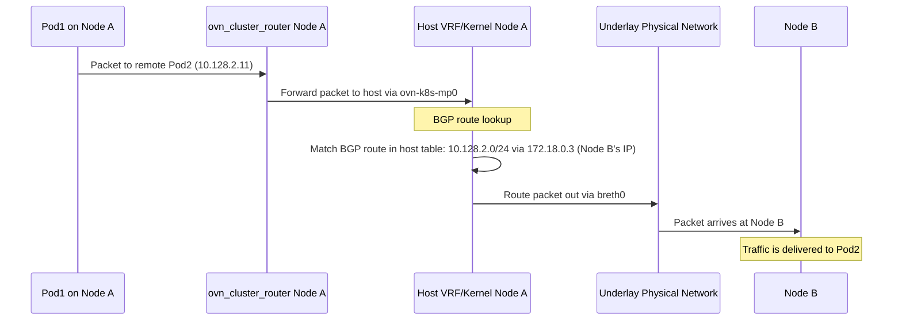
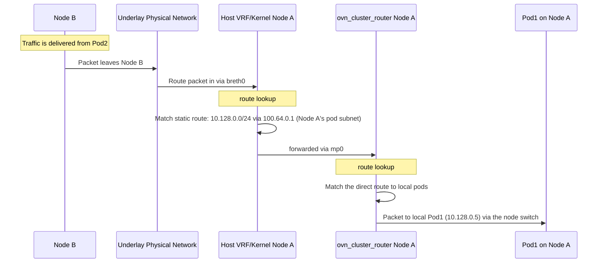
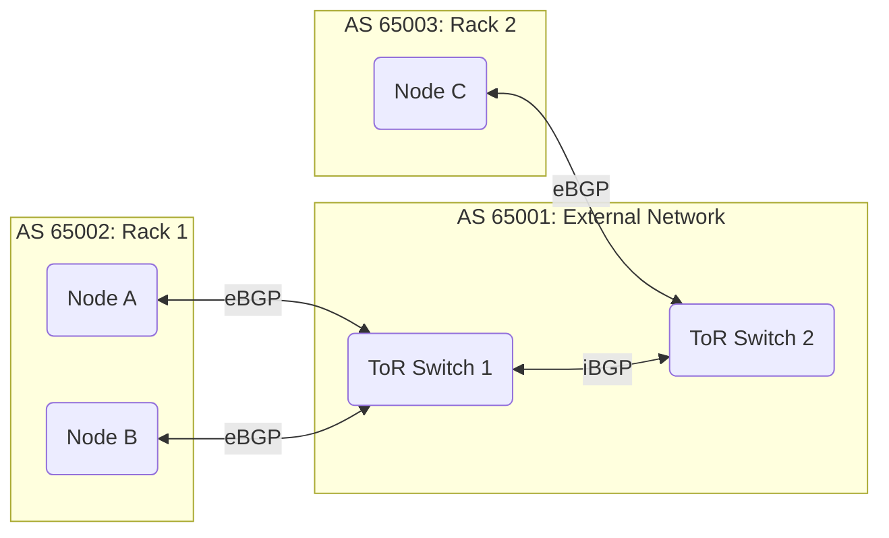
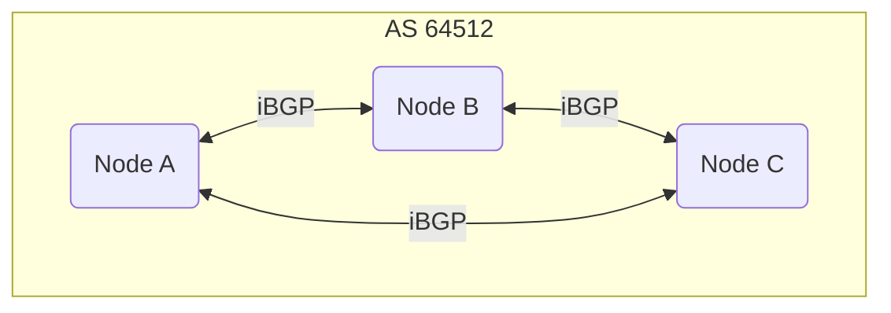
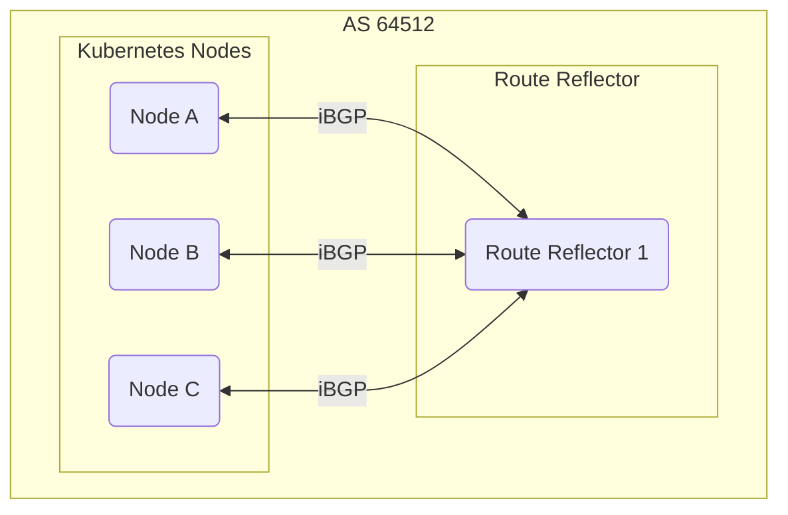

# OKEP-5259: No-overlay Mode For Layer-3 Networks using BGP

* Issue: [\#5259](https://github.com/ovn-kubernetes/ovn-kubernetes/issues/5259)

## Problem Statement

Currently, OVN-Kubernetes uses Geneve as its encapsulation method on the overlay
network for east-west traffic; this adds overhead and reduces throughput. By
leveraging OVN-Kubernetes support for BGP, we want to provide a way for users to
enable a no-overlay mode, which would disable Geneve encapsulation and use
direct routing between nodes for east-west traffic on selected networks.

Many environments, particularly on-premise deployments or those with dedicated
networking infrastructure, prefer to utilize the underlying physical network's
routing capabilities directly. This "no-overlay" approach can offer several
benefits:

* Improved Performance: Eliminates overlay protocol overhead, potentially
  leading to lower latency and higher throughput for inter-pod communication.
* Leverage Existing Network Infrastructure: Integrates more seamlessly with
  existing BGP-capable network devices, allowing direct routing to pod IPs.
* Reduced Resource Consumption: Fewer CPU cycles spent on
  encapsulation/decapsulation.

## Terminology

See [terminology](https://ovn-kubernetes.io/okeps/okep-5193-user-defined-networks/#terminology) details.

## Goals

* Support no-overlay mode for the cluster default network (CDN).
* Support no-overlay mode for Primary layer-3 ClusterUserDefinedNetworks
  (CUDNs).
* The no-overlay mode is only supported for bare-metal clusters.
* A cluster can have networks operating in overlay and no-overlay modes
  simultaneously.
* Use the BGP feature to exchange routes to pod subnets across the cluster.
* Allow direct communication without any overlay encapsulation for east-west
  traffic.
* Maintain compatibility with existing OVN-Kubernetes features where applicable.
* Compatible with both local gateway and shared gateway modes.
* Do not compromise the existing advertised UDN isolation strict mode.
* Support a deployment option where no-overlay mode can be enabled with a
  full-mesh BGP internal fabric managed by OVN-Kubernetes, allowing users to
  leverage no-overlay mode without requiring external BGP infrastructure.

## Future Goals

* When OVN-Kubernetes supports BGP for UserDefinedNetwork CRs, extend no-overlay
  mode support for Primary layer-3 UDNs.
* Support toggling no-overlay mode on/off for an existing network. To support
  this functionality, there are two things we need to consider.
  First, in no-overlay mode, as there is no Geneve overhead, a network can have
  the same MTU size as the provider network. However, overlay networks require a
  smaller MTU (default 1400). We cannot modify a pod interface MTU without
  restarting the pod, so OVN-Kubernetes must work with other external
  controllers to accommodate such a migration.
  Secondly, to facilitate a smooth, node-by-node migration, it's crucial to
  allow networks to operate in a hybrid no-overlay and overlay mode.
* Address the advertised UDN isolation loose mode issue when no-overlay mode is
  enabled.
* Support route-reflector BGP topology for the managed cluster internal BGP
  fabric. If FRR node instances can act as a BGP route reflector, it enables
  creation of an internal route reflector-based BGP network. However, it is not
  currently supported by frr-k8s, which we use for integrating OVN-Kubernetes
  with FRR. We will need to implement this feature in frr-k8s first before
  supporting this.

## Non-Goals

* This enhancement does not aim to change the default behavior of
  OVN-Kubernetes, which will continue to use Geneve encapsulation for the
  default network and any user-defined networks unless no-overlay mode is
  explicitly enabled.
* This enhancement does not aim to change the existing CUDN lifecycle
  management. The user must ensure that the CUDN CRs are correctly managed
  according to the existing lifecycle management practices.
* This enhancement does not aim to implement no-overlay mode with the
  centralized OVN architecture, as the BGP feature is only available in a
  cluster running in interconnect mode.
* This enhancement does not aim to implement no-overlay mode for the layer-2
  type of networks. The layer-2 type of networks is implemented by connecting
  pods to the same OVN distributed logical switch. Pods on different nodes are
  connected through a layer-2 segment using Geneve encapsulation. It's quite
  challenging to implement a layer-2 network over a layer-3 infrastructure
  without an overlay protocol.
* This enhancement does not aim to integrate no-overlay mode with the EVPN
  feature.
* This enhancement does not aim to support users creating a no-overlay network
  by manually creating a NetworkAttachmentDefinition (NAD) CR.
* This enhancement does not aim to support egress IP or egress service for
  no-overlay networks. Both features leverage OVN-Kubernetes's logical routing
  policy to steer pod egress traffic. They also rely on overlay tunnels to
  transport pod egress traffic to egress nodes.

## Introduction

In the [OVN-Kubernetes BGP Integration
enhancement](https://github.com/ovn-kubernetes/ovn-kubernetes/blob/master/docs/okeps/okep-5296-bgp.md#future-goals),
no-overlay mode was briefly discussed. In this enhancement, we aim to describe
the feature in detail, define the API changes we want to introduce for it, and
address a number of concerns with respect to the existing BGP Integration and
User-Defined Network Segmentation features.

Avoiding Geneve encapsulation and using the provider network for east-west
traffic stems from the need to minimize network overhead and maximize
throughput. Users who intend to enable BGP on their clusters can leverage
BGP-learned routes to achieve this. The goal is to provide users with an API to
create networks (default or CUDN), with no-overlay mode enabled, allowing
traffic to skip Geneve encapsulation (i.e., the overlay network) and simply make
use of the learned routes in the underlay or provider network for inter-node
communication.

While BGP is the proposed solution for exchanging east-west routing information
within a cluster, it is not the only possible option. Future implementations of
no-overlay mode may incorporate additional routing technologies and protocols
beyond BGP.

## User-Stories/Use-Cases

### Story 1: Have the cluster default network in the no-overlay mode

As a cluster admin, I want to enable no-overlay mode for the cluster default
network to integrate seamlessly with existing BGP-capable networks, achieve
maximum network performance, and reduce overhead.

### Story 2: Create a CUDN in the no-overlay mode

As a cluster admin, I want to enable no-overlay mode for a cluster user defined
network to integrate seamlessly with existing BGP-capable networks and achieve
maximum network performance.

### Story 3: Deploy networks in the no-overlay mode without external BGP routers

As a cluster admin, I want to use no-overlay mode for intra-cluster traffic
without advertising pod networks to the external network or depending on
external BGP routers.

## Proposed Solution

This solution leverages the existing BGP feature to advertise each node's pod
subnet via the CNCF project [FRR-K8s](https://github.com/metallb/frr-k8s). FRR
routers managed by FRR-k8s then propagate these routes throughout the provider
network, enabling direct pod-to-pod traffic without an overlay. A single cluster
can simultaneously have networks in both overlay and no-overlay modes.

When no-overlay mode is enabled for a network:

* By default, when BGP advertisement is enabled, the BGP feature disables SNAT
  for pod egress traffic leaving nodes. For users who only want to have
  no-overlay mode but do not want to expose pod IPs externally, this behavior is
  not ideal. To address this, users will be able to enable SNAT for
  pod-to-external traffic. This will be configured via a new `outboundSNAT`
  field in the `ClusterUserDefinedNetwork` CRD for CUDNs, and the
  `outbound-snat` flag in the `[no-overlay]` section of the configuration file
  for the default network.

* For east-west traffic:
  * Intra-node traffic remains unchanged, handled by the local OVN bridge.
  * Inter-node traffic will follow the same path as north-south traffic, routed
    via the underlay. Pod-to-pod, Pod-to-clusterIP traffic within the same
    network will be forwarded by the provider network without encapsulation or
    NAT. Pod-to-node egress traffic will be SNATed to the node IP at the source
    node to allow a pod to access nodePort services in a different UDN.

### Configuration File and Flags

For the default network transport, the new flag `transport` will be added to
the `[default]` section of the configuration file:

* The `transport` flag accepts either `no-overlay` or
  `geneve`, defaulting to `geneve`. Setting it to `no-overlay` configures the
  default network to operate in no-overlay mode. More overlay transport
  methods can be supported in the future. If
  `transport=no-overlay` is set, but
  no `RouteAdvertisements` CR is configured for advertising the default network,
  ovnkube-cluster-manager will emit an event and log an error message.

For the default network in no-overlay mode, the new flags `outbound-snat` and
`routing` will be added to the `[no-overlay]` section of the configuration file:

* The `outbound-snat` flag is a string flag to configure the SNAT behavior for
  outbound traffic from pods on the default network. Supported values are
  `enabled` or `disabled`. It is required when `transport=no-overlay`.

  * `enabled`: SNATs pod-to-external traffic to the node IP. This is useful when
    pod IPs are not routable on the external network.
  * `disabled`: Does not SNAT pod-to-external traffic. This requires pod IPs to
    be routable on the external network.

  In no-overlay mode, pod-to-remote-pod traffic is never SNATed, regardless of
  this flag's setting. However, traffic to remote nodes, the Kubernetes API
  server, and DNS is always SNATed.

* The `routing` flag is a string flag to configure whether the cluster default
  network routing configuration is managed by OVN-Kubernetes or users. Supported
  values are `managed` or `unmanaged`. It is required when
  `transport=no-overlay`.

  * `managed`: OVN-Kubernetes manages the routing for the no-overlay network.
    OVN-Kubernetes will generate the BGP configurations (RouteAdvertisements and
    FRRConfiguration) to advertise the pod subnets, and set up BGP sessions
    between nodes. In the managed routing mode, pod subnets will be advertised
    to the default VRF of each node.

    Please note that the managed routing mode requires nodes to be directly
    connected at Layer 2. Therefore, the managed routing mode is not suitable
    for clusters that have nodes in different subnets, as pod subnets are not
    routable between nodes in different subnets. So normally, this option shall
    be used with `outbound-snat=enabled`.

    However, when the network is in the managed routing mode, users can still
    advertise the pod network to the external network by creating the
    RouteAdvertisements and FRRConfiguration CRs manually.

    More managed routing options can be specified by the flags in the section
    `[bgp-managed]` described below.

  * `unmanaged`: Users are responsible for managing the routing, including
    creating the RouteAdvertisements and FRRConfiguration CRs to advertise the
    pod subnets. It allows users to have more control over the BGP
    configuration. Normally, this option shall be used with
    `outbound-snat=disabled`.

    One day if other routing protocols are integrated with OVN-Kubernetes, users
    can use this option to manage the routing themselves.

To configure the internal BGP fabric that CDN and CUDNs in managed no-overlay
mode will use, the configuration file will have a new section `[bgp-managed]`,
with the following new flags:

* The `topology` flag specifies the BGP topology to use for the cluster internal
  BGP fabric, with supported values of `full-mesh` initially, more topology
  options can be added in the future.

  This flag is required when the CDN or any CUDN is configured in no-overlay
  mode with `managed` routing. Configuration will fail if not provided. When
  set, the `ovnkube-cluster-manager` generates FRRConfigurations to configure
  the BGP topology for the cluster.

  If set to `full-mesh`, ovnkube-cluster-manager will generate FRRConfigurations
  for all nodes to peer with each other in a full mesh. This topology is simpler
  to configure but less scalable for large clusters.

* The `as-number` flag is used when no-overlay networks are configured with
  managed routing. It is shared by both the cluster default network and CUDNs.
  It specifies the AS number to be used by the BGP speakers on each node for its
  default VRF. It's optional. The default AS number is `64512` if not specified.

For CUDNs, no-overlay mode is configured via their respective CRs. Due to a BGP
limitation, CUDNs with overlapping pod subnets cannot be advertised to the same
VRF. To enable no-overlay mode for these networks, a VRF-lite configuration is
required.

Here is an example configuration file snippet for the default network in
no-overlay mode:

```ini
[default]
transport = no-overlay

[no-overlay]
outbound-snat = enabled
routing = managed

[bgp-managed]
topology = full-mesh
as-number = 64514
```

### API Details

We introduce new fields to the `spec.network` section of the
ClusterUserDefinedNetwork (CUDN) CRD to control network transport technology:

* **`transport`**: Specifies the transport technology used for the network.
  * Supported values: `Geneve` or `NoOverlay`
  * It's optional, if not specified, it will be treated as `Geneve`.
  * More transport methods can be supported in the future.
* **`noOverlayOptions`**: Contains configuration for no-overlay mode. This is
  required when `transport` is `NoOverlay`.
  * `outboundSNAT`: Defines the SNAT behavior for outbound traffic from pods.
    * Supported values: `Enabled` or `Disabled`. It is required when `transport`
      is `NoOverlay`.
    * `Enabled`: SNATs pod-to-external traffic to the node IP. This is useful
      when pod IPs are not routable on the external network.
    * `Disabled`: Does not SNAT pod-to-external traffic. This requires pod IPs
      to be routable on the external network.
    * Pod-to-remote-pod traffic is never SNATed in no-overlay mode.
  * `routing`: Specifies whether the pod network routing configuration is
    managed by OVN-Kubernetes or users. It is required when `transport` is
    `NoOverlay`.
    * Supported values: `Managed` or `Unmanaged`.
    * `Managed`: OVN-Kubernetes manages the routing for the no-overlay network.
      OVN-Kubernetes will generate the per-node BGP configurations to advertise
      the pod subnets, and set up a full-mesh BGP topology where each node peers
      with all other nodes in the cluster. In the managed routing mode, pod
      subnets will be advertised to the default VRF of each node. When the
      network is in the managed routing mode, users can still advertise the pod
      network to the external network by creating the RouteAdvertisements and
      FRRConfiguration CRs manually.
    * `Unmanaged`: Users are responsible for managing the routing, including
      creating the RouteAdvertisements and FRRConfiguration CRs to advertise the
      pod subnets. It allows users to have more control over the BGP
      configuration. One day if other routing protocols are integrated with
      OVN-Kubernetes, users can use this option to manage the routing
      themselves.

The `spec` field of a ClusterUserDefinedNetwork CR is immutable. Therefore, the
transport configuration cannot be changed after a ClusterUserDefinedNetwork CR is
created.

```golang
type TransportOption string
type SNATOption string
type RoutingOption string

const (
    TransportOptionNoOverlay  TransportOption = "NoOverlay"
    TransportOptionGeneve     TransportOption = "Geneve"

    SNATEnabled  SNATOption = "Enabled"
    SNATDisabled SNATOption = "Disabled"

    RoutingManaged   RoutingOption = "Managed"
    RoutingUnmanaged RoutingOption = "Unmanaged"
)

// NoOverlayOptions contains configuration options for networks operating in no-overlay mode.
type NoOverlayOptions struct {
    // OutboundSNAT defines the SNAT behavior for outbound traffic from pods.
    // +kubebuilder:validation:Enum=Enabled;Disabled
    // +required
    OutboundSNAT SNATOption `json:"outboundSNAT"`
    // Routing specifies whether the pod network routing is managed by OVN-Kubernetes or users.
    // +kubebuilder:validation:Enum=Managed;Unmanaged
    // +required
    Routing RoutingOption `json:"routing"`
}

type NetworkSpec struct {
    ...
    // Transport describes the transport technology used for the network.
    // Allowed values are "NoOverlay" and "Geneve".
    // - "NoOverlay": The network operates in no-overlay mode.
    // - "Geneve": The network uses Geneve overlay.
    // Defaults to "Geneve" if not specified.
    // +kubebuilder:validation:Enum=NoOverlay;Geneve
    // +optional
    Transport TransportOption `json:"transport,omitempty"`
    // NoOverlayOptions contains configuration for no-overlay mode.
    // It is only allowed when Transport is "NoOverlay".
    // +optional
    NoOverlayOptions *NoOverlayOptions `json:"noOverlayOptions,omitempty"`
}
```

To prevent a user from setting unsupported transport configurations in CUDN
accidentally, we will add the following CEL validation rules to the
`spec.network` field of the ClusterUserDefinedNetwork CRD.

```yaml
    network:
      x-kubernetes-validations:
      - message: "transport 'NoOverlay' is only supported for Layer3 primary networks"
        rule: "!has(self.transport) || self.transport != 'NoOverlay' || (self.topology == 'Layer3' && has(self.layer3) && self.layer3.role == 'Primary')"
      - message: "noOverlayOptions is required if and only if transport is 'NoOverlay'"
        rule: "(has(self.transport) && self.transport == 'NoOverlay') == has(self.noOverlayOptions)"
```

A new status condition will be added to the CUDN CR to indicate whether the
transport is correctly configured for a CUDN. The UDN controller in the
ovnkube-cluster-manager is responsible for setting this condition based on the
transport configuration. The UDN controller will watch RouteAdvertisements CR
events and validate whether a RouteAdvertisements CR is correctly configured to
advertise the pod networks.

Here is the definition of the new status condition:

* **`TransportAccepted`**: Indicates whether the transport is
  correctly configured.
  * `True`: The transport is correctly configured.
  * `False`: The transport is not correctly configured.
  * `Unknown`: The status of the transport configuration is unknown.
  * This condition is only applicable when `spec.network.transport` is not set
    to `Geneve`.
  * For a no-overlay CUDN, this condition is set to `True` when:
    * A RouteAdvertisements CR is created to advertise the pod subnets of
      the CUDN, and its status is `Accepted`.
    * Otherwise, it will be set to `False` with an appropriate message.

If the transport is not configured or configured as `Geneve`, the UDN controller
shall set the `TransportAccepted` condition like this:

```yaml
status:
  conditions:
  - type: TransportAccepted
    status: "True"
    reason: "GeneveTransportAccepted"
    message: "Geneve transport has been configured."
```

If the transport is configured as `NoOverlay` and the RouteAdvertisements CR is
created and its status is `Accepted`, the UDN controller shall set the
`TransportAccepted` condition like this:

```yaml
status:
  conditions:
  - type: TransportAccepted
    status: "True"
    reason: "NoOverlayTransportAccepted"
    message: "Transport has been configured as 'no-overlay'."
```

If no RouteAdvertisements CR is advertising the network, it shall update the
CUDN status condition `TransportAccepted` to `False` with an appropriate
message.

```yaml
status:
  conditions:
  - type: TransportAccepted
    status: "False"
    message: "No RouteAdvertisements CR is advertising the pod networks."
    reason: "NoOverlayRouteAdvertisementsIsMissing"
```

Or if the RouteAdvertisements CR exists but its status is not accepted:

```yaml
status:
  conditions:
  - type: TransportAccepted
    status: "False"
    message: "RouteAdvertisements CR blue advertises the pod subnets, but its status is not accepted."
    reason: "NoOverlayRouteAdvertisementsNotAccepted"
```

#### Example of a layer-3 CUDN with no-overlay mode enabled

A layer-3 CUDN with no-overlay mode enabled should look like this:

```yaml
apiVersion: k8s.ovn.org/v1
kind: ClusterUserDefinedNetwork
metadata:
  name: my-cudn
spec:
  namespaceSelector:
    matchExpressions:
    - key: kubernetes.io/metadata.name
      operator: In
      values: ["red", "blue"]
  network:
    topology: Layer3
    layer3:
      role: Primary
      mtu: 1500
      subnets:
      - cidr: 10.10.0.0/16
        hostSubnet: 24
    transport: "NoOverlay"
    noOverlayOptions:
      outboundSNAT: "Disabled"
      routing: "Unmanaged"
status:
  conditions:
  - type: TransportAccepted
    status: "True"
    reason: "NoOverlayTransportAccepted"
    message: "Transport has been configured as 'no-overlay'."
```

Or: if the routing is managed by OVN-Kubernetes:

```yaml
apiVersion: k8s.ovn.org/v1
kind: ClusterUserDefinedNetwork
metadata:
  name: my-cudn
spec:
  namespaceSelector:
    matchExpressions:
    - key: kubernetes.io/metadata.name
      operator: In
      values: ["red", "blue"]
  network:
    topology: Layer3
    layer3:
      role: Primary
      mtu: 1500
      subnets:
      - cidr: 10.10.0.0/16
        hostSubnet: 24
    transport: "NoOverlay"
    noOverlayOptions:
      outboundSNAT: "Enabled"
      routing: "Managed"
status:
  conditions:
  - type: TransportAccepted
    status: "True"
    reason: "NoOverlayTransportAccepted"
    message: "Transport has been configured as 'no-overlay'."
```

### Implementation Details

No-overlay mode relies on the BGP feature, which is exclusive to clusters
deployed in the single-node zone interconnect mode. Therefore, no-overlay mode
can only be enabled in clusters configured with single-node zone interconnect.

For networks configured with no-overlay mode, the OVN topology requires minor
adjustments. In the current interconnect architecture, a network can span all
cluster nodes thanks to the cross-node logical links that OVN establishes
between the transit switch and the ovn-cluster-router instances on each node.
That is the logical representation of the OVN network, and in practice, these
links are implemented through Geneve tunnels between every node in the cluster.

To route pod traffic directly over the underlay, the network's logical topology
is modified: the transit switch will not be created anymore, thus the
`ZoneInterconnectHandler` in ovnkube-controller will not create a connection to
the transit switch. As a result, static routes to remote pod subnets will not be
added to the ovn_cluster_router. Instead, traffic will be forwarded using a
source-based route, with the next hop determined by the cluster's gateway mode.
ovn_cluster_router will route all east-west traffic to the provider network,
following the same path as north-south traffic.

The following diagram shows the OVN topology of a cluster with three networks:

* a CUDN (in green) that uses Geneve encapsulation (default behavior)
* a default network (in gray) that is operating in no-overlay mode
* a CUDN (in blue) that is operating in no-overlay mode



#### Traffic Path in Shared Gateway Mode

At the ovn_cluster_router, the pod-to-remote-pod egress traffic will be
forwarded to the GatewayRouter via the join switch. Unlike the current route
advertisement behavior, routes to remote pod subnets will be imported to
the gateway router. Once the traffic reaches the GatewayRouter, it will be
forwarded to the nexthop node according to the imported BGP routes.

An example traffic path is as follows (assuming pod IP of 10.128.0.10 on node A,
destined to remote pod 10.128.2.11 on node B):

As the east-west traffic will not go through the transit switch, the static
routes to remote pod subnets will not be added to the ovn_cluster_router
anymore. The ovn_cluster_router routes all local pod egress traffic to the
gateway router according to a source-based route (10.128.0.0/24). The routing
table of the default network's ovn_cluster_router for node A would look like:

```text
IPv4 Routes
Route Table <main>:
               100.64.0.4                100.64.0.4 dst-ip
            10.128.0.0/24                100.64.0.4 src-ip
            10.128.0.0/16                100.64.0.4 src-ip
```

And the routing table of the gateway router with learned BGP routes to remote pod
subnets:

```text
IPv4 Routes
Route Table <main>:
           169.254.0.0/17               169.254.0.4 dst-ip rtoe-GR_nodeA
            10.128.0.0/16                100.64.0.1 dst-ip
            10.128.1.0/24                172.18.0.2 dst-ip rtoe-rtoe-GR_nodeA
            10.128.2.0/24                172.18.0.4 dst-ip rtoe-rtoe-GR_nodeA
                0.0.0.0/0                172.18.0.1 dst-ip rtoe-rtoe-GR_nodeA
```



And the reply path:



#### Traffic Path in Local Gateway Mode

The pod-to-remote-pod egress traffic will enter the host VRF via the
ovn-k8s-mpX interface. Then it will be forwarded to remote nodes according to
the host routing table of the VRF.

An example traffic path is as follows (assuming pod IP of 10.128.0.10,
destined to remote pod 10.128.2.11):

The routing table of the default VRF of node A which contains learned BGP routes:

```text
10.128.0.0/16 via 10.128.2.1 dev ovn-k8s-mp0
10.128.0.0/24 dev ovn-k8s-mp0 proto kernel scope link src 10.128.0.2
10.128.1.0/24 nhid 30 via 172.18.0.2 dev eth0 proto bgp metric 20
10.128.2.0/24 nhid 25 via 172.18.0.4 dev eth0 proto bgp metric 20
```



And the reply path:



#### Import Routes to NodeSubnets

Changes to BGP behavior are necessary to import node subnet routes into the
gateway router and the host routing table of each node. A new `transport` key
will be included in the OVN CNI NetConf (the NAD's spec.config JSON) to indicate
the east-west transport protocol of the network. If a network operates in
no-overlay mode, this key is set to `noOverlay`. Additionally, the `outboundSNAT`
key will be included to indicate the SNAT behavior for outbound traffic from pods.
This information can then be passed into the NetInfo object and utilized by the
route import and gateway controller of ovnkube-controller.

Note: Users must not set these fields manually; OVN-Kubernetes manages them.

An example OVN-Kubernetes NAD may look like:

```yaml
apiVersion: k8s.cni.cncf.io/v1
kind: NetworkAttachmentDefinition
metadata:
  name: l3-network
  namespace: default
spec:
  config: |
    {
            "cniVersion": "0.3.1",
            "name": "l3-network",
            "type": "ovn-k8s-cni-overlay",
            "topology":"layer3",
            "mtu": 1500,
            "netAttachDefName": "default/l3-network",
            "role": "primary",
            "transport": "noOverlay",
            "outboundSNAT": "disabled"
    }
```

##### Host Routing Tables

To [maintain isolation between
UDNs](https://github.com/ovn-kubernetes/ovn-kubernetes/pull/5140), node BGP
speakers do not accept routes to pod subnets by default. However, to route
east-west traffic in no-overlay mode, these routes must be imported to the host
routing table.

##### Gateway Router

Currently, BGP routes to other pod subnets are not imported into the gateway
router, which ensures node-to-pod traffic traverses the OVN logical topology.
However, we need the routes to be imported into the gateway router in no-overlay
mode. We need to update the route import controller to check whether a network
is in no-overlay mode and import the routes from the host routing table if so.

#### Configurable SNAT for Egress Traffic

By default, the OVN-Kubernetes BGP feature disables SNAT for all pod egress
traffic when the pod network is advertised. The only exception is traffic
destined to other nodes in the cluster (pod-to-node), which remains SNATed to
the node IP to ensure nodePort services can be accessed across networks.

However, this default behavior assumes all external destinations can route back
to the pod IPs. This assumption fails for destinations reached via non-BGP
routers (such as a default gateway). To address this, we introduce configurable
SNAT behavior via:

* `outboundSNAT` field in the ClusterUserDefinedNetwork CRD for CUDNs
* `outbound-snat` flag in the `[no-overlay]` configuration section for the
  default network

**SNAT Behavior:**

* **`outboundSNAT: Disabled`** (or `outbound-snat=disabled`): Pod egress traffic
  is not SNATed. Pod IPs must be routable on the external network.

* **`outboundSNAT: Enabled`** (or `outbound-snat=enabled`): Pod egress traffic
  to external destinations is SNATed to the node IP. This is intended for
  deployments where pod networks are only advertised to an internal BGP fabric
  and are not routable from external networks.

**Important:** Regardless of this setting, pod-to-remote-pod traffic within the
same network is never SNATed, while traffic to remote nodes, the Kubernetes API
server, and DNS is always SNATed.

##### Shared Gateway Mode

When `outboundSNAT` is disabled, the existing BGP feature behavior is preserved:
pod egress traffic is not SNATed (see [OKEP-5296](okep-5296-bgp.md#route-advertisements)
for details).

When `outboundSNAT` is enabled, the gateway router maintains the default SNAT
rule for pod-to-external traffic while exempting pod-to-remote-pod traffic. To
achieve this, the network controllers in ovnkube-controller create an address
set containing the pod subnets for each CUDN and the default network, then add
an exemption rule using this address set.

The implementation uses the `exempted_ext_ips` field rather than adding a
negative match to the `match` field because negative matches in OVN SNAT rules
are inefficient. Using `exempted_ext_ips` results in one OpenFlow rule per pod
SNAT entry in the OVS bridge, providing better performance.

In the following example, `10.128.0.0/24` is the pod subnet in the local node,
`10.128.0.0/16` is the CIDR of the pod network. `outboundSNAT` is enabled.

```text
# Address_Set for the no-overlay pod network CIDR
_uuid               : a718588e-0a9b-480e-9adb-2738e524b82d
addresses           : ["10.128.0.0/16"]
external_ids        : {ip-family=v4}
name                : a15397791517117706455

# per-pod SNAT rule in the Gateway Router (exclude pod-network destinations)
_uuid               : cd9264de-f2c6-4528-8f53-c2ccb5b23c8d
allowed_ext_ips     : []
exempted_ext_ips    : ["a15397791517117706455"] # Exclude traffic to the pod Network
external_ids        : {}
external_ip         : "172.18.0.2"            # Node/GR external IP used for SNAT for the default network, or a Masquerade IP for a CUDN.
external_mac        : []
external_port_range : "32768-60999"
gateway_port        : []
logical_ip          : "10.128.0.7"            # The local pod IP
logical_port        : []
match               : ""                      # SNAT all non-exempt destinations (node and external)
options             : {stateless="false"}
priority            : 0
type                : snat
```

For UDN, the behavior is similar. The UDN controller will create an address set
for the UDN pod subnet and add an exemption rule to the Gateway Router of that
UDN.

In the following example, `10.10.1.0/24` is the pod subnet in the local node,
`10.10.0.0/16` is the CIDR of the pod network. `outboundSNAT` is enabled.

```text
# Address_Set for the no-overlay UDN pod network CIDR
_uuid               : a718588e-0a9b-480e-9adb-2738e524b85d
addresses           : ["10.10.0.0/16"]
external_ids        : {ip-family=v4}
name                : a15397791517117706478

# per-pod SNAT rule in the Gateway Router (exclude pod-network destinations)
_uuid               : 5f72b7a5-e7fc-4d14-8dbf-70d5ba304452
allowed_ext_ips     : []
exempted_ext_ips    : ["a15397791517117706478"] # Exclude traffic to the pod Network
external_ids        : {"k8s.ovn.org/network"=cluster_udn_e2e-test-bgp-1, "k8s.ovn.org/topology"=layer3}
external_ip         : "169.254.0.12"            # Masquerade IP for the CUDN
external_mac        : []
external_port_range : "32768-60999"
gateway_port        : []
logical_ip          : "10.10.1.0/24"            # The local pod subnet
logical_port        : []
match               : ""                        # SNAT all non-exempt destinations (node and external)
options             : {stateless="false"}
priority            : 0
type                : snat
```

##### Local Gateway Mode

When `outboundSNAT` is disabled, the existing BGP feature behavior is preserved:
pod egress traffic is not SNATed (see [OKEP-5296](okep-5296-bgp.md#route-advertisements)
for details).

When `outboundSNAT` is enabled for the default network, pod egress traffic is
forwarded to the host kernel by the ovn-cluster-router, where it is then SNATed
to the node IP using nftables rules.

In the following example, `10.128.0.0/24` is the pod subnet in the local node,
`10.128.0.0/16` is the CIDR of the pod network. `outboundSNAT` is enabled for
the network.

```text
table ip nat {
    chain postrouting {
        type nat hook postrouting priority 100; policy accept;
        # skip SNAT for pod-to-pod traffic
        ip saddr 10.128.0.0/24 ip daddr 10.128.0.0/16 return
        ip saddr 10.128.0.0/24 masquerade
    }
}
```

For UDN, before the pod egress traffic entering the host kernel, the
ovn-cluster-router will perform a SNAT first to change source IP to the UDN
masquerade IP. So instead of changing the nftables rules. The UDN controller in
the ovnkube-controller will modify the SNAT rule in the ovn-cluster-router.

In the following example, `10.10.1.0/24` is the pod subnet in the local node,
`10.10.0.0/16` is the CIDR of the pod network. `outboundSNAT` is enabled for
the network.

```text
# Address_Set for the no-overlay pod network CIDR
_uuid               : a718588e-0a9b-480e-9adb-2738e524b85d
addresses           : ["10.10.0.0/16"]
external_ids        : {ip-family=v4}
name                : a15397791517117706478

# per-pod SNAT rule in the ovn-cluster-router (exclude pod-network destinations)
_uuid               : 5f72b7a5-e7fc-4d14-8dbf-70d5ba304452
allowed_ext_ips     : []
exempted_ext_ips    : ["a15397791517117706478"] # Exclude traffic to the pod Network
external_ids        : {"k8s.ovn.org/network"=cluster_udn_e2e-test-bgp-1, "k8s.ovn.org/topology"=layer3}
external_ip         : "169.254.0.12"
external_mac        : []
external_port_range : "32768-60999"
gateway_port        : []
logical_ip          : "10.10.1.0/24"
logical_port        : rtos-cluster_udn_e2e.test.bgp.1_ovn-worker
match               : ""                        # SNAT all non-exempt destinations (node and external)
options             : {stateless="false"}
priority            : 0
type                : snat
```

#### UDN Traffic Isolation

Currently, for inter-UDN pod-to-pod traffic, OVN-Kubernetes supports 2 modes:
loose and strict. In the strict mode, inter-UDN traffic is blocked by ACL rule
defined in the node switch. In no-overlay mode, this isolation mode will still
operate in the same way.

In the loose mode, inter-UDN traffic is allowed to be routed by external
routers. However, loose mode can be broken when multiple CUDNs are advertised to
the same VRF. Because routes to pod subnets are learned by the host routing
table and then imported into the gateway router, OVN-Kubernetes may route
inter-UDN traffic directly, which violates the intended loose-mode behavior. We
may address this limitation in the future by generating additional import-filter
rules via FRR-K8s. One workaround is to use either eBGP on their external router,
or iBGP with `next-hop-self` to ensure that inter-UDN traffic is routed by an
external router instead of the node.

### Workflow

#### Enable No-overlay Mode for the Default Network with Unmanaged Routing

1. The frr-k8s pods shall be deployed on each node.
2. The cluster admin shall create a base FRRConfiguration CR that is used for
   generating the per-node FRRConfiguration instances by OVN-Kubernetes.

    ```yaml
    apiVersion: frrk8s.metallb.io/v1beta1
    kind: FRRConfiguration
    metadata:
      name: external-rr
      namespace: frr-k8s-system
      labels:
        network: default
    spec:
      bgp:
        routers:
        - asn: 64512
          neighbors:
          # the external BGP route reflector
          - address: 172.20.0.2
            asn: 64512
            disableMP: true
            toReceive:
              allowed:
                mode: filtered
                prefixes:
                # accept pod subnets of the default network explicitly
                - prefix: 10.128.0.0/16
                  ge: 24
    ```

3. The cluster admin shall create a RouteAdvertisements CR to advertise the
   default network. Make sure the RouteAdvertisements CR selects the
   FRRConfiguration defined in the previous step.

    ```yaml
    apiVersion: k8s.ovn.org/v1
    kind: RouteAdvertisements
    metadata:
      name: default
    spec:
      advertisements:
      - PodNetwork
      # Select the FRRConfiguration defined in step-2 with the custom label.
      frrConfigurationSelector:
        matchLabels:
          network: default
      networkSelectors:
      - networkSelectionType: DefaultNetwork
      # The empty nodeSelector selects all nodes. We don't support a network in an overlay and no-overlay hybrid mode.
      nodeSelector: {}
    ```

4. The cluster admin enables no-overlay mode by running ovn-kubernetes with
   config file below:

    ```ini
    [default]
    transport = no-overlay

    [no-overlay]
    routing = unmanaged
    outbound-snat = disabled
    ```

5. The default network controller in ovnkube-controller will create the OVN
   virtual topology for the default network. Neither the transit switch nor the
   static routes to remote pod subnets will be created.

6. The default network controller in ovnkube-cluster-manager shall watch the
   RouteAdvertisements CRs. It shall ensure at least one RouteAdvertisements CR
   is correctly configured to advertise the pod networks and will validate the
   RouteAdvertisements CR status. If the RouteAdvertisements CR is missing or
   its status is not accepted, it shall report event and log an error message.

7. The BGP feature is responsible for exchanging BGP routes to remote pod
   subnets between nodes. Ultimately, these routes will be imported into the
   gateway router.

#### Enable No-overlay Mode for the Default Network with Managed Routing

1. The frr-k8s pods shall be deployed on each node.

2. In the Managed routing mode, the default network controller in
   ovnkube-cluster-manager will create the RouteAdvertisements CR. A new
   FRRConfiguration controller will be responsible for creating the base
   FRRConfiguration CR which sets up the cluster internal BGP fabric. The
   cluster admin only needs to start ovn-kubernetes with the following flags:

    ```ini
    [default]
    transport = no-overlay

    [no-overlay]
    routing = managed
    outbound-snat = enabled

    [bgp-managed]
    topology = full-mesh
    as-number = 64514
    ```

3. The default network controller in ovnkube-cluster-manager will create a base
   FRRConfiguration CR in the `frr-k8s-system` namespace, and a
   RouteAdvertisements CR that advertises the default network. The generated
   FRRConfiguration will configure BGP speakers on each node to advertise the
   pod subnets and set up a full-mesh iBGP topology where each node peers with
   all other nodes in the cluster.

   When nodes are added or removed, the FRRConfiguration controller shall update
   the base FRRConfiguration CR, and the per-node FRRConfiguration instances
   accordingly.

   For example, if the cluster has 3 nodes with pod subnets `10.128.0.0/24`,
   `10.128.1.0/24`, and `10.128.2.0/24`. The generated RouteAdvertisements CR
   will look like:

    ```yaml
    apiVersion: k8s.ovn.org/v1
    kind: RouteAdvertisements
    metadata:
      name: ovnk-managed-<hash>
    spec:
      advertisements:
      - PodNetwork
      frrConfigurationSelector:
        matchLabels:
          k8s.ovn.org/managed-internal-fabric: bgp # Selects the base FRRConfiguration CR managed by OVN-Kubernetes
      networkSelectors:
      - networkSelectionType: DefaultNetwork
      nodeSelector: {}
    ```

    And the generated base FRRConfiguration CR for a full mesh BGP topology
    will look like:

    ```yaml
    apiVersion: frrk8s.metallb.io/v1beta1
    kind: FRRConfiguration
    metadata:
      name: ovnk-managed-<hash>
      namespace: frr-k8s-system
      labels:
        k8s.ovn.org/managed-internal-fabric: bgp # This label is set on FRRConfigurations managed by OVN-Kubernetes to configure the internal fabric
    spec:
      bgp:
        routers:
        - asn: 64514
          neighbors:
          # BGP peers with other nodes
          - address: <node1-ip>
            asn: 64514
            toReceive:
              # Allow to receive the routes to remote pod subnets.
              # This is no-overlay specific behavior.
              allowed:
                prefixes:
                - ge: 24
                  le: 24
                  prefix: 10.128.0.0/16
          - address: <node2-ip>
            asn: 64514
            toReceive:
              allowed:
                prefixes:
                - ge: 24
                  le: 24
                  prefix: 10.128.0.0/16
          - address: <node3-ip>
            asn: 64514
            toReceive:
              allowed:
                prefixes:
                - ge: 24
                  le: 24
                  prefix: 10.128.0.0/16
    ```

  The following steps are the same as steps 5 to 7 in the previous section.

#### Create a ClusterUserDefinedNetwork in No-overlay Mode with Unmanaged Routing

Here is a configuration example:

1. The frr-k8s pods shall be deployed on each node.
2. A cluster admin wants to enable no-overlay mode for the blue network by
   creating the following ClusterUserDefinedNetwork CR.

    ```yaml
    apiVersion: k8s.ovn.org/v1
    kind: ClusterUserDefinedNetwork
    metadata:
      name: blue
      labels:
        network: blue
    spec:
      namespaceSelector:
        matchExpressions:
        - key: kubernetes.io/metadata.name
          operator: In
          values: ["ns1", "ns2"]
      network:
        topology: Layer3
        layer3:
          role: Primary
          # The UDN MTU shall not be larger than the provider network's MTU.
          mtu: 1500
          subnets:
          - cidr: 10.10.0.0/16
            hostSubnet: 24
        transport: "NoOverlay"
        noOverlayOptions:
          outboundSNAT: "Disabled"
          routing: "Unmanaged"
    ```

3. The cluster admin has created an FRRConfiguration CR to peer with an external
   BGP router `182.18.0.5`.

    ```yaml
    apiVersion: frrk8s.metallb.io/v1beta1
    kind: FRRConfiguration
    metadata:
      name: blue
      namespace: frr-k8s-system
      # A custom label
      labels:
        network: blue
    spec:
      bgp:
        routers:
        - asn: 64512
          neighbors:
          - address: 182.18.0.5
            asn: 64512
            disableMP: true
            holdTime: 1m30s
            keepaliveTime: 30s
            passwordSecret: {}
            port: 179
            toAdvertise:
              allowed:
                mode: filtered
            toReceive:
              # Allow to accept the routes to remote pod subnets.
              allowed:
                mode: filtered
                prefixes:
                - ge: 24
                  le: 24
                  prefix: 10.10.0.0/16
    ```

4. The cluster admin advertises the CUDN pod network. In this example, the
   `targetVRF` is not set, meaning routes to the pod networks will be advertised
   to the default VRF.

   If users want to advertise the pod networks to a specific VRF or deploy
   VRF-lite they can set the `targetVRF` field in the RouteAdvertisements CR.

    ```yaml
    apiVersion: k8s.ovn.org/v1
    kind: RouteAdvertisements
    metadata:
      name: blue
    spec:
      # nodeSelector must be empty, since we don't support a network in an overlay and no-overlay hybrid mode.
      nodeSelector: {}
      frrConfigurationSelector:
        matchLabels:
        # Select the FRRConfiguration defined in step-3
        network: blue
      networkSelectors:
      - networkSelectionType: ClusterUserDefinedNetwork
        clusterUserDefinedNetworkSelector:
          networkSelector:
            matchLabels:
              # Select the CUDN defined in step-2
              network: blue
      advertisements:
      - PodNetwork
    ```

5. The UDN controller in ovnkube-controller will create the OVN virtual topology
   for the UDN. Neither the transit switch nor the static routes to remote pod
   subnets will be created.

6. The UDN controller in ovnkube-cluster-manager will watch the
   RouteAdvertisements events to check whether at least one RouteAdvertisements
   CR is correctly configured to advertise the pod networks and its status is
   `Accepted`. The UDN controller will update the status condition
   `TransportAccepted` accordingly.

7. The BGP feature is responsible for exchanging BGP routes to remote pod
   subnets between nodes. Ultimately, these routes will be imported into the
   gateway router.

#### Create a ClusterUserDefinedNetwork in No-overlay Mode with Managed Routing

1. The frr-k8s pods shall be deployed on each node.

2. In the Managed routing mode, a new FRRConfiguration controller will be
   responsible for creating the base FRRConfiguration CR which sets up the
   cluster internal BGP fabric. The cluster admin only needs to start
   ovn-kubernetes with the following flags:

    ```ini
    [bgp-managed]
    topology = full-mesh
    as-number = 64514
    ```

   The generated FRRConfiguration will be the same as the one described in the
   managed default network section.

3. A cluster admin wants to enable no-overlay mode for the blue network by
   creating the following ClusterUserDefinedNetwork CR.

    ```yaml
    apiVersion: k8s.ovn.org/v1
    kind: ClusterUserDefinedNetwork
    metadata:
      name: blue
      labels:
        network: blue
    spec:
      namespaceSelector:
        matchExpressions:
        - key: kubernetes.io/metadata.name
          operator: In
          values: ["ns1", "ns2"]
      network:
        topology: Layer3
        layer3:
          role: Primary
          # The UDN MTU shall not be larger than the provider network's MTU.
          mtu: 1500
          subnets:
          - cidr: 10.10.0.0/16
            hostSubnet: 24
        transport: "NoOverlay"
        noOverlayOptions:
          outboundSNAT: "Enabled"
          routing: "Managed"
    ```

4. The UDN controller in ovnkube-cluster-manager will create a
   RouteAdvertisements CR that advertises the blue network.

   The generated RouteAdvertisements CR will look like:

    ```yaml
    apiVersion: k8s.ovn.org/v1
    kind: RouteAdvertisements
    metadata:
      name: ovnk-managed-<hash>
    spec:
      advertisements:
      - PodNetwork
      frrConfigurationSelector:
        matchLabels:
          k8s.ovn.org/managed-internal-fabric: bgp # Selects the base FRRConfiguration CR managed by OVN-Kubernetes
      networkSelectors:
      - networkSelectionType: ClusterUserDefinedNetwork
        clusterUserDefinedNetworkSelector:
          networkSelector:
            matchLabels:
              network: blue
      nodeSelector: {}
    ```

The following steps are the same as steps 5 to 7 in the previous section.

### Deployment Considerations

#### BGP Topology

The selected `FRRConfiguration` CR determines the deployment mode for the
no-overlay network. There will be no new field added to the FRRConfiguration.
The goal is to exchange the routes to the pod subnets across the cluster. The
possible BGP topologies are varied. Users shall be able to choose any topology
that is most suitable for their use case. However, frr and frr-k8s may not
support some BGP features. Here we list some common deployment options.

##### eBGP Peering with External Routers

A common deployment model is to use eBGP to peer each node with an external BGP
speaker, such as a Top-of-Rack (ToR) switch. This approach is often preferred in
enterprise environments as it provides clear Autonomous System (AS) boundaries
and allows for more advanced routing policies (e.g., AS path prepending, MEDs,
and filtering based on AS paths).

In this topology, the FRR instance on each node establishes an eBGP session with
its upstream router. The upstream routers are then responsible for advertising
the node subnet routes to the rest of the network. It is also possible for
different groups of nodes (e.g. nodes in different racks) to belong to different
Autonomous Systems.



##### Full-Mesh iBGP across the Cluster

The FRR instance on each node maintains a full-mesh BGP peer relationship with
all other nodes across the cluster. In this mode, users can enable no-overlay
mode without relying on external BGP routes. Enabling `outboundSNAT` for the
no-overlay network allows pod egress traffic to be SNATed to the node IP,
enabling communication with external destinations even when the pod network is
not advertised externally.

This is particularly useful in smaller clusters or in environments where
external BGP speakers are not available. However, it is important to note that a
full-mesh iBGP setup can lead to increased CPU and memory consumption on the
nodes, as each node must maintain a session with every other node.



Here's an example FRRConfiguration:

```yaml
apiVersion: frrk8s.metallb.io/v1beta1
kind: FRRConfiguration
metadata:
  labels:
    network: default
  name: receive-all
  namespace: frr-k8s-system
spec:
  bgp:
    routers:
    - asn: 64512
      # All nodes are added as neighbors to setup a full-mesh BGP topology
      neighbors:
      - address: 192.168.111.20
        asn: 64512
        disableMP: true
        toReceive:
          allowed:
            mode: all
      - address: 192.168.111.21
        asn: 64512
        disableMP: true
        toReceive:
          allowed:
            mode: all
      - address: 192.168.111.22
        asn: 64512
        disableMP: true
        toReceive:
          allowed:
            mode: all
```

##### External Route Reflectors for Larger Clusters

In a large cluster, a full-mesh BGP setup leads to more CPU and memory
consumption on the nodes. Instead of every node peering with every other node,
nodes peer only with external BGP route reflectors. This significantly reduces
the number of BGP sessions each node needs to maintain, improving scalability.



Users can also force the BGP routes to use the route reflector as the next hop
by setting the `next-hop-self force` option on the iBGP neighbors. Such
configuration can be used together with the UDN isolation loose mode to prevent
inter-UDN traffic from being routed by the node.

Here is an example of how to configure the iBGP neighbors on FRR routers:

```text
  neighbor 172.18.0.2 activate
  neighbor 172.18.0.2 route-reflector-client
  neighbor 172.18.0.2 next-hop-self force
```

### Feature Compatibility

#### Multiple External Gateways (MEG)

MEG cannot work with advertised networks, therefore MEG cannot work with
networks operating in the no-overlay mode either.

#### Egress IP

Not supported.

#### Services

MetalLB will still be used in order to advertise services across the BGP fabric.

#### Egress Service

Not supported.

#### Egress Firewall

Full support.

#### Egress QoS

Full support.

#### Network Policy/ANP

Full support.

#### IPsec

Not supported.

#### Multicast

Not supported.

OVN does not support routing multicast traffic to external networks. OVN logical
routers only support forwarding multicast traffic between logical switches. It
cannot exchange PIM messages with external routers. Additionally, FRR-K8s does
not currently support configuring the FRR multicast functions (IGMP/MLD, PIM,
etc.). Therefore, multicast is not supported in no-overlay mode.

#### UserDefinedNetworks Connect

Not supported.

### Testing Details

* E2E Testing Details
  The E2E tests shall cover the following combinations:
  * Gateway Modes: LGW and SGW
  * IP Modes: IPv4, IPv6, and dual-stack
  * BGP Topologies: iBGP with an external route reflector, full-mesh iBGP,
    iBGP+eBGP combined and eBGP only.
  * BGP VRF-lite with multiple CUDNs
  * test suite: conformance, control-plane
* API Testing Details
  * ClusterUserDefinedNetwork CR reports expected status conditions
  * No-overlay mode cannot be enabled for UserDefinedNetworks
* Scale Testing Details
  * The impact of the number of the imported BGP routes
* Performance Testing Details
  * Test pod-to-pod throughput and latency
* Cross-Feature Testing Details - coverage for interaction with other features
  * UDN isolation between UDNs in no-overlay mode
    * Default mode
    * Loose mode
  * NetworkPolicy
  * EgressFirewall

## Risks, Known Limitations and Mitigations

### Risks

In the no-overlay mode, east-west traffic relies on the BGP network. Therefore,
internal and external BGP speaker outages may impact cluster networking.

The no-overlay mode inherits all limitations from the BGP integration feature.
Consequently, multicast is not supported in no-overlay mode.

As OVN is no longer delivering pod-to-pod traffic end-to-end, it will
necessitate BGP knowledge for debugging.

### Known Limitations

* Features that rely on OVN to deliver pod-to-pod traffic, such as IPSec,
  EgressIP and EgressService, are not supported in no-overlay mode.
  OVN-Kubernetes will report an event/warning.

* When users configure egress IP or egress service for no-overlay networks,
  OVN-Kubernetes won't block the configuration or set a status condition to the
  EgressIP or EgressService CR. As we believe such feature compatibility issues
  are not no-overlay specific, it should be designed and addressed
  comprehensively in future enhancements.

* The UDN loose mode isolation will be broken if multiple no-overlay UDNs are
  advertised to the same VRF. Before this issue is resolved, if the user wants
  to use loose mode with no-overlay, then they should either use eBGP on their
  external router, or iBGP with next-hop-self to ensure that inter-UDN traffic
  is routed by an external router instead of the node. However, the drawback of
  this workaround is that all the intra-UDN traffic will be routed by the
  external router too, which may add extra latency and increase the load on the
  external router.

* The managed routing mode uses a full-mesh BGP topology where each node peers
  with all other nodes in the cluster. This approach does not scale well for
  large clusters, as the number of BGP sessions grows quadratically (N*(N-1)/2
  sessions for N nodes), leading to increased CPU and memory consumption on each
  node. For large-scale deployments, users should consider using the unmanaged
  routing mode with external route reflectors or other scalable BGP topologies.

* Changing the transport type between Geneve and no-overlay for the cluster
  default network is not supported. Users must create a new cluster with the
  desired transport type configured at installation time.

## OVN Kubernetes Version Skew

To be discussed.

## Alternatives

N/A

## References

1. [OKEP-5296: OVN-Kubernetes BGP Integration](https://github.com/ovn-kubernetes/ovn-kubernetes/blob/master/docs/okeps/okep-5296-bgp.md)
2. [OKEP-5193: User Defined Network Segmentation](https://github.com/ovn-kubernetes/ovn-kubernetes/blob/master/docs/okeps/okep-5193-user-defined-networks.md)
