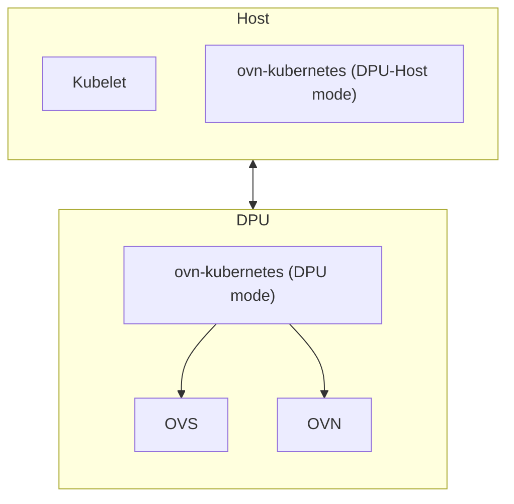

# OKEP-5674: DPU Healthcheck

* Issue: [#5674](https://github.com/ovn-org/ovn-kubernetes/issues/5674)

## Problem Statement

With the DPU (trusted) architecture, we have ovnkube running on the host (DPU-Host mode), and ovnkube running in the
DPU (DPU mode). Kubelet talks on the host to dpu-host mode, which annotates the VF rep information so that DPU ovnkube
can plug the port into OVS and handle all the OVN configuration. The DPU component is managed outside the host
kubernetes cluster.

The purpose of this addition is to be able to detect when the DPU side goes down, and indicate that the CNI is no longer
ready on the node.

## Goals

* Decrease CNI failure time by detecting when the DPU is unhealthy
* Avoid Kubernetes scheduling new pods via to nodes where the DPU is unhealthy

## Non-Goals

* Tainting the node
* Distinguishing between different types of failure in the DPU

## Introduction

As a refresher, the architecture of the DPU architecture in "trusted" mode is shown below:



Note, "trusted" mode here means the DPU side has the kubeconfig of the host cluster, and runs OVNK in the DPU. There
is an "untrusted" mode, but it is outside the scope of this enhancement and will not use this feature.

As can be seen in the diagram, the ovn-kubernetes DPU mode is running down in the DPU, managed outside the purview of
the host Kubernetes cluster. Therefore, the Host Kubernetes cluster has no observability or failure detection of this pod.
When a DPU-accelerated pod is created, the following happens:

1. Kubelet invokes Multus which checks that the UDN/NAD has a resourceName field
2. SR-IOV plugin is called and reserves a VF, passes the PCI address in the CNI ADD
3. OVN-Kubernetes DPU-Host receives the CNI ADD, and annotates the pod with the connection details.
4. OVN-Kubernetes DPU waits for the annotation, plugs the VF representor into OVS, and annotates the pod with typical
k8s.ovn.org annotations.
5. OVN-Kubernetes DPU-Host sees annotations, and then moves the VF into the pod and configures it
6. DPU-Host sends CNI ADD reply

Now, if the DPU side goes down, DPU-Host will keep waiting on the CNI ADD for 2 minutes. All CNI ADDs will keep failing.
From a user's perspective on the Host Kubernetes cluster, they may have no insight into what is running in the DPU from
KAPI. We can make this better by:

1. Detecting when the DPU side has gone down.
2. Failing CNI operations fast as we know when the DPU is down.
3. Triggering Kubelet to report the node as not ready to avoid future pods from being scheduled to this node.

## User-Stories/Use-Cases

Story 1: Make DPU operations more robust

As a cluster admin, I want to leverage DPUs for hardware offload. However, I do not want to compromise my
visibility into the cluster and be stuck with components that are failing outside my view. I'd like to have DPU
issues propagate up the stack so that I can see when a node has failed. Additionally, I would like Kubelet to no longer
schedule pods to this node until it has come back online.

## Proposed Solution

Kubernetes uses node leases as a mechanism to maintain health within a cluster. This solution proposes that a custom
node lease is created and used by OVN-Kubernetes to detect when a DPU is no longer functioning. The DPU OVN-Kubernetes
component will update this node lease periodically. DPU-Host will monitor this node lease, and when it expires it will:

1. Trigger CNI operations to fail fast, CNI is down.
2. Implement the CNI STATUS verb to signal CNI issues to the container runtime.

The container runtime such as CRI-O or containerd will call CNI STATUS. When CNI STATUS returns an error, the runtime
will report to Kubelet that `NetworkReady=false`, and then Kubelet will set the Kubernetes node status as `NotReady`.
Kubernetes will stop scheduling new pods to this node, and after a grace period (default 300 seconds), Kube Node Controller
will taint the node, triggering eviction for pods that do not tolerate the taint.

### API Details

A configuration knob will be introduced in OVN-Kubernetes to set the "--dpu-node-lease-renew-interval" time in seconds.
The default setting will be 10 seconds. Set this value to 0 to disable.
In addition, another config knob "--dpu-node-lease-duration" will be exposed that takes a time value in seconds. It will
be used as the max time before the DPU is considered dead. The default time will be 40 seconds.
These values are similar to what Kubernetes uses for Kubelet node leases.

### Implementation Details

OVN-Kubernetes default node network controller (DNNC) will be updated to update the node lease when the mode is configured
to be DPU mode, and the --dpu-node-lease-renew-interval is > 0. OVN-Kubernetes CNI server will be updated to track
this lease, and when the DPU node lease expires it will trigger CNI to:

- Immediately fail CNI ADD, rather than annotating the pod with the VF and waiting 2 minutes. The CNI ADD will fail
with a new message "DPU Not Ready".
- Report STATUS according to the [CNI specification](https://www.cni.dev/docs/spec/#status-check-plugin-status).

#### DPU Custom Node Lease

OVN-Kubernetes RBAC will be updated to allow for a RoleBinding to allow ovnkube to interact with the Kubernetes `lease`
resource in the ovn-kubernetes namespace. 
DPU-Host will be responsible for creating the lease, and the owner reference will be set to the Kubernetes
Node object. This will allow automatic clean up if the node is deleted in Kubernetes. Example:

```yaml
apiVersion: coordination.k8s.io/v1
kind: Lease
metadata:
  name: ovn-dpu-worker-node-1
  namespace: ovn-kubernetes
  ownerReferences:
    - apiVersion: v1
      kind: Node
      name: worker-node-1
      uid: <actual-node-uid> # Critical for GC to work
spec:
  holderIdentity: "ovnkube-dpu-node"
  leaseDurationSeconds: 40
  renewTime: "2023-10-27T10:00:00Z"
```

ovnkube-node-dpu will be given update and read RBAC permissions in order to update the heartbeat every interval.

### Testing Details

* Unit tests will be added to make sure CNI ADD/STATUS function correctly under different DPU conditions.
* Unit tests will be added to ensure that the DPU custom node lease functions as expected.
* E2E tests will be added where there is no DPU mode, and DPU-Host mode is just launched. Checking that
the node condition gets updated correctly and pods are not scheduled to the node.
* Future E2E tests will be added upstream once there is a full DPU CI environment to do more comprehensive testing.

### Documentation Details

Documentation will be added describing this feature as well as the overall OVN-Kubernetes Trusted DPU architecture.

## Risks, Known Limitations and Mitigations

Only applicable for Trusted DPU Architecture. Zero-trust will be handled later.

## OVN-Kubernetes Version Skew

Targeting version 1.2.

## Alternatives

Instead of using the node condition to indicate the CNI is down, cluster-manager could listen for the lease expiry and
then taint the node. We have tried tainting the node in the past, and it led to a bunch of issues causing us to revert it:
https://github.com/ovn-kubernetes/ovn-kubernetes/pull/2459. The SDN should refrain from tainting nodes, as it can cause
system critical pods to not be able to start, including OVN-Kubernetes itself.

## References

None
