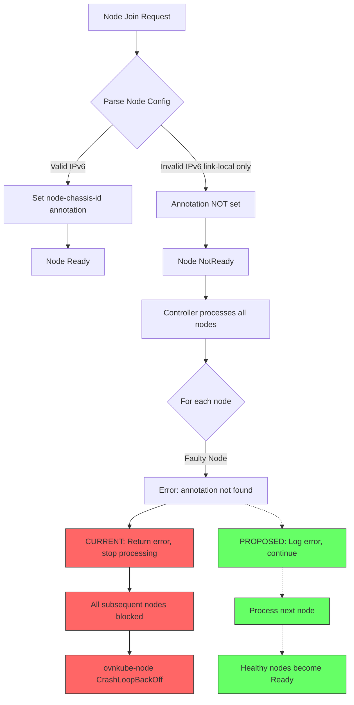

# Proposal: Isolate Faulty Node Processing in Dual-Stack Clusters

## Issue Reference

- **Jira**: [OCPBUGS-81548](https://redhat.atlassian.net/browse/OCPBUGS-81548)
- **Component**: Networking / ovn-kubernetes
- **OpenShift Version**: 4.x (dual-stack enabled)

## Problem Statement

When adding new nodes to a dual-stack cluster, if an existing node has an invalid IPv6 configuration (link-local only), it blocks newly added nodes from becoming Ready and destabilizes OVN-Kubernetes.

### Current Behavior

1. A node with IPv6 configured as link-local only exists in a dual-stack (IPv4/IPv6) cluster
2. The faulty node's certificates are approved, but it remains NotReady with warning:

```text
k8s.ovn.org/node-chassis-id annotation not found
```

3. When another node with correct network configuration is added:
   - The new node also remains in NotReady state
   - Healthy node provisioning is blocked until the faulty node is fixed
   - `ovnkube-node` pods on control-plane nodes enter CrashLoopBackOff
   - Cluster networking becomes unstable

### Expected Behavior

1. Node with invalid IPv6 configuration should remain NotReady (expected)
2. **Newly added nodes with correct configuration should become Ready** (not happening)
3. `ovnkube-node` pods should remain stable (no crashes)
4. Faulty node should not impact other nodes joining the cluster

## Technical Analysis

### Failure Flow Diagram



### Affected Code Areas

The `k8s.ovn.org/node-chassis-id` annotation is parsed in multiple locations:

| File | Function | Purpose |
|------|----------|---------|
| `go-controller/pkg/util/node_annotations.go` | `ParseNodeChassisIDAnnotation()` | Core annotation parsing |
| `go-controller/pkg/ovn/master.go` | Node processing | Main node controller logic |
| `go-controller/pkg/ovn/zone_interconnect/zone_ic_handler.go` | Zone IC handling | Multi-zone support |
| `go-controller/pkg/ovn/base_network_controller.go` | Base controller | Network controller base |

### Root Cause Hypothesis

When processing nodes, an error from one faulty node (missing chassis-id annotation due to invalid IPv6) may be causing the controller to:

- Stop processing subsequent nodes
- Enter a crash loop trying to reconcile the faulty state
- Block the entire node join process

### Proposed Solution Areas

1. **Isolate per-node errors**: Ensure that processing errors for one node do not block processing of other nodes
2. **Graceful degradation**: Log errors for faulty nodes but continue processing healthy nodes
3. **Improved error handling**: Add specific handling for missing annotations vs. other errors

## Reproduction Steps

### Prerequisites

- OpenShift 4.x cluster with dual-stack (IPv4/IPv6) networking enabled
- Access to add new nodes to the cluster
- `oc` CLI configured with cluster-admin access

### Step 1: Verify Cluster is Dual-Stack

```bash
oc get network.config cluster -o jsonpath='{.status.clusterNetwork}' | jq .
```

Expected: Shows both IPv4 and IPv6 CIDRs.

### Step 2: Add a Node with Invalid IPv6 Configuration

Configure a new node where IPv6 is set to link-local only (no global IPv6 address):

```bash
# Example: Node's network configuration (on the node itself)
ip addr show eth0
# Should show only: inet6 fe80::xxxx/64 scope link (no global IPv6)
```

### Step 3: Approve the Node's CSR

```bash
# List pending CSRs
oc get csr | grep Pending

# Approve the CSR for the faulty node
oc adm certificate approve <csr-name>
```

### Step 4: Verify Faulty Node Status

```bash
# Check node status
oc get nodes

# Check for missing annotation
oc get node <faulty-node> -o jsonpath='{.metadata.annotations}' | grep chassis-id

# Expected: No chassis-id annotation, node in NotReady state
```

### Step 5: Add a Healthy Node

Add another node with correct dual-stack configuration (both IPv4 and global IPv6).

```bash
# Approve its CSR
oc adm certificate approve <healthy-node-csr>
```

### Step 6: Observe the Blocking Behavior

```bash
# Check that healthy node is also blocked
oc get nodes
# Expected (BUG): Both nodes in NotReady state

# Check for CrashLoopBackOff
oc get pods -n openshift-ovn-kubernetes | grep -E 'CrashLoop|Error'
```

### Expected vs Actual Results

| Check | Expected | Actual (Bug) |
|-------|----------|--------------|
| Faulty node status | NotReady | NotReady ✓ |
| Healthy node status | Ready | NotReady ✗ |
| ovnkube-node pods | Running | CrashLoopBackOff ✗ |

## Questions for Maintainers

1. What is the intended behavior when a node has incomplete/invalid network configuration?
2. Should node processing be isolated per-node to prevent cascade failures?
3. Are there existing patterns in the codebase for handling per-node errors gracefully?

## References

- Similar error pattern seen in zone interconnect tests: `zone_ic_handler_test.go:1441`
- Node annotation utilities: `util/node_annotations.go`
- OVN-Kubernetes documentation: https://github.com/ovn-org/ovn-kubernetes/tree/master/docs
